# **KT0193F 37 in1 sensor kit for Arduino**

## 1.Description

This sensor kit contains 37 kinds of commonly used sensor modules in playing the microcontroller, such as active buzzer module, 5V relay module, temperature and humidity module and so on. It is compatible for various microcontrollers and Raspberry Pi.

At the same time, we also provide some detailed projects for each sensor based on development board, including wiring method, test code, etc. It can help you have further understanding of those sensor modules and can apply them to interactive projects.

Note that in the following projects, the main board and other wires are not included in this kit. You need to prepare them by yourself.

## 2.Component List

|    | NAME                                                                         | PHOTO                                                   |
|----|------------------------------------------------------------------------------|---------------------------------------------------------|
| 1  | Two-color LED Module                                                         |          |
| 2  | Colorful flashing LED Module                                                 |          |
| 3  | DIP RGB LED Module                                                           |          |
| 4  | SMD RGB LED Module                                                           |          |
| 5  | Active Buzzer Module                                                         |          |
| 6  | Passive Buzzer Module                                                        |          |
| 7  | Laser Transmitter Module                                                     |          |
| 8  | 5V 1 Channel Relay Module                                                    |          |
| 9  | Digital Push Button Module                                                   |          |
| 10 | Digital Tilt Sensor                                                          |          |
| 11 | Knock Sensor Module                                                          |          |
| 12 | Hall Magnetic Sensor                                                         |          |
| 13 | Vibration Sensor Module                                                      |          |
| 14 | Photo Interrupter Module                                                     |          |
| 15 | Line Tracking Sensor                                                         |          |
| 16 | Infrared Obstacle Avoidance Sensor                                           |          |
| 17 | Photoresistor module                                                         |          |
| 18 | Water Sensor                                                                 |          |
| 19 | Soil Humidity Sensor                                                         |          |
| 20 | Flame Sensor                                                                 |          |
| 21 | Linear Magnetic Hall Sensor                                                  |          |
| 22 | Metal Touch Sensor                                                           |          |
| 23 | Reed Switch Module                                                           |          |
| 24 | Digita Temperature Sensor                                                    |          |
| 25 | High-sensitivity sound sensor                                                |          |
| 26 | Analog Sound Sensor                                                          |          |
| 27 | Digital IR Receiver Module                                                   | 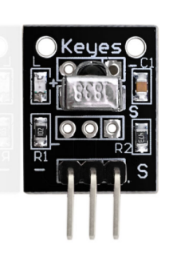         |
| 28 | Digital IR Transmitter Module                                                |          |
| 29 | 1602 LCD module                                                              |   |
| 30 | DHT11 Sensor                                                                 |          |
| 31 | PIR Motion Sensor                                                            |          |
| 32 | Joystick Module                                                              |          |
| 33 | Rotary Encoder Module                                                        |          |
| 34 | 4x4 membrane keypad                                                          |          |
| 35 | HC-SR04 Blue Ultrasonic Sensor                                               |          |
| 36 | MMA8452Q Acceleration Sensor                                                 |    |
| 37 | DS1307 Clock Module                                                          |          |
| 38 | potentiometer                                                                |  |
| 39 | Zy-170 hole white (without package) with buckle for environmental protection |  |

## 3. How to Add a Library?

What are Libraries ?

[Libraries](https://www.arduino.cc/en/Reference/Libraries) are a collection of code that makes it easy for you to connect to a sensor,display, module, etc.

For example, the built-in LiquidCrystal library helps talk to LCD displays. There are hundreds of additional libraries available on the Internet for download.

The built-in libraries and some of these additional libraries are listed in the reference.

How to Install a Library ?

Here we will introduce the most simple way for you to add libraries .

Step 1：After downloading well the Arduino IDE, you can right-click the icon of Arduino IDE.

Find the option "Open file location" shown as below:

Step 2: Enter it to find out libraries folder, this folder is the library file of Arduino.

Step 3： Next to find out the “libraries” folder of this kit(seen in the link: https://fs.keyestudio.com/KT0193F), you just need to replicate and paste it into the libraries folder of Arduino IDE.

Then copy the above libraries in the libraries of Arduino, as shown below:

## 4.Projects

### **Project 1: Two-color LED Module**

**Description**

The Two Color LED module can emits red and yellow light. You can light it with blink's code ,can also adjust the intensity of each color using PWM.

It Compatible with popular electronics platforms like Arduino, Raspberry Pi, ESP32 and more.

This module consist of a common cathode 5mm red/yellow LED, a 0Ω resistor, and 3 male header pins. Since the operating voltage is between 2.0v and 2.5v, you’ll have to use limiting resistors to prevent burnout when connecting to the Arduino.

**Specification**

| Operating Voltage          | 2v \~ 2.5v    |
|----------------------------|---------------|
| Working Current            | 10mA          |
| Diameter                   | 5mm           |
| Package Type               | Diffusion     |
| Color                      | Red + Yellow  |
| Beam Angle                 | 150           |
| Wavelength                 | 571nm + 644nm |
| Luminosity Intensity (MCD) | 20-40; 40-80  |

 **How Does It Work?**

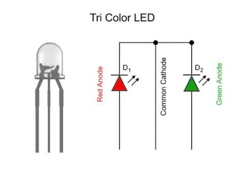

A dual-color light-emitting diode (LED) is capable of emitting two different colors of light, typically red and yellow, rather than only one color.

It is housed in a 3mm or 5mm epoxy package. It has 3 leads; a common cathode or common anode is available. A dual-color LED features two LED terminals, or pins, arranged in the circuit in anti-parallel and connected by a cathode/anode.

Positive voltage can be directed towards one of the LED terminals, causing that terminal to emit light of the corresponding color; when the direction of the voltage is reversed, the light of the other color is emitted.

In a dual-color LED, only one of the pins can receive voltage at a time. As a result, this type of LED frequently functions as indicator lights for a variety of devices, including televisions, digital cameras, and remote controls.

 Pinout

YELLOW is the yellow LED pin which we connect to the Arduino.

RED is the red LED pin which we connect to the Arduino.

GND should be connected to the ground of Arduino.

**Connection Diagram**

Connect the yellow pin (Y) on the board to Pin 10 on the Arduino, connect the red pin (R) to pin 11. Lastly, connect the ground pin (G) to GND.

**Sample Code**

<iframe src=https://create.arduino.cc/editor/keyestudio/fe5b1b3e-0e41-44de-a3b3-7db504616c0a/preview?embed style="height:510px;width:100%;margin:10px 0" frameborder=0></iframe>

**Example Result**

Upload the code to the development board, you can see the red LED and yellow LED on the LED flash alternately for 1 second.

**UNO:**

 

**MEGA 2560:**

 

### **Project 2: 7 Color flashing LED Module**

**Description**

The LED 7 Color Flashing Module incorporates a 5mm tri-color (RGB) LED with red, green and blue LEDs and the logic to cycle through various colors at different speeds all housed in the same package.

**Specification**

| Operating Voltage | 3.5 \~ 5v        |
|-------------------|------------------|
| Working Current   | 10mA             |
| Diameter          | 5mm              |
| Color             | 7 Color Flashing |

 **How Does It Work?**

This module provides an eye catching flashing display without a lot of work.

The LED contains logic built-in to automatically flash the LED at different rates while cycling through the 7 possible colors of red, green, blue, yellow, purple, cyan and white by mixing the different LED colors. The LED body is water clear.

Because it has built-in driver, it can be simply wired between 5V and ground to operate (will also work at 3.3V) or it can be controlled by the output pin of an MCU. A current limiting resistor of 220 ohms or greater should be used to protect the MCU and LED module from excessive current.

 Pinout

SIN is the 7 color LED pin which we connect to the Arduino.

NC means not connecting to anything.

GND should be connected to the ground of Arduino.

**Connection Diagram**

Connect the SIN pin (S) on the board to Pin 4 on the Arduino, connect the ground pin (-) to GND.The PIN in the middle is not connected.

**Sample Code**

<iframe src=https://create.arduino.cc/editor/keyestudio/606e837f-594f-4d5e-b312-19f612137048/preview?embed style="height:510px;width:100%;margin:10px 0" frameborder=0></iframe>

**Example Result**

Upload the code to the development board, you can see the 7 color flashing led turn on for 10 seconds and then turn off for 2 seconds.

**UNO:**

**MEGA 2560:**

 

### **Project 3: DIP RGB LED Module**

**Description**

The KY-016 Full Color RGB LED emits a wide range of different colors by mixing red, green and blue light. Compatible with many popular microcontrollers like Arduino, Raspberry Pi and ESP32.

**Specification**

This module consists of a 5mm RGB LED, 3 150Ω limiting resistors to prevent burnout and 4 male header pins. Adjusting the PWM signal on each color pin will result on different colors.

| Operating Voltage | 3.3-5V                        |
|-------------------|-------------------------------|
| Working Current   | 10mA                          |
| Color             | Red + green+blue              |
| LED Drive Mode    | Common cathode drive          |
| LED Diameter      | 5mm                           |
| Board Size        | 15mm x 19mm [0.59in x 0.75in] |

 **How Does It Work?**

An RGB LED is a combination of 3 LEDs in just one package:

-   1x **R**ed LED
-   1x **G**reen LED
-   1x **B**lue LED

You can produce almost any color by combining those three colors. An RGB LED is shown in the following figure:

**How to create different colors?**

With an RGB LED you can, of course, produce red, green, and blue light, and by configuring the intensity of each LED, you can produce other colors as well.

For example, to produce purely blue light, you’d set the blue LED to the highest intensity and the green and red LEDs to the lowest intensity. For a white light, you’d set all three LEDs to the highest intensity.

**Mixing colors**

To produce other colors, you can combine the three colors in different intensities. To adjust the intensity of each LED you can use a PWM signal.

Because the LEDs are very close to each other, our eyes see the result of the combination of colors, rather than the three colors individually.

To have an idea on how to combine the colors, take a look at the following chart. This is the simplest color mixing chart, but gives you an idea how it works and how to produce different colors.

**Common Anode and Common Cathode RGB LEDs**

There are two kinds of RGB LEDs: *common anode* LED and *common cathode* LED. The figure below illustrates a common anode and a common cathode LED.

In a common cathode RGB LED, all three LEDs share a negative connection (cathode). In a common anode RGB LED, the three LEDs share a positive connection (anode).This results in an LED that has 4 pins, one for each LED, and one common cathode or one common anode.

**Pinout**

GREEN is the green LED pin which we connect to the Arduino.

RED is the red LED pin which we connect to the Arduino.

BLUE is the blue LED pin which we connect to the Arduino.

GND should be connected to the ground of Arduino.

**Connection Diagram**

Connect the module red pin (R) to pin 11 on the Arduino. Blue (B) to pin 10, green (G) to pin 9 and ground (-) to GND.

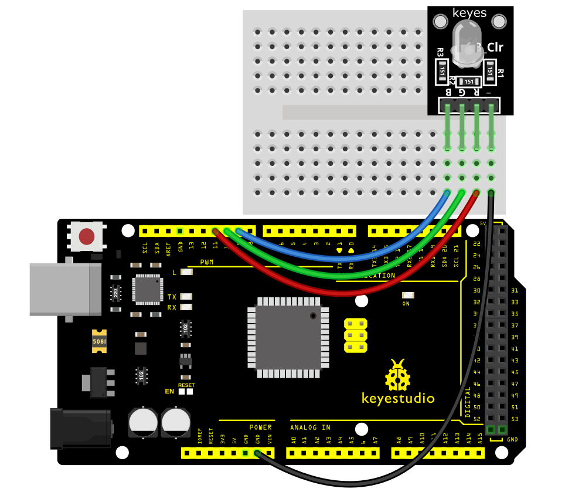

**Sample Code**

<iframe src=https://create.arduino.cc/editor/keyestudio/ca3bcf3f-1f8f-4555-be7e-8f3d0a9106ab/preview?embed style="height:510px;width:100%;margin:10px 0" frameborder=0></iframe>

**Example Result**

Connect the cable, and after uploading the code, you can see that the LED is changing color

**UNO:**

**MEGA 2560:**

 

### **Project 4: SMD RGB LED Module**

**Description**

This is a full-color LED module, which contains 3 basic colors－red, green and blue. They can be seen as separate LED lights.

After programming, you can turn them on and off by sequence or can also use PWM analog output to mix three colors to generate different colors.

**Specification**

| Operating Voltage     | 5V max Red 1.8V \~2.4V Green 2.8V \~ 3.6V Blue 2.8V \~ 3.6V |
|-----------------------|-------------------------------------------------------------|
| Forward Current       | 20mA \~ 30mA                                                |
| Operating Temperature | -25°C to 85°C [-13°F \~ 185°F]                              |
| Board Diemsions       | 18.5mm x 15mm [0.728in x 0.591in]                           |

 

 **How Does It Work?**

SMD LED (acronym for Surface-Mount-Device, Light-Emitting-Diode) is a type of LED characterized by having a 3 in 1 encapsulation, meaning that it integrates all 3 colors (Red, Green, Blue) in a single system.

This type of module consists of four pins: the Ground pin, the Red, Green and blue pins.

The three pins are digital signals that we connect to the digital ports of any different microcontroller boards which in this project is the Arduino Uno.

Once connected and codes have been made, the LED’s inside the chip will light up.

Resistors will be placed on the three signal pins to regulate the flow of current to prevent burning the actual module.

 Pinout

GREEN is the green LED pin which we connect to the Arduino.

RED is the red LED pin which we connect to the Arduino.

BLUE is the blue LED pin which we connect to the Arduino.

GND should be connected to the ground of Arduino.

**Connection Diagram**

Connect the red pin (R) to Pin 10, the green pin (G) to pin 11, the blue pin (B) to pin 9 and finally the ground pin (-) to GND.

You must use resistors between the board and the Arduino to prevent LED burnout.

**Sample Code**

<iframe src=https://create.arduino.cc/editor/keyestudio/85d732d5-d4f2-4cb6-9105-de48500d496d/preview?embed style="height:510px;width:100%;margin:10px 0" frameborder=0></iframe>

**Example Result**

Done wiring and powered up, upload well the code, you will see the RGB LED module emit shiny colors.

**UNO:**

****

****

**MEGA 2560:**

** **

**  
**

### **Project 5: Active Buzzer Module**

**Description**

The Active buzzer is the simplest sound making module. You can use high/low level to drive it.

This module is widely used on our daily appliances like PC, refrigerator, phones, etc.

In addition, you can create many interesting interactive projects with this small but useful module. Just try it!! You will find the electronic sound it creates so fascinating.

**Specification**

| Operating Voltage    | 3.5V \~ 5.5V                      |
|----------------------|-----------------------------------|
| Maximum Current      | 30mA / 5VDC                       |
| Resonance Frequency  | 2500Hz ± 300Hz                    |
| Minimum Sound Output | 85Db @ 10cm                       |
| Working Temperature  | -20°C \~ 70°C [-4°F \~ 158°F]     |
| Storage Temperature  | -30°C \~ 105°C [-22°F \~ 221°F]   |
| Board Dimensions     | 18.5mm x 15mm [0.728in x 0.591in] |

 **How Does It Work?**

The Active buzzer also known as indicator buzzer uses a DC power and will produce frequency right when it is powered with its built in PCB. However it has only one frequency and can be pulsed. It generates a sound of aproximately 2.5kHz when the signal is high.

 Pinout

SIN is the Active buzzer pin which we connect to the Arduino.

NC means not connecting to anything.

GND should be connected to the ground of Arduino.

**Connection Diagram**

Connect signal (S) to pin 8 on the Arduino and Ground (-) to GND. The middle pin is not used.

| **KY-012** | **Arduino** |
|------------|-------------|
| S          | Pin 8       |
| middle     |             |
| –          | GND         |

**Sample Code**

<iframe src=https://create.arduino.cc/editor/keyestudio/bbdc4bbf-f192-4aca-aa2c-12afd621b469/preview?embed style="height:510px;width:100%;margin:10px 0" frameborder=0></iframe>

**Example Result**

Done uploading the code to board, the buzzer will make a sound.

**UNO:**

**MEGA 2560:**

****

 

### **Project 6: Passive Buzzer Module**

**Description**

The buzzer we introduced here is a passive buzzer. It cannot be actuated by itself, but by external pulse frequencies. Different frequencies produce different sounds. You can use Arduino to code the melody of a song, quite fun and simple.

**Specification**

| Operating Voltage     | 1.5V \~ 15V DC                    |
|-----------------------|-----------------------------------|
| Tone Generation Range | 1.5kHz \~ 2.5kHz                  |
| Board Dimensions      | 18.5mm x 15mm [0.728in x 0.591in] |

 

 **How Does It Work?**

passive buzzers are types of magnetic buzzers. Inside the buzzer, there is a coil of wire that’s connected to the buzzer’s pins.

There is also a round magnet that surrounds the wire coil. A thin metal film with a metal weight attached to the top sits above the round magnet and wire coil.

When pulses of current are applied to the wire coil, magnetic inductance causes the metal weight and metal film to vibrate up and down. The vibration of the metal film produces sound waves:

 Pinout

SIN is the Passive buzzer pin which we connect to the Arduino.

NC means not connecting to anything.

GND should be connected to the ground of Arduino.

**Connection Diagram**

Connect the module signal (S) to pin 8 on the Arduino and ground (-) to GND.

The middle pin is not used.

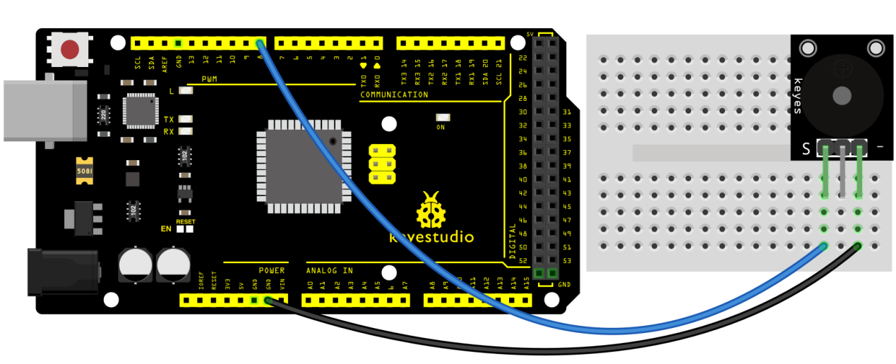

**Sample Code**

<iframe src=https://create.arduino.cc/editor/keyestudio/486a88b8-f0b2-4b3f-b984-14d804a24170/preview?embed style="height:510px;width:100%;margin:10px 0" frameborder=0></iframe>

**Example Result**

Done uploading the code to board, the buzzer will make a sound.

**UNO**

**MEGA 2560:**

### **Project 7: Laser Transmitter Module**

**Description**

The KY-008 Laser Transmitter module can be used as a laser pointer. It emits a dot shaped, red laser beam.

It consists of a 650nm red laser diode head, a resistor and 3 male header pins. Handle with caution, do not point the laser beam directly to the eyes.

Laser Transmitter module compatible with Arduino, Raspberry PI, ESP32 and other popular microcontrollers.

**Specification**

| Operating Voltage   | 5V                                |
|---------------------|-----------------------------------|
| Output Power        | 5mW                               |
| Wavelenght          | 650nm                             |
| Operating Current   | \< 40mA                           |
| Working Temperature | -10°C \~ 40°C [14°F to 104°F]     |
| Board Dimensions    | 18.5mm x 15mm [0.728in x 0.591in] |

 **How Does It Work?**

The working of a laser diode takes place in three main steps:

1.Energy Absorption

The laser diode consists of a p-n junction where holes and electrons exist. (Here, a hole means the absence of an electron).

When a certain voltage is applied at the p-n junction, the electrons absorb energy and they transition to a higher energy level. Holes are formed at the original position of the excited electron.

The electrons stay in this excited state without recombining with holes for a very small duration of time, termed as “recombination time” or “upper-state lifetime”. The recombination time is about a nanosecond for most laser diodes.

2.Spontaneous Emission

After the upper-state lifetime of excited electrons, they recombine with holes.

As the electrons fall from higher energy level to a lower energy level, the difference in energy is converted into photons or electromagnetic radiation.

This same process is used to produce light in LEDs. The energy of the emitted photon is given by the difference between the two energy levels.

3.Stimulated Emission

We need more coherent photons from the laser diode than the ones emitted through the process of spontaneous emission.

A partially reflecting mirror is used on either side of the diode so that the photons released from spontaneous emission are trapped in the p-n junction until their concentration reaches a threshold value.

These trapped photons stimulate the excited electrons to recombine with holes even before their recombination time.

This results in the release of more photons that are in exact phase with the initial photons and so the output gets amplified. Once the photon concentration goes above a threshold, they escape from the partially reflecting mirrors, resulting in a bright monochromatic coherent light.

 Pinout

SIN is the laser signal pin which we connect to the Arduino.

NC means not connecting to anything.

GND should be connected to the ground of Arduino.

**Connection Diagram**

Connect the module signal pin (S) to pin 8 on the Arduino and ground (-) to GND.The middle pin on the module is not used.

**Sample Code**

<iframe src=https://create.arduino.cc/editor/keyestudio/c4e97630-91f5-4410-9727-385ec36a96cb/preview?embed style="height:510px;width:100%;margin:10px 0" frameborder=0></iframe>

**Example Result**

Connect the cable, and after uploading the code, you can see the flashing of the laser module on and off for one second

**UNO:**

**MEGA 2560:**

### **Project 8：5V 1 Channel Relay Module**

**Description**

This single relay module can be used in interactive projects. This module uses SONGLE 5v high-quality relay. It can also be used to control lighting, electrical and other equipment.

The modular design makes it easy to use with Arduino board. It can be controlled through digital IO port, such as solenoid valves, lamps, motors and other high current or high voltage devices.

**Specification**

| TTL Control Signal | 5VDC to 12VDC (some boards may work with 3.3) |
|--------------------|-----------------------------------------------|
| Maximum AC         | 10A 250VAC                                    |
| Maximum DC         | 10A 30VDC                                     |
| Contact Type       | NC and NO                                     |
| Board Dimensions   | 27mm x 34mm [1.063in x 1.338in]               |

 **How Does It Work?**

A relay is an **electromagnetic switch** operated by a relatively small current that can control much larger current.

Here’s a simple animation illustrating how the relay uses one circuit to switch on another circuit.

Initially the first circuit is switched off and no current flows through it until something (either a sensor or switch closing) turns it on. The second circuit is also switched off.

When a small current flows through the first circuit, it activates the electromagnet, which generates a magnetic field all around it.

The energized electromagnet attracts a contact in the second circuit toward it, closing the switch and allowing a much bigger current to flow through the second circuit.

When the current stops flowing, the contact goes back up to its original position, switching the second circuit off again.

 Relay Basics

Typically the relay has 5 pins, three of them are high voltage terminals (NC, COM, and NO) that connect to the device you want to control.

The mains electricity enters the relay at the common (COM) terminal. While use of NC & NO terminals depends upon whether you want to turn the device ON or OFF.

Between the remaining two pins (coil1 and coil2), there is a coil that acts like an electromagnet.

When current flows through the coil, the electromagnet becomes charged and moves the internal contacts of the switch. At that time the normally open (NO) terminal connects to the common (COM), and the normally closed (NC) terminal becomes disconnected.

When current stops flowing through the coil, the internal contact returns to its initial state i.e. the normally closed (NC) terminal connects to the common (COM), and the normally open (NO) terminal reopens.

This is known as a single pole, double throw switch (**SPDT**).

 Pinout

SIN is the relay signal pin which we connect to the Arduino.

VCC should be connected to the +5V Power of Arduino.

GND should be connected to the ground of Arduino.

**Connection Diagram**

For the DC part of the circuit connect S (signal) to pin 10 on the Arduino, also connect the Power line (+) and ground (-) to +5 and GND respectively.

On the AC side connect your feed to Common (middle contact) and use NC or NO according to your needs.

NO (Normally Open) will get power when (S) is high, NC (Normally Closed) gets disconnected when (S) is high.

Always be very careful when experimenting with AC, electrical shock can result in serious injures.

**Sample Code**

<iframe src=https://create.arduino.cc/editor/keyestudio/eadaec62-03c5-4656-b55c-50cca25c4529/preview?embed style="height:510px;width:100%;margin:10px 0" frameborder=0></iframe>

**Example Result**

This relay module is active at HIGH level.

Wire it up well, powered up, then upload the above code to the board, you will see the relay is turned on（ON connected, NC disconnected）for two seconds, then turned off for two seconds（NC closed,ON disconnected）, repeatedly and circularly.

When the relay is turned on, external LED is on. If relay is turned off, external LED is off.

**UNO:**

**MEGA 2560:**

 

### **Project 9: Digital Push Button Module**

**Description**

This is a basic button module. You can simply plug it into an IO shield to have your first try of Arduino. The KY-004 Key Switch Module is a push button that will close the circuit when pressed, sending a high signal.

This module is compatible with Arduino, Raspberry Pi, ESP32 and other platforms.

**Specification**

| Rating                  | 50mA 12VC                         |
|-------------------------|-----------------------------------|
| Environment temperature | -25°C to 105°C [ -13°F to 221°F]  |
| Durability              | 100,000 cycles                    |
| Operating Force         | 180/230(±20gf)                    |
| Board Dimensions        | 18.5mm x 15mm [0.728in x 0.591in] |

 **How Does It Work?**

There are 4 legs in this type of button in the KY 004 Arduino module. The 2 legs on the top are connected together and the same goes with the 2 legs on the bottom.

Current will flow when the top section and the bottom section connect, and this happens when the button is pressed.

Once released, connection is lost between the two sections and the flow of current will stop.

Once we interface the module with an Arduino, the Arduino will be able to know if the button is being pressed as it will detect the flow of current from the resistor that is connected to the legs of the button.

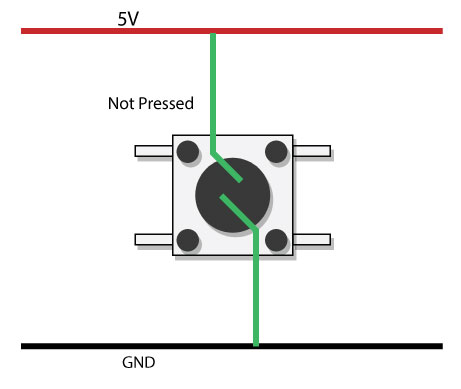

 Pinout

SIN is the button signal pin which we connect to the Arduino.

VCC should be connected to the +5V Power of Arduino.

GND should be connected to the ground of Arduino.

**Connection Diagram**

Connect the module signal pin (S) to pin 3 on the Arduino.Then connect the board power pin (middle) and ground (-) to +5V and GND on the Arduino respectively.

**Sample Code**

<iframe src=https://create.arduino.cc/editor/keyestudio/eae23e46-5c29-4f2e-b534-1eab64b00e2c/preview?embed style="height:510px;width:100%;margin:10px 0" frameborder=0></iframe>

**Example Result**

Wire it up well as the figure shown below, and then upload the code to the board.

When the number button is pressed, the D13 led goes out, and when the number button is released, the D13 led goes on

**UNO:**

**MEGA2560:**

### **Project 10: Digital Tilt Sensor**

**Description**

The KY-020 Tilt Switch Sensor module is a switch that reacts to movement. It closes the circuit when it’s tilted to the side as long as it is moved with enough force and degree of inclination to activate the ball switch inside.It Compatible with Arduino, Raspberry Pi, ESP32 and other microcontrollers.

**Specification**

| Operating Voltage | 3.3V \~ 5V |
|-------------------|------------|
| Output Type       | Digital    |

 **How Does It Work?**

A ball tilt sensor is typically made up of a metal tube with a little metal ball that rolls around in it. One end of the cavity has two conductive elements (poles). The sensor is designed in such a way that a sufficient level of tilt allows the ball to roll, making or breaking an electrical connection.

When the sensor is upright the ball touches the poles and makes an electrical connection. And when the sensor is tilted the ball rolls off the poles and the connection is broken.

 Pinout

SIN is the tilt switch signal pin which we connect to the Arduino.

VCC should be connected to the +5V Power of Arduino.

GND should be connected to the ground of Arduino.

**Connection Diagram**

Connect the module’s Power line (middle) and ground (-) to +5 and GND respectively.Connect signal (S) to pin 2 on the Arduino.

**Sample Code**

<iframe src=https://create.arduino.cc/editor/keyestudio/6abe4949-5e15-4444-a24b-3ff9cb0062b4/preview?embed style="height:510px;width:100%;margin:10px 0" frameborder=0></iframe>

**Example Result**

Done wiring and powered up, then upload well the code to PLUS board.

Then tilt the sensor, you will see the led on the sensor is turned on. Shown as below.

**UNO:**

 

**MEGA 2560:**

 

### **Project 11: Knock Sensor Module**

**Description**

The KY-031 Knock Sensor module is a vibration sensor that sends a signal when a knock/tap is detected. You can combine it with Arduino to make some interesting experiments, e.g. electronic drum.

It Compatible with Arduino, ESP8266, ESP32, Teensy, Raspberry Pi, and other popular platforms.

**Specification**

| Operating Voltage | 3.3V \~ 5V |
|-------------------|------------|
| Output Type       | Digital    |

 **How Does It Work?**

Inside the actual sensor, there is a thin copper wire that is coiled up in a spring form and it surrounds another copper wire that acts as a center post. Both the spring and the center post will be the two connection terminals of the sensor which functions like a simple switch.

Normally, the outer spring is slightly separated from the center post. When the outer spring and the center post touch by means of sufficient amount of vibration, this shorts both of the terminals.

Although the contact of the spring and the center post is momentary, the Arduino is superbly efficient detecting this connection by implementing the proper programming.

 Pinout

SIN is the knock sensor signal pin which we connect to the Arduino.

VCC should be connected to the +5V Power of Arduino.

GND should be connected to the ground of Arduino.

**Connection Diagram**

Connect the module’s Power line (middle) and the ground (-) to +5 and GND respectively.Connect signal (S) to pin 3 on the Arduino.

**Sample Code**

<iframe src=https://create.arduino.cc/editor/keyestudio/af7b9938-c1c3-49ce-bc2e-85942cb8b6ad/preview?embed style="height:510px;width:100%;margin:10px 0" frameborder=0></iframe>

**Example Result**

After connecting the cable and uploading the code, knocking on the module will make the D13 LED light on for 3 seconds.

**UNO:**

**MEGA 2560:**

 

### **Project 12: Hall Magnetic Sensor**

**Description**

The KY-003 Hall Magnetic Sensor module is a switch that reacts to the presence of a magnetic field, turning itself on or off.

It can sense the magnetic materials within a detection range up to 3cm.

The detection range and the strength of magnetic field are proportional. The output is digital on/off. Compatible with popular microcontrolers like Arduino, Raspberry Pi and ESP32.

**Specification**

| Operating Voltage           | 4.5V to 24V                       |
|-----------------------------|-----------------------------------|
| Operating Temperature Range | -40°C to 85°C [-40°F to 185°F]    |
| Board Dimensions            | 18.5mm x 15mm [0.728in x 0.591in] |

 

 **How Does It Work?**

The Hall effect is due to the nature of the current in a conductor. Current consists of the movement of many small charge carriers, typically electrons, holes, ions (see Electromigration) or all three.

When a magnetic field is present, these charges experience a force, called the Lorentz force. When such a magnetic field is absent, the charges follow approximately straight, 'line of sight' paths between collisions with impurities, phonons, etc.

However, when a magnetic field with a perpendicular component is applied, their paths between collisions are curved so that moving charges accumulate on one face of the material. This leaves equal and opposite charges exposed on the other face, where there is a scarcity of mobile charges.

The result is an asymmetric distribution of charge density across the Hall element, arising from a force that is perpendicular to both the 'line of sight' path and the applied magnetic field. The separation of charge establishes an electric field that opposes the migration of further charge, so a steady electrical potential is established for as long as the charge is flowing.

This phenomenon is Hall Effect.

 Pinout

SIN is the hall magnetic sensor signal pin which we connect to the Arduino.

VCC should be connected to the +5V Power of Arduino.

GND should be connected to the ground of Arduino.

**Connection Diagram**

Connect the board power line (middle) and ground (-) to +5 and GND on the Arduino respectively.Connect signal (S) to pin 3 on the Arduino.

**Sample Code**

<iframe src=https://create.arduino.cc/editor/keyestudio/c99cf83f-bb70-41d0-ab54-09de53d71346/preview?embed style="height:510px;width:100%;margin:10px 0" frameborder=0></iframe>

**Example Result**

Wire it up and upload well the code to board, you will see that D13 indicator on PLUS board is off, and led on the module is also off.

But if put a magnetic ball close to the hall module, you will see the D13 indicator on PLUS board is turned on, and led on the module is also turned on.

**UNO:**

 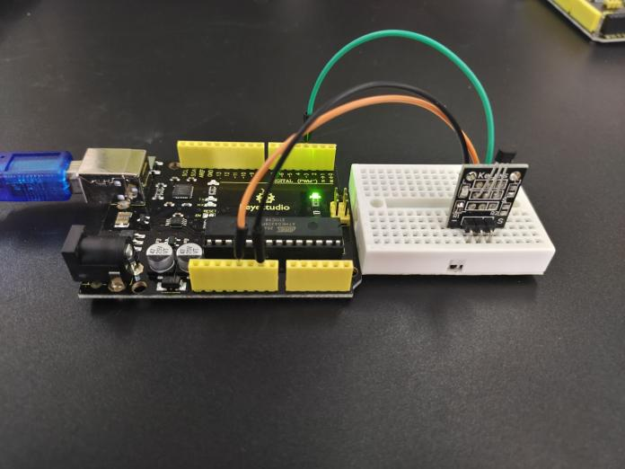

**MEGA 2560:**

 

### **Project 13: Vibration Sensor Module**

**Description**

The KY-002 Vibration Switch Module detects shaking and knocking. When the module is moved, a spring mechanism will close the circuit sending a short high signal.It can be used with a variety of microcontrollers like Arduino, ESP32, Raspberry Pi and others.

**Specification**

| Operating Voltage | 5V                                |
|-------------------|-----------------------------------|
| Board Dimensions  | 18.5mm x 15mm [0.728in x 0.591in] |

 **How Does It Work?**

As stated above, the functionality or working principle of the Vibration sensor and the Knock sensor are pretty similar.

Inside the Vibration sensor is a center post that serves as the metal conductive leg of the sensor. Around the center post is a thin metal that is coiled up into a spring form.

Once vibration is generated, the metal conductive leg and the thin metal spring will be in contact with each other and once this happens, current will directly flow from the metal conductive leg to the thin metal spring.

As current flow on both wires, a supply of 5 volts will be generated. With this, vibration will be detected by the sensor and will send out information to the microcontroller.

There is also a 10k resistor onboard in this module. This resistor will limit the circulation of current from the powersource preventing any damage to the module.

 Pinout

SIN is the vibration switch signal pin which we connect to the Arduino.

VCC should be connected to the +5V Power of Arduino.

GND should be connected to the ground of Arduino.

**Connection Diagram**

Connect the module signal pin (S) to pin 3 on the Arduino.Then connect the module’s power pin (middle) and ground (-) to +5V and GND on the Arduino respectively.

**Sample Code**

<iframe src=https://create.arduino.cc/editor/keyestudio/5c4c8671-06ba-4811-8db0-37750690da47/preview?embed style="height:510px;width:100%;margin:10px 0" frameborder=0></iframe>

**Example Result**

After connecting the cable and uploading the code, the module will be vibrated and the D13 LED will be on for 3 seconds

**UNO:**

 

**MEGA 2560:**

 

### **Project 14: Photo Interrupter Module**

**Description**

The KY-010 Photo Interrupter module is a switch that will trigger a signal when light between the sensor’s gap is blocked.

It is used for many applications including optical limit switches, pellet dispensing, general object detection, etc.

This module is suitable for various electronics platforms like Arduino, Raspberry Pi, ESP32 and others.

**Specification**

| Operating Voltage | 3.3V \~ 5V                        |
|-------------------|-----------------------------------|
| Board Dimensions  | 18.5mm x 15mm [0.728in x 0.591in] |

 **How Does It Work?**

Upright part of this sensor is an infrared emitter and on the other side, it’s a shielded infrared detector. By emitting a beam of infrared light from one end to other end, the sensor can detect an object when an object passes through the beam.

**Usage Example: Detecting Voltage Change at the Phototransistor Side**

 Pinout

SIN is the photo Interrupter module signal pin which we connect to the Arduino.

VCC should be connected to the +5V Power of Arduino.

GND should be connected to the ground of Arduino.

**Connection Diagram**

Connect the power line (middle) and ground (left) to +5V and GND respectively. Connect signal (S) to pin 3 on the Arduino.

**Sample Code**

<iframe src=https://create.arduino.cc/editor/keyestudio/c9e15316-13d2-4c00-a012-4a660fddbd38/preview?embed style="height:510px;width:100%;margin:10px 0" frameborder=0></iframe>

**Example Result**

Done uploading the code to board, you can see both led on PLUS board and on module are turned on. Shown as below.

When pick up a paper on groove joint of module, the signal is interrupted, and led1 on the module will be turned off.

**UNO:**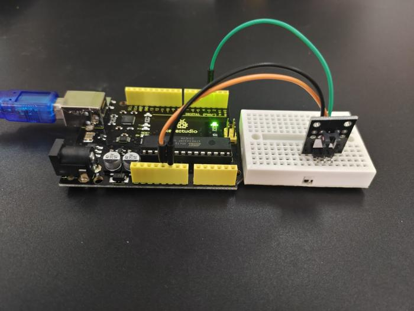

**MEGA 2560:**

### **Project 15: Line Tracking Sensor**

**Description**

This Line Tracking Sensor can detect white line in black or black line in white. The single line-tracking signal provides a stable output signal TTL for a more accurate and more stable line. Multi-channel option can be easily achieved by installing required line-tracking robot sensors.

| Operating Voltage           | 3.3V \~ 5V    |
|-----------------------------|---------------|
| Operating current           | \<10mA        |
| Operating temperature range | 0°C \~ + 50°C |
| Output Level                | TTL level     |

**Specification**

 **How Does It Work?**

The KY-033 module detects if the surface in front of the IR transmitter/receiver absorbs or reflects light. A dark surface absorbs light while a light surface reflects light. If the surface is dark, the module Signal pin will be pulled HIGH. And if the surface is light, the signal pin will be LOW.

Pinout

SIN is the line-tracking sensor signal pin which we connect to the Arduino.

VCC should be connected to the +5V Power of Arduino.

GND should be connected to the ground of Arduino.

**Connection Diagram**

Connect the module’s GND line (the leftmost pin) to GND on the Arduino and + (the second pin) to 5V.

Connect signal (out) to pin 3 on the Arduino.

**Sample Code**

<iframe src=https://create.arduino.cc/editor/keyestudio/cde2ccf9-b21e-48ba-9cf2-93666c9c4132/preview?embed style="height:510px;width:100%;margin:10px 0" frameborder=0></iframe>

**Example Result**

Done uploading the code to board, open the serial monitor and set the baud rate as 9600, then you can see the data from the sensor.

**UNO:**

 

**MEGA 2560:**

### **Project 16: Infrared Obstacle Avoidance Sensor**

**Description**

The KY-032 Obstacle Avoidance Sensor module is a distance-adjustable, infrared proximity sensor designed for wheeled robots.

The sensor detection distance ranges from 2cm to 40cm, it can be adjusted by turning the potentiometer knob. The operating voltage is 3.3V-5V so it is suitable for a variety of microcontrollers like Arduino, ESP32, Teensy, ESP8266, Raspberry Pi, and others.

It has strong adaptability to ambient light and it is fairly accurate to sense changes in the surrounding environment.

**Specification**

| Working voltage     | 3.3V – 5V DC                                                    |
|---------------------|-----------------------------------------------------------------|
| Working current     | ≥ 20mA                                                          |
| Working temperature | -10°C – 50°C [14°F – 122°F]                                     |
| Detection distance  | 2cm – 40cm [0.79in – 15.75in]                                   |
| IO interface        | 4-wire interface (-/+/S/EN)                                     |
| Output signal       | TTL level (low level if obstacle detected, high if no obstacle) |
| Adjustment method   | multi-turn resistance adjustment                                |
| IR pulse frequency  | 38kHz according to HS0038DB datasheet                           |
| Effective angle     | 35°                                                             |
| Board Size          | 1.6cm x 4cm [0.62in x 1.57in]                                   |
| Weight              | 9g                                                              |

 **How Does It Work?**

The module produces a 38KHz square wave primarily made-up by the 555 Timer IC and VR1.

This 38KHz pulse is used to switch on/off the IR LED. If there is an object in front of the IR LED, the infrared pulses are reflected and some of the reflected IR is detected by the IR receiver (HS0038BD).

This would tell the module that there is an obstacle and will pull the signal pin S to LOW. If there is no obstacle, pin S will be HIGH. VR2 is used to adjust the distance the obstacle is detected. The module has a detection range of 2\~40cm.

The EN pin and EN jumper are provided to have control over the module detection. Put a jumper at EN to have the module always enabled.

If you want to have control over the module enable/disable, remove the jumper and connect the EN pin to HIGH to enable or LOW to disable.

 Pinout

SIN is the obstacle avoidance sensor signal pin which we connect to the Arduino.

VCC should be connected to the +5V Power of Arduino.

GND should be connected to the ground of Arduino.

EN enable the obstacle avoidance sensor.

**Connection Diagram**

Connect the module’s GND line (the leftmost pin) to GND on the Arduino and + (the second pin) to 5V.Connect signal (out) to pin 3 on the Arduino.

**Sample Code**

<iframe src=https://create.arduino.cc/editor/keyestudio/c07c4c88-f359-48ed-baf7-fda042f78230/preview?embed style="height:510px;width:100%;margin:10px 0" frameborder=0></iframe>

**Example Result**

Done uploading the code to board, you can see the led on both PLUS board and obstacle detector sensor is turned on.

If we put a foam block in front of the sensor, this time when sensor detects the obstacle, sled on the sensor will be turned on.

**UNO:**

**MEGA 2560:**

### **Project 17: Photocell Sensor**

**Description**

Photocell is commonly seen in our daily life and is mainly used in intelligent switch, also in common electronic design. To make it easier and more effective, we supply the corresponding modules.

Photocell is a semiconductor. It has features of high sensitivity, quick response, spectral characteristic and R-value consistence, maintaining high stability and reliability in environment extremely such as high temperature and high humidity.

It’s widely used in automatic control switch fields like cameras, garden solar lights, lawn lamps, money detectors, quartz clocks, music cups, gift boxes, mini night lights, sound and light control switches, etc.

The Photocell sensor compatible with many popular microcontrollers like Arduino, ESP32 and others.

**Specification**

| Operating Voltage | 3.3V \~ 5V |
|-------------------|------------|
| Output Type       | Analog     |

 **How Does It Work?**

The flow of current in any metal is caused by electrons and they are categorized by the number of electrons flowing through it as Insulator, Conductor and Semiconductors.

These are categorized depending on the energy gap between the valence band and the conduction band called the band gap.

As stated above, a [photoresistor](https://microdaz.com/product/ky-018-photo-resistor-module/) is made up of high resistance semiconductor as the available electrons for conduction in it are few. The zigzag pattern on top of the photoresistor is the semiconductor Cadmium Sulfide. It is deposited this way to procure the required resistance and power rating.

As light hits the [photoresistor](https://microdaz.com/product/ky-018-photo-resistor-module/), the electrons in the valence band or the valence electrons assimilate energy enough to break its bond with the atom and jump to the conduction band.

This process of transfer of electrons generates current flow to the [photoresistor](https://microdaz.com/product/ky-018-photo-resistor-module/) and as more and more electrons transfer to the conduction band, current flow increases and results in the decrease of resistance in the photoresistor.

 Pinout

SIN is the photocell sensor signal pin which we connect to the Arduino.

VCC should be connected to the +5V Power of Arduino.

GND should be connected to the ground of Arduino.

**Connection Diagram**

Connect the Power line (middle) and ground (-) to +5 and GND respectively. Connect signal (S) to pin A2 on the Arduino.

**Sample Code**

<iframe src=https://create.arduino.cc/editor/keyestudio/4e02d2b7-4f24-4d7f-b97a-da8653114946/preview?embed style="height:510px;width:100%;margin:10px 0" frameborder=0></iframe>

**Example Result**

Done wiring and powered up, upload well the code, then open the serial monitor, if cover the photocell on the sensor with your hand, you will see the analog value decrease.

 

### **Project 18: Water level Sensor**

**Description**

The water level sensor is easy- to-use, portable and cost-effective, designed to identify and detect water level and water drop.

This small sensor can measure the volume of water drop or water quantity through an array of traces of exposed parallel wires.

**Features**

-   smooth conversion between water quantity and analog quantity;
-   strong flexibility, outputting basic analog value;
-   low power consumption and high sensitivity;
-   directly connect to microprocessor or other logic circuits, suitable for a variety of development boards and controllers such as Arduino controller, STC single-chip microcomputer, AVR single-chip microcomputer and more.

**Specifications**

| Operating voltage   | DC5V                         |
|---------------------|------------------------------|
| Operating current   | ﹤20mA                       |
| Sensor type         | Analog                       |
| Detection area      | 40mm x16mm                   |
| Production process  | FR4 double-side tinned       |
| Shape design        | Anti-skid semi-lunar recess  |
| Working Humidity    | 10%-90% without condensation |
| Working Temperature | 10℃-30℃                      |

 **How Does It Work?**

The working of the water level sensor is pretty straightforward.

The series of exposed parallel conductors, together acts as a **variable resistor** (just like a potentiometer) whose resistance varies according to the water level.

The change in resistance corresponds to the distance from the top of the sensor to the surface of the water.

The resistance is inversely proportional to the height of the water:

The more water the sensor is immersed in, results in better conductivity and will result in a lower resistance.

The less water the sensor is immersed in, results in poor conductivity and will

result in a higher resistance.

The sensor produces an output voltage according to the resistance, which by measuring we can determine the water level.

 Pinout

SIN is the water level sensor signal pin which we connect to the Arduino.

VCC should be connected to the +5V Power of Arduino.

GND should be connected to the ground of Arduino.

**Connection Diagram**

**Sample Code**

<iframe src=https://create.arduino.cc/editor/keyestudio/b910e95a-f8c4-4811-8418-28f518c4f0b9/preview?embed style="height:510px;width:100%;margin:10px 0" frameborder=0></iframe>

**Example Result**

For example, using the same circuit above, you’ll see the close to the following values in the serial monitor when the senor is dry (0) and when it is partially submerged in the water (\~420) and when it is completely submerged (\~520).

Furthermore, you can set an alarm value and connect a buzzer to make an alarm.

The LED can’t light up when water level haven’t reach alarm value. If water level reaches the alarm value, LED will be turned on and buzzer will sound to make an alarm.

### **Project 19: Soil Humidity Sensor**

**Description**

This is a simple soil humidity sensor aimed to detect the soil humidity. If the soil is in lack of water, the analog value output by the sensor will decrease, otherwise, it will increase.

If you use this sensor to make an automatic watering device, it can detect whether your botany is thirsty to prevent it from withering when you go out.

Combine this sensor with Arduino controller can make your plant more comfortable and your garden more smarter.

The soil humidity sensor module is not as complicated as you might think, so if you need to detect the soil in your project, it will be your best choice.

The sensor is set with two probes which are inserted into the soil. If the current goes through the soil, the sensor will get resistance value by reading the current changes between the two probes, then convert the resistance value into moisture content.

The higher moisture (less resistance), the higher conductivity the soil has.

The surface of the sensor has undergone metallization process to prolong its service life. Insert it into the soil and then use the AD converter to read it. With the help of this sensor, the plant can remind of you: I need water.

**Specification**

1.  Power Supply Voltage: 3.3V or 5V
2.  Working Current: ≤ 20mA
3.  Output Voltage: 0-2.3V (When the sensor is totally immersed in water, the voltage will be 2.3V)
4.  The higher humidity, the higher the output voltage.
5.  Sensor type: Analog output
6.  Interface: Pin1- signal, Pin2- GND, Pin3 - VCC

 **How Does It Work?**

The working of the soil moisture sensor is pretty straightforward.

The fork-shaped probe with two exposed conductors, acts as a **variable resistor** (just like a potentiometer) whose resistance varies according to the water content in the soil.

This resistance is inversely proportional to the soil moisture:

The more water in the soil means better conductivity and will result in a lower resistance.

The less water in the soil means poor conductivity and will result in a higher resistance.

The sensor produces an output voltage according to the resistance, which by measuring we can determine the moisture level.

 Pinout

SIN is the soil humidity sensor signal pin which we connect to the Arduino.

VCC should be connected to the +5V Power of Arduino.

GND should be connected to the ground of Arduino.

**Connection Diagram**

Connect the S pin of module to Analog A0 of PLUS board, connect the negative pin to GND port, positive pin to 5V port.

**Sample Code**

<iframe src=https://create.arduino.cc/editor/keyestudio/19b81dc5-2e2e-4415-b095-45a38c5aad49/preview?embed style="height:510px;width:100%;margin:10px 0" frameborder=0></iframe>

**Example Result**

Done wiring and powered up, upload well the code, then open the serial monitor and set the baud rate as 57600, you will see the value. When the sensor detects the moisture, the value will make corresponding changes. Shown below.

### **Project 20: Flame Sensor**

**Description**

The KY-026 Flame Sensor module detects infrared light emitted by fire. This module has both digital and analog outputs and a potentiometer to adjust the sensitivity. Commonly used in fire detection systems.Compatible with Arduino, Raspberry Pi, ESP32 and other microcontrollers.

This flame sensor can be used to detect fire or other lights with wavelength stands at 760nm \~ 1100nm.

In the fire-fighting robot game, the flame plays an important role in the probing, which can be used as the robot's eyes to find fire source.

**Specification**

| Operating Voltage             | 3.3V \~ 5.5V                  |
|-------------------------------|-------------------------------|
| Infrared Wavelength Detection | 760nm \~ 1100nm               |
| Sensor Detection Angle        | 60°                           |
| Board Dimensions              | 1.5cm x 3.6cm [0.6in x 1.4in] |

 **How Does It Work?**

This type of infrared flame sensors is usually incorporated with a standard measurement using LM393 comparator, which allows to obtain the reading **in both analog and digital outputs** when a certain threshold is exceeded, which is regulated through a potentiometer located in the plate.

As we can see the wavelength of this cheap and small flame sensors are will not perform well when compared to industrial sensors. These may even affected by indoor lighting which can lead to numerous false positives.

Therefore, the sensitivity and reliability of these cheap flame sensors **are not enough to consider them a true security device**, although they can be interesting in small electronics projects and for educational purposes, such as sounding an alarm or activating an LED when detecting the flame of a lighter.

 Pinout

DOUT is the flame sensor digital pin which we connect to the Arduino.

AOUT is the flame sensor analog pin which we connect to the Arduino.

VCC should be connected to the +5V Power of Arduino.

GND should be connected to the ground of Arduino.

**Connection Diagram**

Connect the board’s analog output (A) to pin A0 on the Arduino and the digital output (D) to pin 2.Connect the power line (+) and ground (G) to 5V and GND respectively.

**Sample Code**

<iframe src=https://create.arduino.cc/editor/keyestudio/94241617-5076-48ab-9dc1-7acd92fbb89e/preview?embed style="height:510px;width:100%;margin:10px 0" frameborder=0></iframe>

**Example Result**

Use **Tools** \> **Serial Plotter** on the Arduino IDE to visualize the values on the analog interface, in this example we used a lighter to create a small flame every couple of seconds. You can see the values decreasing as the flame gets closer to the sensor and then increasing when the flame moves away from the sensor.

### **Project 21: Linear Magnetic Hall Sensor**

**Description**

The KY-024 Linear magnetic Hall sensor reacts in the presence of a magnetic field. It has a potentiometer to adjust the sensitivity of the sensor and it provides both analog and digital outputs.

The digital output acts as a switch that will turn on/off when a magnet is near, similar to the [KY-003](https://arduinomodules.info/ky-003-hall-magnetic-sensor-module/). On the other hand, the analog output can measure the polarity and relative strength of the magnetic field.Compatible with popular electronics platforms like Arduino, Raspberry Pi, Esp32, Teensy and others.

**Specification**

| Operating Voltage | 2.7V to 6.5V                                 |
|-------------------|----------------------------------------------|
| Sensitivity       | 1.0 mV/G min., 1.4 mV/G typ., 1.75 mV/G max. |
| Board Dimensions  | 1.5cm x 3.6cm [0.6in x 1.4in]                |

 **How Does It Work?**

The KY-024 module consists of a linear Hall effect sensor SS49E and a double differential comparator LM393, a potentiometer BOCHEN 3296). The comparator coupled with the potentiometer allows to compare the sensor value with a threshold value in order to use the sensor as an all-or-nothing sensor. Two leds are present on the module. The led1 indicates that the sensor is supplied with voltage and the led2 indicates that a magnetic field is detected.

 Pinout

DOUT is the linear hall sensor digital pin which we connect to the Arduino.

AOUT is the linear hall sensor analog pin which we connect to the Arduino.

VCC should be connected to the +5V Power of Arduino.

GND should be connected to the ground of Arduino.

**Connection Diagram**

Connect board power line (+) and ground (G) to 5V and GND on the Arduino respectively.Connect the digital signal pin (D0) to pin 3 and the analog signal pin (A0) to pin A0 on the Arduino.

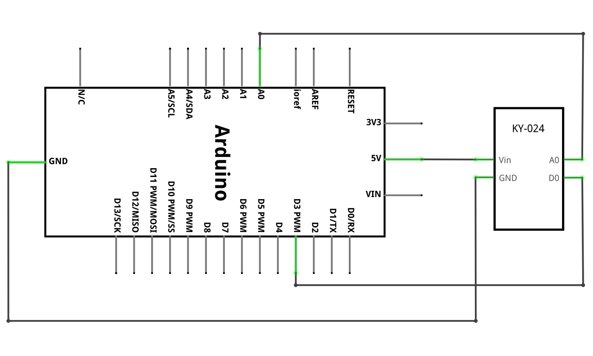

**Sample Code**

<iframe src=https://create.arduino.cc/editor/keyestudio/ee9695cc-af7f-42cd-bb40-64c962d8aff5/preview?embed style="height:510px;width:100%;margin:10px 0" frameborder=0></iframe>

**Example Result**

Setting analog pin as input (line 11) is not necessary, the [analogRead()](https://www.arduino.cc/reference/en/language/functions/analog-io/analogread/) function will automatically set the pin as analog input when used.

Use **Tools** \> **Serial Plotter** on the Arduino IDE to visualize the changes on intensity and polarity of the magnetic field.

 

### **Project 22: Metal Touch Sensor**

**Description**

The KY-036 metal touch sensor module features a Darlington and PN transistor, the signal of which is controlled by LM393 comparator IC which consists of two comparators. When you touch the bar wire meant over the transistor which is represented by the base of the transistor.

**Specification**

| Supply Voltage | 3.3V to 5V         |
|----------------|--------------------|
| Interface      | analog and digital |
| Size           | 34 x 16 mm         |
| Weight         | 4g                 |

 

 **How Does It Work?**

Basically, the functionality of the KY-036 Metal Touch sensor module is divided into three main components first the sensor unit at the front of the module which measures the area physically and sends an analog signal to the second unit the amplifier.

The amplifier basically amplifies the signal and according to the resistance value of the potentiometer and sends the signal to the analog output of the module also you can set the sensitivity of the sensor by adjusting the knob of the potentiometer. If you rotate it in clockwise direction you can increase the sensitivity and if you rotate it in anti-clockwise direction you can reduce the sensitivity as shown in the diagram.

The comparator will switches the digital out and turn on the led if the signal falls under a specific value.

 Pinout

DOUT is the metal touch sensor digital pin which we connect to the Arduino.

AOUT is the metal touch sensor analog pin which we connect to the Arduino.

VCC should be connected to the +5V Power of Arduino.

GND should be connected to the ground of Arduino.

**Connection Diagram**

Connect the board’s analog output (A0) to pin A0 on the Arduino and the digital output (D0) to pin 3.Connect the power line (+) and ground (G) to 5V and GND respectively.

**Sample Code**

<iframe src=https://create.arduino.cc/editor/keyestudio/295ff094-b231-4469-abca-efc67ec5d793/preview?embed style="height:510px;width:100%;margin:10px 0" frameborder=0></iframe>

**Example Result**

Use **Tools** \> **Serial Plotter** on the Arduino IDE to visualize the values on the analog interface, use a magnet to trigger the switch.

### **Project 23: Reed Switch Module**

**Description**

The KY-025 Reed Switch Module is a small electrical switch operated by an applied magnetic field, commonly used as proximity sensor.

The module has both digital and analog outputs. A trimmer is used to calibrate the sensitivity of the sensor.Compatible with Arduino, Raspberry Pi, ESP32 and other microcontrollers.

Reed Switch is a special switch and a main component for reed relay and proximity switch.

Reed switch is usually comprised of two soft magnetic materials and metal reed contacts which will disconnect itself when there is no magnetic.

In addition, some reed switches are also equipped with another reed acting as the third normally-closed contact. These reed contacts are encapsulated in a glass tube fulled of inert gases(such as nitrogen and helium) or in a vacuum glass tube.

The reeds encapsulated in the glass tube are placed in parallel with ends overlapped. Certain amount of space or mutual contact will be reserved to constitute the normally-open or normally-closed contacts of the switch.

Reed switch can be used as for count, limit or other purposes.

For instance, a kind of bike-kilometer is constituted by sticking magnetic to the tire and mounting reed switch aside.

You can also mount reed switch on the door for alarming purpose or as switches.

Reed switch has been widely applied in household appliances, cars, communication, industry, healthcare and security areas.

Furthermore, it can also be applied to other sensors and electric devices such as liquidometer, door magnet, reed relay, oil level sensor and proximity sensor(magnetic sensor). It can be used under high-risk environment.

**Specification**

This module consist of a 2x14mm normally open [reed switch](https://en.wikipedia.org/wiki/Reed_switch), an LM393 dual differential comparator, a 3296W-104 trimmer pontetiometer, 6 resistors, 2 LEDs and 4 male header pins.

| Operation Voltage   | 3.3V \~ 5.5V                  |
|---------------------|-------------------------------|
| Working current     | ≥20mA                         |
| Working temperature | －10℃ to ＋50℃                |
| Detection distance  | ≤10mm                         |
| Board Dimensions    | 1.5cm x 3.6cm [0.6in x 1.4in] |

 Reed Switch Overview

A typical reed switch contains a pair of metal reeds made of a ferromagnetic material (something that gets magnetized easily but loses magnetism when it leaves a magnetic field). The surfaces of the reed contacts are plated with hardwearing metals such as rhodium, ruthenium, palladium or iridium to give them a longer life as they switch on and off millions of times.

The reeds are hermetically sealed inside a tubular glass envelope to keep them free of dust and dirt. The [hermetic sealing](https://en.wikipedia.org/wiki/Hermetic_seal) of reed switches makes them suitable for use in explosive environments where small sparks from conventional switches would constitute a hazard. The glass tube is filled with an inert gas, usually nitrogen, or a vacuum to prevent oxidation of the contacts.

Typically, contacts are made of a nickel-iron alloy that is easy to magnetize (has high magnetic permeability) but does not stay that way for long (has low magnetic retentivity). Being a mechanical device, they take some time to respond to changes in the magnetic field – in other words, their switching speed is low (typically 0.6 ms turn-on time, 0.2 ms turn-off time) compared to electronic switches.

In the presence of a magnetic field, both contacts move (instead of just one) and they form a flat, parallel area of ​​contact with each other. This helps to increase the life and reliability of the reed switch.

A reed switch only detects the presence of a magnetic field and does not measure its strength. If you are interested in measuring strength, an analog Hall Effect sensor is a better option to consider.

 **How Does It Work?**

The key to understanding how reed switches work is to realize that they are part of a magnetic circuit, as well as an electrical one – magnetism flows through them as well as electricity.

As you bring a magnet closer to the reed switch, the entire switch becomes a part of the “magnetic circuit” including the magnet (the dotted line in the image shows part of the magnetic field).

The two contacts of a reed switch become opposite magnetic poles, which is why they attract and snap together. It doesn’t matter which end of the magnet you bring closer: the contacts still polarize in opposite ways and attract each other.

When you take the magnet away, the contacts separate and return back to their original position.

A reed switch like this is normally open (NO). This means ‘normally’ when the switch is unaffected by the magnetic field, the switch is open and does not conduct electricity. When a magnet comes close enough to activate the switch, the contacts close and current flows through.

In these illustrations, the movement of the contacts is largely exaggerated. Real reed switches have contacts that are only a few microns apart (about ten times thinner than a human hair). So the movement is not visible to the naked eye. Thanks to [Zátonyi Sándor](https://en.wikipedia.org/wiki/File:Reed_switch.ogv) for sharing macroscopic photos of the reed switch.

 Pinout

DOUT is the reed switch digital pin which we connect to the Arduino.

AOUT is the reed switch analog pin which we connect to the Arduino.

VCC should be connected to the +5V Power of Arduino.

GND should be connected to the ground of Arduino.

**Connection Diagram**

Connect the board’s analog output (A0) to pin A0 on the Arduino and the digital output (D0) to pin 3.Connect the power line (+) and ground (G) to 5V and GND respectively.

**Sample Code**

<iframe src=https://create.arduino.cc/editor/keyestudio/c23e0b10-d0f9-4e98-9510-977c2debfafe/preview?embed style="height:510px;width:100%;margin:10px 0" frameborder=0></iframe>

**Example Result**

Use **Tools** \> **Serial Plotter** on the Arduino IDE to visualize the values on the analog interface, use a magnet to trigger the switch.

### **Project 24: Digita Temperature Sensor**

**Description**

The KY-028 Digital Temperature Sensor measures temperature changes based on thermistor resistance. This module has both digital and analog outputs, there’s a potentiometer to adjust the detection threshold on the digital interface.Compatible with Arduino, Raspberry Pi, ESP32, and other microcontrollers.

This module is based on the working principle of a thermistor (resistance varies with temperature change in the environment).

It can sense temperature changes in the surrounding and send the data to the analog IO of Arduino board.

All we need to do is to convert the sensor’s output data into degrees Celsius temperature via simple programming, finally displaying it on the monitor.

It's both convenient and effective, thus it is widely applied to gardening, home alarm system and other devices.

**Specification**

Operating Voltage 3.3V \~ 5.5V

Temperature Measurement Range -55°C to 125°C [-67°F to 257°F]

Measurement Accuracy ±0.5°C

Board Dimensions 15mm x 36mm [0.6in x 1.4in]

 **How Does It Work?**

The Thermistor or simply **Therm**ally Sensitive Res**istor** is a **temperature sensor** that works on the principle of varying resistance with temperature. They are made of semiconducting materials. The circuit symbol of the thermistor is shown in the figure.

The thermistor works on the simple principle of change in resistance due to a change in temperature. When the ambient temperature changes the thermistor starts self-heating its elements. its resistance value is changed with respect to this change in temperature. This change depends on the type of thermistor used. The resistance temperature characteristics of different types of thermistors are given in the following section.

**NTC Thermistor**

NTC stands for Negative Temperature coefficient. They are ceramic semiconductors that have a high Negative Temperature Coefficient of resistance. The resistance of an NTC will decrease with increasing temperature in a non-linear manner.

Circuit symbols of NTC and PTC thermistors are shown in the following figure.

**PTC Thermistor**

PTC thermistors are Positive Temperature Coefficient resistors and are made of polycrystalline ceramic materials. The resistance of a PTC will increase with increasing temperature in a non-linear manner. The PTC thermistor shows only a small change of resistance with temperature until the switching point(TR) is reached.

The temperature resistance characteristics of an NTC and a PTC is shown in the following figure.

 Pinout

DOUT is the digital temperature sensor digital pin which we connect to the Arduino.

AOUT is the digital temperature sensor analog pin which we connect to the Arduino.

VCC should be connected to the +5V Power of Arduino.

GND should be connected to the ground of Arduino.

**Connection Diagram**

Connect the board’s analog output (A0) to pin A0 on the Arduino and the digital output (D0) to pin 3.Connect the power line (+) and ground (G) to 5V and GND respectively.

**Sample Code**

<iframe src=https://create.arduino.cc/editor/keyestudio/8dc3a39d-5104-4855-bf45-465fe66aa6a0/preview?embed style="height:510px;width:100%;margin:10px 0" frameborder=0></iframe>

**Example Result**

Done wiring and powered up as the above figure, upload well the code to the board, then open the serial monitor of Arduino IDE, you will see the current temperature value.

### **Project 25: High-sensitivity sound sensor**

**Description**

 High-sensitivity sound sensor is typically used in detecting the volume of ambient sounds. The sensor comes with a potentiometer, so that you can turn it to adjust the signal gain.

You can use it to make some interesting and interactive works, such as a voice operated switch.

**Specification**

| Operating Voltage          | 2v \~ 2.5v    |
|----------------------------|---------------|
| Working Current            | 10mA          |
| Diameter                   | 5mm           |
| Package Type               | Diffusion     |
| Color                      | Red + Yellow  |
| Beam Angle                 | 150           |
| Wavelength                 | 571nm + 644nm |
| Luminosity Intensity (MCD) | 20-40; 40-80  |

 **How Does It Work?**

Inside the microphone is the thin diaphragm, which is actually one plate of a capacitor. The second plate is the backplate, which is close to and parallel to the diaphragm.

When you speak into the microphone, sound waves created by your voice strike the diaphragm, causing it to vibrate.

When the diaphragm vibrates in response to sound, the capacitance changes as the plates get closer together or farther apart.

As the capacitance changes, the voltage across the plates changes, which by measuring we can determine the amplitude of the sound.

 Hardware Overview

The sound sensor is a small board that combines a microphone (50Hz-10kHz) and some processing circuitry to convert sound waves into electrical signals.

This electrical signal is fed to on-board LM393 High Precision Comparator to digitize it and is made available at OUT pin.

The module has a built-in potentiometer for sensitivity adjustment of the OUT signal.

You can set a threshold by using a potentiometer; So that when the amplitude of the sound exceeds the threshold value, the module will output LOW otherwise HIGH.

This setup is very useful when you want to trigger an action when certain threshold is reached. For example, when the amplitude of the sound crosses a threshold (when a knock is detected), you can activate a relay to control the light. You got the idea!

Tip: Rotate the knob counterclockwise to increase sensitivity and clockwise to decrease it.

Apart from this, the module has two LEDs. The Power LED will light up when the module is powered. The Status LED will light up when the digital output goes LOW.

 Pinout

DOUT is the sound sensor digital pin which we connect to the Arduino.

AOUT is the sound sensor analog pin which we connect to the Arduino.

VCC should be connected to the +5V Power of Arduino.

GND should be connected to the ground of Arduino.

**Connection Diagram**

Connect the board’s analog output (A0) to pin A0 on the Arduino and the digital output (D0) to pin 3.Connect the power line (+) and ground (G) to 5V and GND respectively.

**Sample Code**

<iframe src=https://create.arduino.cc/editor/keyestudio/23468d97-47da-4aa7-970d-489349888f6f/preview?embed style="height:510px;width:100%;margin:10px 0" frameborder=0></iframe>

**Example Result**

Done wiring and powered up, upload well the code, then open the serial monitor and set the baud rate as 9600, you will see the analog value. When talking toward the micro head, the value will increase. Shown below.

### **Project 26：Analog Sound Sensor**

**Description**

This module is made of three functional elements, the sensor on the front of the module which performs the measurement, then the analog signal is sent to the amplifier.

This amplifies the signal according to the gain determined by the potentiometer and sends the signal to the analog output of the module.

The third part consists of a comparator that switches the digital output and the diode when the signal falls below a certain value.

**Specification**

| Operating Voltage          | 2v \~ 2.5v    |
|----------------------------|---------------|
| Working Current            | 10mA          |
| Diameter                   | 5mm           |
| Package Type               | Diffusion     |
| Color                      | Red + Yellow  |
| Beam Angle                 | 150           |
| Wavelength                 | 571nm + 644nm |
| Luminosity Intensity (MCD) | 20-40; 40-80  |

 Hardware Overview

The sound sensor is a small board that combines a microphone (50Hz-10kHz) and some processing circuitry to convert sound waves into electrical signals.

This electrical signal is fed to on-board LM393 High Precision Comparator to digitize it and is made available at OUT pin.

The module has a built-in potentiometer for sensitivity adjustment of the OUT signal.

You can set a threshold by using a potentiometer; So that when the amplitude of the sound exceeds the threshold value, the module will output LOW otherwise HIGH.

This setup is very useful when you want to trigger an action when certain threshold is reached. For example, when the amplitude of the sound crosses a threshold (when a knock is detected), you can activate a relay to control the light. You got the idea!

Tip: Rotate the knob counterclockwise to increase sensitivity and clockwise to decrease it.

Apart from this, the module has two LEDs. The Power LED will light up when the module is powered. The Status LED will light up when the digital output goes LOW.

 Pinout

DOUT is the sound sensor digital pin which we connect to the Arduino.

AOUT is the sound sensor analog pin which we connect to the Arduino.

VCC should be connected to the +5V Power of Arduino.

GND should be connected to the ground of Arduino.

**Connection Diagram**

**Sample Code**

<iframe src=https://create.arduino.cc/editor/keyestudio/146dffe9-bcca-4987-a0ff-c30782142e26/preview?embed style="height:510px;width:100%;margin:10px 0" frameborder=0></iframe>

**Example Result**

Done wiring and powered up, upload well the code, then open the serial monitor and set the baud rate as 9600, you will see the analog value. When talking toward the micro head, the value will increase. Shown below.

### **Project 27：Digital IR Receiver Module**

**Description**

The KY-022 Infrared Receiver module reacts to 38kHz IR light. It can be used to receive commands from IR remote controllers from TVs, stereos and other devices.

It can also be used together with the [KY-005 IR Transmitter module](https://arduinomodules.info/ky-005-infrared-transmitter-sensor-module/).

IR is widely used in remote control. With this IR receiver, Arduino project is able to receive command from any IR remoter controllers if you have the right decoder. Well, it will be also easy to make your own IR controller using IR transmitter.

**Specification**

| Operating Voltage    | 2.7V to 5.5V   |
|----------------------|----------------|
| Operating Current    | 0.4mA to 1.5mA |
| Reception Distance   | 18m            |
| Reception Angle      | ±45º           |
| Carrier Frequency    | 38KHz          |
| Low Level Voltage    | 0.4V           |
| High Level Voltage   | 4.5V           |
| Ambient Light Filter | up to 500LUX   |

**What Is Infrared?**

Infrared radiation is a form of light similar to the light we see all around us. The only difference between IR light and visible light is the frequency and wavelength, meaning that infrared light lies outside the range of visible light, so it is inviable to the human eye. A good way of seeing Infrared light is to view it through an old camera, this is because they contain a filter which makes the IR light visible, usually seen as a purple glow.

**IR Signal Modulation**

IR light is all around us, emitted by the sun, light bulbs and anything else that produces heat. So it would be easy to assume that an IR Receiver would pick up all this extra IR radiation rather than the one being sent by a transmitter. To prevent this extra radiation from interfering with the IR signal, a signal modulation technique is used.

In IR signal modulation, an encoder on the IR remote converts a binary signal into a modulated electrical signal. This electrical signal is sent to the transmitting LED. The transmitting LED converts the modulated electrical signal into a modulated IR light signal. The IR receiver then demodulates the IR light signal and converts it back to binary before passing on the information to a microcontroller as seen below in the diagram.

A modulated IR signal is a series of light pulses switched on and off at a high frequency, this is known as the carrier frequency. The carrier frequency used by most transmitters is 38 kHz, because it is rare in nature and therefor can be distinguished from ambient IR noise. This way the IR receiver will know that the 38 kHz signal was sent from the transmitter and not picked up from the surrounding environment.

 Pinout

SIN is the IR receiver module signal pin which we connect to the Arduino.

VCC should be connected to the +5V Power of Arduino.

GND should be connected to the ground of Arduino.

**Connection Diagram**

Connect the module power line (middle) and ground (-) to +5 and GND on the Arduino respectively. Also connect the signal pin (S) to pin 11.Line up the IR receiver and transmitter, place them facing each other.

**Sample Code**

<iframe src=https://create.arduino.cc/editor/keyestudio/16cac7ca-3f1a-49e2-8cda-3f03126a0748/preview?embed style="height:510px;width:100%;margin:10px 0" frameborder=0></iframe>

**Note:** before compiling the code, do remember to place the library into libraries directory of Arduino IDE. Otherwise, compiling will fail.

IR Remote Library Includes some sample codes for sending and receiving.

**Example Result**

Finish the wiring and upload the code, and then send the infrared signal through the infrared remote controller, which is received and printed by the infrared receiver module.

**Expand training**

Use the infrared remote control to connect the led lamp

**Connection Diagram**

**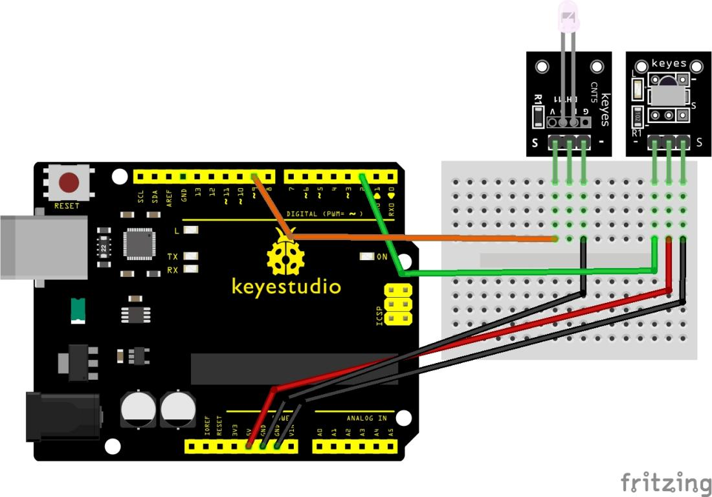**

**Sample Code**

<iframe src=https://create.arduino.cc/editor/keyestudio/0a67adcf-e902-4ca0-a824-7b84ab58c7f5/preview?embed style="height:510px;width:100%;margin:10px 0" frameborder=0></iframe>

**Example Result**

Press THE OK key and the LED turns on. Press the OK key again and the LED turns off

**  
**

### **Project 28：Digital IR Transmitter Module**

**Description**

The KY-005 Infrared Transmitter module emits infrared light at 38kHz. It can be used to control TVs, stereos, air conditioners and other devices with IR receivers. It can also be used together with the KY-022 Infrared Receiver module.

**Specification**

| Power Supply               | 3-5V                  |
|----------------------------|-----------------------|
| Infrared center frequency  | 850nm-940nm           |
| Infrared emission angle    | about 20 degrees      |
| Infrared emission distance | about 1.3m (5V 38Khz) |
| Interface socket           | PH2.54                |

 **How Does It Work?**

There are different types of infrared transmitters depending on their wavelengths, output power and response time. An IR sensor consists of an IR LED and an IR Photodiode, together they are called as PhotoCoupler or OptoCoupler.

**IR Transmitter or IR LED**

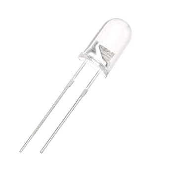Infrared Transmitter is a light emitting diode (LED) which emits infrared radiations called as IR LED’s. Even though an IR LED looks like a normal LED, the radiation emitted by it is invisible to the human eye.

The picture of an Infrared LED is shown below.

**IR Receiver or Photodiode**

Infrared receivers or infrared sensors detect the radiation from an IR transmitter. IR receivers come in the form of photodiodes and phototransistors. Infrared Photodiodes are different from normal photo diodes as they detect only infrared radiation. Below image shows the picture of an IR receiver or a photodiode,

Different types of IR receivers exist based on the wavelength, voltage, package, etc. When used in an infrared transmitter – receiver combination, the wavelength of the receiver should match with that of the transmitter.

The emitter is an IR LED and the detector is an IR photodiode. The IR photodiode is sensitive to the IR light emitted by an IR LED. The photo-diode’s resistance and output voltage change in proportion to the IR light received. This is the underlying working principle of the IR sensor.

When the IR transmitter emits radiation, it reaches the object and some of the radiation reflects back to the IR receiver. Based on the intensity of the reception by the IR receiver, the output of the [**sensor**](https://robu.in/product-category/sensor/) defines.

 Pinout

SIN is the infrared transmitter module signal pin which we connect to the Arduino.

VCC should be connected to the +5V Power of Arduino.

GND should be connected to the ground of Arduino.

**Connection Diagram**

Connect the board power line (middle) and ground (-) to +5 and GND on the Arduino respectively.Connect the signal pin (S) to pin 3 on the Arduino Uno.The pin number for the IR transmitter is determined by IRremote library. Other platforms might use a different pin.

The following Arduino sketch acts as a TV remote control. It uses the IRremote library to serially send instructions to a TV using infrared light.

In this example, we will send the power command for Sony TVs every 5 seconds, turning the TV on and off 10 times.

Check the IRremote library documentation for supported TV commands and devices. Links to the required libraries can be found in the Downloads section below.

You can also use the [KY-022 IR Receiver](https://arduinomodules.info/ky-022-infrared-receiver-module/) module to receive and process the signal.

**Sample Code**

<iframe src=https://create.arduino.cc/editor/keyestudio/41d92e91-c660-4a5d-8449-50093ebed0c0/preview?embed style="height:510px;width:100%;margin:10px 0" frameborder=0></iframe>

**Result:**

Connect the line, upload the code, and then connect the infrared receiving module with a fast sending board. Print the code of item 27 through the serial port to see the value sent by the infrared transmitting module

**  
**

### **Project 29: 1602 LCD module**

**Description**

Want your Arduino projects to display status messages or sensor readings? Then these LCD displays might be the perfect fit. They are extremely common and a fast way to add a readable interface to your project.

**Specification**

| Power Supply    | 3.3-5V                               |
|-----------------|--------------------------------------|
| Display Mode    | STN, BLUB                            |
| Display Formate | 16 Character x 2 Line                |
| Input Data      | 4-Bits or 8-Bits interface available |
| Display Font    | 5 x 8 Dots                           |
| Driving Scheme  | 1/16Duty,1/5Bias                     |
| BACKLIGHT       | blue                                 |

 **How Does It Work?**

These LCDs are ideal for displaying text/characters only, hence the name ‘Character LCD’. The display has an LED backlight and can display 32 ASCII characters in two rows with 16 characters on each row.

Each rectangle contains grid of 5×8 pixels

If you look closely, you can actually see the little rectangles for each character on the display and the pixels that make up a character. Each of these rectangles is a grid of 5×8 pixels.

Although they display only text, they do come in many sizes and colors: for example, 16×1, 16×4, 20×4, with white text on blue background, with black text on green and many more.

The good news is that all of these displays are ‘swappable’ – if you build your project with one you can just unplug it and use another size/color LCD of your choice. Your code may have to adjust to the larger size but at least the wiring is the same!

 Pinout

 

GND should be connected to the ground of Arduino.

VCC is the power supply for the LCD which we connect the 5 volts pin on the Arduino.

Vo (LCD Contrast) controls the contrast and brightness of the LCD. Using a simple voltage divider with a potentiometer, we can make fine adjustments to the contrast.

RS (Register Select) pin lets the Arduino tell the LCD whether it is sending commands or the data. Basically this pin is used to differentiate commands from the data.

For example, when RS pin is set to LOW, then we are sending commands to the LCD (like set the cursor to a specific location, clear the display, scroll the display to the right and so on). And when RS pin is set on HIGH we are sending data/characters to the LCD.

R/W (Read/Write) pin on the LCD is to control whether or not you’re reading data from the LCD or writing data to the LCD. Since we’re just using this LCD as an OUTPUT device, we’re going to tie this pin LOW. This forces it into the WRITE mode.

En (Enable) pin is used to enable the display. Meaning, when this pin is set to LOW, the LCD does not care what is happening with R/W, RS, and the data bus lines; when this pin is set to HIGH, the LCD is processing the incoming data.

D0-D7 (Data Bus) are the pins that carries the 8 bit data we send to the display. For example, if we want to see the uppercase ‘A’ character on the display we will set these pins to 0100 0001(according to the ASCII table) to the LCD.

A-C (Anode & Cathode) pins are used to control the backlight of the LCD.

**Connection Diagram**

let’s connect the LCD Display to the Arduino. Four data pins (D4-D7) from the LCD will be connected to Arduino’s digital pins from \##4-7. The Enable pin on LCD will be connected to Arduino \##2 and the RS pin on LCD will be connected to Arduino \##1.

**Sample Code**

<iframe src=https://create.arduino.cc/editor/keyestudio/297ee0b0-c507-43fc-bc1d-90244e380dc7/preview?embed style="height:510px;width:100%;margin:10px 0" frameborder=0></iframe>

**Example Result**

If everything goes right, you should see something like this on the display.

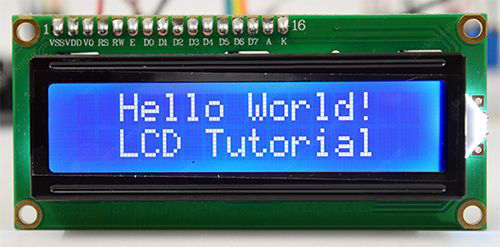

### **Project 30:DHT11 Sensor**

**Description**

Give your next Arduino project the ability to sense the world around it with the inexpensive DHT11 digital temperature & humidity sensor module from AOSONG.

This sensor is pre-calibrated and don’t require extra components so you can start measuring relative humidity and temperature right away.

**Specification**

| Operating Voltage                  | 3.3V to 5.5V                |
|------------------------------------|-----------------------------|
| Humidity measurement range         | 20% to 90% RH               |
| Humidity measurement accuracy      | ±5% RH                      |
| Humidity measurement resolution    | 1% RH                       |
| Temperature measurement range      | 0ºC to 50ºC [32ºF to 122ºF] |
| Temperature measurement accuracy   | ±2ºC                        |
| Temperature measurement resolution | 1ºC                         |
| Signal transmission range          | 20m                         |

 **How Does It Work?**

Inside the DHT11, there is a humidity sensing component along with a Thermistor.

Humidity sensing component has two electrodes with moisture holding substrate sandwiched between them.

The ions are released by the substrate as water vapor is absorbed by it, which in turn increases the conductivity between the electrodes.

The change in resistance between the two electrodes is proportional to the relative humidity. Higher relative humidity decreases the resistance between the electrodes, while lower relative humidity increases the resistance between the electrodes.

DHt11 also contains a NTC/Thermistor to measure temperature. A thermistor is a thermal resistor whose resistance changes drastically with temperature. The term “NTC” means “Negative Temperature Coefficient”, which means that the resistance decreases with increase of the temperature.

On the other side, there is a small PCB with an 8-bit SOIC-14 packaged IC. This IC measures and processes the analog signal with stored calibration coefficients, does analog to digital conversion and spits out a digital signal with the temperature and humidity.

 Pinout

\+ (VCC) pin supplies power for the sensor.

SIN pin is used to communication between the sensor and the Arduino.

– (GND) should be connected to the ground of Arduino.

**Connection Diagram**

Connect the Power line (middle) and ground (-) to +5 and GND respectively. Connect signal (S) to pin 8 on the Arduino.

| **KY-015** | **Arduino** |
|------------|-------------|
| S          | Pin 8       |
| middle     | +5V         |
| –          | GND         |

 Installing DHT library

DHT11 sensors have their own single wire protocol for transferring the data. This protocol requires precise timing. Fortunately, **DHT Library** was written to hide away all the complexities so that we can issue simple commands to read the temperature and humidity data.

Download the library first, by visiting the [GitHub repo](https://github.com/RobTillaart/Arduino/tree/master/libraries/DHTlib) , download the zip:

<https://github.com/RobTillaart/Arduino/tree/master/libraries/DHTlib>

To install it, open the Arduino IDE, go to Sketch \> Include Library \> Add .ZIP Library, and then select the DHTlib ZIP file that you just downloaded.

**Sample Code**

<iframe src=https://create.arduino.cc/editor/keyestudio/eb777384-8f6a-4d7f-bd23-5c34a2179980/preview?embed style="height:510px;width:100%;margin:10px 0" frameborder=0></iframe>

**Example Result**

Once the sketch is uploaded, open a Serial Monitor window to see the output from the Arduino.

### **Project 31: PIR Motion Sensor**

**Description**

Every mad scientist’s lab, or teenager’s secret room, needs advanced protection against intrusion by rogue agents or siblings. If you are one of them, you should probably consider getting a Passive infrared (PIR) sensor for you. PIR sensors allow you to detect when someone is in your room when they shouldn’t be.

Though it may seem like something out of a spy movie, you likely use PIR sensors every day. This sensor is the same you will find in most modern security systems, automatic light switches, garage door openers and similar applications where the operation of some electrical device is necessary only in the presence of humans.

**Specification**

1.  Input Voltage: 3.3 \~ 5V, Maximum for 6V
2.  Working Current: 15uA
3.  Working Temperature: -20 \~ 85 ℃
4.  Output Voltage: High 3V, Low 0V
5.  Output Delay Time (High Level): About 2.3 to 3 Seconds
6.  Detection Angle: 100 °
7.  Detection Distance: 7 meters
8.  Output Indicator LED (if output HIGH, it will be ON)
9.  Limit Current for Pin: 100mA
10. Size: 30\*20mm
11. Weight: 4g

 **How Does It Work?**

If you didn’t know, all objects with a temperature above Absolute Zero (0 Kelvin / -273.15 °C) emit heat energy in the form of infrared radiation, including human bodies. The hotter an object is, the more radiation it emits.

PIR sensor is specially designed to detect such levels of infrared radiation. It basically consists of two main parts: **A Pyroelectric Sensor** and A special lens called **Fresnel lens** which focuses the infrared signals onto the pyroelectric sensor.

A Pyroelectric Sensor actually has two rectangular slots in it made of a material that allows the infrared radiation to pass. Behind these, are two separate infrared sensor electrodes, one responsible for producing a positive output and the other a negative output. The reason for that is that we are looking for a change in IR levels and not ambient IR levels. The two electrodes are wired up so that they cancel each other out. If one half sees more or less IR radiation than the other, the output will swing high or low.

**When the sensor is idle**, i.e. there is no movement around the sensor; both slots detect the same amount of infrared radiation, resulting in a zero output signal.

**But when a warm body like a human or animal passes by**; it first intercepts one half of the PIR sensor, which causes a positive differential change between the two halves. When the warm body leaves the sensing area, the reverse happens, whereby the sensor generates a negative differential change. The corresponding pulse of signals results in the sensor setting its output pin high.

 HC-SR501 PIR Motion Detector

For most of our Arduino projects that need to detect when a person has left or entered the area, or has approached, HC-SR501 PIR sensors are a great choice. They are low power and low cost, pretty rugged, have a wide lens range, easy to interface with and are insanely popular among hobbyists.

HC-SR501 PIR sensor has three output pins VCC, Output and Ground as shown in the diagram below. It has a built-in voltage regulator so it can be powered by any DC voltage from 4.5 to 12 volts, typically 5V is used. Other than this, there are a couple options you have with your PIR. Let’s check them out.

There are two potentiometers on the board to adjust a couple of parameters:

-   **Sensitivity**– This sets the maximum distance that motion can be detected. It ranges from 3 meters to approximately 7 meters. The topology of your room can affect the actual range you achieve.
-   **Time**– This sets how long that the output will remain HIGH after detection. At minimum it is 3 seconds, at maximum it is 300 seconds or 5 minutes.

Finally the board has a jumper (on some models the jumper is not soldered in). It has two settings:

-   **H**– This is the Hold/Repeat/Retriggering In this position the HC-SR501 will continue to output a HIGH signal as long as it continues to detect movement.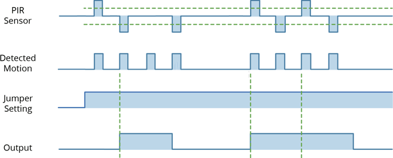
-   **L**– This is the Intermittent or No-Repeat/Non-Retriggering In this position the output will stay HIGH for the period set by the TIME potentiometer adjustment.

 Pinout

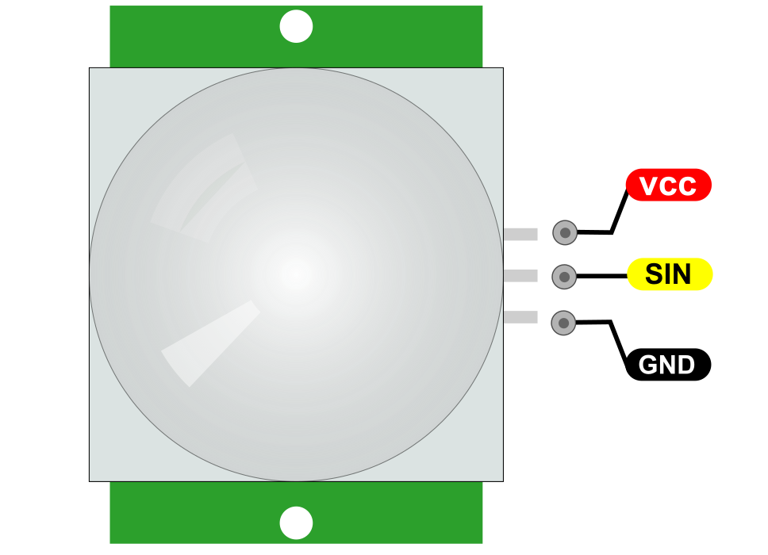

VCC is the power supply for HC-SR501 PIR sensor which we connect the 5V pin on the Arduino.

SIN pin is a 3.3V TTL logic output. LOW indicates no motion is detected, HIGH means some motion has been detected.

GND should be connected to the ground of Arduino.

**Connection Diagram**

**Sample Code**

<iframe src=https://create.arduino.cc/editor/keyestudio/80cbe42d-d2e1-4ba4-bb5c-ad74a74a9e25/preview?embed style="height:510px;width:100%;margin:10px 0" frameborder=0></iframe>

**Example Result**

At the end we will print a message on the serial monitor when motion is detected.

### **Project 32:Joystick Module**

**Description**

When you hear the word **Joystick**, the first thing that comes to mind is the game controllers. They are mainly used for playing games, although in DIY Electronics, there are a lot of fun things you can do with it. Like controlling a robot/a rover, controlling the movement of camera; these are just the tip of the iceberg.

**Specification**

| Operating Voltage | 3.3V to 5V                      |
|-------------------|---------------------------------|
| Board Dimensions  | 2.6cm x 3.4cm [1.02in x 1.22in] |
| Interface         | Analog x2, Digital x1           |
|                   |                                 |

 **How Does It Work?**

The basic idea of a joystick is to translate the stick’s position on **two axes** — the **X-axis** (left to right) and the **Y-axis** (up and down) into electronic information an Arduino can process. This can be little tricky, but thanks to the design of the joystick consisting of two potentiometers and a **Gimbal Mechanism**.

 Gimbal Mechanism

When you rotate the joystick, the thumb handle moves a narrow rod that sits in two rotatable slotted shafts (Gimbal). One of the shafts allows motion in the X-axis (left and right) while the other allows motion in the Y-axis (up and down). Tilting the stick forward and backward pivots the Y-axis shaft from side to side. Tilting it left to right pivots the X-axis shaft. When you move the stick diagonally, it pivots both shafts.

A potentiometer is connected to each joystick shaft that interprets the position of the rod as analog readings. Moving the slotted shafts rotates the contact arm of the potentiometer. In other words, if you push the stick all the way forward, it will turn the potentiometer contact arm to one end of the track, and if you pull it back toward you, it will turn the contact arm the other way.

 Reading analog values from Joystick

In order to read the joystick’s physical position, we need to measure the change in resistance of a potentiometer. This change can be read by an Arduino analog pin using ADC.

As the Arduino board has an ADC resolution of 10 bits, the values on each analog channel (axis) can vary from 0 to 1023. So, if the stick is moved on X axis from one end to the other, the X values will change from 0 to 1023 and similar thing happens when moved along the Y axis. When the joystick stays in its center position the value is around 512.

The graphic below shows the X and Y directions and also gives an indication of how the outputs will respond when the joystick is pushed in various directions.

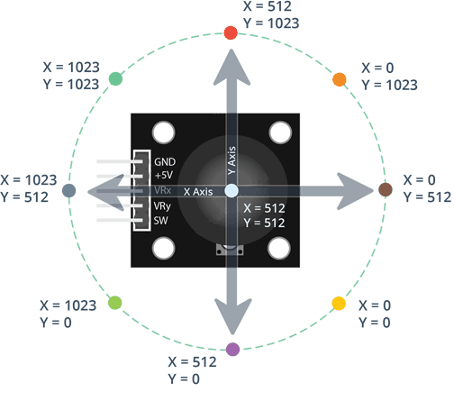

 Pinout

GND is the Ground Pin which we connect the GND pin on the Arduino.

VCC supplies power for the module. You can connect it to 5V output from your Arduino.

VRx gives readout of the joystick in the horizontal direction (X-coordinate) i.e. how far left and right the joystick is pushed.

VRy gives readout of the joystick in the vertical direction (Y-coordinate) i.e. how far up and down the joystick is pushed.

SW is the output from the pushbutton. It’s normally open, meaning the digital readout from the SW pin will be HIGH. When the button is pushed, it will connect to GND, giving output LOW.

**Connection Diagram**

Connect VRx to analog pin A0 of the Arduino and VRy to analog pin A1 of the Arduino.connect the SW pin of the joystick to digital pin D7 of the Arduino.

**Sample Code**

<iframe src=https://create.arduino.cc/editor/keyestudio/4b1b7392-115e-441b-aa8d-6352106039bf/preview?embed style="height:510px;width:100%;margin:10px 0" frameborder=0></iframe>

**Example Result**

Wiring well and uploading the code, open the serial monitor on Arduino software, and set the baud rate as 9600, you will see the value shown below. If push the joystick downward /upward /leftward /rightward, the data will change.

### **Project 33:Rotary Encoder Module**

**Description**

A rotary encoder is a type of position sensor that converts the angular position (rotation) of a knob into an output signal that is used to determine what direction the knob is being rotated.

Due to their robustness and fine digital control; they are used in many applications including robotics, CNC machines and printers.

There are two types of rotary encoder – absolute and incremental. The absolute encoder gives us the exact position of the knob in degrees while the incremental encoder reports how many increments the shaft has moved.

The rotary encoder used in this tutorial is of an **incremental** type.

**Specification**

| Power Supply | 5V      |
|--------------|---------|
| Interface    | Digital |

 **How Does It Work?**

Inside the encoder is a slotted disk connected to the common ground pin C, and two contact pins A and B, as illustrated below.

When you turn the knob, A and B come in contact with the common ground pin C, in a particular order according to the direction in which you are turning the knob.

When they come in contact with common ground they produce signals. These signals are shifted 90° out of phase with each other as one pin comes in contact before the other pin. This is called **quadrature encoding**.

When you turn the knob clockwise, the A pin connects first, followed by the B pin. When you turn the knob counterclockwise, the B pin connects first, followed by the A pin.

By tracking when each pin connects to and disconnects from the ground, we can use these signal changes to determine in which direction the knob is being rotated. You can do this by simply observing the state of B when A changes state.

When the A changes state:

-   if B != A, then the knob was turned clockwise.

if B = A, then the knob was turned counterclockwise.

 Pinout

GND is the Ground connection.

VCC is the positive supply voltage, usually 3.3 or 5 Volts.

SW is the active low push button switch output. When the knob is pushed, the voltage goes LOW.

DT (Output B) is the same as the CLK output, but it lags the CLK by a 90° phase shift. This output can be used to determine the direction of rotation.

CLK (Output A) is the primary output pulse for determining the amount of rotation. Each time the knob is rotated by one detent (click) in either direction, the ‘CLK’ output goes through one cycle of going HIGH and then LOW.

**Connection Diagram**

connect the CLK and DT pins to digital pin2 and 3 respectively. Finally, connect the SW pin to a digital pin 4.

**Sample Code**

<iframe src=https://create.arduino.cc/editor/keyestudio/6eff86c8-3892-43a1-8a85-ea46a2dbb954/preview?embed style="height:510px;width:100%;margin:10px 0" frameborder=0></iframe>

**Example Result**

If everything is fine, you should see below output on serial monitor.

###**Project 34: 4x4 membrane keypad**

**Description**

Membrane keypad is an application case of membrane switch with arrayed buttons. Membrane keypad is a kind of currently widespread operation system in the world that has the advantages of both practicality and beauty. It is composed of panel, upper circuit, isolation layer and bottom circuit. Due to these advantages: nice appearance, modern design, tiny in size, light weight, strong sealing (moisture proof, dust proof, oil pollution prevention, acid and alkali resistance), quake resistance and long service life, etc., it is commonly used in these fields, like medical instrument, computer control, digital machine tool, electronic weighing device, post and telecommunication, photocopier, refrigerator, microwave oven, electric fan, washing machine, electronic gaming machines.

**Specification**

| Rated Current          | 35V (DC), 100mA, 1W     |
|------------------------|-------------------------|
| Contact Resistance     | 10Ω\~500Ω               |
| Insulation Resistance  | 100MΩ100V               |
| Dielectric Strength    | 250VRms (50\~60Hz 1min) |
| Electric Shock Shake   | \<5ms                   |
| Longevity: touch type  | ≥ 1 million times       |
| Working Voltage: touch | 170\~397g（6\~14oz）    |
| Switching Path         | T-Touch: 0.6\~1.5mm     |
| Working Temperature    | -40 \~ +80              |
| Temperature            | 40,90％ \~ 95％, 240h   |
| Vibration              | 20G, maximum            |

 **How Does It Work?**

The buttons on a keypad are arranged in rows and columns. a 4X4 keypad has 4 rows and 4 columns:

Beneath each key is a membrane switch. Each switch in a row is connected to the other switches in the row by a conductive trace underneath the pad. Each switch in a column is connected the same way – one side of the switch is connected to all of the other switches in that column by a conductive trace. Each row and column is brought out to a single pin, for a total of 8 pins on a 4X4 keypad:

Pressing a button closes the switch between a column and a row trace, allowing current to flow between a column pin and a row pin.

The schematic for a 4X4 keypad shows how the rows and columns are connected:

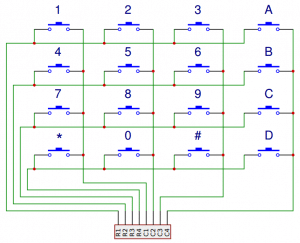

The Arduino detects which button is pressed by detecting the row and column pin that’s connected to the button.

This happens in four steps:

1\. First, when no buttons are pressed, all of the column pins are held HIGH, and all of the row pins are held LOW:

2\. When a button is pressed, the column pin is pulled LOW since the current from the HIGH column flows to the LOW row pin:

3\. The Arduino now knows which column the button is in, so now it just needs to find the row the button is in. It does this by switching each one of the row pins HIGH, and at the same time reading all of the column pins to detect which column pin returns to HIGH:

4\. When the column pin goes HIGH again, the Arduino has found the row pin that is connected to the button:

From the diagram above, you can see that the combination of row 2 and column 2 could only mean that the number 5 button was pressed.

 Pinout

**Connection Diagram**

**Sample Code**

<iframe src=https://create.arduino.cc/editor/keyestudio/6faccd43-7da7-4f10-9c00-36cd0c7e62c4/preview?embed style="height:510px;width:100%;margin:10px 0" frameborder=0></iframe>

**Example Result**

After you upload the code, open the serial monitor. When you press a key, the value will be printed out:

### **Project 35: HC-SR04 Ultrasonic Sensor**

**Description**

Give your next Arduino project bat-powers with a HC-SR04 Ultrasonic Distance Sensor that can report the range of objects up to 13 feet away. Which is really good information to have if you’re trying to avoid your robot driving into a wall! They are low power (suitable for battery powered devices), inexpensive, easy to interface with and are insanely popular among hobbyists. And as a bonus it even looks cool, like a pair of Wall-E Robot eyes for your latest robotic invention!

**What is Ultrasound?**

Ultrasound is high-pitched sound waves with frequencies higher than the audible limit of human hearing.

Human ears can hear sound waves that vibrate in the range from about 20 times a second (a deep rumbling noise) to about 20,000 times a second (a high-pitched whistling). However, ultrasound has a frequency of over 20,000 Hz and is therefore inaudible to humans.

 Hardware Overview

At its core, the HC-SR04 Ultrasonic distance sensor consists of two ultrasonic transducers. The one acts as a transmitter which converts electrical signal into 40 KHz ultrasonic sound pulses. The receiver listens for the transmitted pulses. If it receives them it produces an output pulse whose width can be used to determine the distance the pulse travelled. As simple as pie!

The sensor is small, easy to use in any robotics project and offers excellent non-contact range detection between 2 cm to 400 cm (that’s about an inch to 13 feet) with an accuracy of 3mm. Since it operates on 5 volts, it can be hooked directly to an Arduino or any other 5V logic microcontrollers.

**Specification**

| Operating Voltage    | DC 5V          |
|----------------------|----------------|
| Operating Current    | 15mA           |
| Operating Frequency  | 40KHz          |
| Max Range            | 4m             |
| Min Range            | 2cm            |
| Ranging Accuracy     | 3mm            |
| Measuring Angle      | 15 degree      |
| Trigger Input Signal | 10µS TTL pulse |
| Dimension            | 45 x 20 x 15mm |

 **How Does It Work?**

It all starts, when a pulse of at least 10 µS (10 microseconds) in duration is applied to the Trigger pin. In response to that the sensor transmits a sonic burst of eight pulses at 40 KHz. This 8-pulse pattern makes the “ultrasonic signature” from the device unique, allowing the receiver to differentiate the transmitted pattern from the ambient ultrasonic noise.

The eight ultrasonic pulses travel through the air away from the transmitter. Meanwhile the Echo pin goes HIGH to start forming the beginning of the echo-back signal.

In case, If those pulses are not reflected back then the Echo signal will timeout after 38 mS (38 milliseconds) and return low. Thus a 38 mS pulse indicates no obstruction within the range of the sensor.

If those pulses are reflected back the Echo pin goes low as soon as the signal is received. This produces a pulse whose width varies between 150 µS to 25 mS, depending upon the time it took for the signal to be received.

The width of the received pulse is then used to calculate the distance to the reflected object. This can be worked out using simple distance-speed-time equation, we learned in High school. In case you forgot, an easy way to remember the distance, speed and time equations is to put the letters into a triangle.

Let’s take an example to make it more clear. Suppose we have an object in front of the sensor at an unknown distance and we received a pulse of width 500 µS on the Echo pin. Now let’s calculate how far the object from the sensor is. We will use the below equation.

Distance = Speed x Time

Here, we have the value of Time i.e. 500 µs and we know the speed. What speed do we have? The speed of sound, of course! Its 340 m/s. We have to convert the speed of sound into cm/µs in order to calculate the distance. A quick Google search for “speed of sound in centimeters per microsecond” will say that it is 0.034 cm/µs. You could do the math, but searching it is easier. Anyway, with that information, we can calculate the distance!

Distance = 0.034 cm/µs x 500 µs

But this is not done! Remember that the pulse indicates the time it took for the signal to be sent out and reflected back so to get the distance so, you’ll need to divide your result in half.

Distance = (0.034 cm/µs x 500 µs) / 2

Distance = 8.5 cm

So, now we know that the object is **8.5 centimeters** away from the sensor.

 Pinout

VCC is the power supply for HC-SR04 Ultrasonic distance sensor which we connect the 5V pin on the Arduino.

Trig pin is used to trigger the ultrasonic sound pulses.

Echo pin produces a pulse when the reflected signal is received. The length of the pulse is proportional to the time it took for the transmitted signal to be detected.

GND should be connected to the ground of Arduino.

**Connection Diagram**

**Sample Code**

<iframe src=https://create.arduino.cc/editor/keyestudio/8b517b27-cea2-4c93-a21f-d212f751f002/preview?embed style="height:510px;width:100%;margin:10px 0" frameborder=0></iframe>

**Example Result**

After upload well the code to board, then open the serial monitor. When place an object in front of the ultrasonic sensor (from near and far), it will detect the distance of object. The value will be displayed on the monitor shown below.

### **Project 36: MMA8452Q Digital Acceleration Sensor**

**Description**

MMA8452Q is a smart low-power, three-axis, capacitive micromachine acceleration sensor with 12-bit resolution.

This acceleration sensor has a rich embedded performance, featured with flexible user programmable options and two interruption pins configuration.

The embedded interruption function can save the overall power consumption and remove the burden of constantly polling the data in the main processor.

Besides, MMA8452Q has a user optional range of ±2g / ±4g/ ±8g, which can output high-pass filtering data and non-filtered data in real time.

This device can configure an embedded function to generate an inertial wake-up interrupt signal, which enables MMA8452Q to maintain a low-power mode in the static state while monitoring the event.

**Specification**

-   Power Supply Voltage：1.95 V to 3.6 V
-   Interface Voltage：1.6 V to 3.6 V
-   ±2g/±4g/±8g Optional dynamic range
-   Output data rate (ODR) range：1.56 Hz to 800 Hz
-   Noise：99μg/√Hz
-   12 bits and 8 bits digital outputs;
-   I2C digital output interface (up to 2.25 MHz when the pull-up resistor is 4.7 kΩ);
-   Two programmable interruption pins applied to six interruption sources;
-   Three motion detection embedded channels: free fall detection, pulse detection, shaking detection;
-   Direction (transverse/longitudinal) detection with setting lag compensation;
-   Automatic arousal and auto-dormant ODR can be automatically altered;
-   High-pass filtering data can be exported in real time;
-   Power consumption：6μA – 165μA

 **How Does It Work?**

The principle of operation of an accelerometer isn’t overly complicated. It measures the acceleration force in unit (g) and take measurements in one, two or three planes. Currently, the most commonly used accelerometers are 3-axis accelerometers, which are designed as a system of three separate accelerometers, each of whom measures acceleration in a different direction - in X, Y and Z planes.

If the acceleration in any plane works in the opposite direction to that in which the sensor is directed, the accelerometer will measure the acceleration with a negative value. Otherwise, the acceleration will be measured with a positive value.

If no external acceleration is applied to the accelerometer, the device will measure only the standard acceleration of free fall, i.e. the force of gravity. Assuming that a 3-axis accelerometer is positioned so that the X-axis sensor points left, the Y-axis sensor points downwards, and the Z-axis sensor is directed forward, with no forces applied to the device, the accelerometer will show the following: X = 0 g, Y = 1 g, Z = 0 g. If the same accelerometer is tilted to the left, it’ll show these values: X = 1 g, Y = 0 g, Z = 0 g. Similarly, if the device is tilted to the right, the X-axis will show X = -1 g. Such dependencies in acceleration measurement are used by the algorithms of accelerator control systems.

 Pinout

VCC_IN is the power supply for the module. Connect it to the 5V output of the Arduino.

3.3V is the power supply for the module. Connect it to the 3.3V output of the Arduino.

GND should be connected to the ground of Arduino.

SCL is a I2C Clock pin. This is a timing signal supplied by the Bus Master device. Connect to the SCL pin on the Arduino.

SDA is a I2C Data pin. This line is used for both transmit and receive. Connect to the SDA pin on the Arduino.

**ConnectionDiagram**

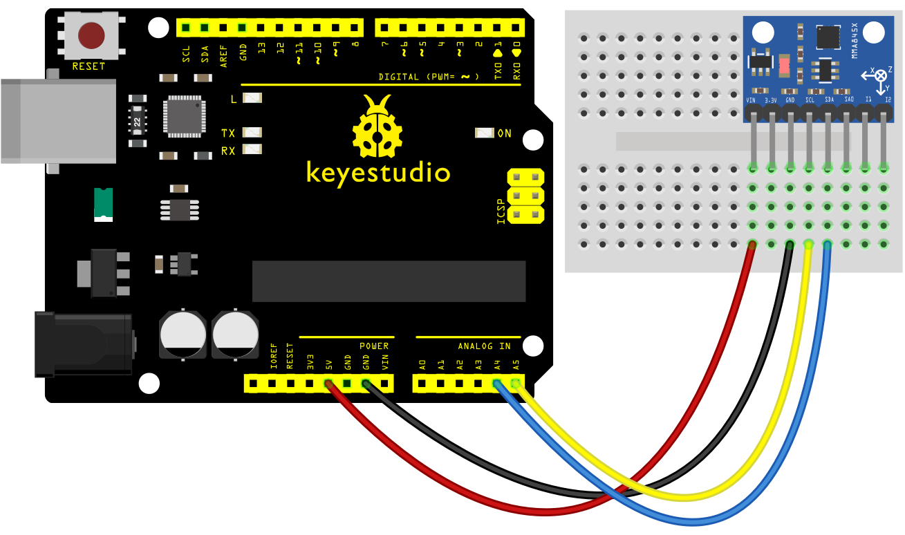

**Sample Code**

<iframe src=https://create.arduino.cc/editor/keyestudio/288a0f7e-9d9a-43e8-af93-7923029c246b/preview?embed style="height:510px;width:100%;margin:10px 0" frameborder=0></iframe>

**Example Result**

Wiring as the above diagram and burning the code, after powered-on,then turn on the serial monitor to display the triaxial acceleration of sensor and its status, as the graph shown below.

### **Project 37: DS1307 Clock Module**

**Description**

We all know that most MCUs we use for our projects are time-agnostic; simply put they are unaware of the time around them. It’s OK for most of our projects but once in a while when you come across an idea where keeping time is a prime concern, DS1307 RTC module is a savior. It’s perfect for projects containing data-logging, clock-building, time stamping, timers and alarms.

 DS1307 RTC chip

At the heart of the module is a low-cost, quite accurate RTC chip from Maxim – **DS1307**. It manages all timekeeping functions and features a simple two-wire I2C interface which can be easily interfaced with any microcontroller of your choice.

The chip maintains seconds, minutes, hours, day, date, month, and year information. The date at the end of the month is automatically adjusted for months with fewer than 31 days, including corrections for leap year (valid up to 2100). The clock operates in either the 24-hour or 12-hour format with an AM/PM indicator.

The other cool feature of this board comes with SQW pin, which outputs one of four square-wave frequencies 1Hz, 4kHz, 8kHz or 32kHz and can be enabled programmatically.

DS1307 come with an external 32kHz crystal for time-keeping. The problem with these crystals is that external temperature can affect their oscillation frequency. This change in frequency is negligible but it surely adds up.

This may sound like a problem, but it’s not. It actually results with the clock being off by around five or so minutes per month.

 Battery Backup

The DS1307 incorporates a battery input, and maintains accurate timekeeping when main power to the device is interrupted.

The built-in power-sense circuit continuously monitors the status of VCC to detect power failures and automatically switches to the backup supply. So, you need not worry about power outages, your MCU can still keep track of time.

The bottom side of the board holds a battery holder for 20mm 3V lithium coincells. Any CR2032 battery can fit well.

Assuming a fully charged CR2032 battery with capacity 47mAh is used and chip consumes its minimum 300nA, the battey can keep the RTC running for a minimum of 17.87 years without an external 5V power supply.

**47mAh/300nA = 156666.67 hours = 6527.78 days = 17.87 years**

 Onboard 24C32 EEPROM

DS1307 RTC module also comes with a 32 bytes 24C32 EEPROM chip from Atmel having limited read-write cycles. It can be used to save settings or really anything.

The 24C32 EEPROM uses I2C interface for communication and shares the same I2C bus as DS1307.

The onboard 24C32 EEPROM has a hardwired I2C address and is set to 0x50HEX

 Pinout

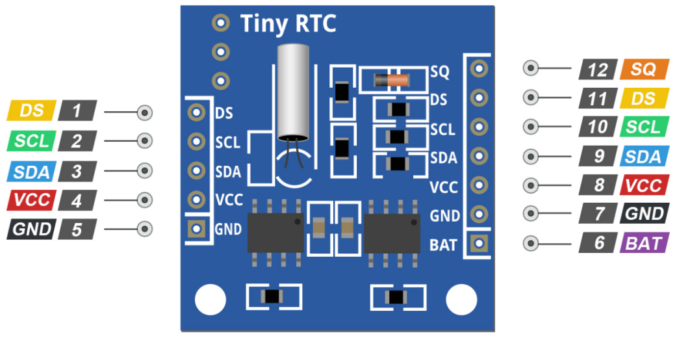

SQ pin outputs one of four square-wave frequencies 1Hz, 4kHz, 8kHz or 32kHz and can be enabled programmatically.

DS pin is supposed output temperature readings if your module has a DS18B20 temperature sensor installed right next to the battery holder(labled as U1).

SCL is the clock input for the I2C interface and is used to synchronize data movement on the serial interface.

SDA is the data input/output for the I2C serial interface.

VCC pin supplies power for the module. It can be anywhere between 3.3V to 5.5V.

GND is a ground pin.

BAT is a backup supply input for any standard 3V lithium cell or other energy source to maintain accurate timekeeping when main power to the device is interrupted.

**Connection Diagram**

connecting VCC pin to the 5V output on the Arduino and connect GND to ground.

On the UNO board, the SDA (data line) and SCL (clock line) are on the pin headers close to the AREF pin. They are also known as A5 (SCL) and A4 (SDA).

If you have a Mega board , the pins are different! You’ll want to use digital 21 (SCL) and 20 (SDA). Refer below table for quick understanding.

**Sample Code**

<iframe src=https://create.arduino.cc/editor/keyestudio/4b15d9ef-327c-4051-ae34-a86d1e3cb005/preview?embed style="height:510px;width:100%;margin:10px 0" frameborder=0></iframe>

**Example Result**

Here’s how the output looks like in the serial monitor.

