## 1.Description

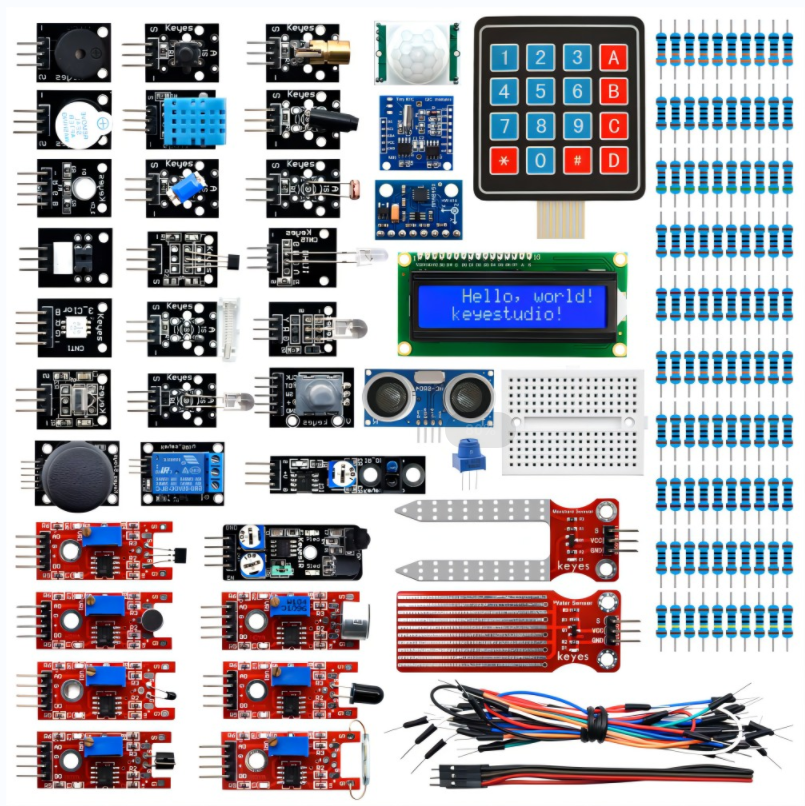

Ce kit de capteurs contient 37 types de modules de capteurs couramment utilisés dans les projets de microcontrôleurs, tels que le module de buzzer actif, le module de relais 5V, le module de température et d'humidité, etc. Il est compatible avec divers microcontrôleurs et Raspberry Pi.

De plus, nous fournissons des projets détaillés pour chaque capteur basés sur une carte de développement, y compris la méthode de câblage, le code de test, etc. Cela peut vous aider à mieux comprendre ces modules de capteurs et à les appliquer à des projets interactifs.

Veuillez noter que dans les projets suivants, la carte principale et les autres câbles ne sont pas inclus dans ce kit. Vous devrez les préparer vous-même.

**Adresse de téléchargement du tutoriel et du code :** [KT0193F Tutorial](./code.7z)

## 2.Liste des composants

| \\ | NAME | PHOTO | quantity |
|-----|------------------------------------|-------------------------------|----------|
| 1 | DIP RGB LED Module | 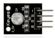 | 1 |
| 2 | DIP RGB LED Module | 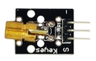 | 1 |
| 3 | SMD RGB LED Module | 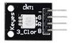 | 1 |
| 4 | Passive Buzzer Module | 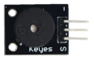 | 1 |
| 5 | Active Buzzer Module | 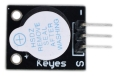 | 1 |
| 6 | Colorful flashing LED Module | 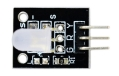 | 1 |
| 7 | Colorful flashing LED Module | 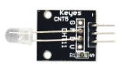 | 1 |
| 8 | Colorful flashing LED Module | 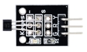 | 1 |
| 9 | Vibration Sensor Module | 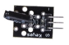 | 1 |
| 10 | Photo Interrupter Module | 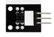 | 1 |
| 11 | Digital Push Button Module | 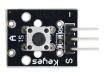 | 1 |
| 12 | Digital Tilt Sensor | 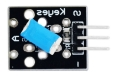 | 1 |
| 13 | Knock Sensor Module | 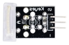 | 1 |
| 14 | Photoresistor module | 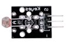 | 1 |
| 15 | Digital IR Transmitter Module | 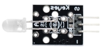 | 1 |
| 16 | Flame Sensor | 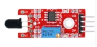 | 1 |
| 17 | Linear Magnetic Hall Sensor | 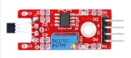 | 1 |
| 18 | Metal Touch Sensor | 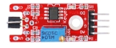 | 1 |
| 19 | Reed Switch Module | 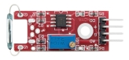 | 1 |
| 20 | Digita Temperature Sensor | 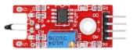 | 1 |
| 21 | High-sensitivity sound sensor | 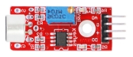 | 1 |
| 22 | Analog Sound Sensor | 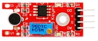 | 1 |
| 23 | Digital IR Receiver Module | 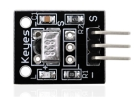 | 1 |
| 24 | DHT11 Sensor | 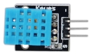 | 1 |
| 25 | MMA8452Q Acceleration Sensor | 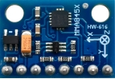 | 1 |
| 26 | DS1307 Clock Module | 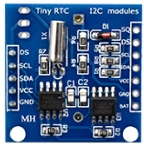 | 1 |
| 27 | Infrared Obstacle Avoidance Sensor | 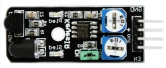 | 1 |
| 28 | HC-SR04 Blue Ultrasonic Sensor | 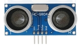 | 1 |
| 29 | PIR Motion Sensor | 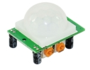 | 1 |
| 30 | 5V 1 Channel Relay Module | 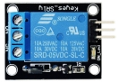 | 1 |
| 31 | Line Tracking Sensor | 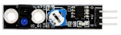 | 1 |
| 32 | Joystick Module | 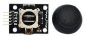 | 1 |
| 33 | Rotary Encoder Module | 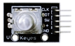 | 1 |
| 34 | 4x4 membrane keypad | 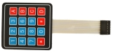 | 1 |
| 35 | Water Sensor | 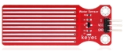 | 1 |
| 36 | Soil Humidity Sensor | 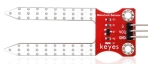 | 1 |
| 37 | 1602 LCD module | 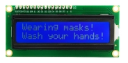 | 1 |
| 38 | 10R resistor | 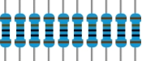 | 10 |
| 39 | 220R resistor | 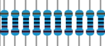 | 10 |
| 40 | 1K resistor | 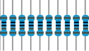 | 10 |
| 41 | 2K resistor | 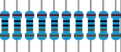 | 10 |
| 42 | 10K resistor | 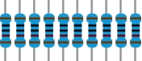 | 10 |
| 43 | 100K resistor | 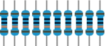 | 10 |
| 44 | 1M resistor | 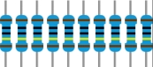 | 10 |
| 45 | 100R resistor | 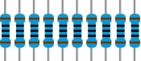 | 10 |
| 46 | 330R resistor | 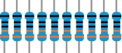 | 10 |
| 47 | 5.1K resistor | 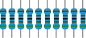 | 10 |
| 48 | jump wires | 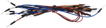 | 1 |
| 49 | 170 hole bread plate | 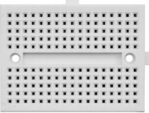 | 1 |
| 50 | M-F 20cm |  | 3 |
| 51 | potentiometer |  | 1 |

## 3. Comment ajouter une bibliothèque ?

Que sont les bibliothèques ?

Les [bibliothèques](https://www.arduino.cc/en/Reference/Libraries) sont une collection de code qui vous permet de vous connecter facilement à un capteur, un écran, un module, etc.

Par exemple, la bibliothèque intégrée LiquidCrystal aide à communiquer avec les écrans LCD. Des centaines de bibliothèques supplémentaires sont disponibles sur Internet en téléchargement.

Les bibliothèques intégrées et certaines de ces bibliothèques supplémentaires sont répertoriées dans la référence.

Comment installer une bibliothèque ?

Nous allons ici vous présenter la manière la plus simple d'ajouter des bibliothèques.

Étape 1 : Après avoir téléchargé l'IDE Arduino, vous pouvez faire un clic droit sur l'icône de l'IDE Arduino.

Trouvez l'option "Ouvrir l'emplacement du fichier" comme indiqué ci-dessous :

Étape 2 : Entrez-y pour trouver le dossier des bibliothèques ; ce dossier contient les fichiers de bibliothèque Arduino.

Étape 3 : Ensuite, trouvez le dossier [« libraries »](./libraries.7z), il vous suffit de le copier et de le coller dans le dossier des bibliothèques de l'IDE Arduino.

Copiez ensuite les bibliothèques ci-dessus dans les bibliothèques d'Arduino, comme indiqué ci-dessous :

## 