### Progetto 1: Modulo LED bicolore
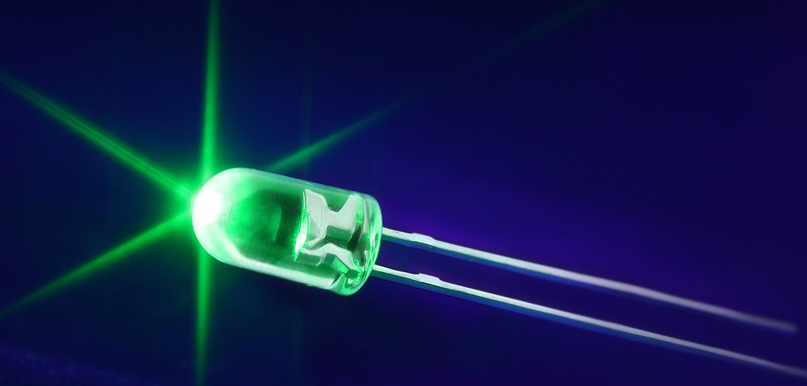

**Descrizione**

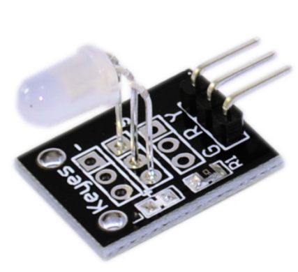

Il modulo LED bicolore può emettere luce rossa e gialla. Puoi accenderlo con il codice di blink e puoi anche regolare l'intensità di ogni colore usando il PWM.

È compatibile con piattaforme elettroniche popolari come Arduino, Raspberry Pi, ESP32 e altro ancora.

Questo modulo è costituito da un LED rosso/giallo da 5 mm a catodo comune, un resistore da 0 Ω e 3 pin maschi. Poiché la tensione operativa è compresa tra 2,0 V e 2,5 V, sarà necessario utilizzare resistori di limitazione per prevenire il burnout quando ci si collega all'Arduino.

**Specifiche**

| Tensione operativa         | 2 V ~ 2,5 V   |
|----------------------------|---------------|
| Corrente di lavoro         | 10 mA         |
| Diametro                   | 5 mm          |
| Tipo di pacchetto          | Diffusione    |
| Colore                     | Rosso + Giallo |
| Angolo del fascio         | 150           |
| Lunghezza d'onda           | 571 nm + 644 nm |
| Intensità luminosa (MCD)   | 20-40; 40-80  |

**Come funziona?**

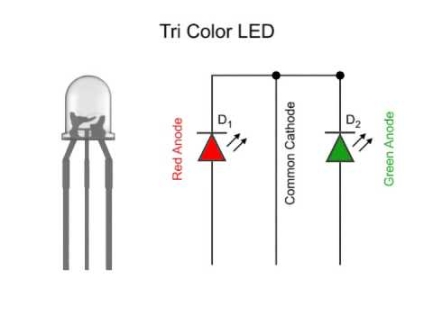

Un diodo a emissione di luce (LED) bicolore è in grado di emettere due diversi colori di luce, tipicamente rosso e giallo, anziché un solo colore.

È alloggiato in un pacchetto epossidico da 3 mm o 5 mm. Ha 3 conduttori; è disponibile un catodo comune o un anodo comune. Un LED bicolore presenta due terminali o pin LED, disposti nel circuito in antiparallelo e collegati da un catodo/anodo.

La tensione positiva può essere diretta verso uno dei terminali LED, facendo sì che quel terminale emetta luce del colore corrispondente; quando la direzione della tensione è invertita, viene emessa la luce dell'altro colore.

In un LED bicolore, solo uno dei pin può ricevere tensione alla volta. Di conseguenza, questo tipo di LED funziona frequentemente come spie luminose per una varietà di dispositivi, inclusi televisori, fotocamere digitali e telecomandi.

Pinout

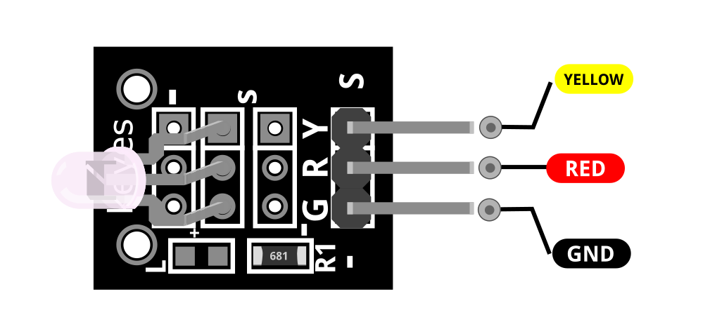

YELLOW è il pin LED giallo che colleghiamo all'Arduino.

RED è il pin LED rosso che colleghiamo all'Arduino.

GND dovrebbe essere collegato alla massa dell'Arduino.

**Schema di collegamento**

Collega il pin giallo (Y) sulla scheda al Pin 10 sull'Arduino, collega il pin rosso (R) al pin 11. Infine, collega il pin di massa (G) a GND.

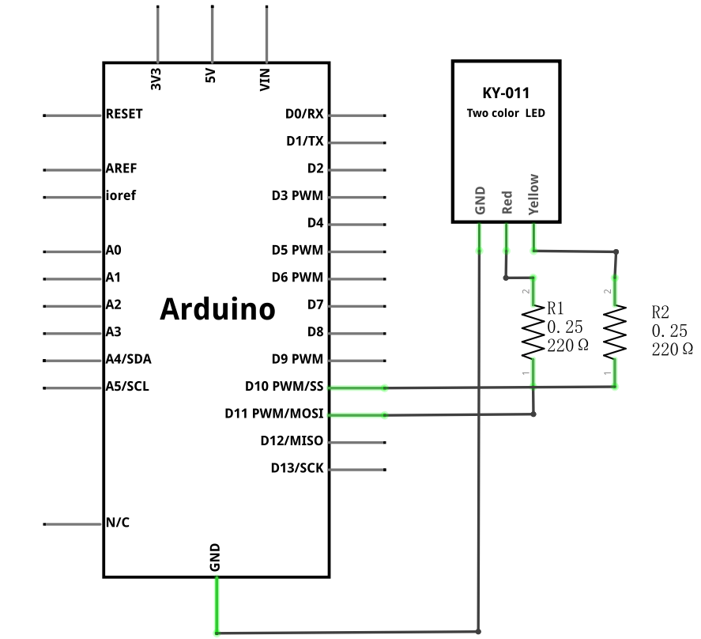

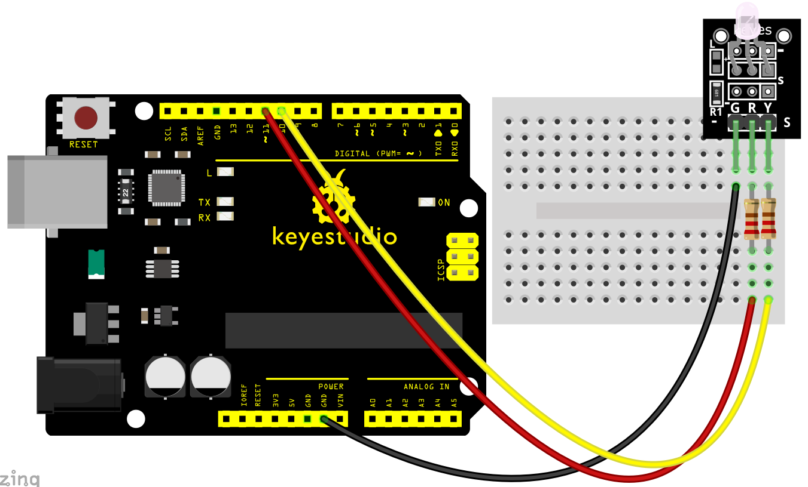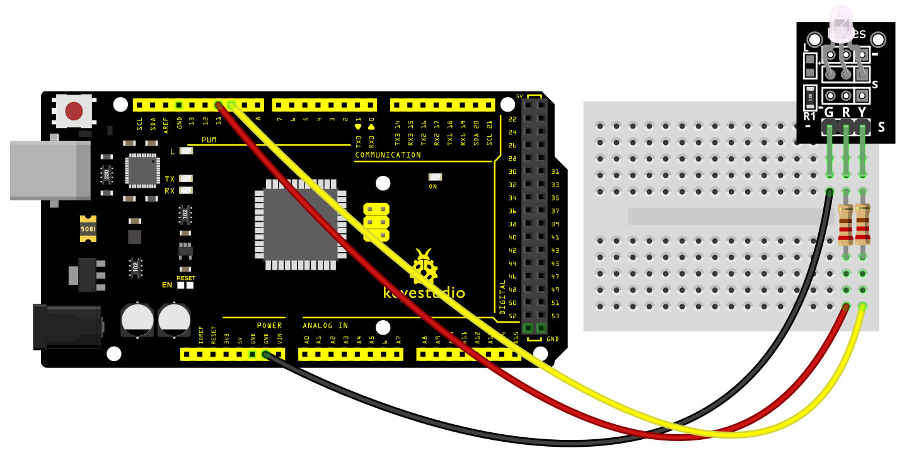

**Codice di esempio**

> **Codice di esempio (Arduino Editor):** [Open in Arduino Cloud Editor](https://create.arduino.cc/editor/keyestudio/fe5b1b3e-0e41-44de-a3b3-7db504616c0a/preview?embed)

**Risultato dell'esempio**

Carica il codice sulla scheda di sviluppo, puoi vedere il LED rosso e il LED giallo sul LED lampeggiare alternativamente per 1 secondo.

**UNO:**

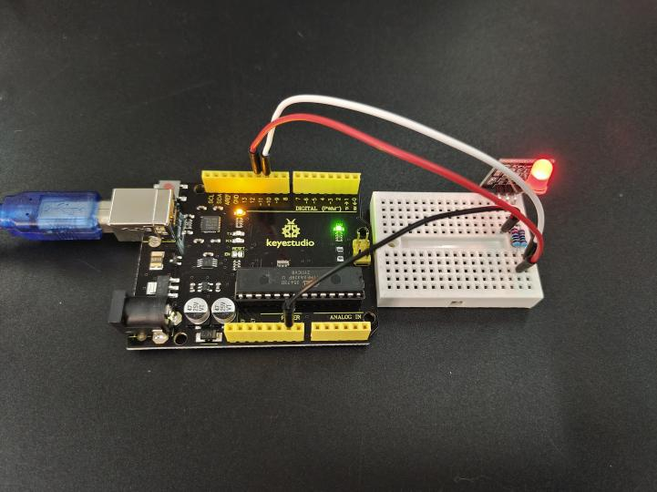

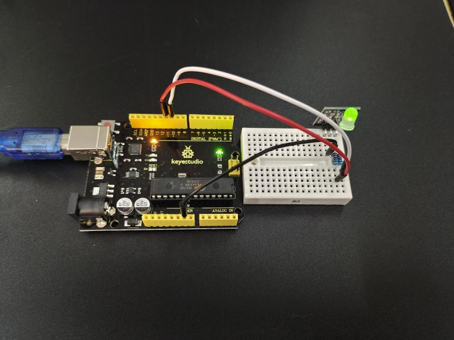

**MEGA 2560:**

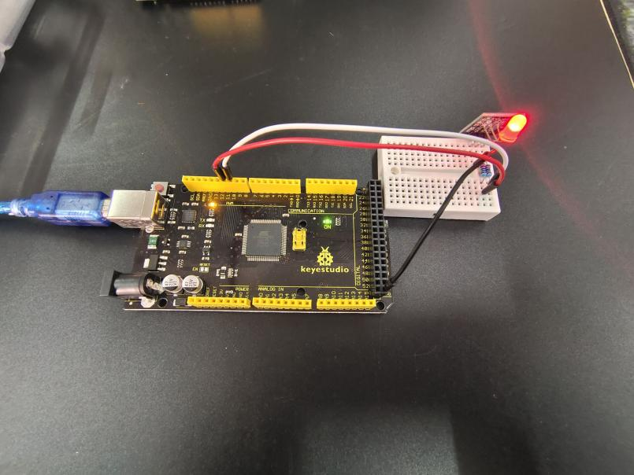

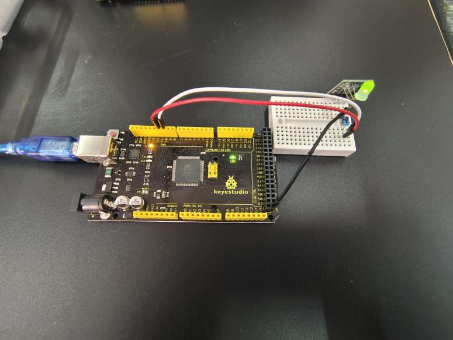