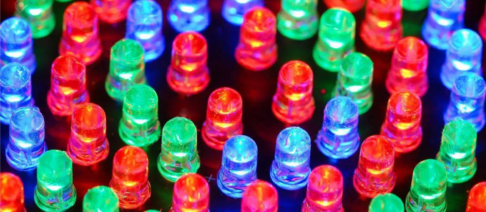
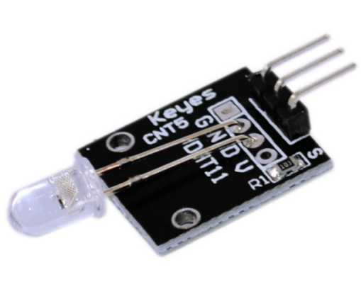
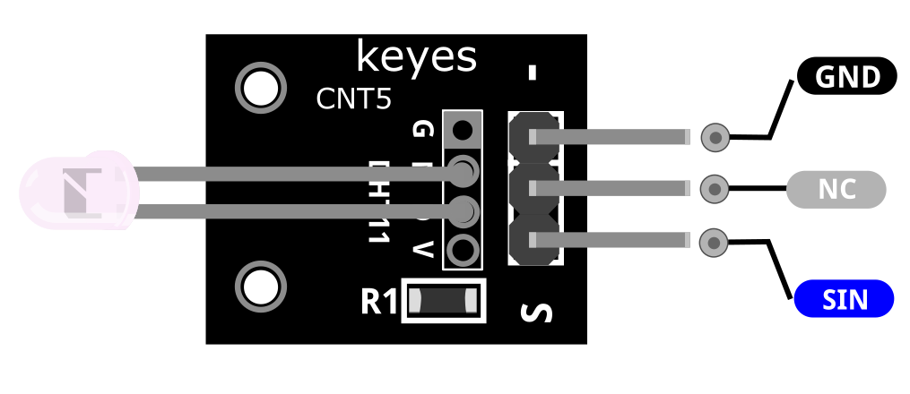
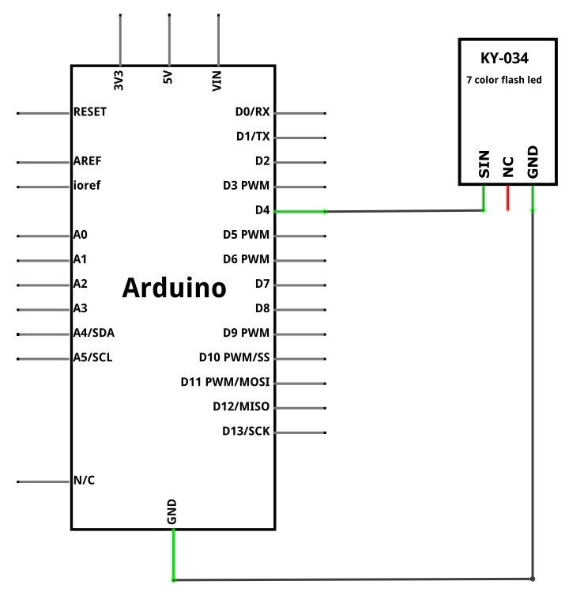
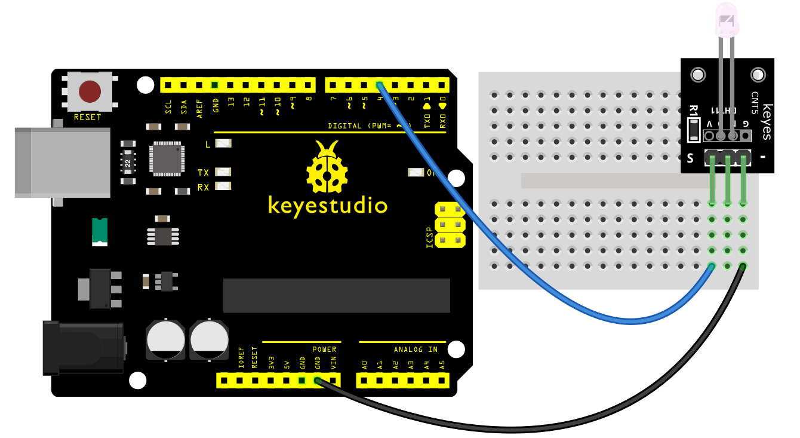
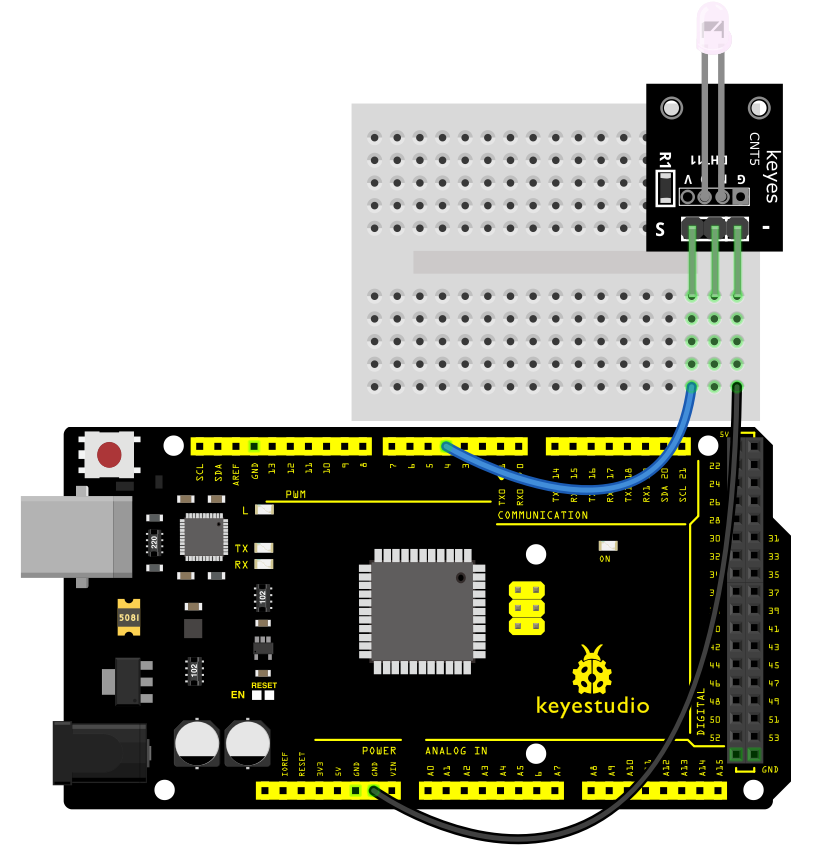
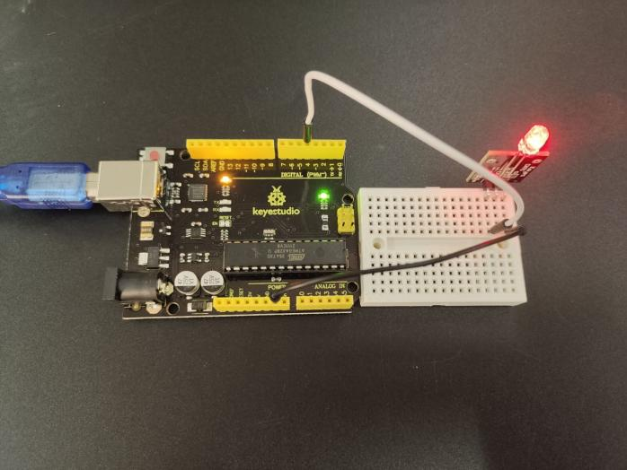
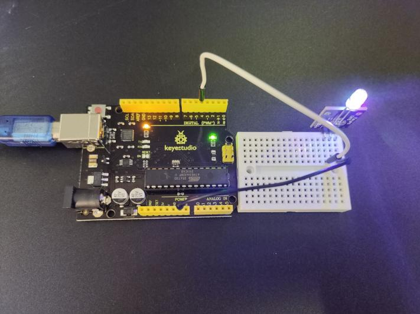
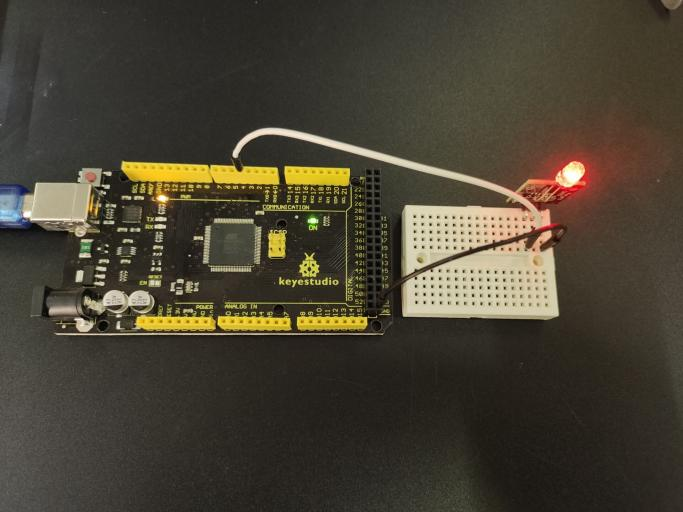
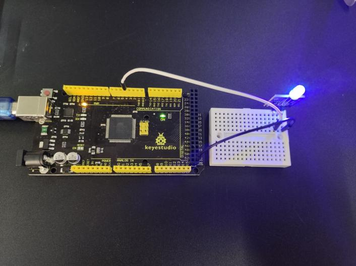

### プロジェクト2：7色点滅LEDモジュール

**説明**

7色点滅LEDモジュールは、赤、緑、青のLEDを備えた5mmの3色（RGB）LEDと、異なる速度で様々な色を循環させるロジックをすべて同じパッケージに収めています。

**仕様**

| 動作電圧 | 3.5 ~ 5V         |
|----------|------------------|
| 動作電流 | 10mA             |
| 直径     | 5mm              |
| 色       | 7色点滅          |

**どのように機能しますか？**

このモジュールは、多くの手間をかけずに目を引く点滅表示を提供します。

LEDには、異なるLEDの色を混合することで、赤、緑、青、黄、紫、シアン、白の7つの可能な色を循環しながら、異なる速度でLEDを自動的に点滅させるためのロジックが内蔵されています。LED本体は透明です。

内蔵ドライバーがあるため、5VとGNDの間に配線するだけで動作します（3.3Vでも動作します）。または、MCUの出力ピンで制御することもできます。MCUとLEDモジュールを過電流から保護するために、220オーム以上の電流制限抵抗を使用する必要があります。

ピン配置

SINは、Arduinoに接続する7色LEDピンです。

NCは何も接続しないことを意味します。

GNDはArduinoのGNDに接続する必要があります。

**接続図**

ボード上のSINピン（S）をArduinoのPin 4に接続し、GNDピン（-）をGNDに接続します。中央のPINは接続されていません。

**サンプルコード**

> **サンプルコード（Arduino Editor）：** [Open in Arduino Cloud Editor](https://create.arduino.cc/editor/keyestudio/606e837f-594f-4d5e-b312-19f612137048/preview?embed)

**実行結果の例**

開発ボードにコードをアップロードすると、7色点滅LEDが10秒間点灯し、その後2秒間消灯するのを確認できます。

**UNO:**

**MEGA 2560:**

