### Progetto 3: Modulo LED RGB DIP
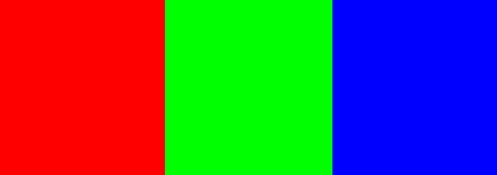

**Descrizione**

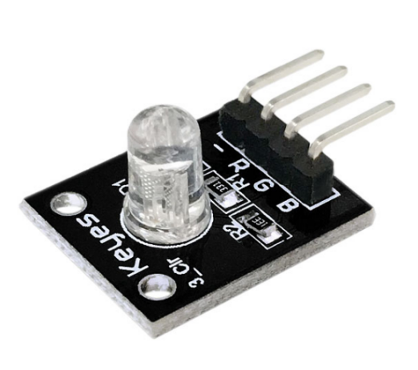Il LED RGB a colori KY-016 emette una vasta gamma di colori diversi mescolando luce rossa, verde e blu. Compatibile con molti microcontrollori popolari come Arduino, Raspberry Pi ed ESP32.

**Specifiche**

Questo modulo è composto da un LED RGB da 5 mm, 3 resistori di limitazione da 150Ω per prevenire il burnout e 4 pin maschi. La regolazione del segnale PWM su ciascun pin colore produrrà colori diversi.

| Tensione operativa | 3.3-5V                          |
|--------------------|---------------------------------|
| Corrente di lavoro | 10mA                            |
| Colore             | Rosso + Verde + Blu             |
| Modalità di pilotaggio LED | Azionamento a catodo comune     |
| Diametro LED       | 5mm                             |
| Dimensioni della scheda | 15mm x 19mm \[0.59in x 0.75in\] |

**Come funziona?**

Un LED RGB è una combinazione di 3 LED in un unico pacchetto:

- 1x LED **R**osso
- 1x LED **V**erde
- 1x LED **B**lu

È possibile produrre quasi tutti i colori combinando queste tre colori. Un LED RGB è mostrato nella figura seguente:

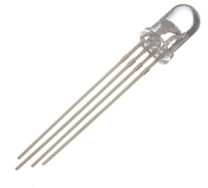

**Come creare colori diversi?**

Con un LED RGB, è possibile, naturalmente, produrre luce rossa, verde e blu, e configurando l'intensità di ciascun LED, è possibile produrre anche altri colori.

Ad esempio, per produrre luce puramente blu, si imposta il LED blu all'intensità più alta e i LED verdi e rossi all'intensità più bassa. Per una luce bianca, si impostano tutti e tre i LED all'intensità più alta.

**Miscelazione dei colori**

Per produrre altri colori, è possibile combinare le tre colori con diverse intensità. Per regolare l'intensità di ciascun LED è possibile utilizzare un segnale PWM.

Poiché i LED sono molto vicini tra loro, i nostri occhi percepiscono il risultato della combinazione dei colori, piuttosto che i tre colori individualmente.

Per avere un'idea di come combinare i colori, dai un'occhiata alla seguente tabella. Questa è la tabella di miscelazione dei colori più semplice, ma ti dà un'idea di come funziona e di come produrre colori diversi.

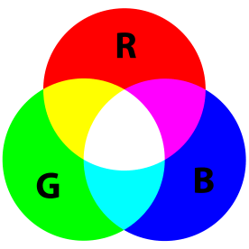

**LED RGB ad anodo comune e catodo comune**

Esistono due tipi di LED RGB: LED ad *anodo comune* e LED a *catodo comune*. La figura seguente illustra un LED ad anodo comune e un LED a catodo comune.

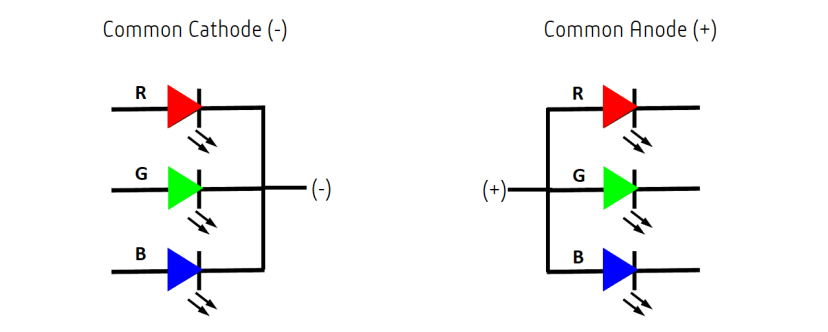

In un LED RGB a catodo comune, tutti e tre i LED condividono una connessione negativa (catodo). In un LED RGB ad anodo comune, i tre LED condividono una connessione positiva (anodo). Ciò si traduce in un LED che ha 4 pin, uno per ciascun LED e un catodo comune o un anodo comune.

**Pinout**

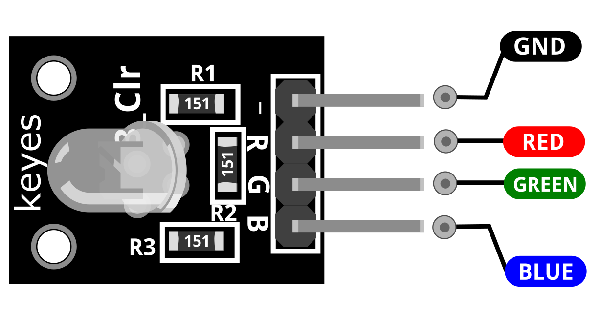

GREEN è il pin del LED verde che colleghiamo all'Arduino.

RED è il pin del LED rosso che colleghiamo all'Arduino.

BLUE è il pin del LED blu che colleghiamo all'Arduino.

GND dovrebbe essere collegato alla massa di Arduino.

**Schema di collegamento**

Collegare il pin rosso (R) del modulo al pin 11 dell'Arduino. Blu (B) al pin 10, verde (G) al pin 9 e massa (-) a GND.

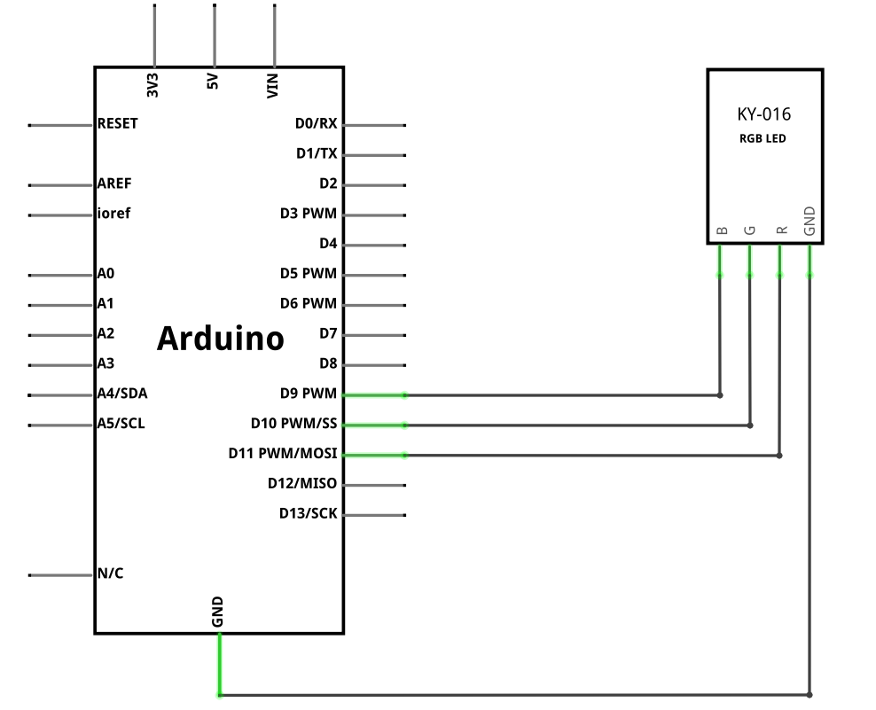

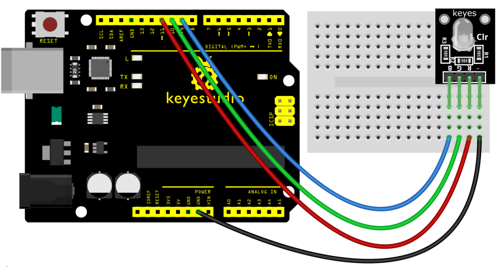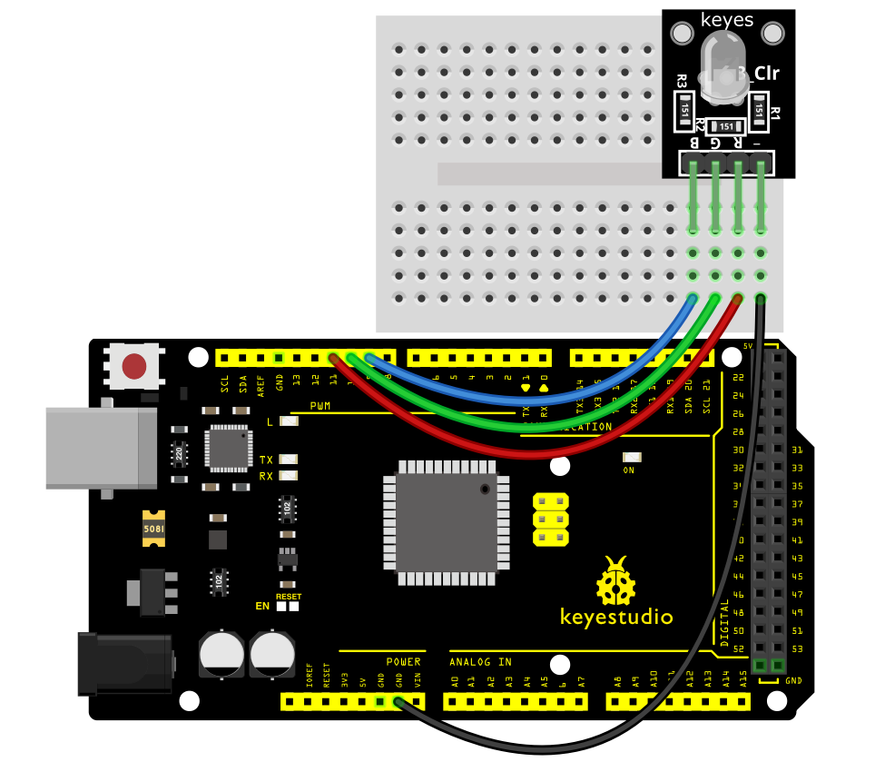

**Codice di esempio**

> **Codice di esempio (Editor Arduino):** [Open in Arduino Cloud Editor](https://create.arduino.cc/editor/keyestudio/ca3bcf3f-1f8f-4555-be7e-8f3d0a9106ab/preview?embed)

**Risultato dell'esempio**

Collegare il cavo e, dopo aver caricato il codice, è possibile vedere che il LED cambia colore.

**UNO:**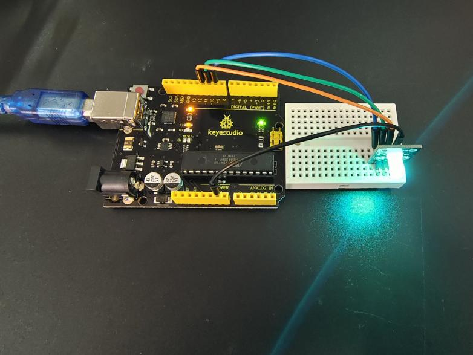

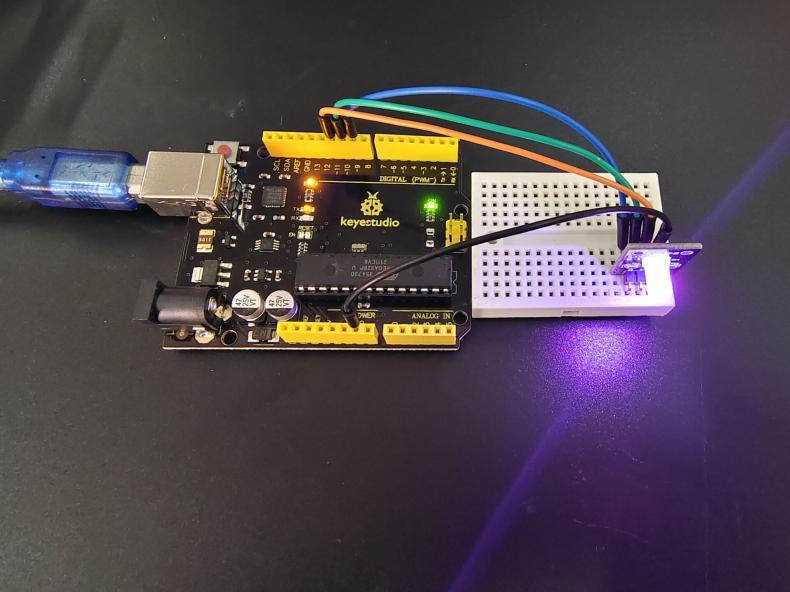

**MEGA 2560:**

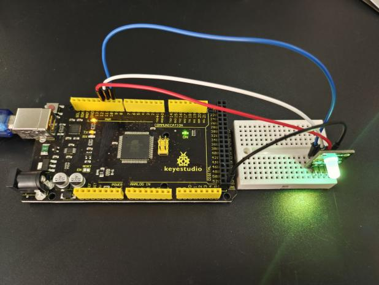

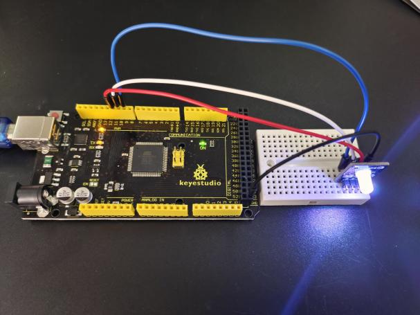