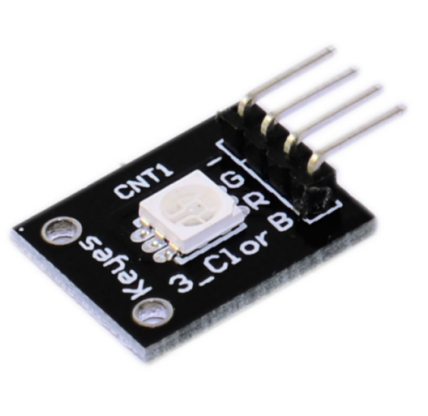
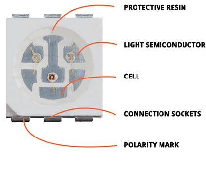
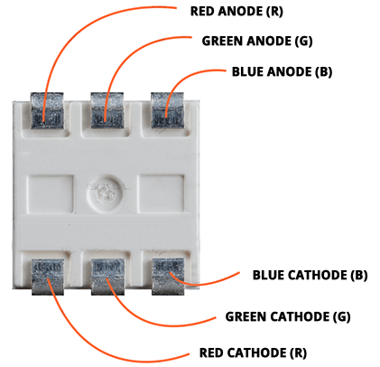
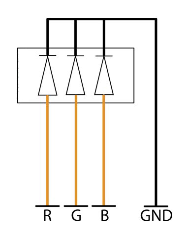
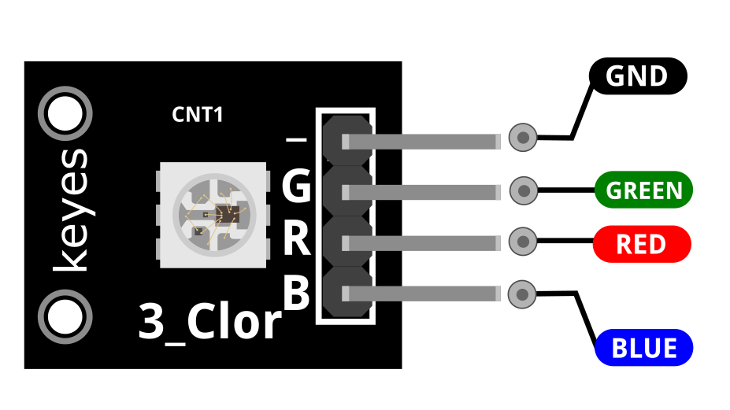
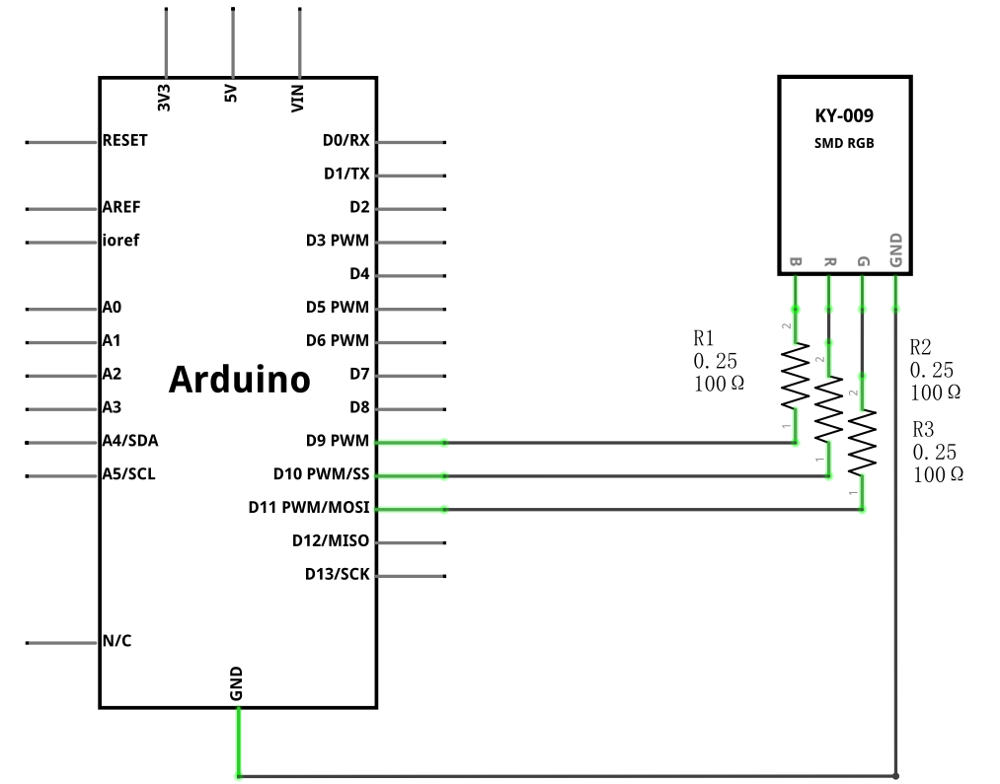
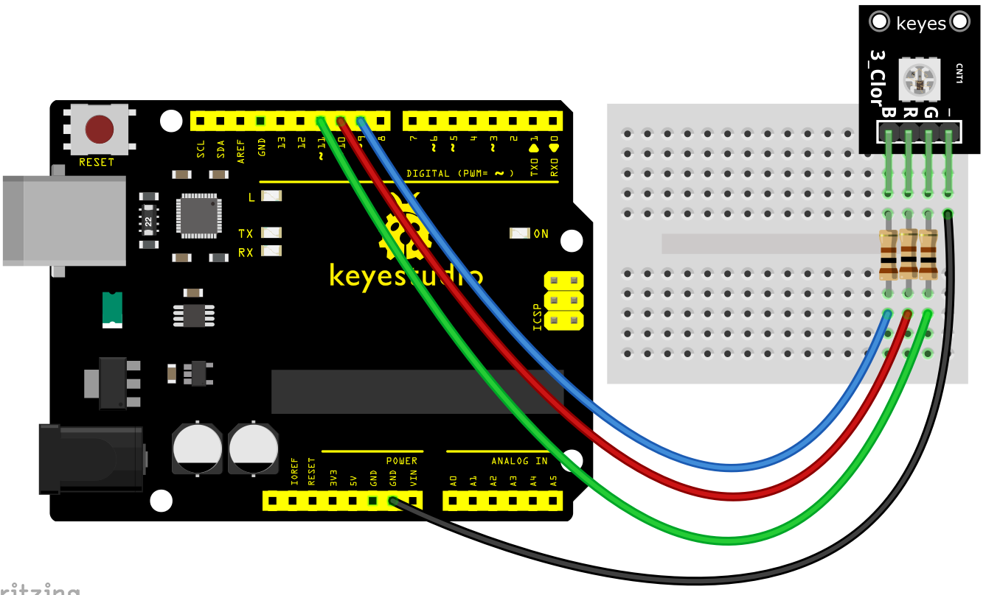
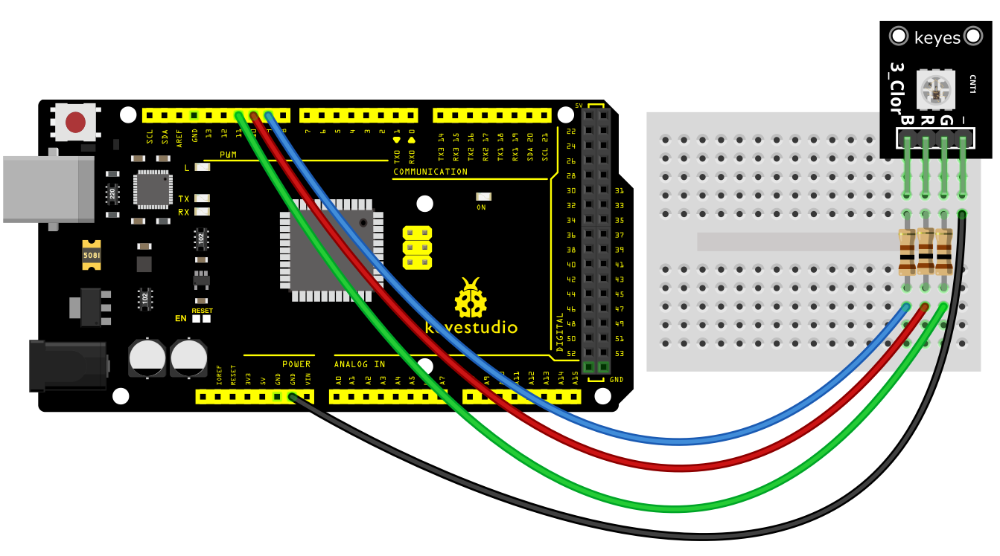

### Progetto 4: Modulo LED RGB SMD

**Descrizione**

Questo è un modulo LED a colori, che contiene 3 colori base: rosso, verde e blu. Possono essere visti come luci LED separate.

Dopo la programmazione, è possibile accenderli e spegnerli in sequenza o utilizzare l'uscita analogica PWM per mescolare i tre colori e generare colori diversi.

**Specifiche**

| Tensione operativa                                      | 5V max Rosso 1.8V ~2.4V Verde 2.8V ~ 3.6V Blu 2.8V ~ 3.6V |     |
|---------------------------------------------------------|----------------------------------------------------------|-----|
| Corrente diretta                                        | 20mA ~ 30mA                                              |     |
| Temperatura operativa                                   | -25°C a 85°C \[-13°F ~ 185°F\]                          |     |
| Dimensioni della scheda \| 18.5mm x 15mm \[0.728in x 0.591in\] |                                                          |     |

**Come funziona?**

Il LED SMD (acronimo di Surface-Mount-Device, Light-Emitting-Diode) è un tipo di LED caratterizzato da un incapsulamento 3 in 1, il che significa che integra tutti e 3 i colori (rosso, verde, blu) in un unico sistema.

Questo tipo di modulo è composto da quattro pin: il pin di massa, e i pin rosso, verde e blu.

I tre pin sono segnali digitali che colleghiamo alle porte digitali di diverse schede microcontrollore, che in questo progetto è l'Arduino Uno.

Una volta collegati e creati i codici, i LED all'interno del chip si accenderanno.

Le resistenze saranno posizionate sui tre pin di segnale per regolare il flusso di corrente e prevenire la bruciatura del modulo effettivo.

Pinout

GREEN è il pin del LED verde che colleghiamo all'Arduino.

RED è il pin del LED rosso che colleghiamo all'Arduino.

BLUE è il pin del LED blu che colleghiamo all'Arduino.

GND deve essere collegato alla massa dell'Arduino.

**Schema di collegamento**

Collegare il pin rosso (R) al Pin 10, il pin verde (G) al pin 11, il pin blu (B) al pin 9 e infine il pin di massa (-) a GND.

È necessario utilizzare resistenze tra la scheda e l'Arduino per prevenire la bruciatura dei LED.

**Codice di esempio**

> **Codice di esempio (Arduino Editor):** [Apri nell'editor cloud di Arduino](https://create.arduino.cc/editor/keyestudio/85d732d5-d4f2-4cb6-9105-de48500d496d/preview?embed)

**Risultato di esempio**

Una volta completato il cablaggio e alimentato, caricare correttamente il codice, si vedrà il modulo LED RGB emettere colori brillanti.

**UNO:**

> ⚠️ **Immagine mancante** — Le foto dei risultati per il Progetto 4 (UNO) non sono state incluse nel documento sorgente originale.

**MEGA 2560:**

> ⚠️ **Immagine mancante** — Le foto dei risultati per il Progetto 4 (MEGA 2560) non sono state incluse nel documento sorgente originale.