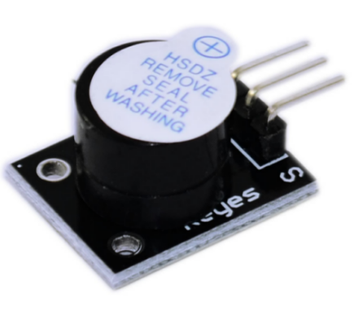
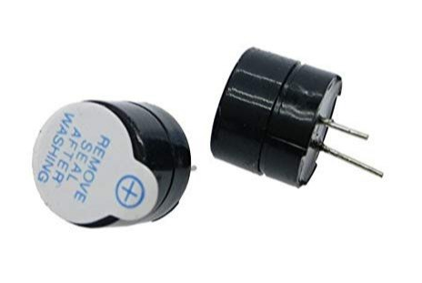
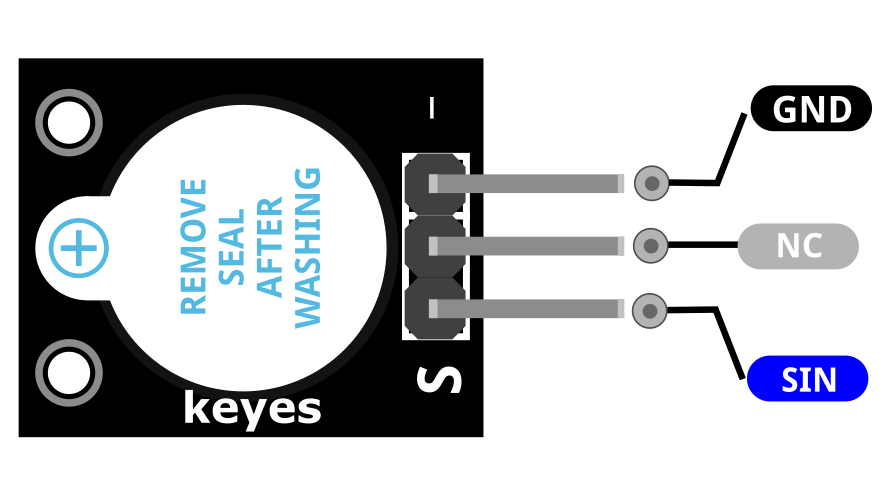
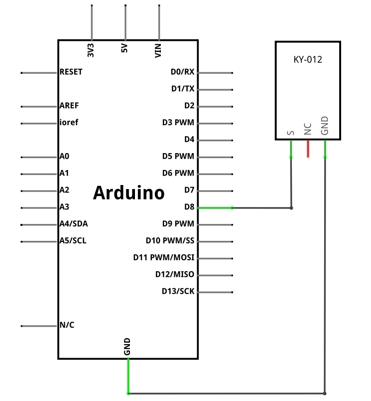
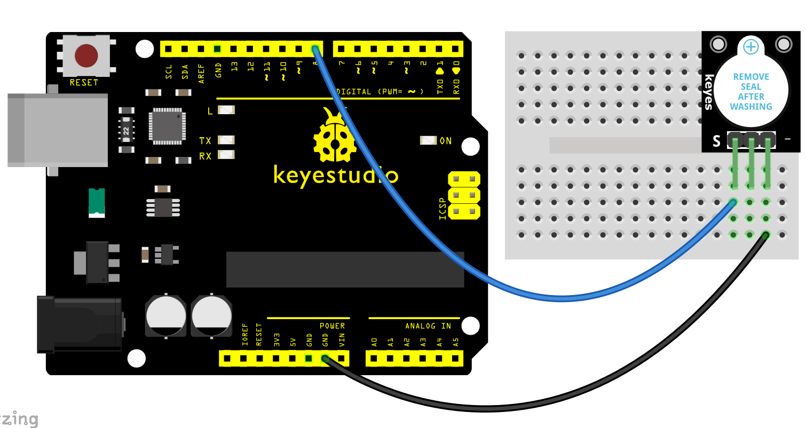
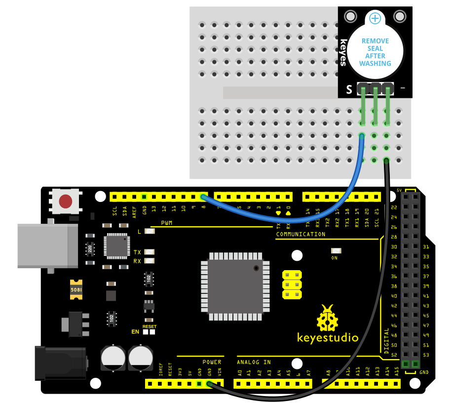
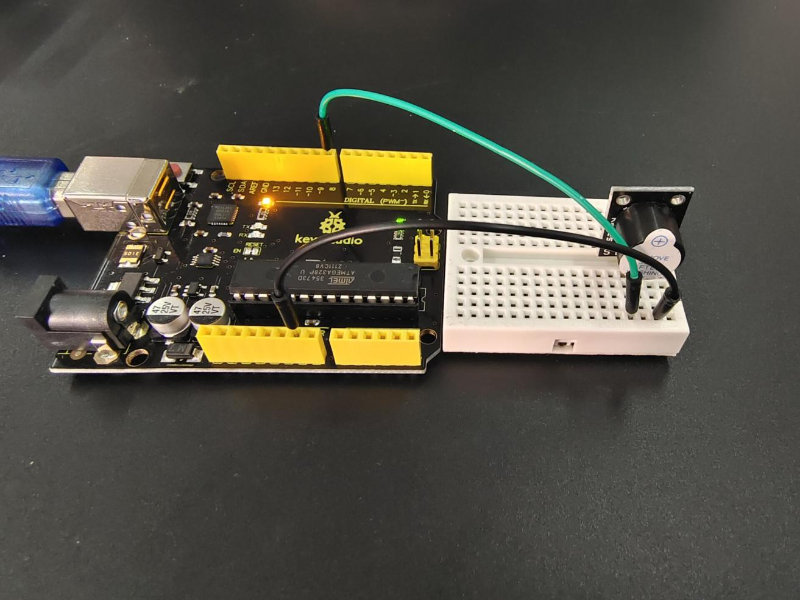

### Project 5: Actieve Buzzer Module

**Beschrijving**

 De actieve buzzer is de eenvoudigste geluidproducerende module. Je kunt deze aansturen met een hoog/laag niveau.

Deze module wordt veel gebruikt in onze dagelijkse apparaten zoals pc's, koelkasten, telefoons, enz.

Bovendien kun je met deze kleine maar nuttige module veel interessante interactieve projecten maken. Probeer het gewoon! Je zult het elektronische geluid dat het produceert fascinerend vinden.

**Specificatie**

| Bedrijfsspanning | 3.5V ~ 5.5V |
|------------------|-------------------------------------|
| Maximale stroom | 30mA / 5VDC |
| Resonantiefrequentie | 2500Hz ± 300Hz |
| Minimale geluidsuitvoer | 85Db @ 10cm |
| Werktemperatuur | -20°C ~ 70°C \[-4°F ~ 158°F\] |
| Opslagtemperatuur | -30°C ~ 105°C \[-22°F ~ 221°F\] |
| Afmetingen bord | 18.5mm x 15mm \[0.728in x 0.591in\] |

**Hoe werkt het?**

De actieve buzzer, ook bekend als indicatorbuzzer, gebruikt gelijkstroom en produceert onmiddellijk een frequentie wanneer deze wordt gevoed, dankzij de ingebouwde printplaat. Het heeft echter slechts één frequentie en kan gepulseerd worden. Het genereert een geluid van ongeveer 2,5 kHz wanneer het signaal hoog is.

Pinbezetting

SIN is de actieve buzzerpin die we verbinden met de Arduino.

NC betekent niet aangesloten op iets.

GND moet worden aangesloten op de massa van de Arduino.

**Aansluitschema**

Verbind het signaal (S) met pin 8 op de Arduino en de massa (-) met GND. De middelste pin wordt niet gebruikt.

| **KY-012** | **Arduino** |
|------------|-------------|
| S midden | Pin 8 |
| – | GND |

**Voorbeeldcode**

> **Voorbeeldcode (Arduino Editor):** [Openen in Arduino Cloud Editor](https://create.arduino.cc/editor/keyestudio/bbdc4bbf-f192-4aca-aa2c-12afd621b469/preview?embed)

**Voorbeeldresultaat**

Na het uploaden van de code naar het bord zal de buzzer een geluid maken.

**UNO:**

**MEGA 2560:**

> ⚠️ **Afbeelding ontbreekt** — De resultaatfoto voor Project 5 (MEGA 2560) was niet opgenomen in het originele brondocument.