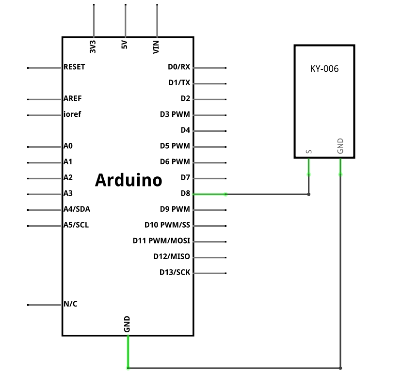

### Project 6: Passive Buzzer Module

**Description**

The buzzer introduced here is a passive buzzer. It cannot be actuated by itself, but by external pulse frequencies. Different frequencies produce different sounds. You can use Arduino to code the melody of a song, which is quite fun and simple.

**Specification**

| Operating Voltage     | 1.5V ~ 15V DC                       |
|-----------------------|-------------------------------------|
| Tone Generation Range | 1.5kHz ~ 2.5kHz                     |
| Board Dimensions      | 18.5mm x 15mm \[0.728in x 0.591in\] |

**How Does It Work?**

Passive buzzers are types of magnetic buzzers. Inside the buzzer, there is a coil of wire that’s connected to the buzzer’s pins.

There is also a round magnet that surrounds the wire coil. A thin metal film with a metal weight attached to the top sits above the round magnet and wire coil.

When pulses of current are applied to the wire coil, magnetic inductance causes the metal weight and metal film to vibrate up and down. The vibration of the metal film produces sound waves:

Pinout

SIN is the Passive buzzer pin which we connect to the Arduino.

NC means not connecting to anything.

GND should be connected to the ground of Arduino.

**Connection Diagram**

Connect the module signal (S) to pin 8 on the Arduino and ground (-) to GND.

The middle pin is not used.

**Sample Code**

> **Sample Code (Arduino Editor):** [Open in Arduino Cloud Editor](https://create.arduino.cc/editor/keyestudio/486a88b8-f0b2-4b3f-b984-14d804a24170/preview?embed)

**Example Result**

Done uploading the code to board, the buzzer will make a sound.

**UNO**

**MEGA 2560:**

