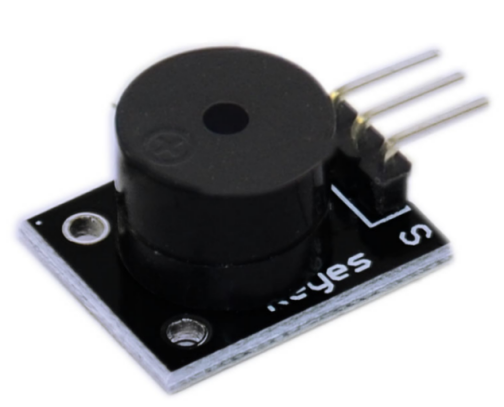
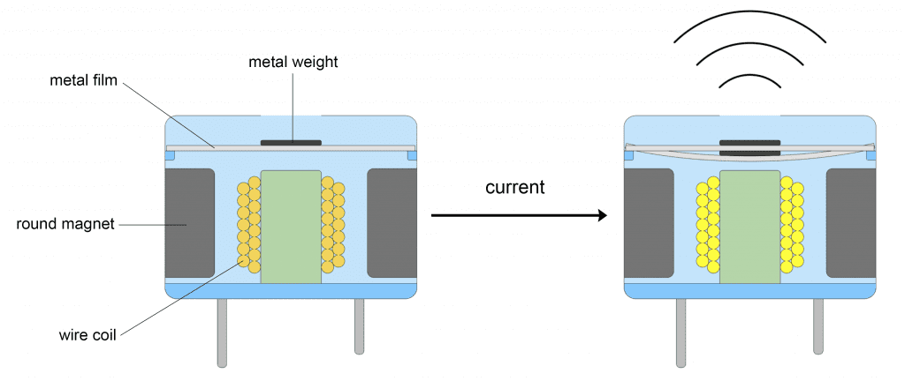
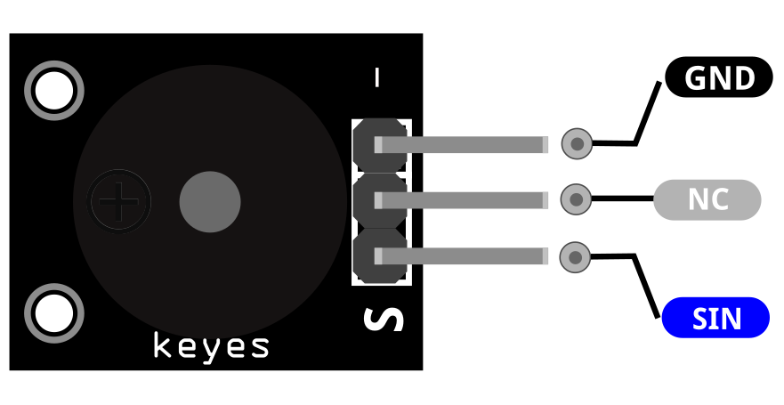
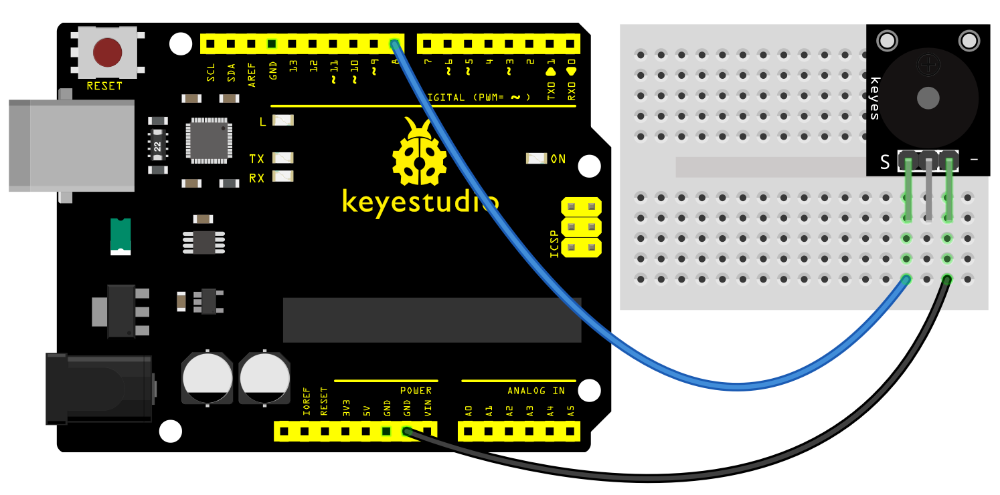
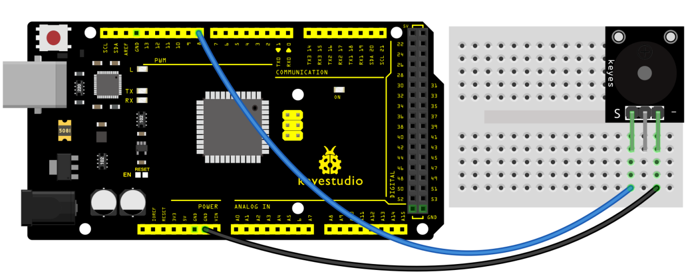
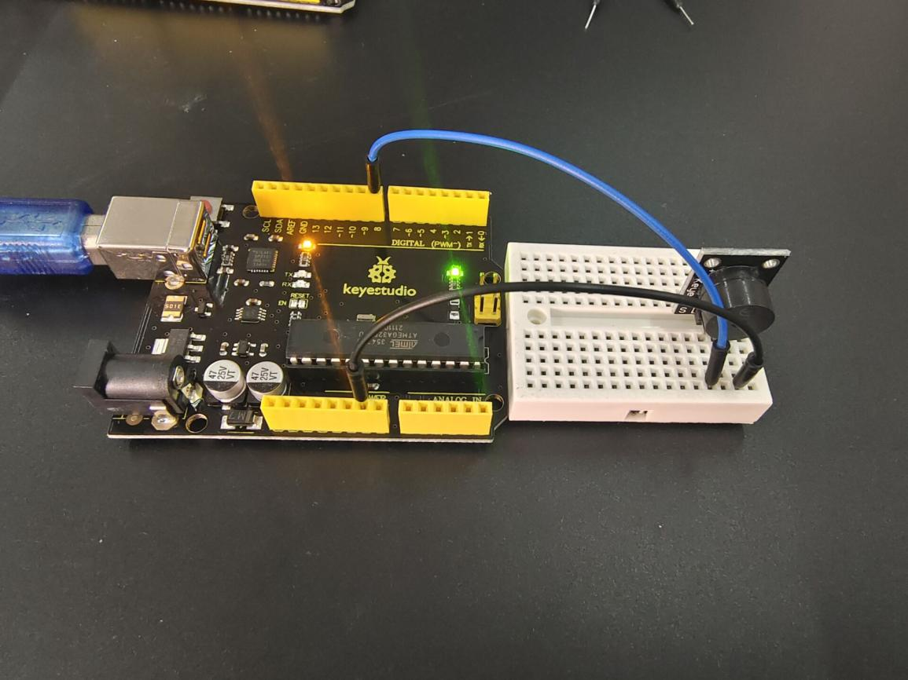
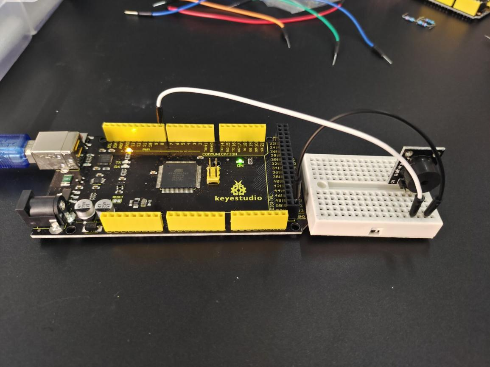

### Progetto 6: Modulo Buzzer Passivo

**Descrizione**

Il buzzer che presentiamo qui è un buzzer passivo. Non può essere azionato da solo, ma da frequenze di impulso esterne. Frequenze diverse producono suoni diversi. Puoi usare Arduino per programmare la melodia di una canzone, il che è piuttosto divertente e semplice.

**Specifiche**

| Tensione operativa    | 1.5V ~ 15V DC                       |
|-----------------------|-------------------------------------|
| Gamma di generazione toni | 1.5kHz ~ 2.5kHz                     |
| Dimensioni della scheda | 18.5mm x 15mm \[0.728in x 0.591in\] |

**Come funziona?**

I buzzer passivi sono tipi di buzzer magnetici. All'interno del buzzer, c'è una bobina di filo collegata ai pin del buzzer.

C'è anche un magnete rotondo che circonda la bobina di filo. Una sottile pellicola metallica con un peso metallico attaccato sopra si trova sopra il magnete rotondo e la bobina di filo.

Quando vengono applicati impulsi di corrente alla bobina di filo, l'induttanza magnetica fa vibrare il peso metallico e la pellicola metallica su e giù. La vibrazione della pellicola metallica produce onde sonore:

Pinout

SIN è il pin del buzzer passivo che colleghiamo all'Arduino.

NC significa non collegare a nulla.

GND dovrebbe essere collegato alla massa di Arduino.

**Schema di collegamento**

Collega il segnale del modulo (S) al pin 8 sull'Arduino e la massa (-) a GND.

Il pin centrale non viene utilizzato.

**Codice di esempio**

> **Codice di esempio (Arduino Editor):** [Open in Arduino Cloud Editor](https://create.arduino.cc/editor/keyestudio/486a88b8-f0b2-4b3f-b984-14d804a24170/preview?embed)

**Risultato dell'esempio**

Dopo aver caricato il codice sulla scheda, il buzzer emetterà un suono.

**UNO**

**MEGA 2560:**

