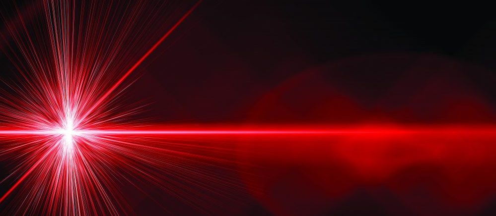
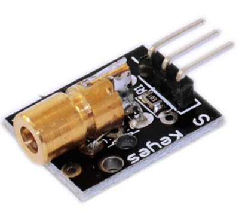
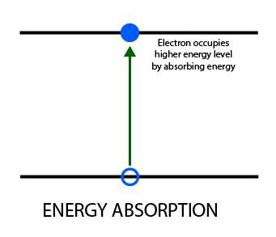
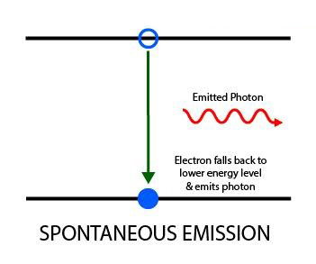
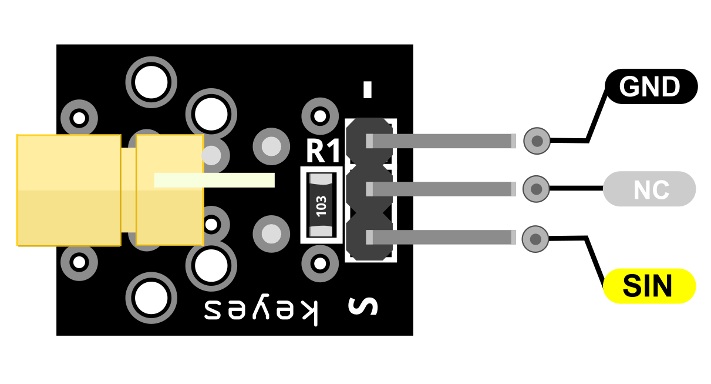
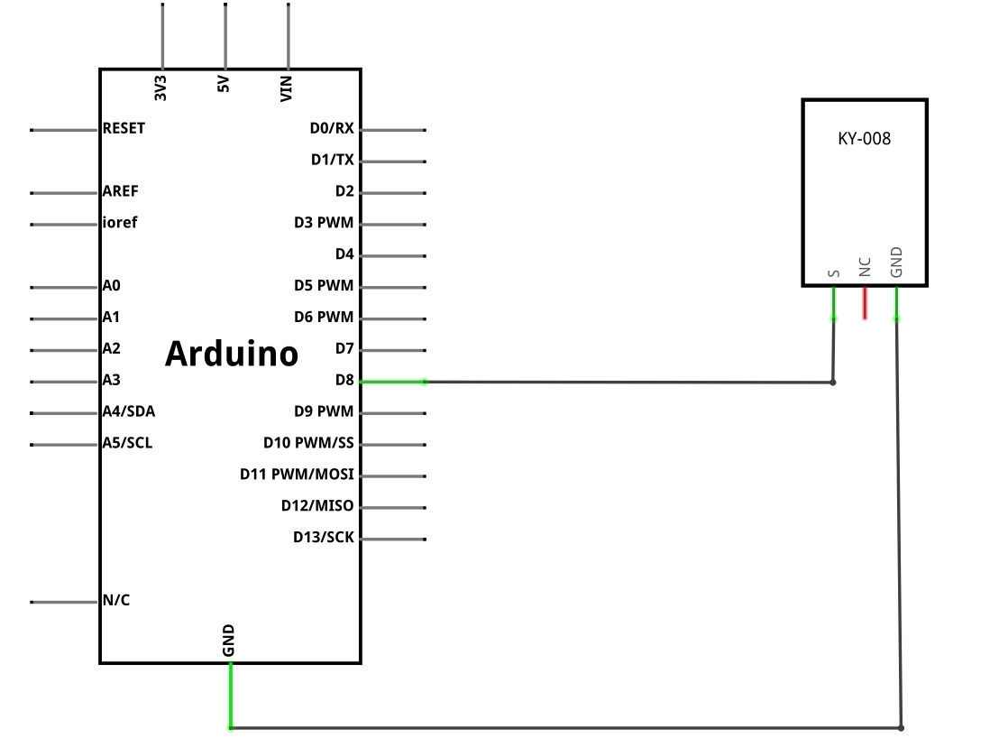
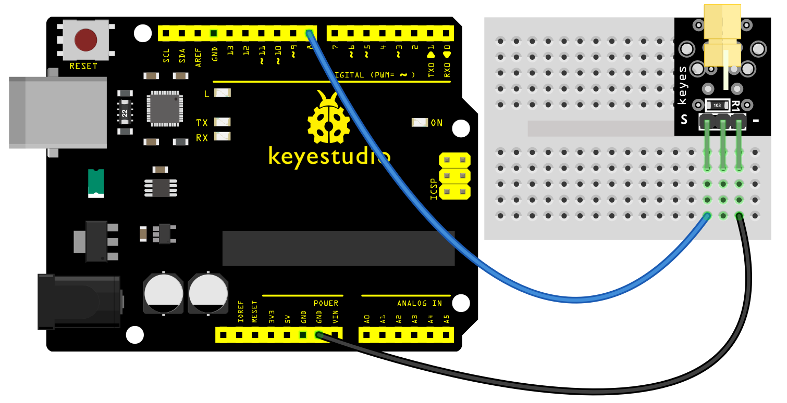
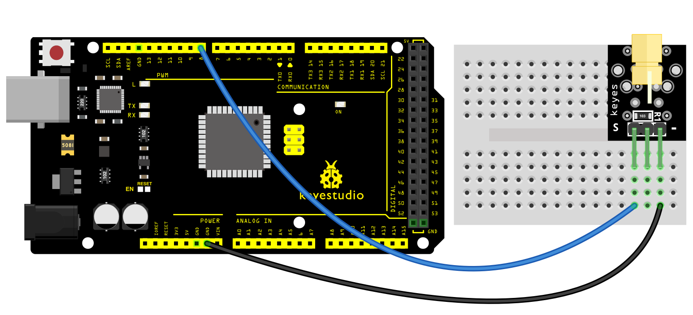
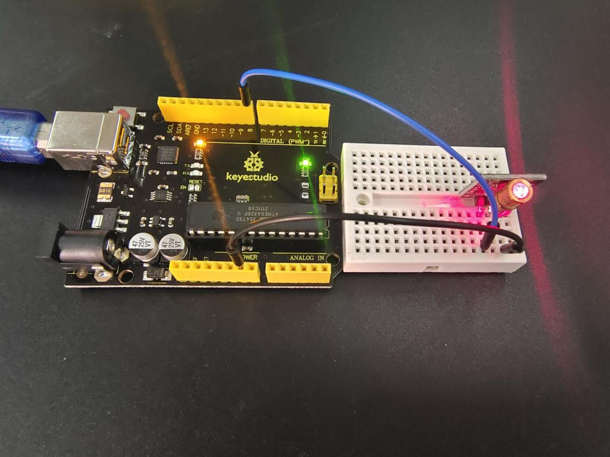
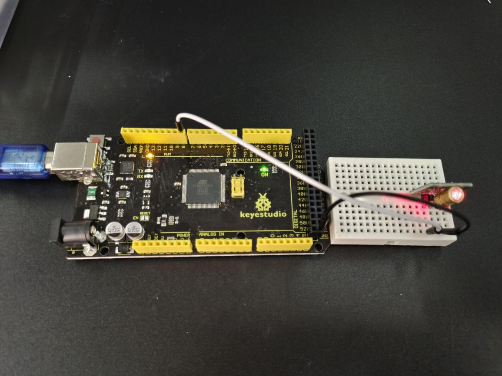

### Proyecto 7: Módulo Transmisor Láser

**Descripción**

 El módulo transmisor láser KY-008 se puede utilizar como puntero láser. Emite un haz láser rojo en forma de punto.

Consiste en un cabezal de diodo láser rojo de 650nm, una resistencia y 3 pines macho. Manipule con precaución, no apunte el rayo láser directamente a los ojos.

Módulo transmisor láser compatible con Arduino, Raspberry PI, ESP32 y otros microcontroladores populares.

**Especificación**

| Voltaje de funcionamiento | 5V                                  |
|---------------------------|-------------------------------------|
| Potencia de salida        | 5mW                                 |
| Longitud de onda          | 650nm                               |
| Corriente de funcionamiento | < 40mA                              |
| Temperatura de trabajo    | -10°C ~ 40°C [14°F to 104°F]      |
| Dimensiones de la placa   | 18.5mm x 15mm [0.728in x 0.591in] |

**¿Cómo funciona?**

El funcionamiento de un diodo láser se lleva a cabo en tres pasos principales:

1.Absorción de energía

El diodo láser consta de una unión p-n donde existen huecos y electrones. (Aquí, un hueco significa la ausencia de un electrón).

Cuando se aplica un cierto voltaje en la unión p-n, los electrones absorben energía y transicionan a un nivel de energía superior. Los huecos se forman en la posición original del electrón excitado.

Los electrones permanecen en este estado excitado sin recombinarse con los huecos durante un período de tiempo muy corto, denominado "tiempo de recombinación" o "vida útil del estado superior". El tiempo de recombinación es de aproximadamente un nanosegundo para la mayoría de los diodos láser.

2.Emisión espontánea

Después de la vida útil del estado superior de los electrones excitados, estos se recombinan con los huecos.

A medida que los electrones caen de un nivel de energía superior a uno inferior, la diferencia de energía se convierte en fotones o radiación electromagnética.

Este mismo proceso se utiliza para producir luz en los LED. La energía del fotón emitido viene dada por la diferencia entre los dos niveles de energía.

3.Emisión estimulada

Necesitamos más fotones coherentes del diodo láser que los emitidos a través del proceso de emisión espontánea.

Se utiliza un espejo parcialmente reflectante a cada lado del diodo para que los fotones liberados por emisión espontánea queden atrapados en la unión p-n hasta que su concentración alcance un valor umbral.

Estos fotones atrapados estimulan a los electrones excitados a recombinarse con los huecos incluso antes de su tiempo de recombinación.

Esto da como resultado la liberación de más fotones que están en fase exacta con los fotones iniciales, por lo que la salida se amplifica. Una vez que la concentración de fotones supera un umbral, escapan de los espejos parcialmente reflectantes, lo que resulta en una luz brillante, monocromática y coherente.

Pinout

SIN es el pin de señal láser que conectamos al Arduino.

NC significa no conectar a nada.

GND debe conectarse a la tierra de Arduino.

**Diagrama de conexión**

Conecte el pin de señal del módulo (S) al pin 8 del Arduino y tierra (-) a GND. El pin central del módulo no se utiliza.

**Código de ejemplo**

> **Código de ejemplo (Arduino Editor):** [Open in Arduino Cloud Editor](https://create.arduino.cc/editor/keyestudio/c4e97630-91f5-4410-9727-385ec36a96cb/preview?embed)

**Resultado del ejemplo**

Conecte el cable y, después de cargar el código, podrá ver el módulo láser parpadear durante un segundo

**UNO:**

**MEGA 2560:**

