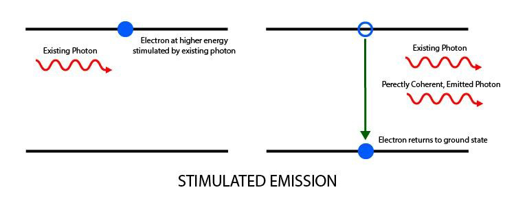

### Progetto 7: Modulo Trasmettitore Laser

**Descrizione**

 Il modulo trasmettitore laser KY-008 può essere utilizzato come puntatore laser. Emette un raggio laser rosso a forma di punto.

È costituito da una testa di diodo laser rosso da 650nm, una resistenza e 3 pin maschi. Maneggiare con cautela, non puntare il raggio laser direttamente negli occhi.

Modulo trasmettitore laser compatibile con Arduino, Raspberry PI, ESP32 e altri popolari microcontrollori.

**Specifiche**

| Tensione operativa  | 5V                                  |
|---------------------|-------------------------------------|
| Potenza di uscita   | 5mW                                 |
| Lunghezza d'onda    | 650nm                               |
| Corrente operativa  | < 40mA                              |
| Temperatura di lavoro | -10°C ~ 40°C [14°F to 104°F]      |
| Dimensioni della scheda | 18.5mm x 15mm [0.728in x 0.591in] |

**Come funziona?**

Il funzionamento di un diodo laser avviene in tre passaggi principali:

1.Assorbimento di energia

Il diodo laser è costituito da una giunzione p-n dove esistono lacune ed elettroni. (Qui, una lacuna significa l'assenza di un elettrone).

Quando una certa tensione viene applicata alla giunzione p-n, gli elettroni assorbono energia e passano a un livello di energia superiore. Le lacune si formano nella posizione originale dell'elettrone eccitato.

Gli elettroni rimangono in questo stato eccitato senza ricombinarsi con le lacune per una durata di tempo molto breve, definita "tempo di ricombinazione" o "vita media dello stato superiore". Il tempo di ricombinazione è di circa un nanosecondo per la maggior parte dei diodi laser.

2.Emissione spontanea

Dopo la vita media dello stato superiore degli elettroni eccitati, essi si ricombinano con le lacune.

Quando gli elettroni cadono da un livello di energia superiore a un livello di energia inferiore, la differenza di energia viene convertita in fotoni o radiazioni elettromagnetiche.

Questo stesso processo viene utilizzato per produrre luce nei LED. L'energia del fotone emesso è data dalla differenza tra i due livelli di energia.

3.Emissione stimolata

Abbiamo bisogno di più fotoni coerenti dal diodo laser rispetto a quelli emessi attraverso il processo di emissione spontanea.

Uno specchio parzialmente riflettente viene utilizzato su entrambi i lati del diodo in modo che i fotoni rilasciati dall'emissione spontanea siano intrappolati nella giunzione p-n fino a quando la loro concentrazione non raggiunge un valore di soglia.

Questi fotoni intrappolati stimolano gli elettroni eccitati a ricombinarsi con le lacune anche prima del loro tempo di ricombinazione.

Ciò si traduce nel rilascio di più fotoni che sono in fase esatta con i fotoni iniziali e quindi l'output viene amplificato. Una volta che la concentrazione di fotoni supera una soglia, essi sfuggono dagli specchi parzialmente riflettenti, risultando in una luce brillante, monocromatica e coerente.

Pinout

SIN è il pin del segnale laser che colleghiamo all'Arduino.

NC significa non collegare a nulla.

GND dovrebbe essere collegato alla massa di Arduino.

**Schema di collegamento**

Collegare il pin di segnale del modulo (S) al pin 8 dell'Arduino e la massa (-) a GND. Il pin centrale del modulo non viene utilizzato.

**Codice di esempio**

> **Codice di esempio (Arduino Editor):** [Open in Arduino Cloud Editor](https://create.arduino.cc/editor/keyestudio/c4e97630-91f5-4410-9727-385ec36a96cb/preview?embed)

**Risultato dell'esempio**

Collegare il cavo e, dopo aver caricato il codice, è possibile vedere il modulo laser lampeggiare per un secondo

**UNO:**

**MEGA 2560:**

