### Project 8: 5V 1 Channel Relay Module
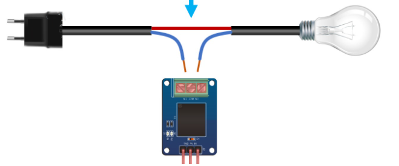

**Description**

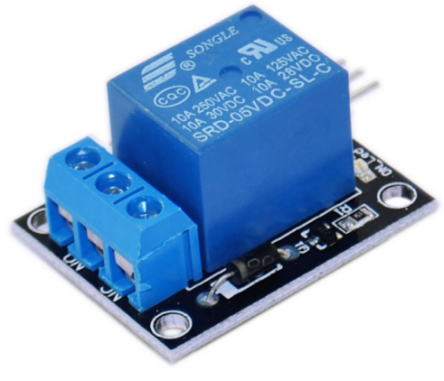 This single relay module can be used in interactive projects. This module uses a SONGLE 5V high-quality relay. It can also be used to control lighting, electrical, and other equipment.

The modular design makes it easy to use with an Arduino board. It can be controlled through a digital IO port, such as for solenoid valves, lamps, motors, and other high-current or high-voltage devices.

**Specification**

| TTL Control Signal | 5VDC to 12VDC (some boards may work with 3.3) |
|--------------------|-----------------------------------------------|
| Maximum AC         | 10A 250VAC                                    |
| Maximum DC         | 10A 30VDC                                     |
| Contact Type       | NC and NO                                     |
| Board Dimensions   | 27mm x 34mm \[1.063in x 1.338in\]             |

**How Does It Work?**

A relay is an **electromagnetic switch** operated by a relatively small current that can control a much larger current.

Here’s a simple animation illustrating how the relay uses one circuit to switch on another circuit.

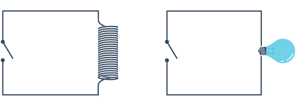

Initially, the first circuit is switched off, and no current flows through it until something (either a sensor or switch closing) turns it on. The second circuit is also switched off.

When a small current flows through the first circuit, it activates the electromagnet, which generates a magnetic field all around it.

The energized electromagnet attracts a contact in the second circuit toward it, closing the switch and allowing a much bigger current to flow through the second circuit.

When the current stops flowing, the contact goes back up to its original position, switching the second circuit off again.

Relay Basics

Typically, the relay has 5 pins; three of them are high-voltage terminals (NC, COM, and NO) that connect to the device you want to control.

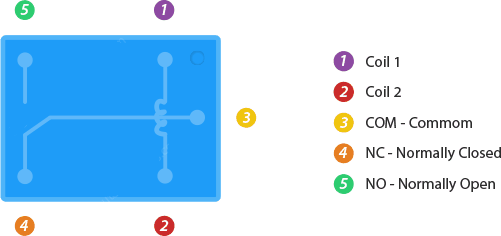

The mains electricity enters the relay at the common (COM) terminal. The use of NC & NO terminals depends on whether you want to turn the device ON or OFF.

Between the remaining two pins (coil1 and coil2), there is a coil that acts like an electromagnet.

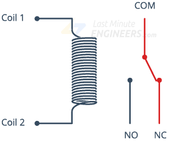

When current flows through the coil, the electromagnet becomes charged and moves the internal contacts of the switch. At that time, the normally open (NO) terminal connects to the common (COM), and the normally closed (NC) terminal becomes disconnected.

When current stops flowing through the coil, the internal contact returns to its initial state, i.e., the normally closed (NC) terminal connects to the common (COM), and the normally open (NO) terminal reopens.

This is known as a single pole, double throw switch (**SPDT**).

Pinout

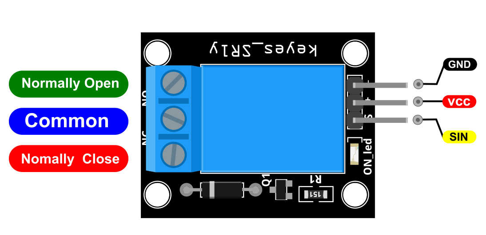

SIN is the relay signal pin which we connect to the Arduino.

VCC should be connected to the +5V Power of Arduino.

GND should be connected to the ground of Arduino.

**Connection Diagram**

For the DC part of the circuit, connect S (signal) to pin 10 on the Arduino, also connect the Power line (+) and ground (-) to +5 and GND respectively.

On the AC side, connect your feed to Common (middle contact) and use NC or NO according to your needs.

NO (Normally Open) will get power when (S) is high; NC (Normally Closed) gets disconnected when (S) is high.

Always be very careful when experimenting with AC; electrical shock can result in serious injuries.

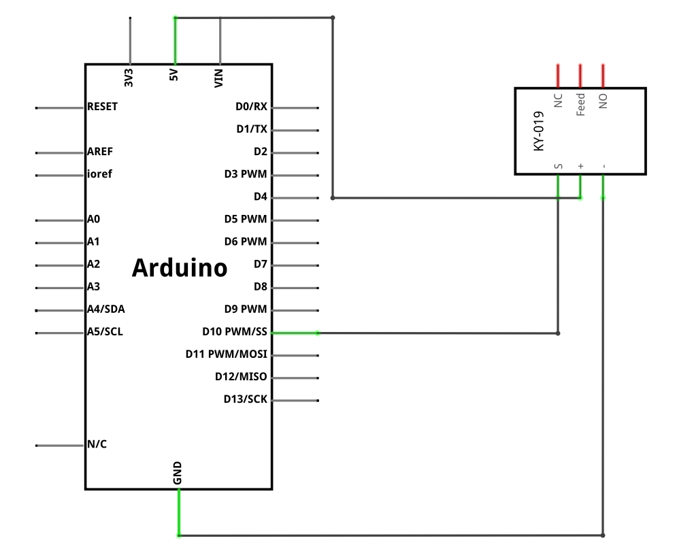

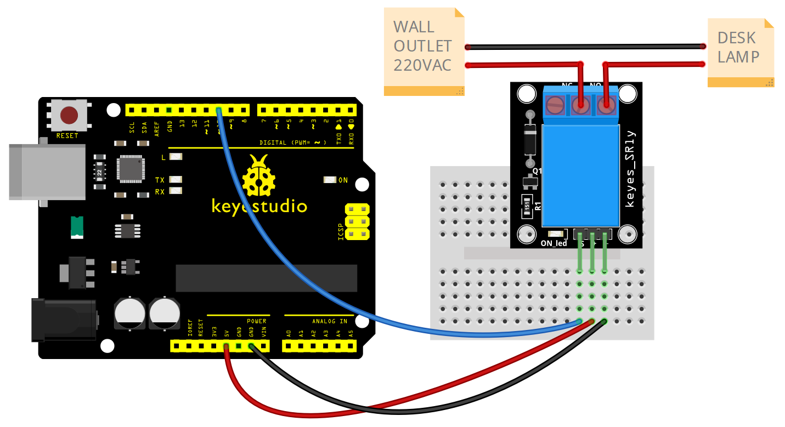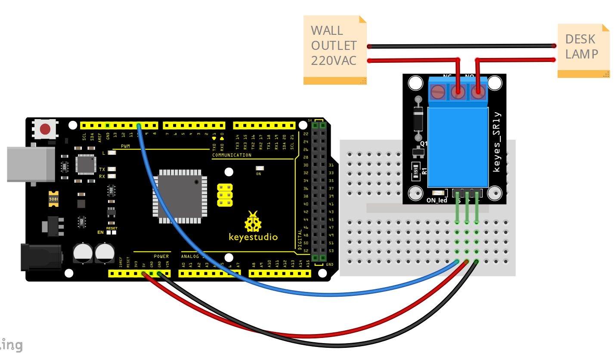

**Sample Code**

> **Sample Code (Arduino Editor):** [Open in Arduino Cloud Editor](https://create.arduino.cc/editor/keyestudio/eadaec62-03c5-4656-b55c-50cca25c4529/preview?embed)

**Example Result**

This relay module is active at HIGH level.

Wire it up well, powered up, then upload the above code to the board. You will see the relay is turned on (ON connected, NC disconnected) for two seconds, then turned off for two seconds (NC closed, ON disconnected), repeatedly and circularly.

When the relay is turned on, the external LED is on. If the relay is turned off, the external LED is off.

**UNO:**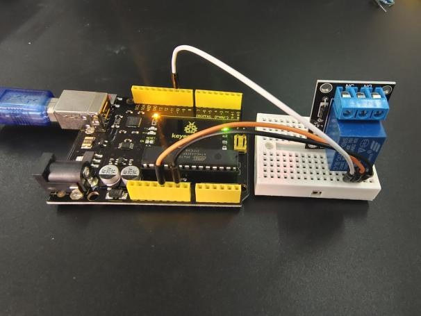

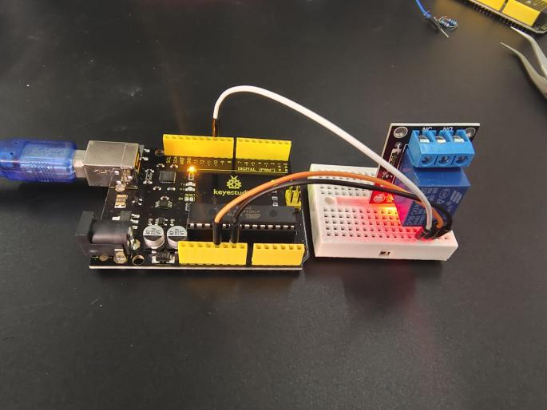

**MEGA 2560:**

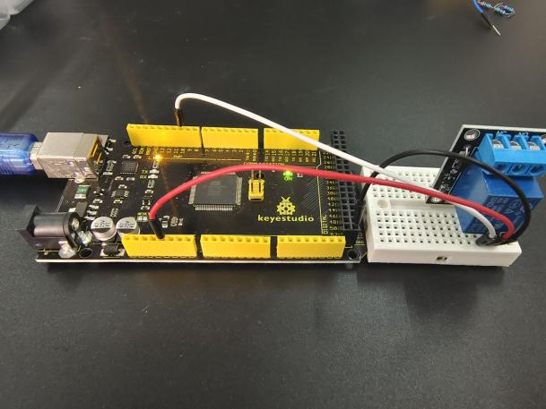

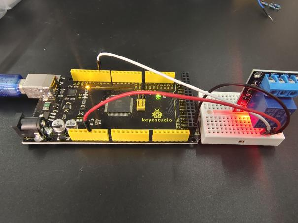