### Proyecto 9: Módulo de Botón Pulsador Digital
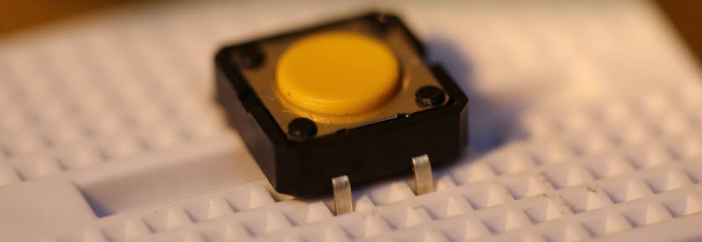

**Descripción**

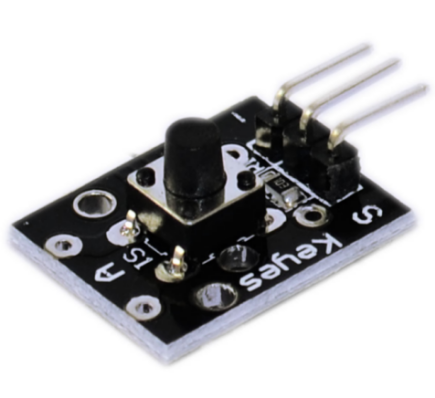 Este es un módulo de botón básico. Simplemente puede conectarlo a un shield de E/S para su primera prueba con Arduino. El módulo de interruptor de llave KY-004 es un botón pulsador que cerrará el circuito cuando se presione, enviando una señal alta.

Este módulo es compatible con Arduino, Raspberry Pi, ESP32 y otras plataformas.

**Especificación**

| Clasificación | 50mA 12VC |
|---|---|
| Temperatura ambiente | -25°C a 105°C [-13°F a 221°F] |
| Durabilidad | 100.000 ciclos |
| Fuerza de operación | 180/230(±20gf) |
| Dimensiones de la placa | 18.5mm x 15mm [0.728in x 0.591in] |

**¿Cómo funciona?**

Hay 4 patas en este tipo de botón en el módulo Arduino KY 004. Las 2 patas superiores están conectadas entre sí y lo mismo ocurre con las 2 patas inferiores.

La corriente fluirá cuando la sección superior y la sección inferior se conecten, y esto sucede cuando se presiona el botón.

Una vez liberado, la conexión se pierde entre las dos secciones y el flujo de corriente se detendrá.

Una vez que interconectamos el módulo con un Arduino, el Arduino podrá saber si el botón está siendo presionado, ya que detectará el flujo de corriente de la resistencia que está conectada a las patas del botón.

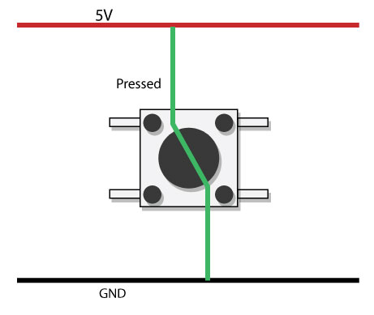

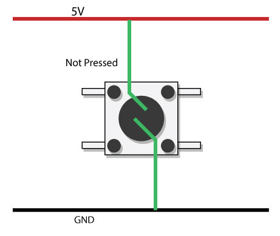

Pinout

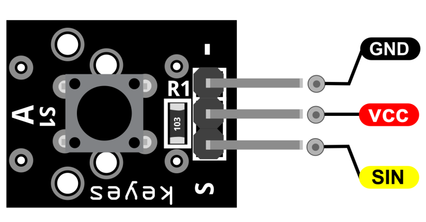

SIN es el pin de señal del botón que conectamos al Arduino.

VCC debe conectarse a la alimentación de +5V de Arduino.

GND debe conectarse a la tierra de Arduino.

**Diagrama de conexión**

Conecte el pin de señal del módulo (S) al pin 3 del Arduino. Luego conecte el pin de alimentación de la placa (central) y tierra (-) a +5V y GND en el Arduino respectivamente.

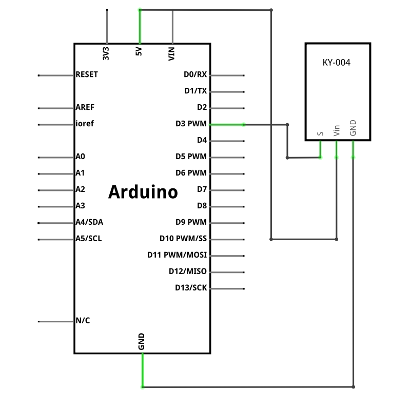

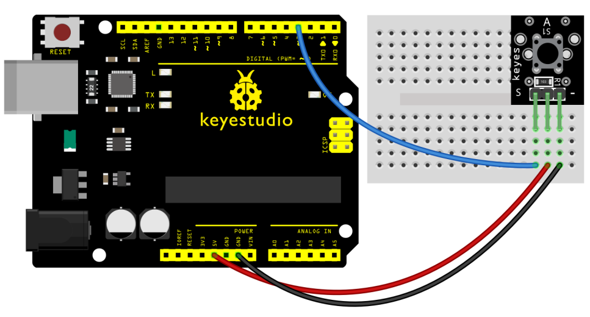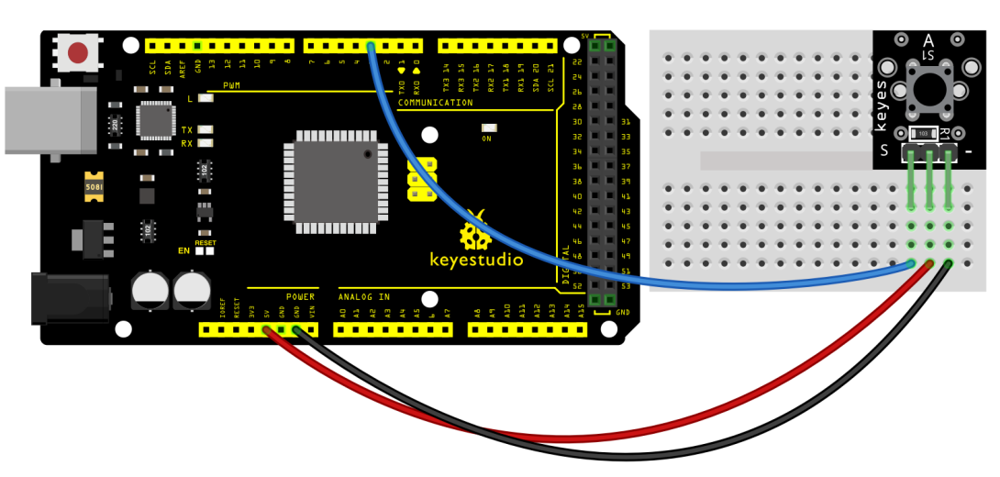

**Código de ejemplo**

> **Código de ejemplo (Editor de Arduino):** [Abrir en el Editor en la nube de Arduino](https://create.arduino.cc/editor/keyestudio/eae23e46-5c29-4f2e-b534-1eab64b00e2c/preview?embed)

**Resultado del ejemplo**

Conéctelo bien como se muestra en la figura siguiente y luego cargue el código a la placa.

Cuando se presiona el botón numérico, el LED D13 se apaga, y cuando se suelta el botón numérico, el LED D13 se enciende.

**UNO:**

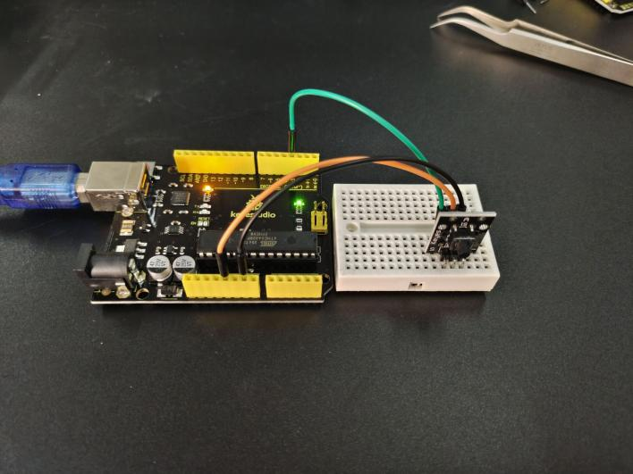

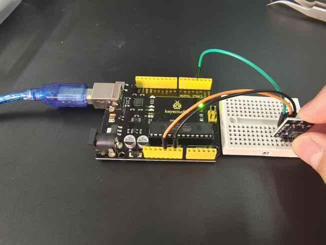

**MEGA2560:**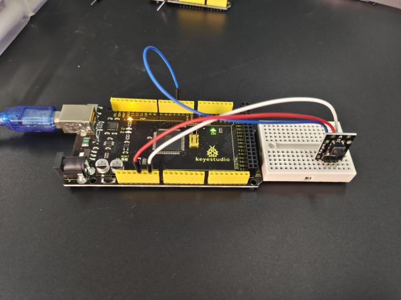

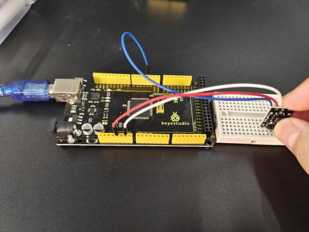