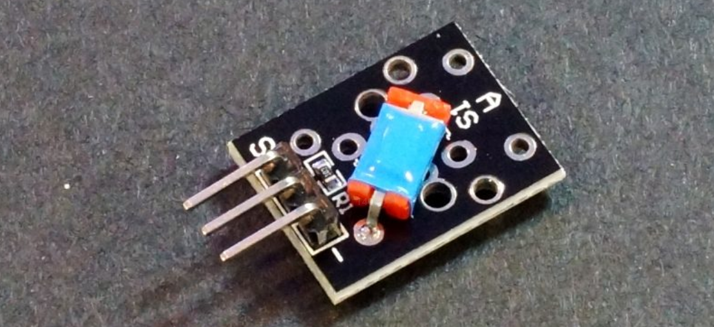
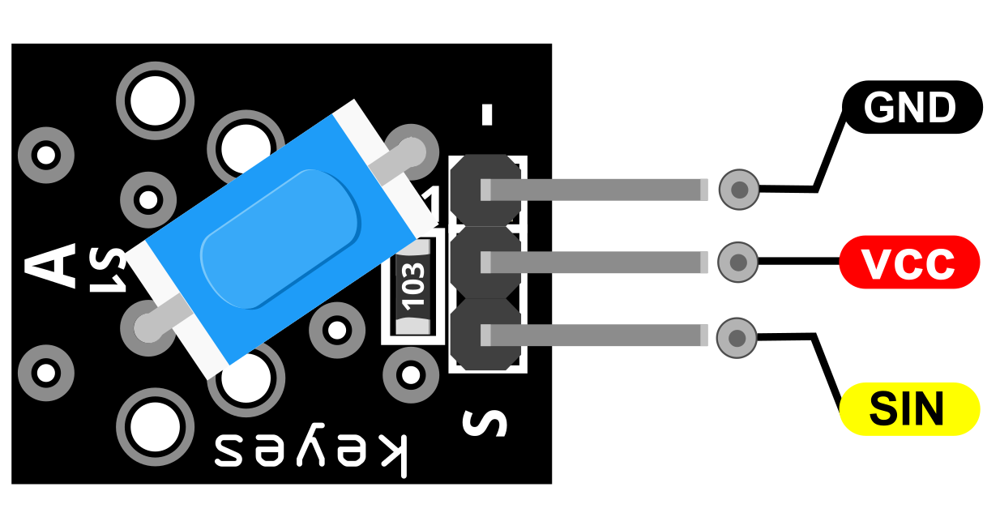
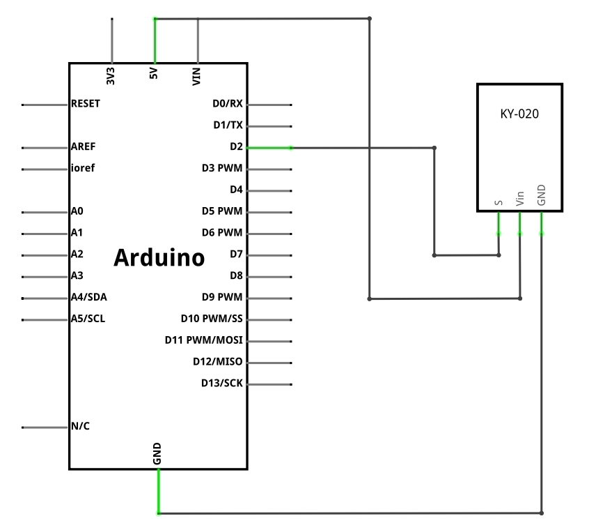
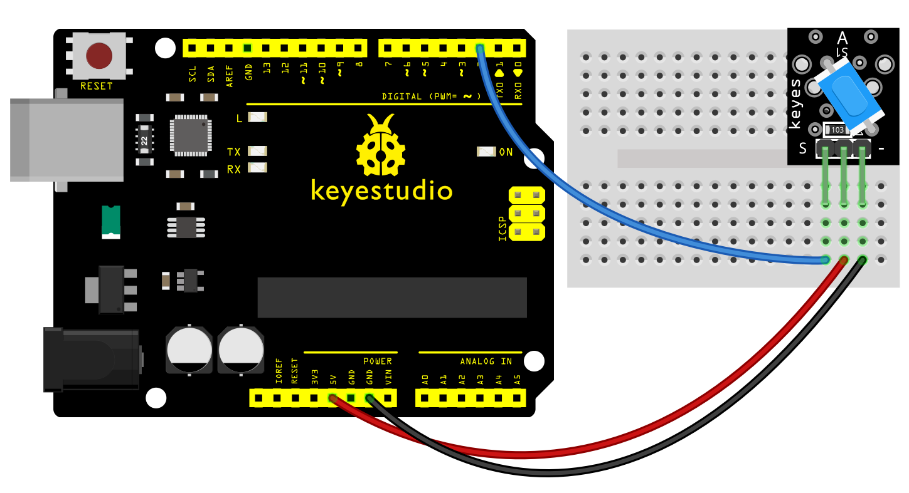
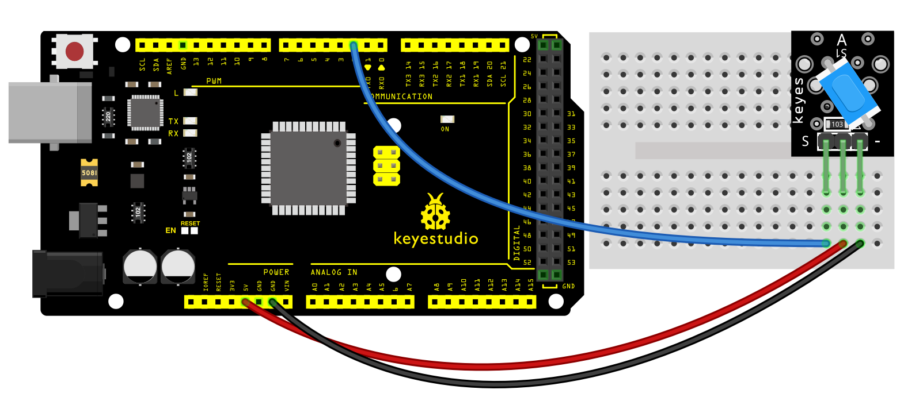
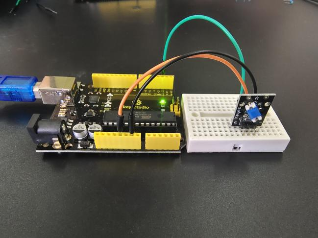
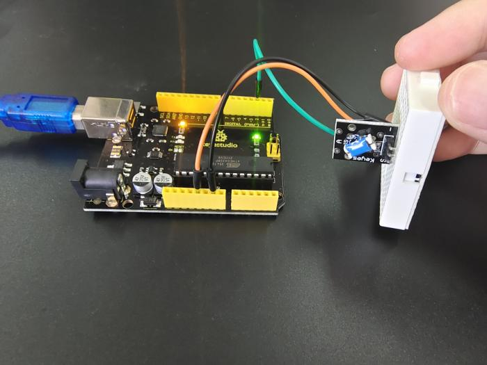
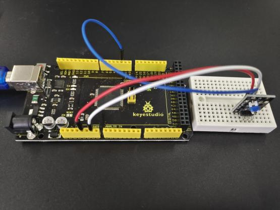
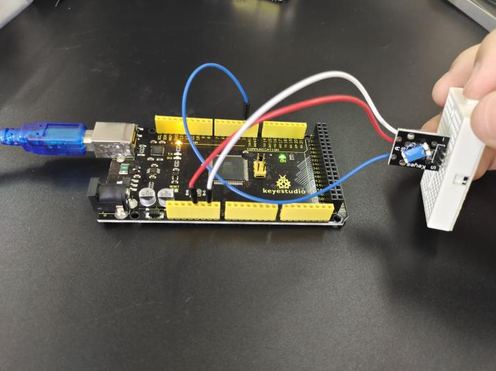

### Project 10: Digital Tilt Sensor

**Description**

The KY-020 Tilt Switch Sensor module is a switch that reacts to movement. It closes the circuit when it's tilted to the side as long as it is moved with enough force and degree of inclination to activate the ball switch inside. It is compatible with Arduino, Raspberry Pi, ESP32 and other microcontrollers.

**Specification**

| Operating Voltage | 3.3V ~ 5V |
|-------------------|----------|
| Output Type       | Digital  |

**How Does It Work?**

A ball tilt sensor is typically made up of a metal tube with a little metal ball that rolls around in it. One end of the cavity has two conductive elements (poles). The sensor is designed in such a way that a sufficient level of tilt allows the ball to roll, making or breaking an electrical connection.

When the sensor is upright the ball touches the poles and makes an electrical connection. When the sensor is tilted the ball rolls off the poles and the connection is broken.

Pinout

SIN is the tilt switch signal pin which we connect to the Arduino.

VCC should be connected to the +5V Power of Arduino.

GND should be connected to the ground of Arduino.

**Connection Diagram**

Connect the module's Power line (middle) and ground (-) to +5 and GND respectively. Connect signal (S) to pin 2 on the Arduino.

**Sample Code**

> **Sample Code (Arduino Editor):** [Open in Arduino Cloud Editor](https://create.arduino.cc/editor/keyestudio/6abe4949-5e15-4444-a24b-3ff9cb0062b4/preview?embed)

**Example Result**

Done wiring and powered up, then upload the code to the board. Tilt the sensor and you will see the LED on the sensor turn on.

**UNO:**

**MEGA 2560:**

