### Project 11: Knock Sensor Module
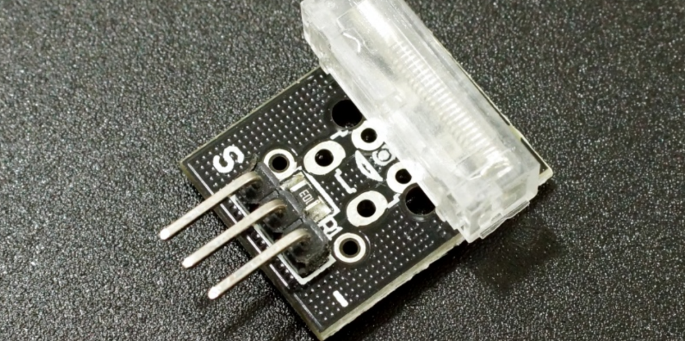

**Description**

The KY-031 Knock Sensor module is a vibration sensor that sends a signal when a knock/tap is detected. You can combine it with Arduino to make some interesting experiments, e.g., an electronic drum.

It is compatible with Arduino, ESP8266, ESP32, Teensy, Raspberry Pi, and other popular platforms.

**Specification**

| Operating Voltage | 3.3V ~ 5V |
|-------------------|-----------|
| Output Type       | Digital   |

**How Does It Work?**

Inside the actual sensor, there is a thin copper wire that is coiled up in a spring form, and it surrounds another copper wire that acts as a center post. Both the spring and the center post will be the two connection terminals of the sensor, which functions like a simple switch.

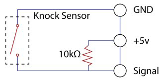

Normally, the outer spring is slightly separated from the center post. When the outer spring and the center post touch by means of a sufficient amount of vibration, this shorts both of the terminals.

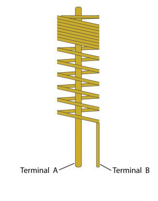

Although the contact of the spring and the center post is momentary, the Arduino is superbly efficient at detecting this connection by implementing the proper programming.

Pinout

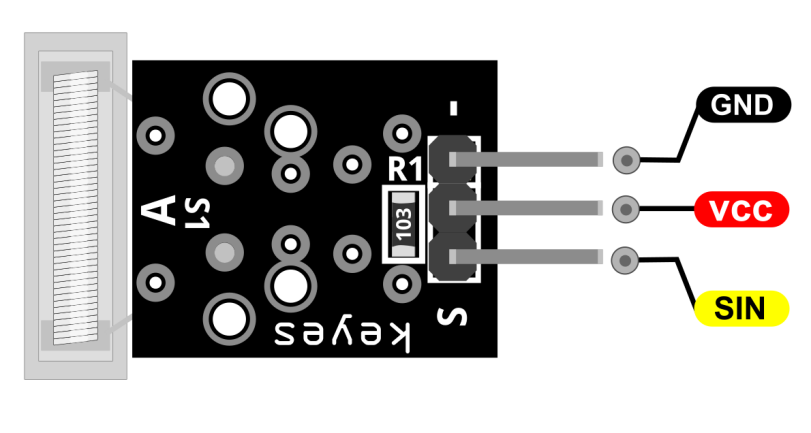

SIN is the knock sensor signal pin which we connect to the Arduino.

VCC should be connected to the +5V Power of Arduino.

GND should be connected to the ground of Arduino.

**Connection Diagram**

Connect the module’s Power line (middle) and the ground (-) to +5 and GND respectively. Connect signal (S) to pin 3 on the Arduino.

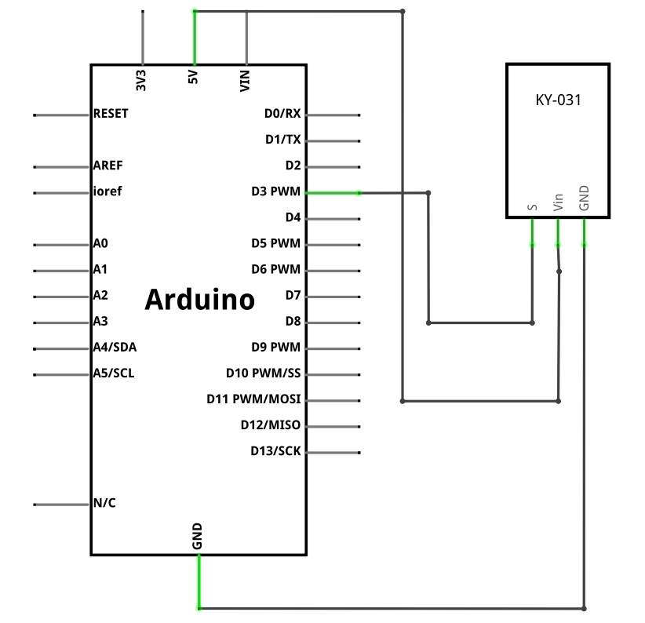

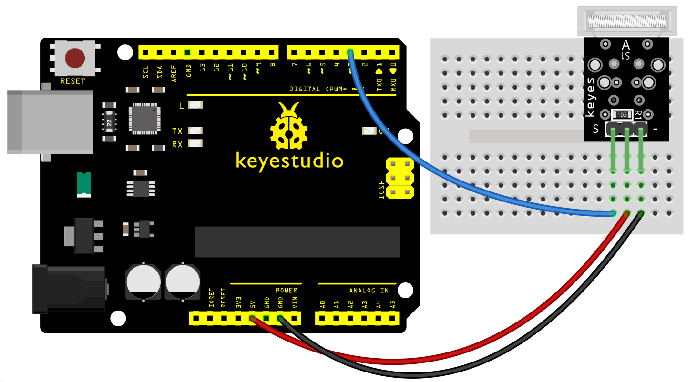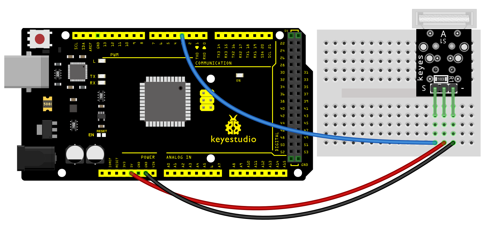

**Sample Code**

> **Sample Code (Arduino Editor):** [Open in Arduino Cloud Editor](https://create.arduino.cc/editor/keyestudio/af7b9938-c1c3-49ce-bc2e-85942cb8b6ad/preview?embed)

**Example Result**

After connecting the cable and uploading the code, knocking on the module will make the D13 LED light on for 3 seconds.

**UNO:**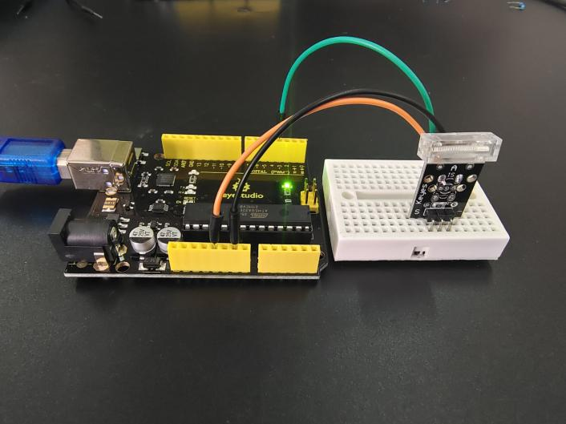

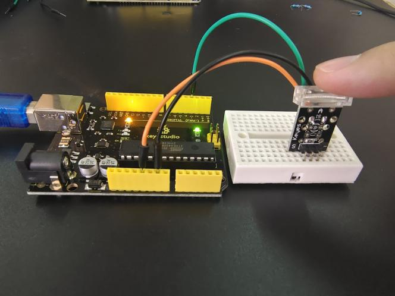

**MEGA 2560:**

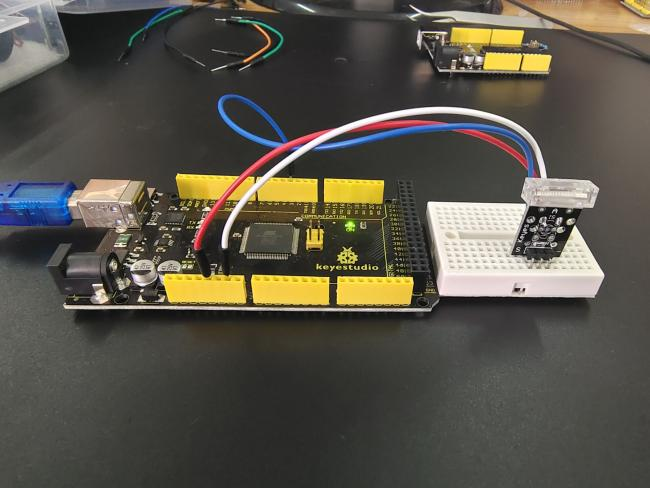

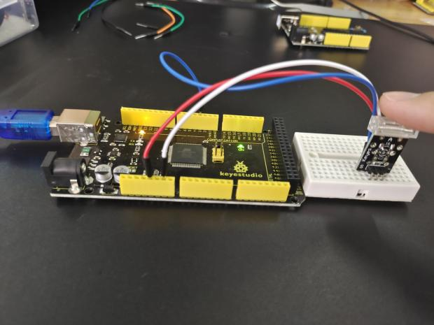