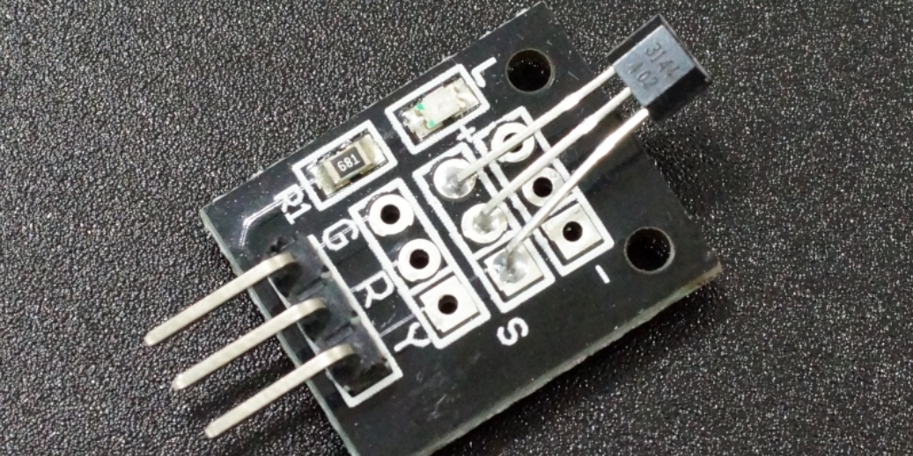
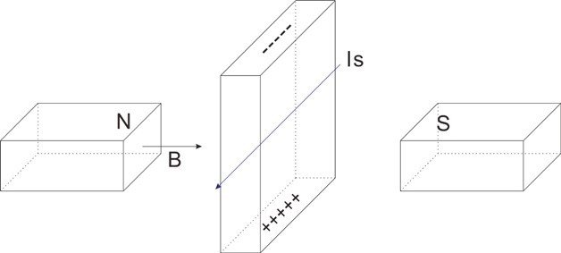
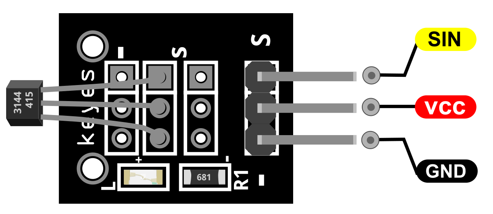
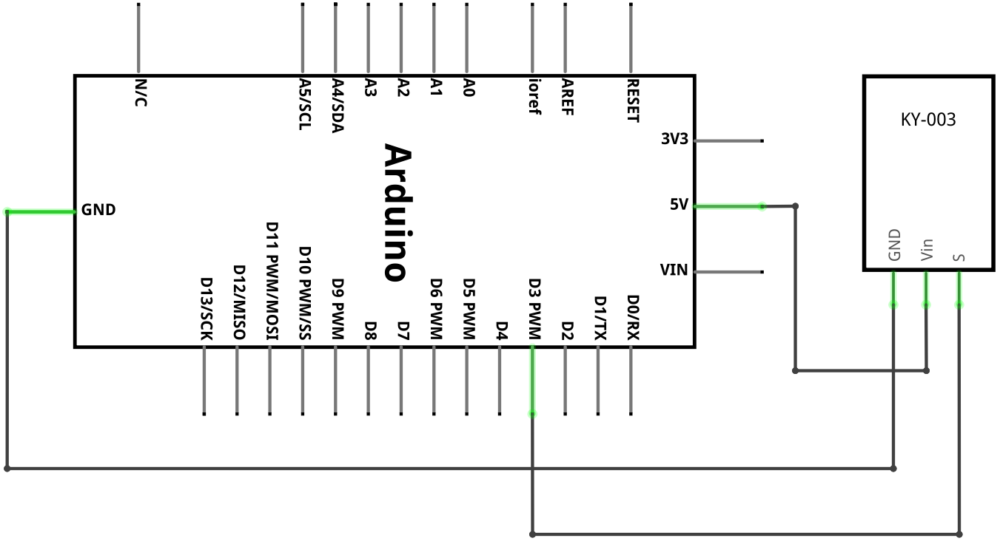
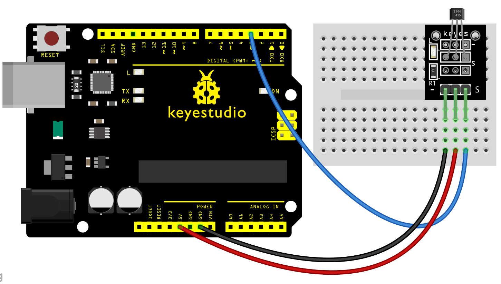
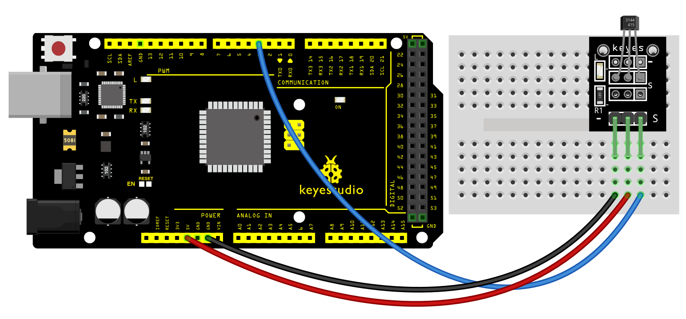
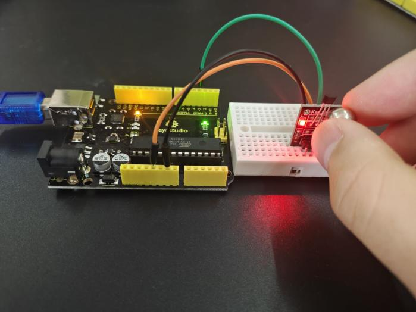
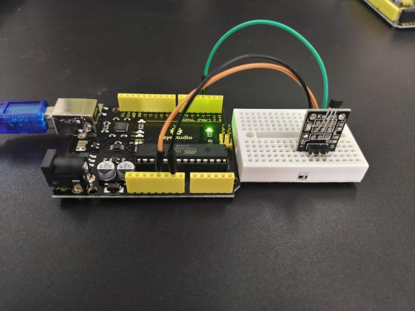
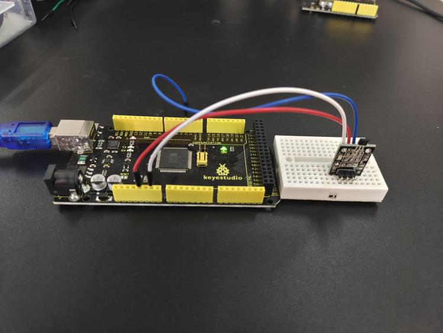
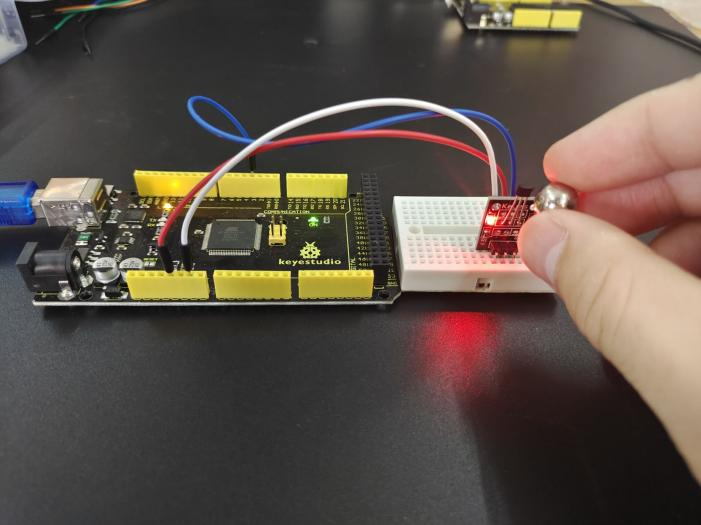

### Projet 12: Capteur magnétique à effet Hall

**Description**

Le module de capteur magnétique à effet Hall KY-003 est un interrupteur qui réagit à la présence d'un champ magnétique en s'activant ou se désactivant.

Il peut détecter des matériaux magnétiques dans une plage de détection allant jusqu'à 3 cm.

La plage de détection et la force du champ magnétique sont proportionnelles. La sortie est numérique (marche/arrêt). Compatible avec les microcontrôleurs populaires comme Arduino, Raspberry Pi et ESP32.

**Spécification**

| Tension de fonctionnement   | 4.5V à 24V                          |
|-----------------------------|-------------------------------------|
| Plage de température de fonctionnement | -40°C à 85°C \[-40°F à 185°F\]    |
| Dimensions de la carte      | 18.5mm x 15mm \[0.728in x 0.591in\] |

**Comment ça marche ?**

L'effet Hall est dû à la nature du courant dans un conducteur. Le courant est constitué du mouvement de nombreux petits porteurs de charge, typiquement des électrons, des trous, des ions (voir Électromigration) ou les trois.

Lorsqu'un champ magnétique est présent, ces charges subissent une force, appelée force de Lorentz. En l'absence d'un tel champ magnétique, les charges suivent des chemins approximativement droits, en "ligne de mire", entre les collisions avec les impuretés, les phonons, etc.

Cependant, lorsqu'un champ magnétique avec une composante perpendiculaire est appliqué, leurs chemins entre les collisions sont courbés de sorte que les charges en mouvement s'accumulent sur une face du matériau. Cela laisse des charges égales et opposées exposées sur l'autre face, où il y a une rareté de charges mobiles.

Le résultat est une distribution asymétrique de la densité de charge à travers l'élément Hall, résultant d'une force perpendiculaire à la fois au chemin en "ligne de mire" et au champ magnétique appliqué. La séparation des charges établit un champ électrique qui s'oppose à la migration de charges supplémentaires, de sorte qu'un potentiel électrique stable est établi tant que la charge circule.

Ce phénomène est l'effet Hall.

Brochage

SIN est la broche de signal du capteur magnétique à effet Hall que nous connectons à l'Arduino.

VCC doit être connecté à l'alimentation +5V de l'Arduino.

GND doit être connecté à la masse de l'Arduino.

**Schéma de connexion**

Connectez la ligne d'alimentation de la carte (milieu) et la masse (-) respectivement à +5V et GND sur l'Arduino. Connectez le signal (S) à la broche 3 de l'Arduino.

**Exemple de code**

> **Exemple de code (Éditeur Arduino):** [Open in Arduino Cloud Editor](https://create.arduino.cc/editor/keyestudio/c99cf83f-bb70-41d0-ab54-09de53d71346/preview?embed)

**Exemple de résultat**

Câblez-le et téléchargez le code sur la carte. Vous verrez que l'indicateur D13 sur la carte PLUS est éteint, et la LED sur le module est également éteinte.

Mais si vous approchez une bille magnétique du module Hall, vous verrez l'indicateur D13 sur la carte PLUS s'allumer, et la LED sur le module s'allumera également.

**UNO:**

**MEGA 2560:**

