### Projekt 13: Vibrationssensormodul

**Beschreibung**

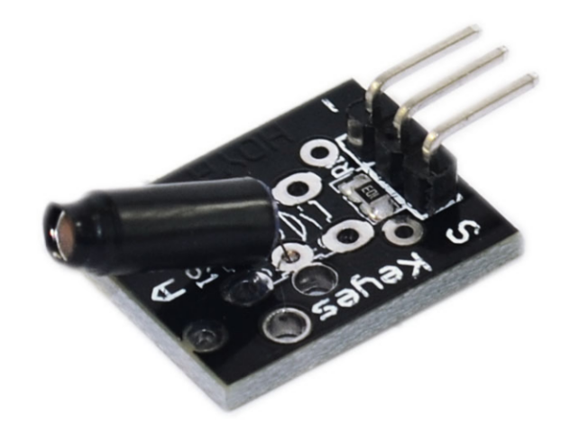 Das KY-002 Vibrationsschaltermodul erkennt Erschütterungen und Klopfen. Wenn das Modul bewegt wird, schließt ein Federmechanismus den Stromkreis und sendet ein kurzes High-Signal. Es kann mit einer Vielzahl von Mikrocontrollern wie Arduino, ESP32, Raspberry Pi und anderen verwendet werden.

**Spezifikation**

| Betriebsspannung | 5V                                  |
|------------------|-------------------------------------|
| Platinenabmessungen | 18.5mm x 15mm \[0.728in x 0.591in\] |

**Wie funktioniert es?**

Wie oben erwähnt, sind die Funktionalität oder das Funktionsprinzip des Vibrationssensors und des Klopfsensors ziemlich ähnlich.

Im Inneren des Vibrationssensors befindet sich ein Mittelpfosten, der als metallisch leitendes Bein des Sensors dient. Um den Mittelpfosten herum befindet sich ein dünnes Metall, das zu einer Federform aufgewickelt ist.

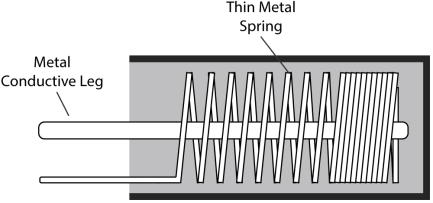

Sobald eine Vibration erzeugt wird, kommen das metallisch leitende Bein und die dünne Metallfeder miteinander in Kontakt, und sobald dies geschieht, fließt Strom direkt vom metallisch leitenden Bein zur dünnen Metallfeder.

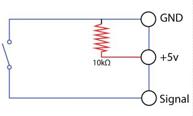

Wenn Strom durch beide Drähte fließt, wird eine Spannung von 5 Volt erzeugt. Dadurch wird die Vibration vom Sensor erkannt und Informationen an den Mikrocontroller gesendet.

In diesem Modul ist auch ein 10k-Widerstand integriert. Dieser Widerstand begrenzt die Stromzirkulation von der Stromquelle und verhindert so Schäden am Modul.

Pinbelegung

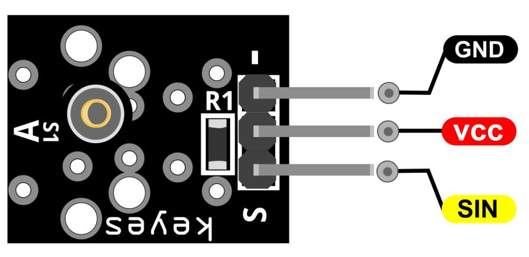

SIN ist der Signalschaltpin des Vibrationsschalters, den wir mit dem Arduino verbinden.

VCC sollte mit der +5V-Stromversorgung des Arduino verbunden werden.

GND sollte mit der Masse des Arduino verbunden werden.

**Schaltplan**

Verbinden Sie den Signalpin (S) des Moduls mit Pin 3 am Arduino. Verbinden Sie dann den Strompin (Mitte) und Masse (-) des Moduls mit +5V bzw. GND am Arduino.

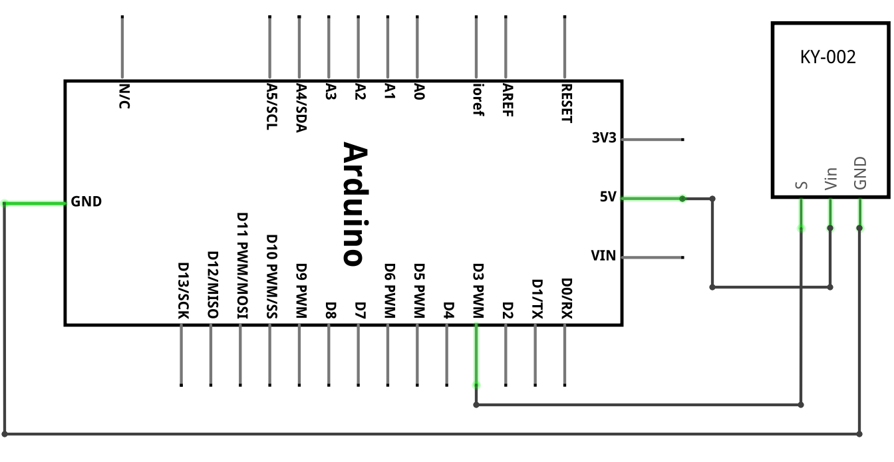

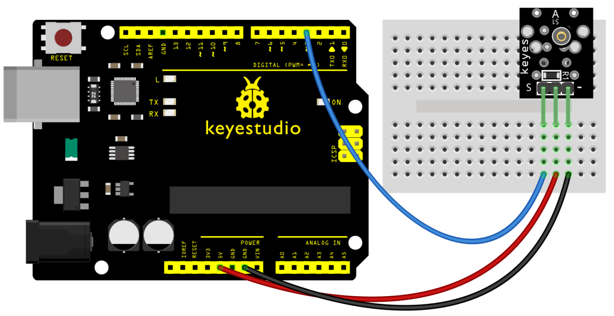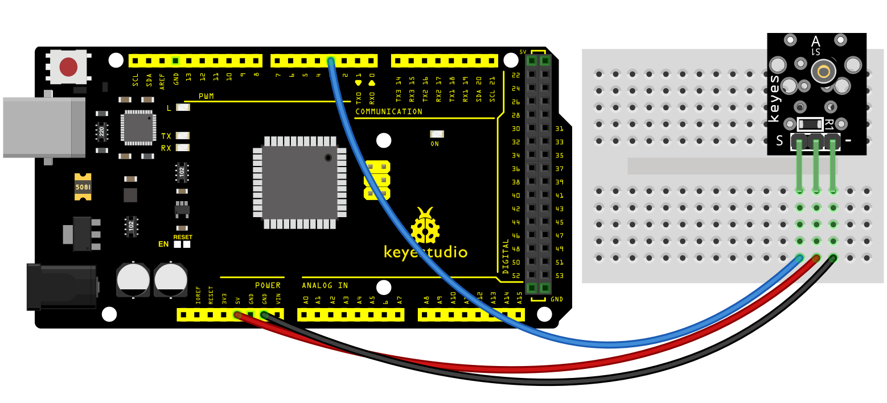

**Beispielcode**

> **Beispielcode (Arduino Editor):** [Open in Arduino Cloud Editor](https://create.arduino.cc/editor/keyestudio/5c4c8671-06ba-4811-8db0-37750690da47/preview?embed)

**Beispielergebnis**

Nach dem Anschließen des Kabels und dem Hochladen des Codes wird das Modul vibriert und die D13-LED leuchtet 3 Sekunden lang auf.

**UNO:**

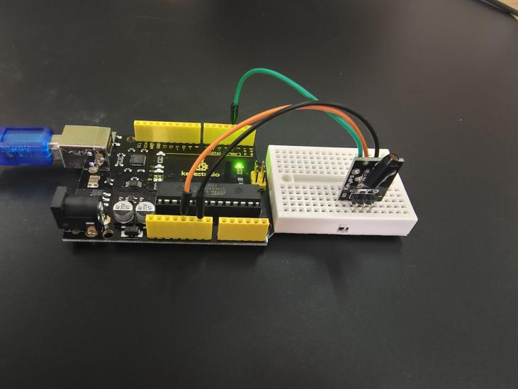

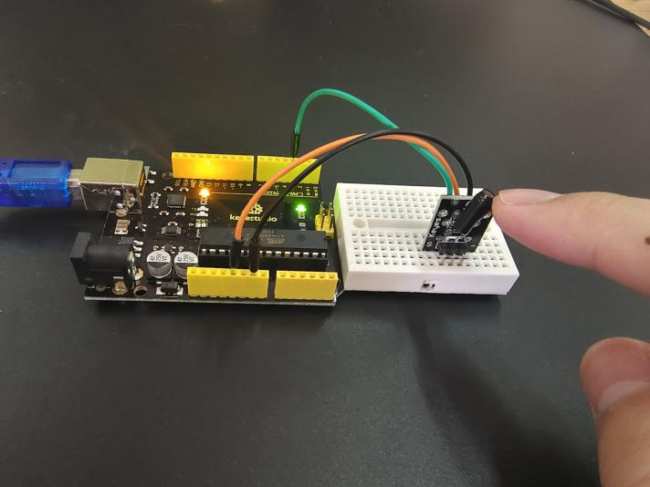

**MEGA 2560:**

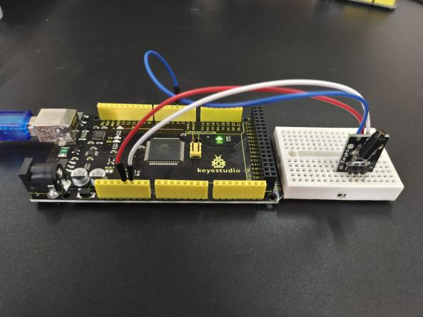

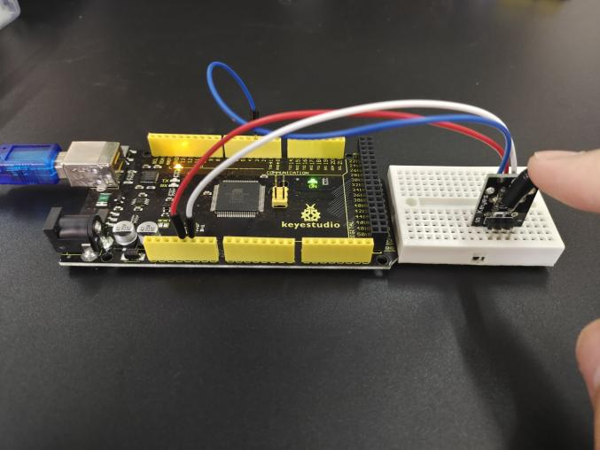