### Progetto 14: Photo Interrupter Module
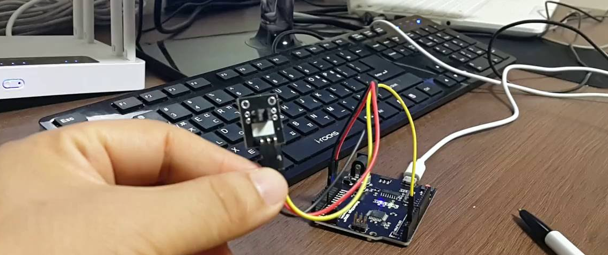

**Descrizione**

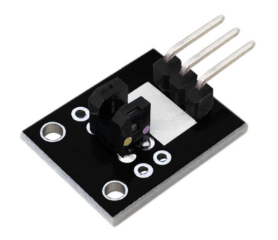 Il modulo KY-010 Photo Interrupter è un interruttore che attiva un segnale quando la luce tra la fessura del sensore viene bloccata.

Viene utilizzato per molte applicazioni, tra cui interruttori di finecorsa ottici, erogazione di pellet, rilevamento generale di oggetti, ecc.

Questo modulo è adatto a varie piattaforme elettroniche come Arduino, Raspberry Pi, ESP32 e altre.

**Specifiche**

| Tensione Operativa | 3.3V ~ 5V                           |
|-------------------|-------------------------------------|
| Dimensioni Scheda | 18.5mm x 15mm \[0.728in x 0.591in\] |

**Come Funziona?**

La parte verticale di questo sensore è un emettitore a infrarossi e sull'altro lato c'è un rilevatore a infrarossi schermato. Emettendo un raggio di luce a infrarossi da un'estremità all'altra, il sensore può rilevare quando un oggetto attraversa il raggio.

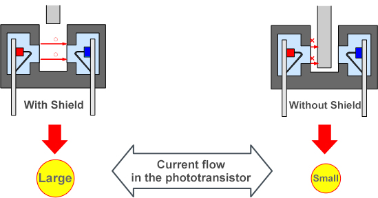

**Esempio di Utilizzo: Rilevamento della Variazione di Tensione sul Lato del Fototransistor**

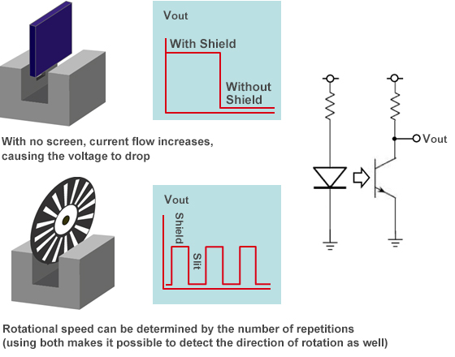

Pinout

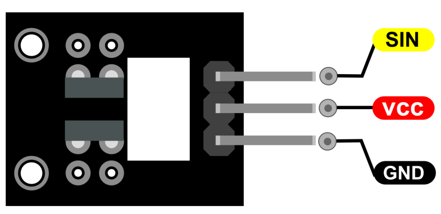

SIN è il pin di segnale del Photo Interrupter Module che colleghiamo ad Arduino.

VCC dovrebbe essere collegato all'alimentazione +5V di Arduino.

GND dovrebbe essere collegato alla terra di Arduino.

**Schema di Collegamento**

Collega la linea di alimentazione (al centro) e la terra (a sinistra) rispettivamente a +5V e GND. Collega il segnale (S) al pin 3 di Arduino.

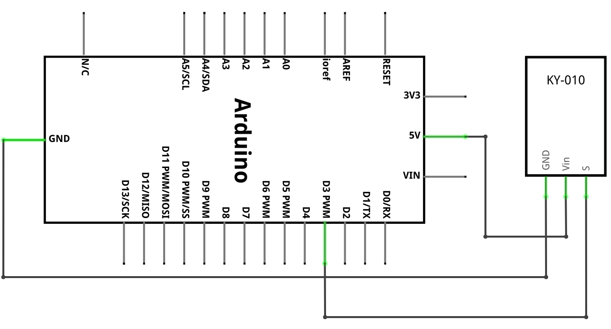

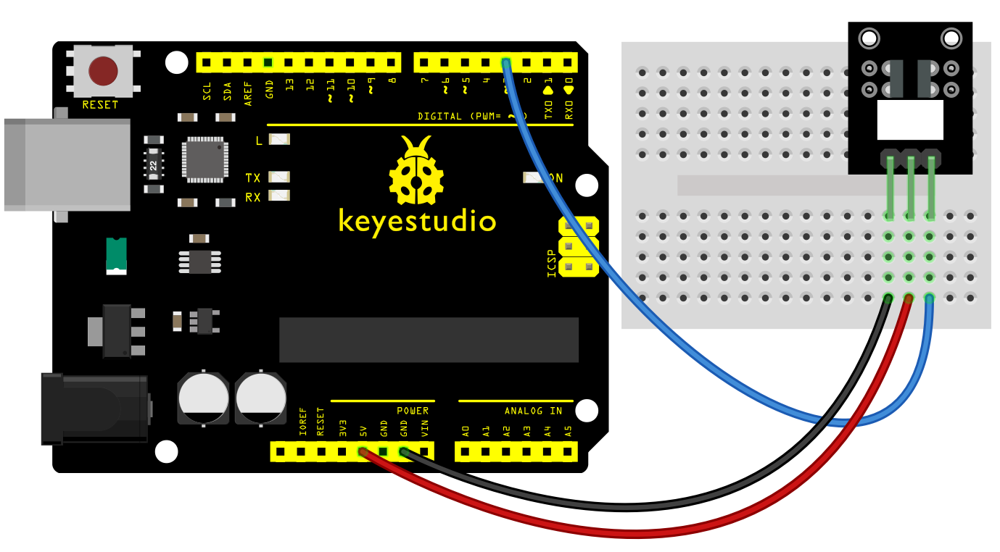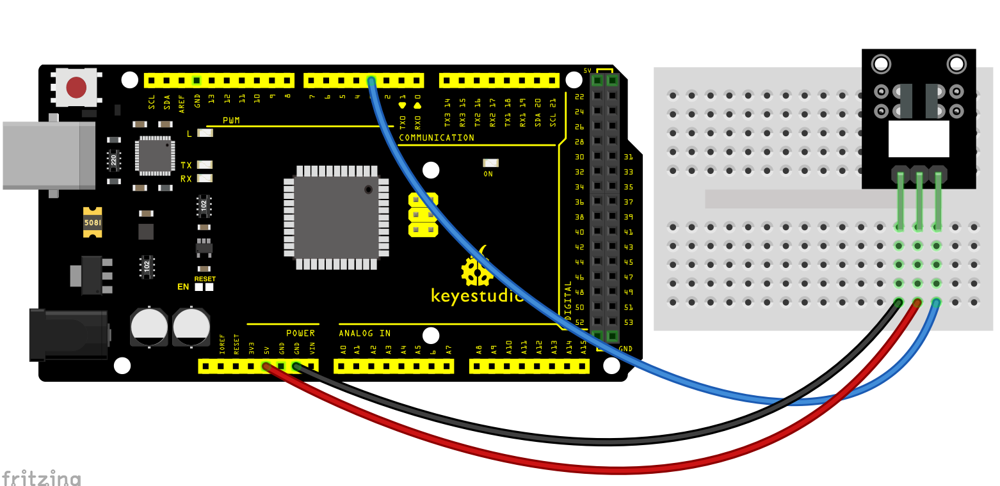

**Codice di Esempio**

> **Codice di Esempio (Arduino Editor):** [Open in Arduino Cloud Editor](https://create.arduino.cc/editor/keyestudio/c9e15316-13d2-4c00-a012-4a660fddbd38/preview?embed)

**Risultato di Esempio**

Dopo aver caricato il codice sulla scheda, puoi vedere che entrambi i LED sulla scheda PLUS e sul modulo sono accesi. Come mostrato di seguito.

Quando inserisci un pezzo di carta nella scanalatura del modulo, il segnale viene interrotto e il led1 sul modulo si spegnerà.

**UNO:**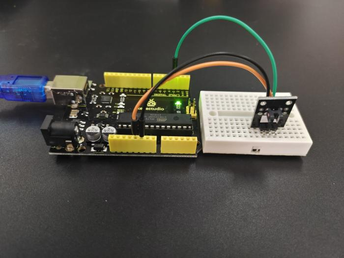

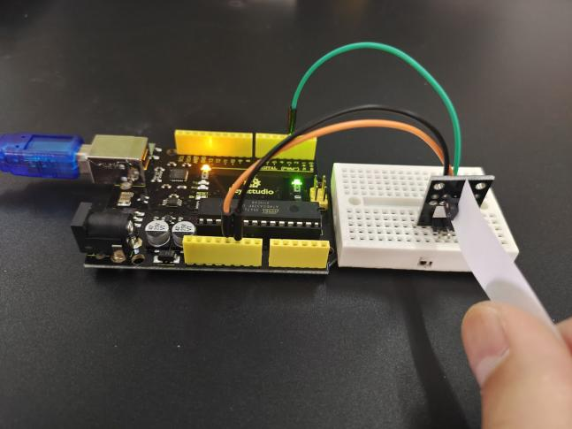

**MEGA 2560:**

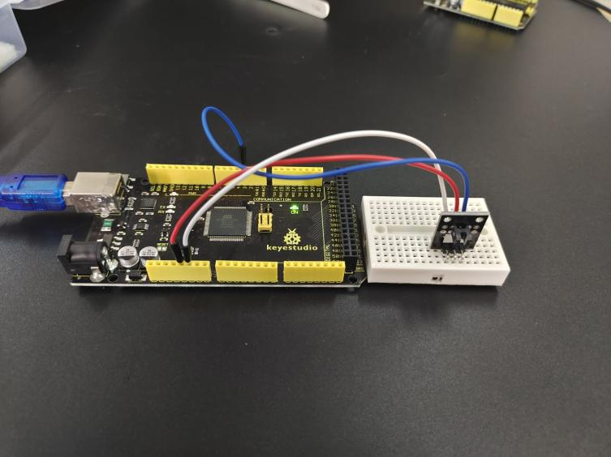

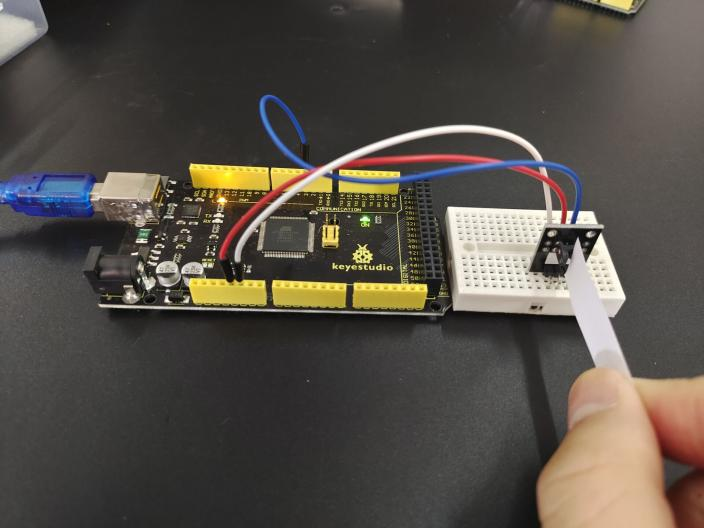