### Progetto 15: Sensore di tracciamento linea
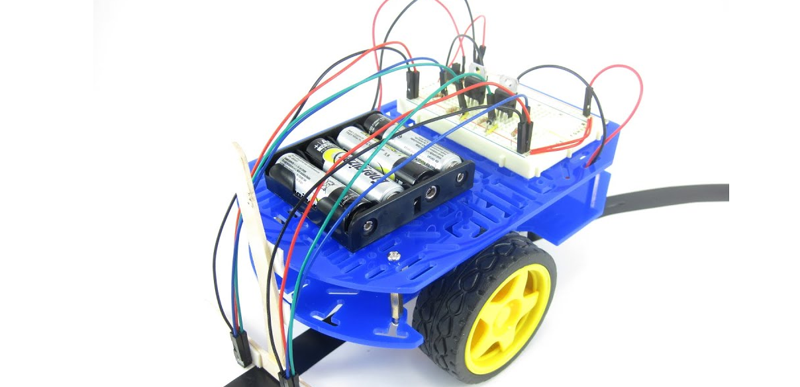

**Descrizione**

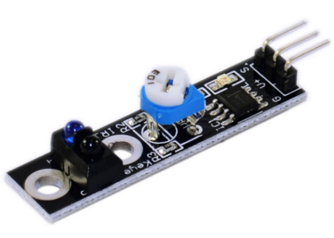 Questo sensore di tracciamento linea può rilevare linee bianche su sfondo nero o linee nere su sfondo bianco. Il segnale di tracciamento linea singolo fornisce un segnale di uscita TTL stabile per una linea più precisa e stabile. L'opzione multicanale può essere facilmente ottenuta installando i sensori robot di tracciamento linea richiesti.

| Tensione operativa          | 3.3V ~ 5V    |
|-----------------------------|--------------|
| Corrente operativa          | <10mA       |
| Intervallo di temperatura operativa | 0°C ~ + 50°C |
| Livello di uscita           | Livello TTL  |

**Specifiche**

**Come funziona?**

Il modulo KY-033 rileva se la superficie davanti al trasmettitore/ricevitore IR assorbe o riflette la luce. Una superficie scura assorbe la luce mentre una superficie chiara riflette la luce. Se la superficie è scura, il pin di segnale del modulo verrà tirato a HIGH. E se la superficie è chiara, il pin di segnale sarà LOW.

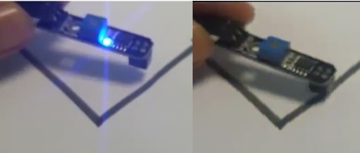

Pinout

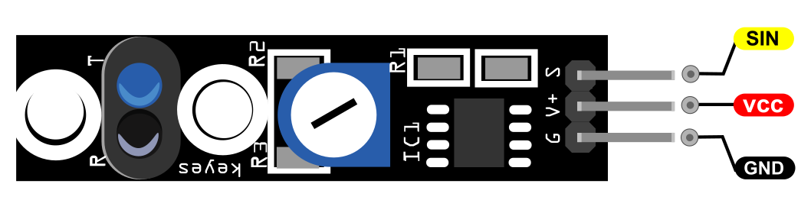

SIN è il pin di segnale del sensore di tracciamento linea che colleghiamo all'Arduino.

VCC dovrebbe essere collegato all'alimentazione +5V di Arduino.

GND dovrebbe essere collegato alla massa di Arduino.

**Schema di collegamento**

Collegare la linea GND del modulo (il pin più a sinistra) a GND sull'Arduino e + (il secondo pin) a 5V.

Collegare il segnale (out) al pin 3 sull'Arduino.

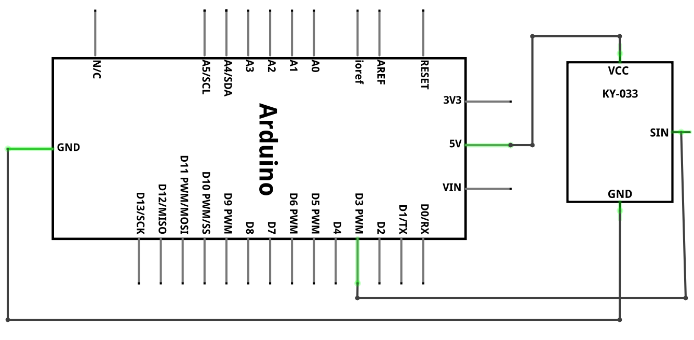

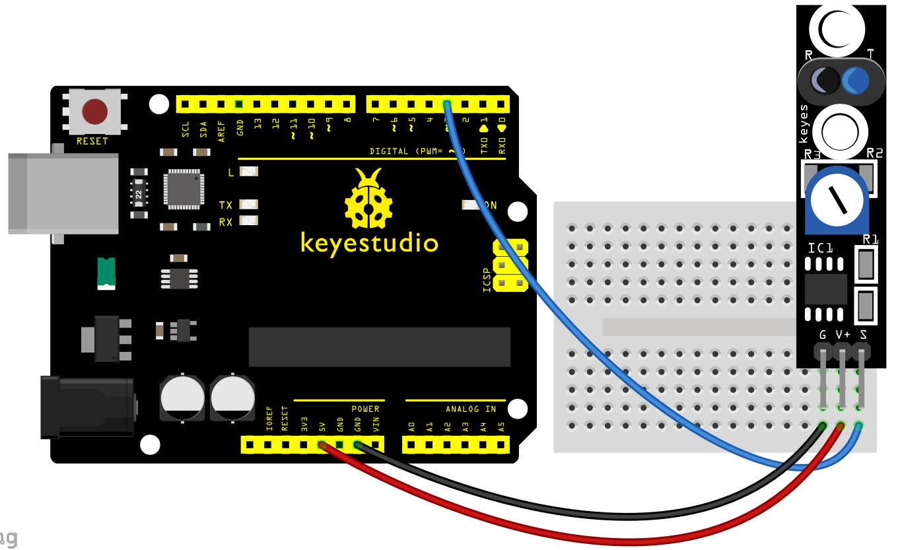

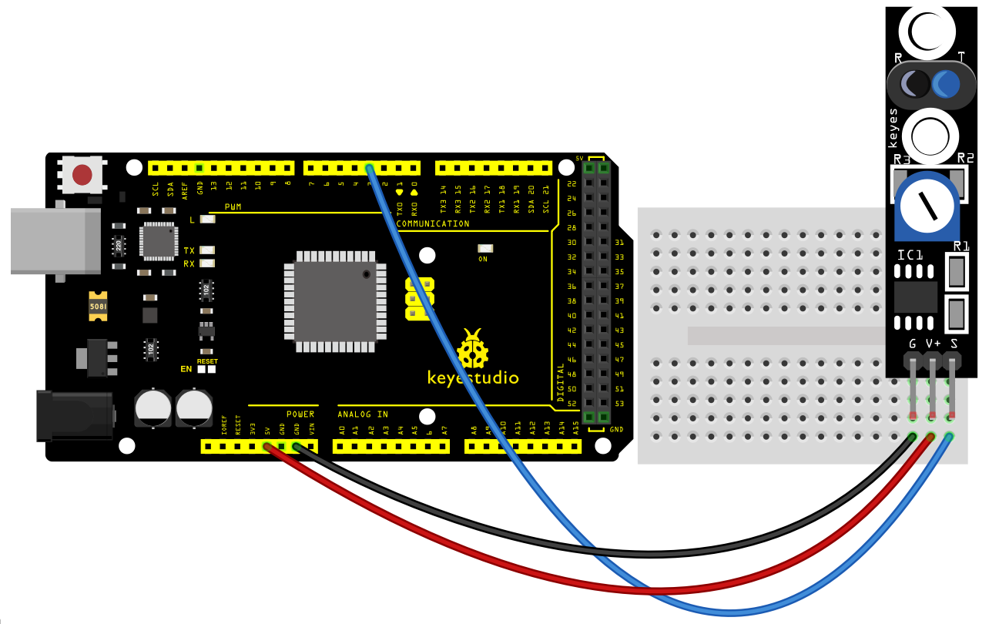

**Codice di esempio**

> **Codice di esempio (Arduino Editor):** [Open in Arduino Cloud Editor](https://create.arduino.cc/editor/keyestudio/cde2ccf9-b21e-48ba-9cf2-93666c9c4132/preview?embed)

**Risultato di esempio**

Dopo aver caricato il codice sulla scheda, aprire il monitor seriale e impostare la velocità di trasmissione a 9600, quindi sarà possibile visualizzare i dati dal sensore.

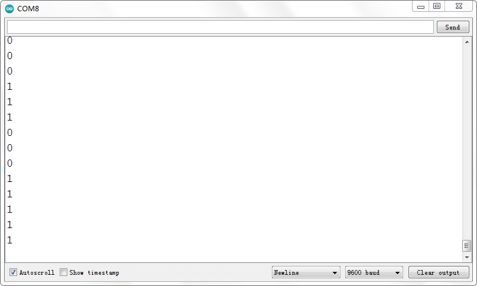

**UNO:**

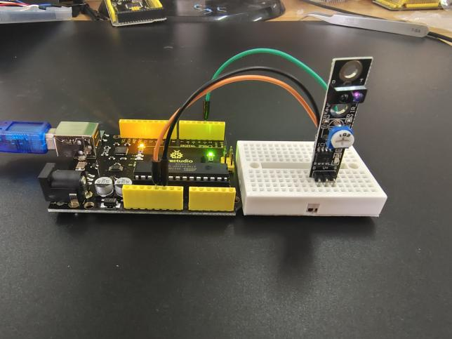

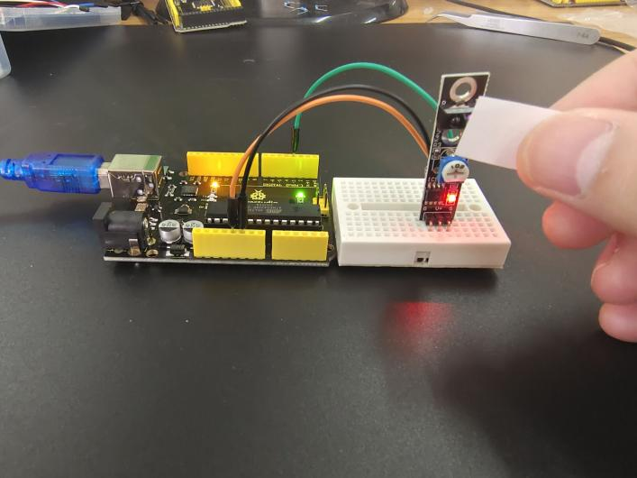

**MEGA 2560:**

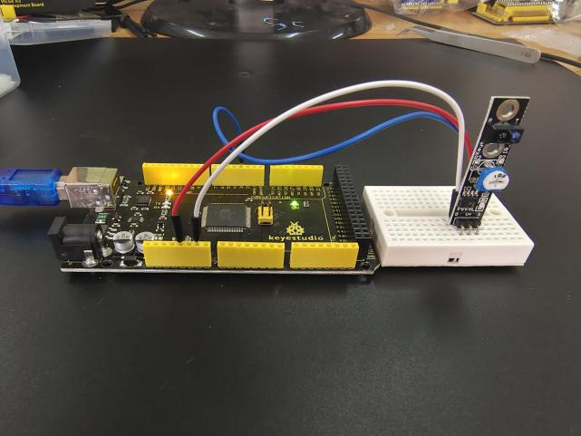

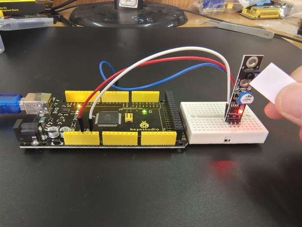