### Project 16: Infrared Obstacle Avoidance Sensor
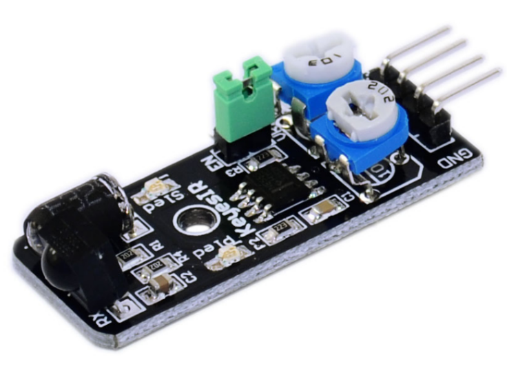

**Description**

KY-032 Obstacle Avoidance Sensor moduleは車輪型ロボット向けの距離調整可能な赤外線近接センサーです。

センサーの検出距離は2cmから40cmで、ポテンショメータのノブを回すことで調整できます。動作電圧は3.3V–5Vのため、Arduino、ESP32、Teensy、ESP8266、Raspberry Piなどさまざまなマイコンで使用できます。

周囲光への適応性が高く、周囲環境の変化を比較的正確に検知します。

**Specification**

| Working voltage     | 3.3V – 5V DC                                                    |
|---------------------|-----------------------------------------------------------------|
| Working current     | ≥ 20mA                                                          |
| Working temperature | -10°C – 50°C \[14°F – 122°F\]                                   |
| Detection distance  | 2cm – 40cm \[0.79in – 15.75in\]                                 |
| IO interface        | 4-wire interface (-/+/S/EN)                                     |
| Output signal       | TTL level (low level if obstacle detected, high if no obstacle) |
| Adjustment method   | multi-turn resistance adjustment                                |
| IR pulse frequency  | 38kHz according to HS0038DB datasheet                           |
| Effective angle     | 35°                                                             |
| Board Size          | 1.6cm x 4cm \[0.62in x 1.57in\]                                 |
| Weight              | 9g                                                              |

**How Does It Work?**

モジュールは主に555 Timer ICとVR1によって生成される38KHzの方形波を出力します。

この38KHzパルスはIR LEDのオン/オフを切り替えるために使用されます。IR LEDの前に物体があると、赤外パルスが反射され、その一部がIR受信機（HS0038BD）によって検出されます。

これによりモジュールは障害物があることを検知し、信号ピンSをLOWに引き下げます。障害物がない場合はピンSはHIGHになります。VR2は障害物検出距離を調整するために使用されます。モジュールの検出範囲は2〜40cmです。

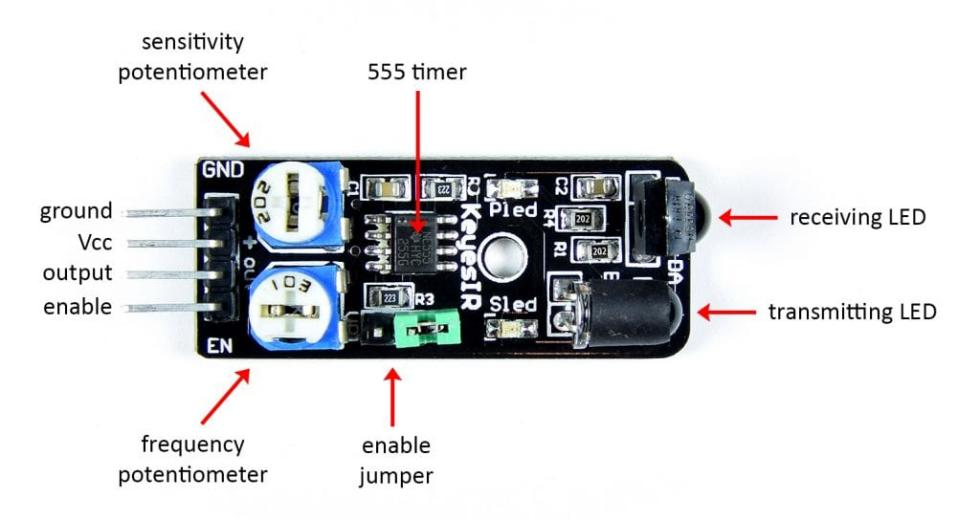

ENピンとENジャンパはモジュールの検出を制御するために用意されています。ENにジャンパを入れるとモジュールは常に有効になります。

モジュールの有効/無効を制御したい場合はジャンパを外し、ENピンをHIGHに接続して有効、LOWに接続して無効にしてください。

Pinout

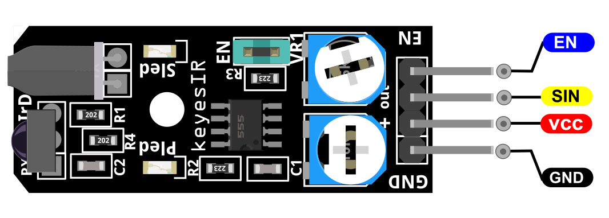

SINはArduinoに接続する障害物回避センサーの信号ピンです。

VCCはArduinoの+5V電源に接続してください。

GNDはArduinoのグラウンドに接続してください。

ENは障害物回避センサーを有効にします。

**Connection Diagram**

モジュールのGNDライン（最も左のピン）をArduinoのGNDに、+（2番目のピン）を5Vに接続します。signal (out)をArduinoのpin 3に接続します。

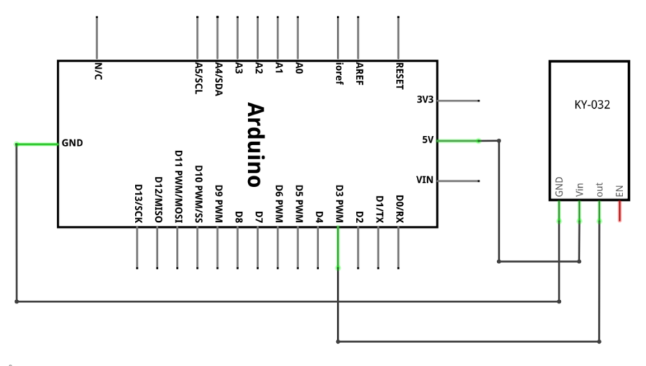

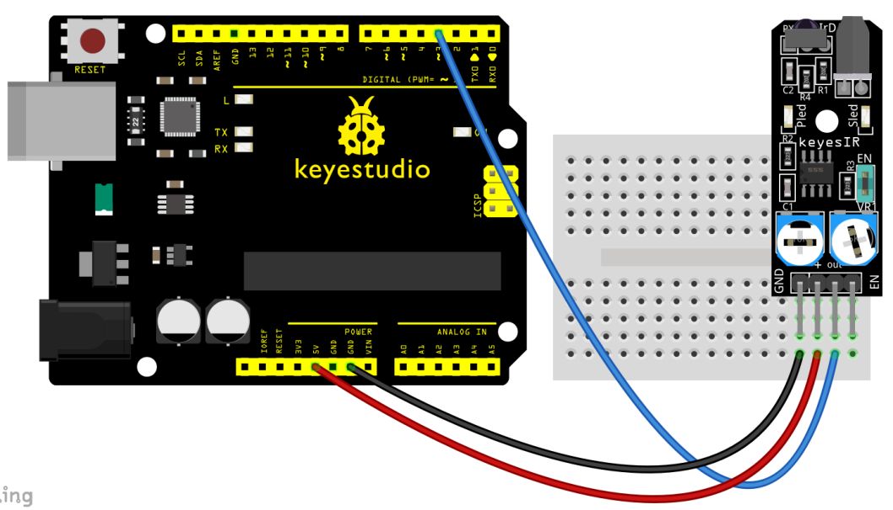

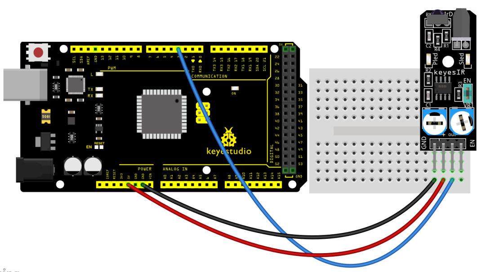

**Sample Code**


> **Sample Code (Arduino Editor):** [Open in Arduino Cloud Editor](https://create.arduino.cc/editor/keyestudio/c07c4c88-f359-48ed-baf7-fda042f78230/preview?embed)


**Example Result**

コードをボードにアップロードすると、PLUSボードと障害物検知センサーの両方のledが点灯しているのが見えます。

センサーの前にフォームブロックを置くと、今回センサーが障害物を検知したときにセンサー上のsledが点灯します。

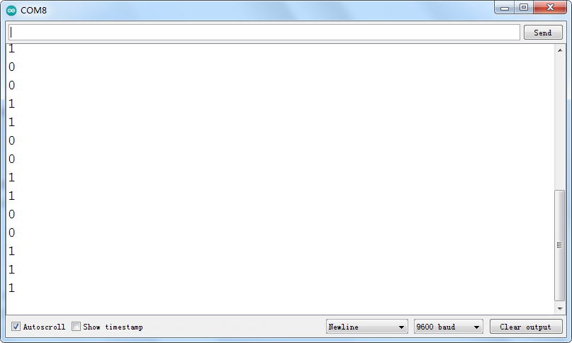

**UNO:**

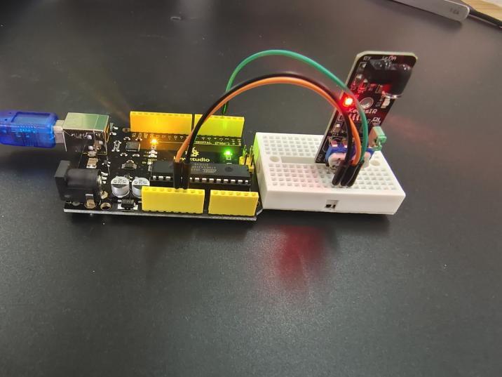

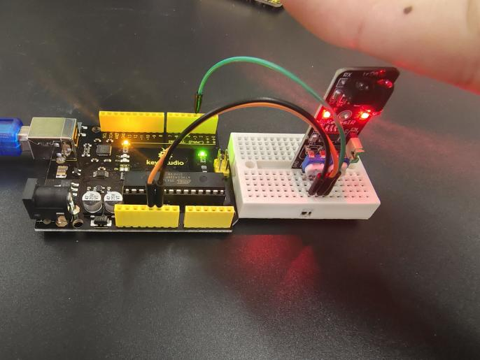

**MEGA 2560:**

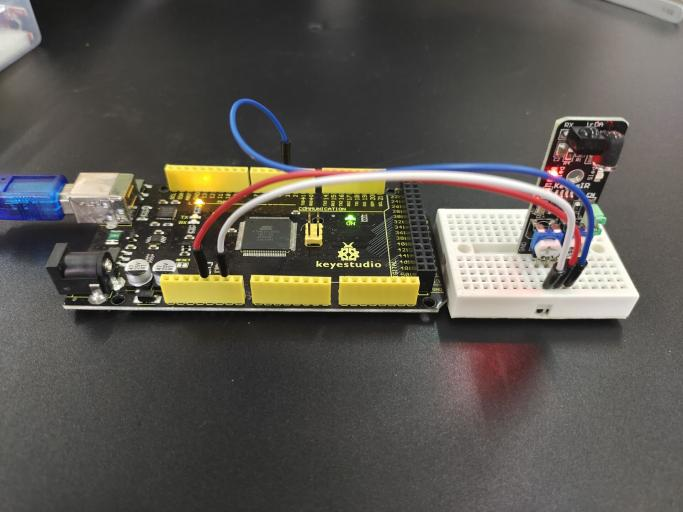

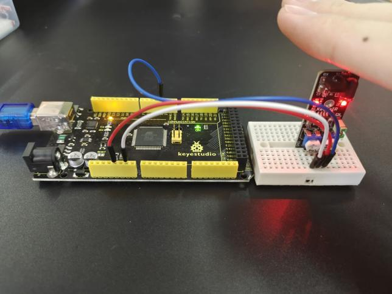

```