### プロジェクト17: Photocell Sensor
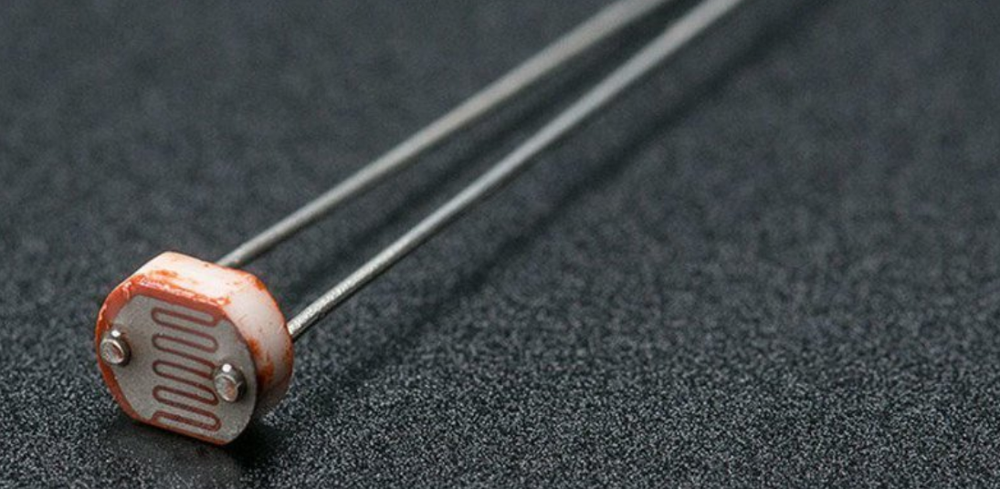

**説明**

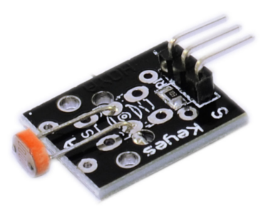フォトセル（光電池）は私たちの日常生活でよく見られ、主にインテリジェントスイッチや一般的な電子設計で使用されています。これをより簡単かつ効果的にするために、対応するモジュールを提供しています。

フォトセルは半導体です。高感度、高速応答、スペクトル特性、R値の一貫性といった特徴を持ち、高温や高湿などの過酷な環境でも高い安定性と信頼性を維持します。

カメラ、ガーデンソーラーライト、芝生ランプ、紙幣検出器、クォーツ時計、ミュージックカップ、ギフトボックス、ミニナイトライト、音と光の制御スイッチなど、自動制御スイッチの分野で広く使用されています。

Photocell センサーは、Arduino、ESP32などの多くの人気のあるマイクロコントローラーと互換性があります。

**仕様**

| 動作電圧 | 3.3V ~ 5V |
|----------|-----------|
| 出力タイプ | Analog    |

**動作原理**

あらゆる金属における電流の流れは電子によって引き起こされ、材料はそこを流れる電子の数によって絶縁体、導体、半導体に分類されます。

これらは、価電子帯と伝導帯の間のエネルギーギャップ（バンドギャップ）に応じて分類されます。

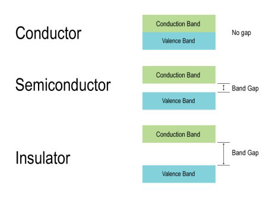

上記のように、[photoresistor](https://microdaz.com/product/ky-018-photo-resistor-module/)は、伝導に利用できる電子が少ないため、高抵抗の半導体で構成されています。フォトレジスタの上部にあるジグザグのパターンは、半導体の硫化カドミウムです。必要な抵抗と定格電力を得るために、このように堆積されています。

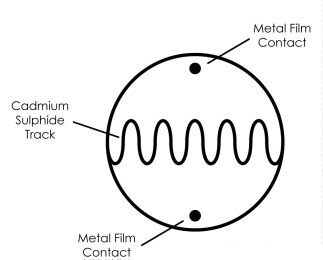

光が[photoresistor](https://microdaz.com/product/ky-018-photo-resistor-module/)に当たると、価電子帯の電子（価電子）は、原子との結合を壊して伝導帯にジャンプするのに十分なエネルギーを吸収します。

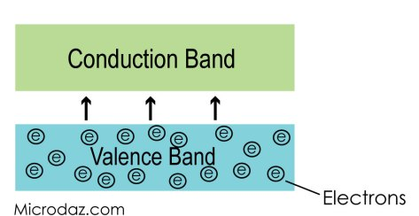

この電子の移動プロセスにより、[photoresistor](https://microdaz.com/product/ky-018-photo-resistor-module/)に電流が流れ、伝導帯に移動する電子が増えるにつれて電流が増加し、その結果、フォトレジスタの抵抗が減少します。

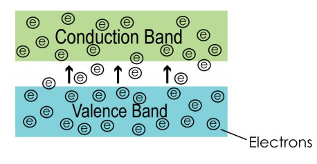

ピン配置

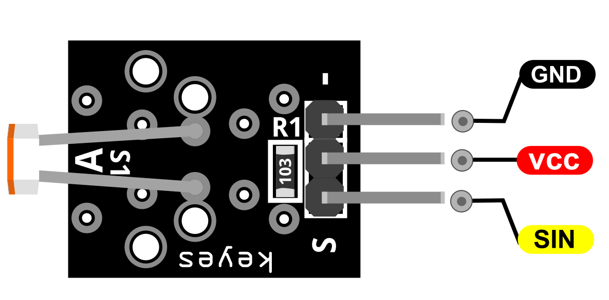

SINは、Arduinoに接続する Photocell センサーの信号ピンです。

VCCは、Arduinoの+5V電源に接続する必要があります。

GNDは、Arduinoのグラウンドに接続する必要があります。

**接続図**

電源ライン（中央）とグラウンド（-）をそれぞれ+5VとGNDに接続します。信号（S）をArduinoのピンA2に接続します。

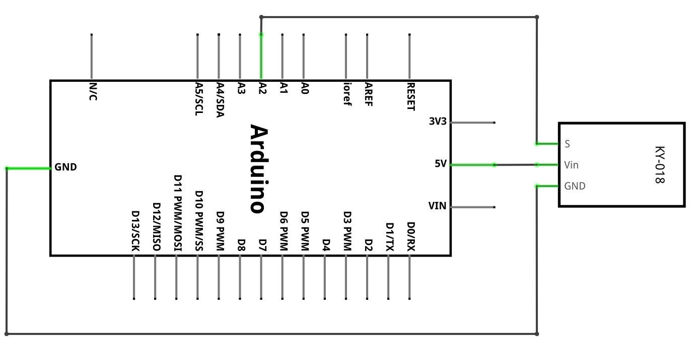

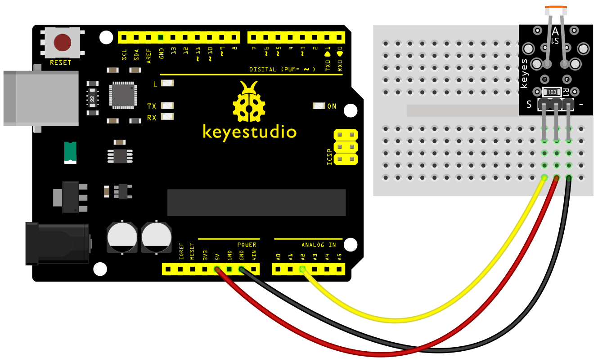

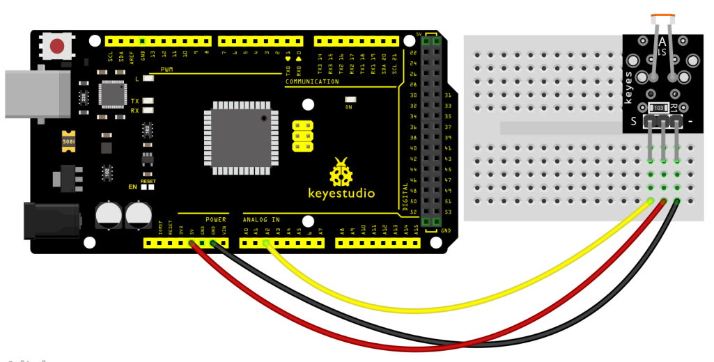

**サンプルコード**

> **サンプルコード (Arduino Editor):** [Arduino Cloud Editorで開く](https://create.arduino.cc/editor/keyestudio/4e02d2b7-4f24-4d7f-b97a-da8653114946/preview?embed)

**実行結果**

配線を完了して電源を入れ、コードを正常にアップロードした後、シリアルモニタを開きます。センサー上のフォトセルを手で覆うと、アナログ値が減少するのがわかります。

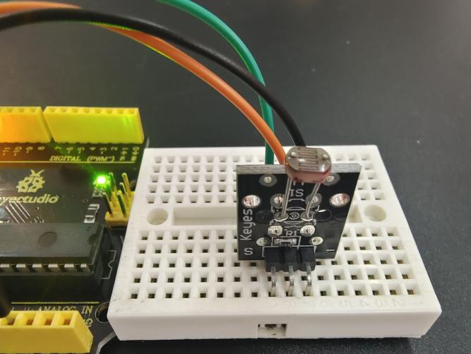

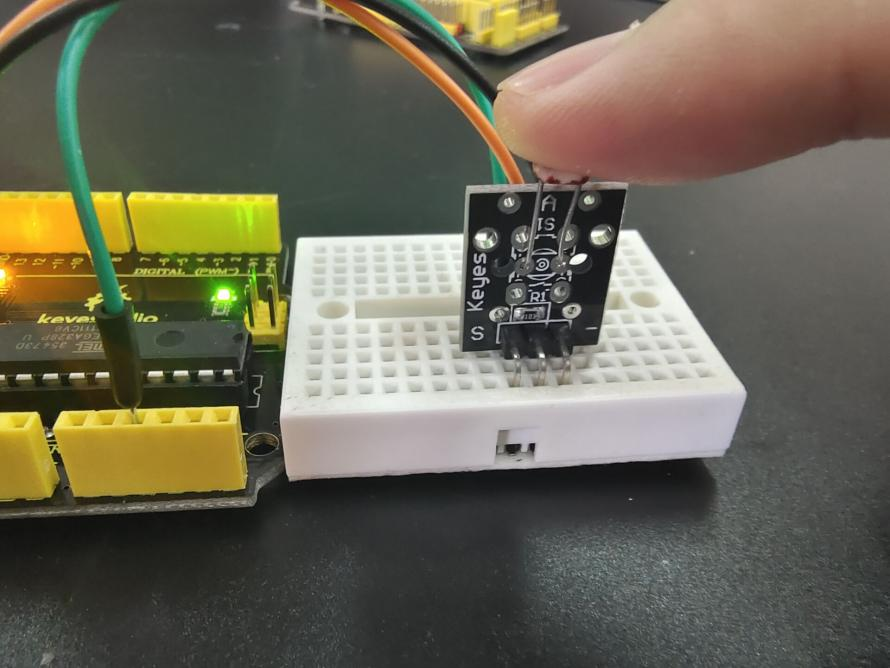

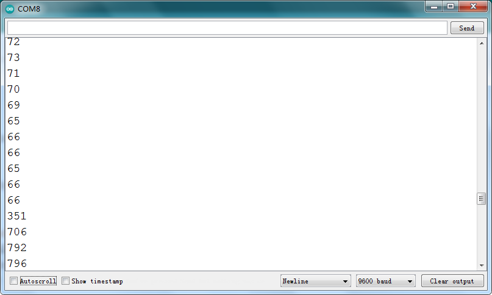