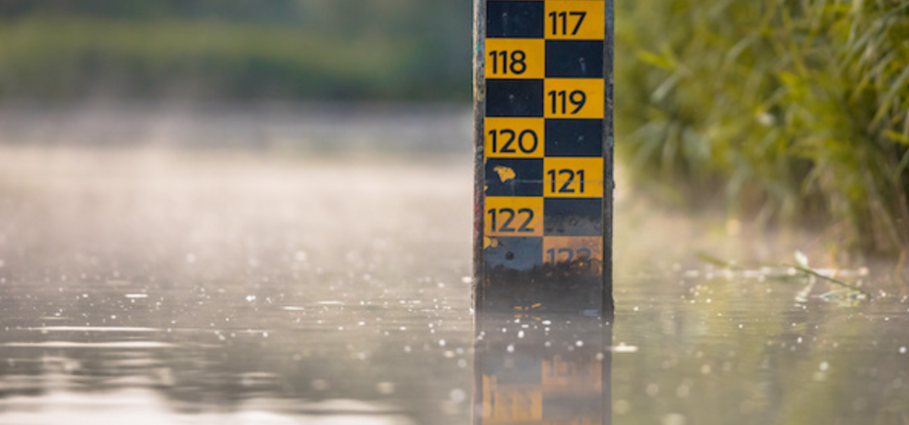
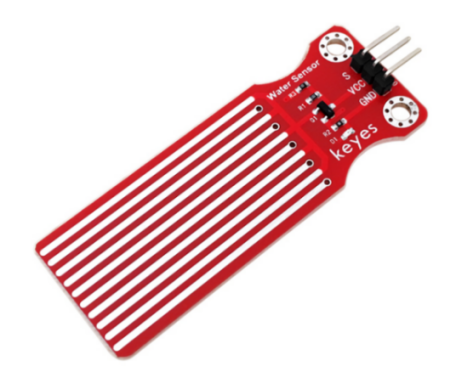
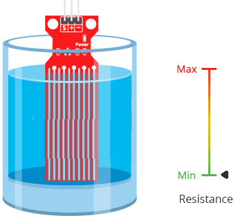
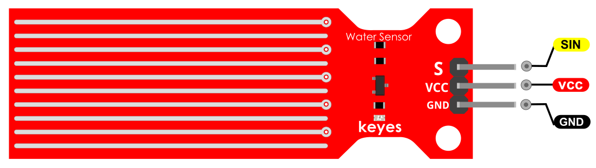
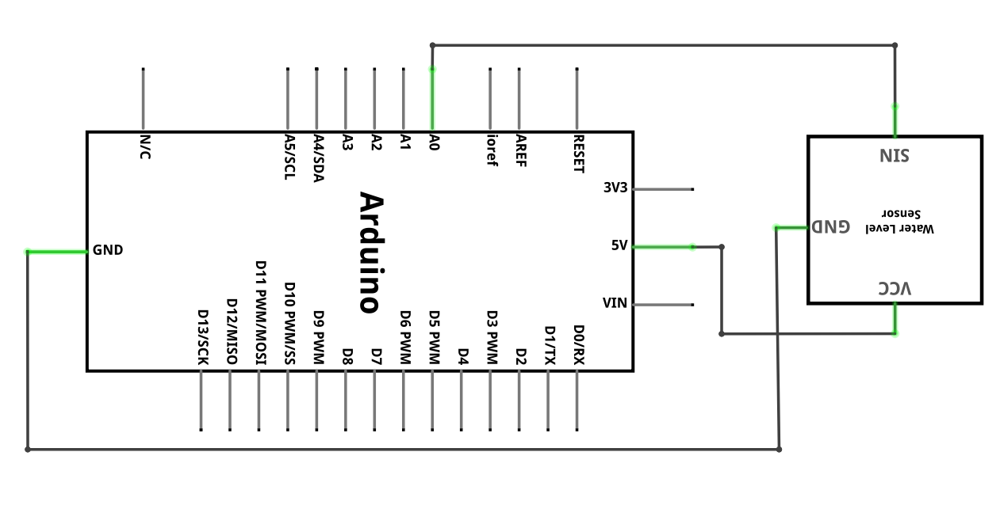
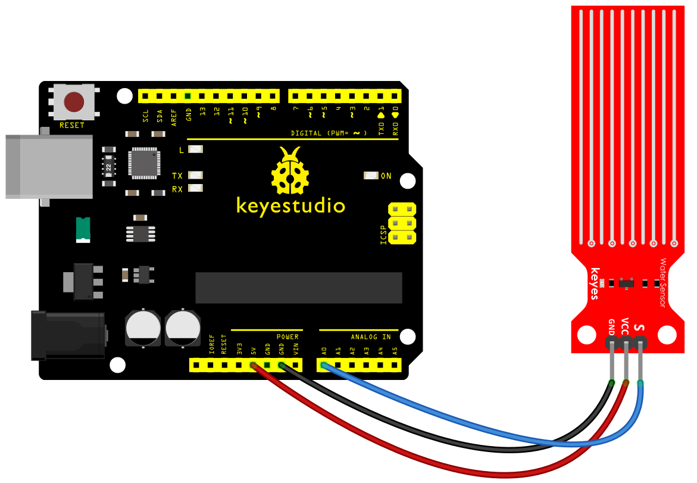
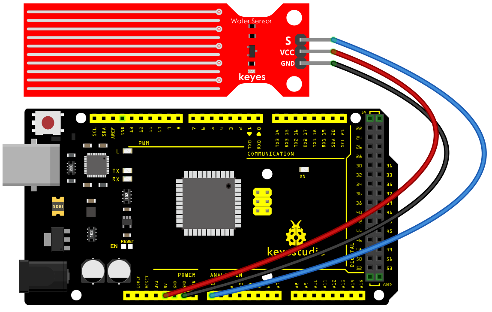
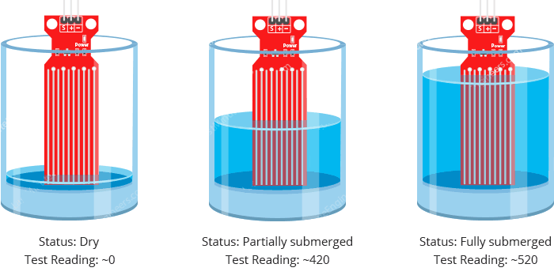
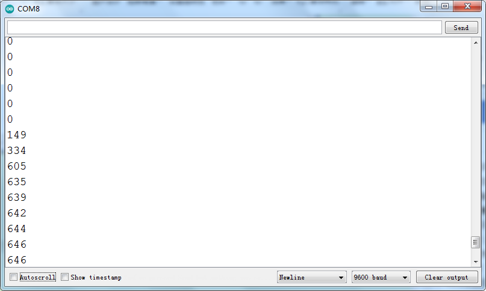

### Proyecto 18: Sensor de nivel de agua

**Descripción**

 El sensor de nivel de agua es fácil de usar, portátil y rentable, diseñado para identificar y detectar el nivel de agua y las gotas de agua.

Este pequeño sensor puede medir el volumen de una gota de agua o la cantidad de agua a través de una matriz de trazas de cables paralelos expuestos.

**Características**

- Conversión suave entre la cantidad de agua y la cantidad analógica;
- Gran flexibilidad, emitiendo valores analógicos básicos;
- Bajo consumo de energía y alta sensibilidad;
- Se conecta directamente a un microprocesador u otros circuitos lógicos, adecuado para una variedad de placas de desarrollo y controladores como el controlador Arduino, el microordenador de un solo chip STC, el microordenador de un solo chip AVR y más.

**Especificaciones**

| Voltaje de funcionamiento | DC5V                         |
|---------------------------|------------------------------|
| Corriente de funcionamiento| ﹤20mA                       |
| Tipo de sensor            | Analógico                    |
| Área de detección         | 40mm x 16mm                  |
| Proceso de producción     | FR4 estañado de doble cara   |
| Diseño de forma           | Hueco semilunar antideslizante|
| Humedad de trabajo        | 10%-90% sin condensación     |
| Temperatura de trabajo    | 10℃-30℃                      |

**¿Cómo funciona?**

El funcionamiento del sensor de nivel de agua es bastante sencillo.

La serie de conductores paralelos expuestos actúa en conjunto como una **resistencia variable** (al igual que un potenciómetro) cuya resistencia varía según el nivel del agua.

El cambio en la resistencia corresponde a la distancia desde la parte superior del sensor hasta la superficie del agua.

La resistencia es inversamente proporcional a la altura del agua:

Cuanta más agua sumerja el sensor, mejor será la conductividad, lo que resultará en una menor resistencia.

Cuanta menos agua sumerja el sensor, peor será la conductividad, lo que

resultará en una mayor resistencia.

El sensor produce un voltaje de salida de acuerdo con la resistencia, que al medir podemos determinar el nivel del agua.

Distribución de pines

SIN es el pin de señal del sensor de nivel de agua que conectamos al Arduino.

VCC debe conectarse a la alimentación de +5V de Arduino.

GND debe conectarse a la tierra de Arduino.

**Diagrama de conexión**

**Código de muestra**

> **Código de muestra (Arduino Editor):** [Abrir en Arduino Cloud Editor](https://create.arduino.cc/editor/keyestudio/b910e95a-f8c4-4811-8418-28f518c4f0b9/preview?embed)

**Resultado de ejemplo**

Por ejemplo, utilizando el mismo circuito anterior, verá valores cercanos a los siguientes en el monitor serie cuando el sensor esté seco (0), cuando esté parcialmente sumergido en el agua (~420) y cuando esté completamente sumergido (~520).

Además, puede establecer un valor de alarma y conectar un zumbador para hacer una alarma.

El LED no puede encenderse cuando el nivel del agua no ha alcanzado el valor de alarma. Si el nivel del agua alcanza el valor de alarma, el LED se encenderá y el zumbador sonará para hacer una alarma.

