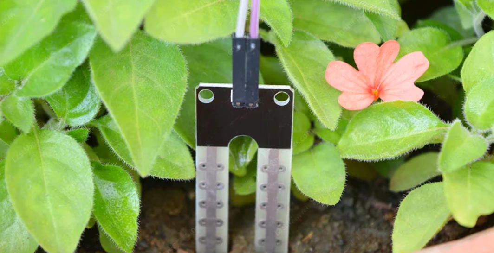
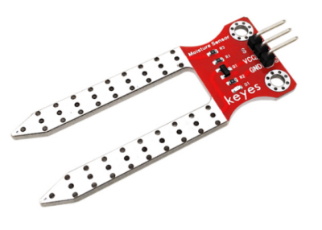
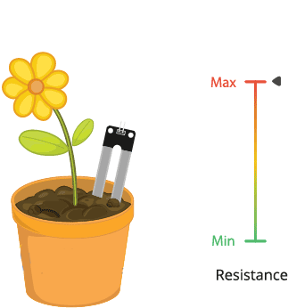
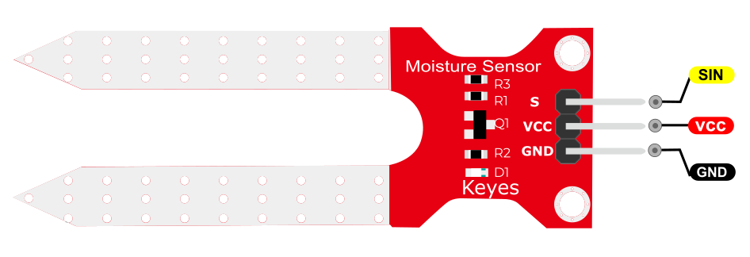
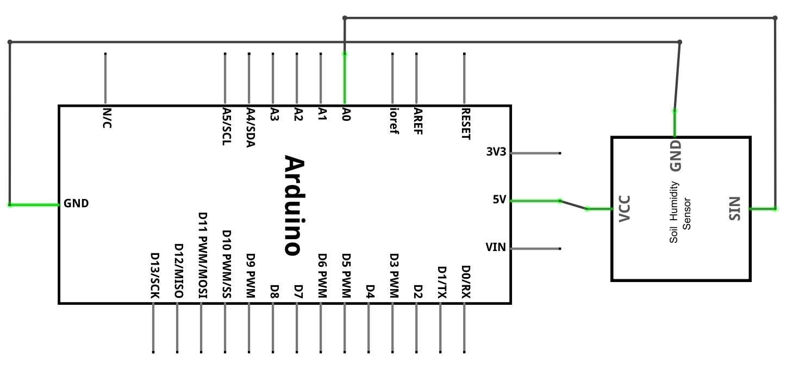
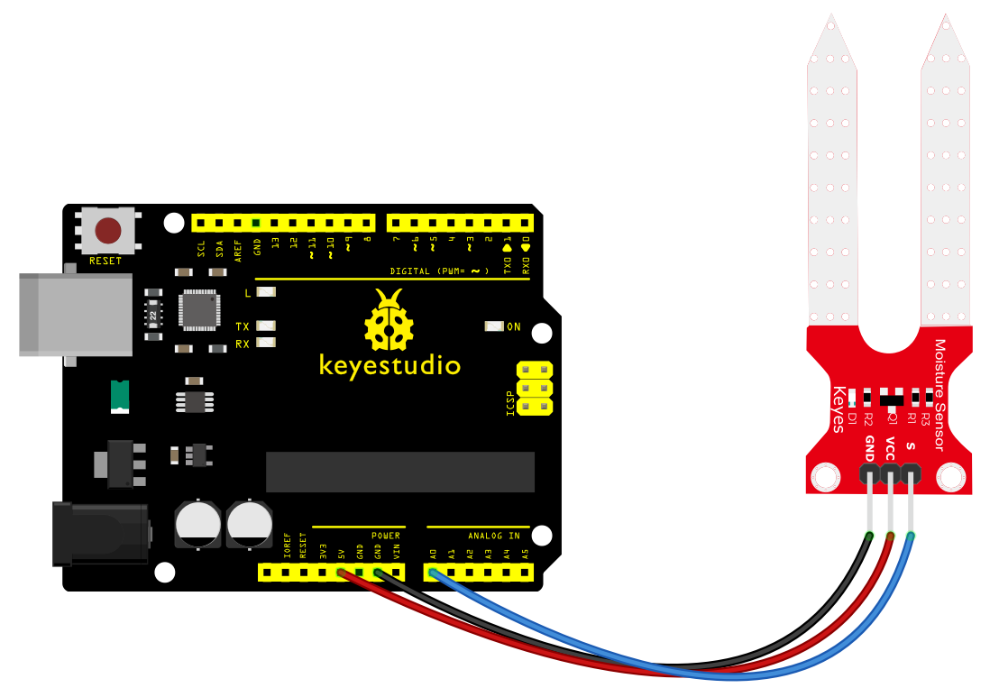
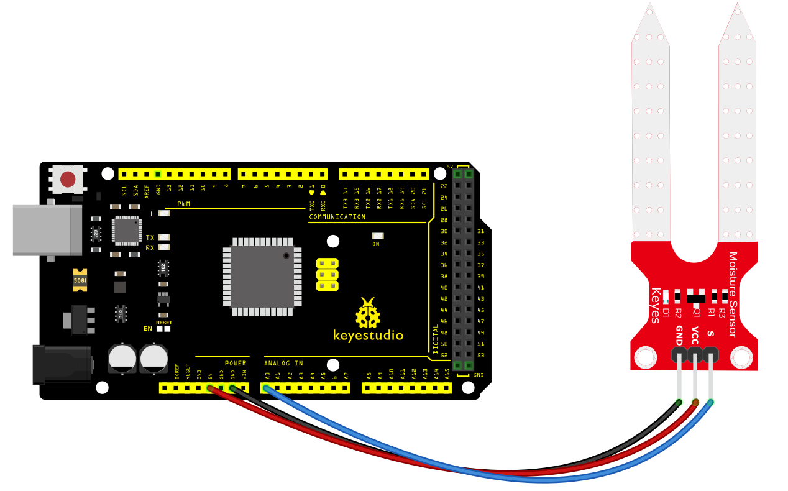
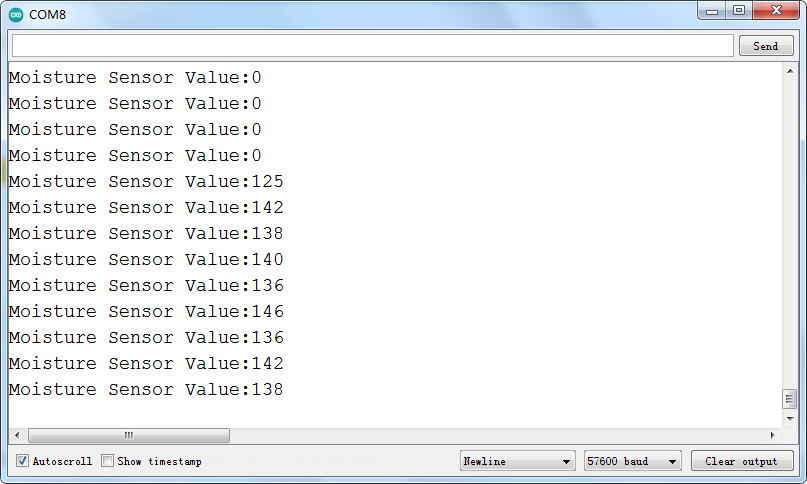

### Projekt 19: Bodenfeuchtigkeitssensor

**Beschreibung**

 Dies ist ein einfacher Bodenfeuchtigkeitssensor, der die Bodenfeuchtigkeit erfassen soll. Wenn dem Boden Wasser fehlt, nimmt der analoge Ausgangswert des Sensors ab; andernfalls nimmt er zu.

Wenn Sie diesen Sensor verwenden, um ein automatisches Bewässerungsgerät zu bauen, kann er erkennen, ob Ihre Pflanzen durstig sind, und so verhindern, dass sie verwelken, wenn Sie unterwegs sind.

Die Kombination dieses Sensors mit einem Arduino Controller kann Ihre Pflanzen komfortabler und Ihren Garten intelligenter machen.

Das Bodenfeuchtigkeitssensormodul ist nicht so kompliziert, wie Sie vielleicht denken, daher ist es die beste Wahl, wenn Sie die Bodenfeuchtigkeit in Ihrem Projekt erfassen müssen.

Der Sensor ist mit zwei Sonden ausgestattet, die in den Boden eingeführt werden. Wenn Strom durch den Boden fließt, ermittelt der Sensor den Widerstandswert, indem er die Stromänderungen zwischen den beiden Sonden liest, und wandelt diesen Widerstandswert dann in den Feuchtigkeitsgehalt um.

Je höher die Feuchtigkeit (weniger Widerstand), desto höher ist die Leitfähigkeit des Bodens.

Die Oberfläche des Sensors wurde metallisiert, um seine lange Lebensdauer zu verlängern. Stecken Sie ihn in den Boden und verwenden Sie dann den AD-Wandler, um ihn auszulesen. Mit Hilfe dieses Sensors kann die Pflanze Sie daran erinnern: Ich brauche Wasser.

**Spezifikation**

1.  Stromversorgungsspannung: 3.3V oder 5V
2.  Arbeitsstrom: ≤ 20mA
3.  Ausgangsspannung: 0-2.3V (Wenn der Sensor vollständig in Wasser getaucht ist, beträgt die Spannung 2.3V)
4.  Je höher die Feuchtigkeit, desto höher die Ausgangsspannung.
5.  Sensortyp: Analogausgang
6.  Schnittstelle: Pin1- signal, Pin2- GND, Pin3 - VCC

**Wie funktioniert es?**

Die Funktionsweise des Bodenfeuchtigkeitssensors ist ziemlich einfach.

Die gabelförmige Sonde mit zwei freiliegenden Leitern fungiert als **variabler Widerstand** (ähnlich einem Potentiometer), dessen Widerstand sich je nach Wassergehalt im Boden ändert.

Dieser Widerstand ist umgekehrt proportional zur Bodenfeuchtigkeit:

Mehr Wasser im Boden bedeutet eine bessere Leitfähigkeit und führt zu einem geringeren Widerstand.

Weniger Wasser im Boden bedeutet eine schlechte Leitfähigkeit und führt zu einem höheren Widerstand.

Der Sensor erzeugt eine Ausgangsspannung entsprechend dem Widerstand, die wir durch Messung zur Bestimmung des Feuchtigkeitsgehalts verwenden können.

**Pinbelegung**

SIN ist der Signalpin des Bodenfeuchtigkeitssensors, den wir mit dem Arduino verbinden.

VCC sollte mit der +5V Stromversorgung des Arduino verbunden werden.

GND sollte mit der Masse des Arduino verbunden werden.

**Verbindungsschema**

Verbinden Sie den S-Pin des Moduls mit Analog A0 des PLUS-Boards, verbinden Sie den negativen Pin mit dem GND-Port und den positiven Pin mit dem 5V-Port.

**Beispielcode**

> **Beispielcode (Arduino Editor):** [Open in Arduino Cloud Editor](https://create.arduino.cc/editor/keyestudio/19b81dc5-2e2e-4415-b095-45a38c5aad49/preview?embed)

**Beispielergebnis**

Nach dem Verdrahten und Einschalten laden Sie den Code hoch. Öffnen Sie dann den seriellen Monitor und stellen Sie die Baudrate auf 57600 ein; Sie werden den Wert sehen. Wenn der Sensor die Feuchtigkeit erkennt, ändert sich der Wert entsprechend, wie unten gezeigt.

