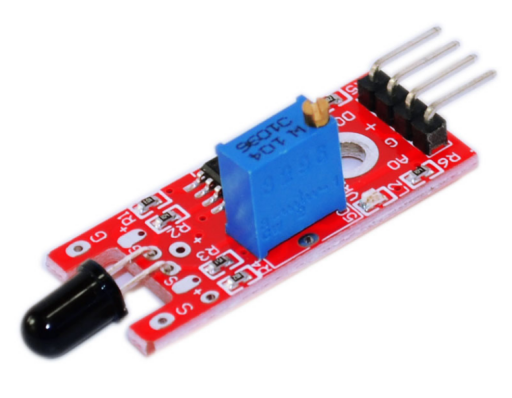
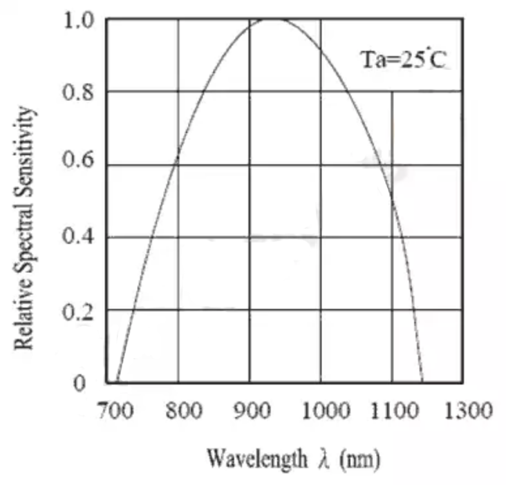
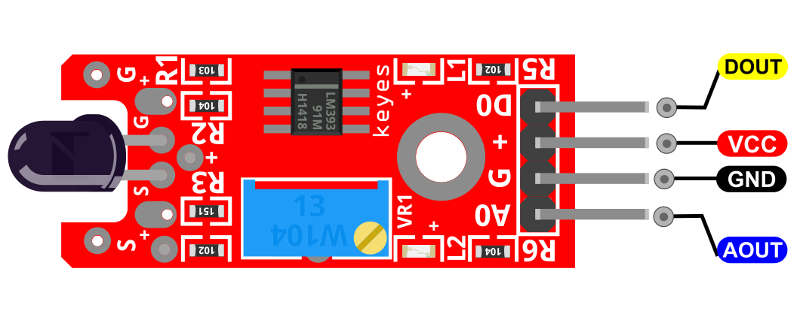
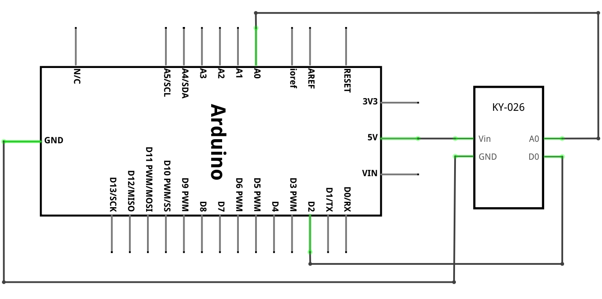
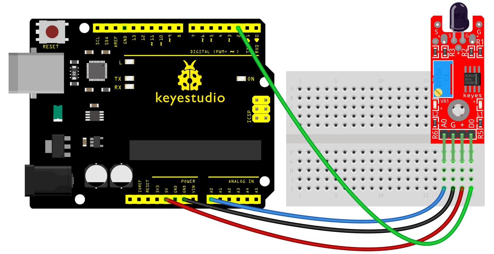
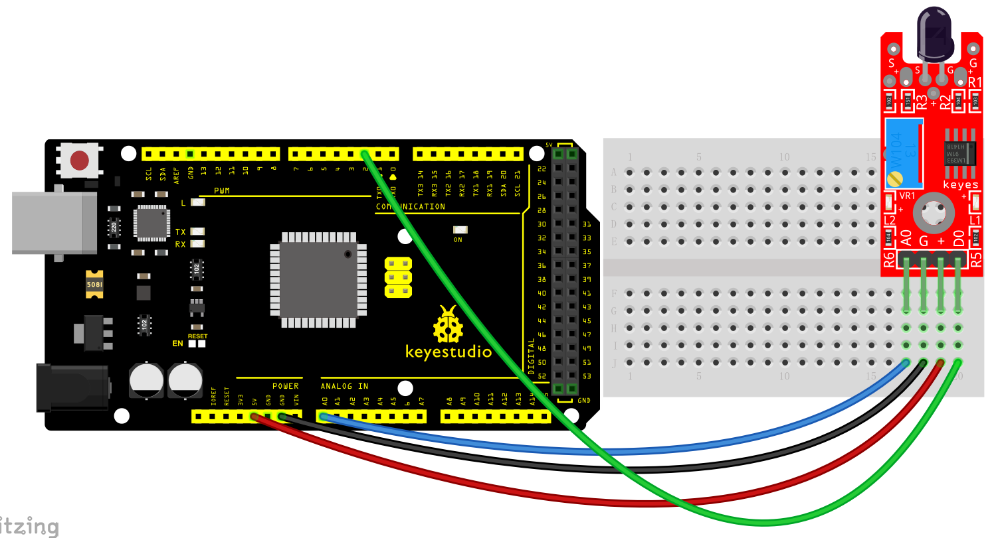
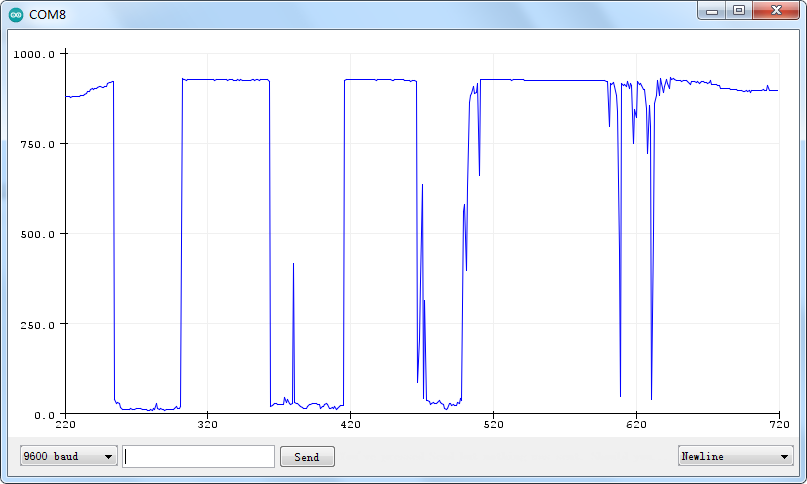

### Projekt 20: Flammensensor

**Beschreibung**

 Das KY-026 Flammensensormodul erkennt Infrarotlicht, das von Feuer ausgestrahlt wird. Dieses Modul verfügt sowohl über digitale als auch analoge Ausgänge und ein Potentiometer zur Einstellung der Empfindlichkeit. Es wird häufig in Brandmeldesystemen eingesetzt. Kompatibel mit Arduino, Raspberry Pi, ESP32 und anderen Mikrocontrollern.

Dieser Flammensensor kann verwendet werden, um Feuer oder andere Lichter mit einer Wellenlänge von 760 nm ~ 1100 nm zu erkennen.

Im Feuerlöschroboter-Spiel spielt die Flamme eine wichtige Rolle bei der Sondierung, die als Augen des Roboters zur Lokalisierung der Brandquelle dienen kann.

**Spezifikation**

| Betriebsspannung              | 3.3V ~ 5.5V                     |
|-------------------------------|---------------------------------|
| Infrarot-Wellenlängenerkennung | 760nm ~ 1100nm                  |
| Sensor-Erfassungswinkel       | 60°                             |
| Platinenabmessungen           | 1.5cm x 3.6cm \[0.6in x 1.4in\] |

**Wie funktioniert es?**

Diese Art von Infrarot-Flammensensoren ist üblicherweise mit einer Standardmessung unter Verwendung eines LM393-Komparators ausgestattet, der es ermöglicht, die Messwerte **sowohl an analogen als auch an digitalen Ausgängen** zu erhalten, wenn ein bestimmter Schwellenwert überschritten wird, der über ein auf der Platine befindliches Potentiometer reguliert wird.

Wie wir sehen können, ist die Wellenlänge dieser billigen und kleinen Flammensensoren im Vergleich zu industriellen Sensoren nicht sehr leistungsfähig. Diese können sogar durch Innenbeleuchtung beeinflusst werden, was zu zahlreichen Fehlalarmen führen kann.

Daher sind die Empfindlichkeit und Zuverlässigkeit dieser billigen Flammensensoren **nicht ausreichend, um sie als echtes Sicherheitsgerät zu betrachten**, obwohl sie in kleinen Elektronikprojekten und für Bildungszwecke interessant sein können, wie z.B. das Auslösen eines Alarms oder das Aktivieren einer LED beim Erkennen der Flamme eines Feuerzeugs.

Pinbelegung

DOUT ist der digitale Pin des Flammensensors, den wir mit dem Arduino verbinden.

AOUT ist der analoge Pin des Flammensensors, den wir mit dem Arduino verbinden.

VCC sollte mit der +5V-Stromversorgung des Arduino verbunden werden.

GND sollte mit der Masse des Arduino verbunden werden.

**Schaltplan**

Verbinden Sie den analogen Ausgang (A) der Platine mit Pin A0 am Arduino und den digitalen Ausgang (D) mit Pin 2. Verbinden Sie die Stromleitung (+) und Masse (G) mit 5V bzw. GND.

**Beispielcode**

> **Beispielcode (Arduino Editor):** [Im Arduino Cloud Editor öffnen](https://create.arduino.cc/editor/keyestudio/94241617-5076-48ab-9dc1-7acd92fbb89e/preview?embed)

**Beispielergebnis**

Verwenden Sie **Tools** > **Serial Plotter** in der Arduino IDE, um die Werte an der analogen Schnittstelle zu visualisieren. In diesem Beispiel haben wir ein Feuerzeug verwendet, um alle paar Sekunden eine kleine Flamme zu erzeugen. Sie können sehen, wie die Werte abnehmen, wenn die Flamme näher an den Sensor kommt, und dann zunehmen, wenn die Flamme sich vom Sensor entfernt.

