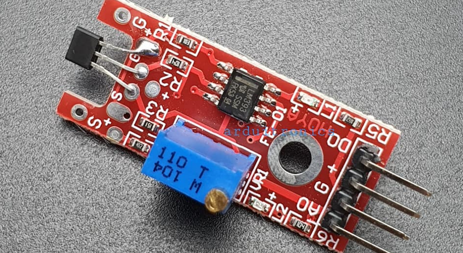
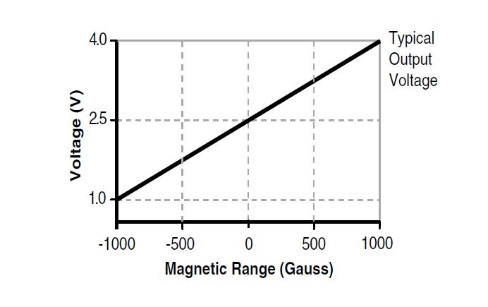
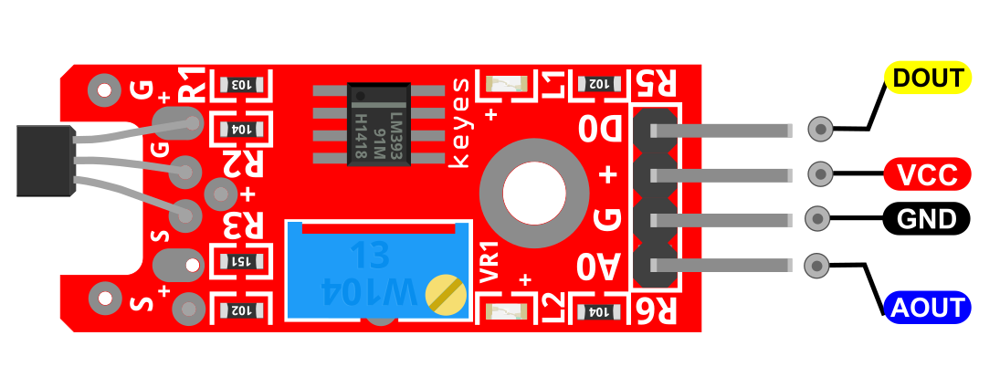
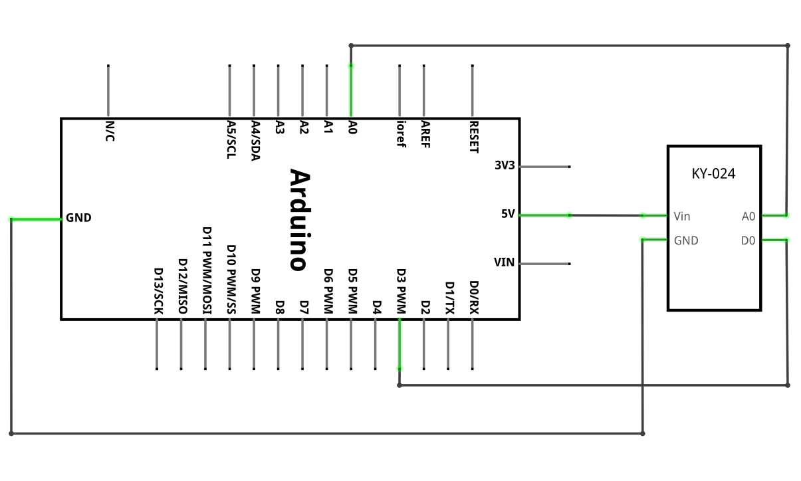
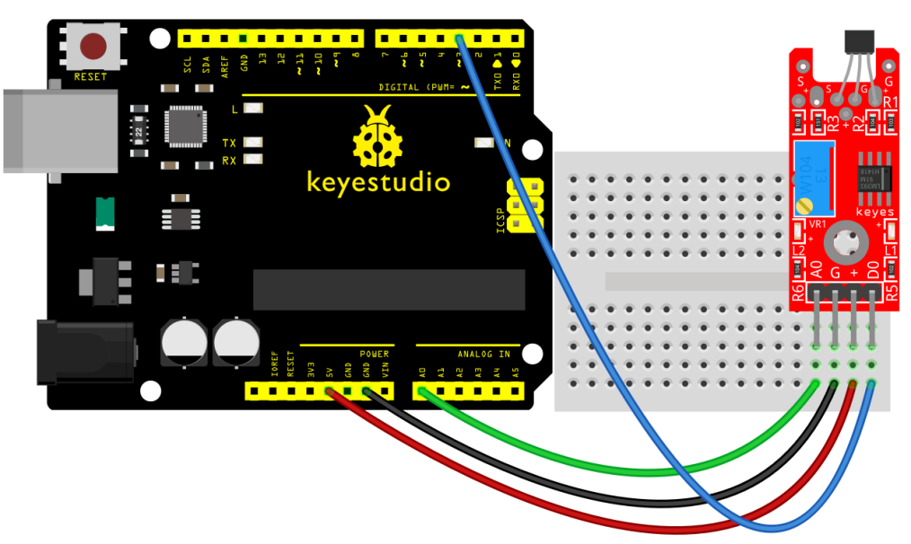
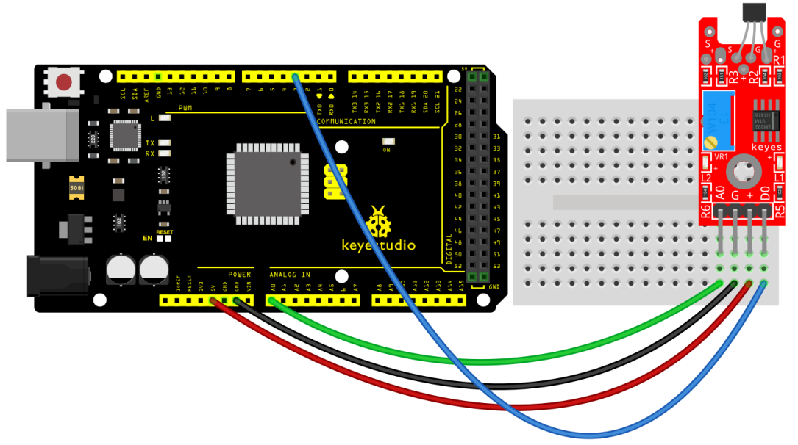
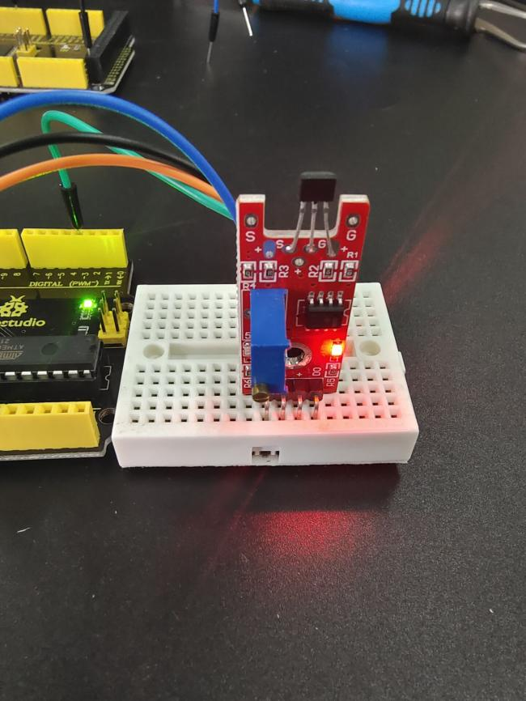
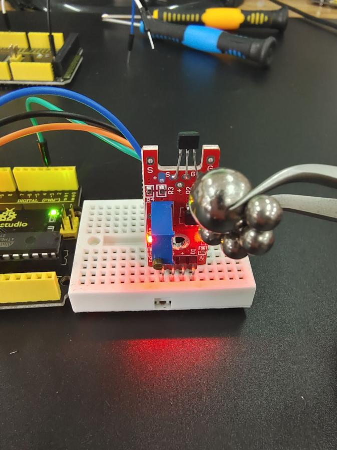
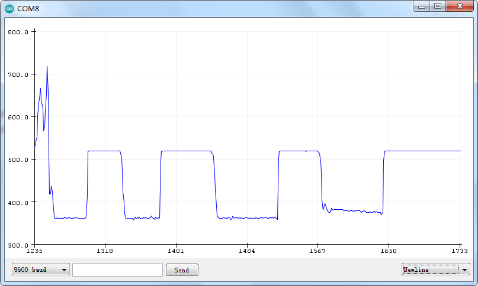

### プロジェクト21：リニア磁気ホールセンサー

**説明**

KY-024リニア磁気ホールセンサーは、磁場の存在に反応します。センサーの感度を調整するためのポテンショメータを備え、アナログ出力とデジタル出力の両方を提供します。

デジタル出力は、[KY-003](https://arduinomodules.info/ky-003-hall-magnetic-sensor-module/)と同様に、磁石が近づくとオン/オフするスイッチとして機能します。一方、アナログ出力は磁場の極性と相対的な強度を測定できます。Arduino、Raspberry Pi、Esp32、Teensyなどの一般的な電子プラットフォームと互換性があります。

**仕様**

| 動作電圧 | 2.7V〜6.5V                                   |
|----------|----------------------------------------------|
| 感度     | 1.0 mV/G 最小、1.4 mV/G 標準、1.75 mV/G 最大 |
| 基板寸法 | 1.5cm x 3.6cm \[0.6in x 1.4in\]              |

**動作原理**

KY-024モジュールは、リニアホール効果センサーSS49Eと二重差動コンパレータLM393、ポテンショメータBOCHEN 3296で構成されています。ポテンショメータと結合されたコンパレータにより、センサー値をしきい値と比較して、センサーをオールオアナッシングセンサーとして使用できます。モジュールには2つのLEDがあります。led1はセンサーに電圧が供給されていることを示し、led2は磁場が検出されたことを示します。

ピン配置

DOUTは、Arduinoに接続するリニアホールセンサーのデジタルピンです。

AOUTは、Arduinoに接続するリニアホールセンサーのアナログピンです。

VCCはArduinoの+5V電源に接続する必要があります。

GNDはArduinoのグランドに接続する必要があります。

**接続図**

ボードの電源ライン（+）とグランド（G）をそれぞれArduinoの5VとGNDに接続します。デジタル信号ピン（D0）をピン3に、アナログ信号ピン（A0）をArduinoのピンA0に接続します。

**サンプルコード**

> **サンプルコード（Arduinoエディタ）：** [Arduinoクラウドエディタで開く](https://create.arduino.cc/editor/keyestudio/ee9695cc-af7f-42cd-bb40-64c962d8aff5/preview?embed)

**実行結果の例**

アナログピンを入力として設定する（11行目）は不要です。[analogRead()](https://www.arduino.cc/reference/en/language/functions/analog-io/analogread/)関数を使用すると、自動的にピンがアナログ入力として設定されます。

Arduino IDEの**ツール** \> **シリアルプロッター**を使用して、磁場の強度と極性の変化を視覚化します。

