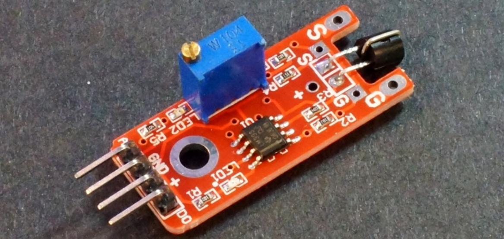
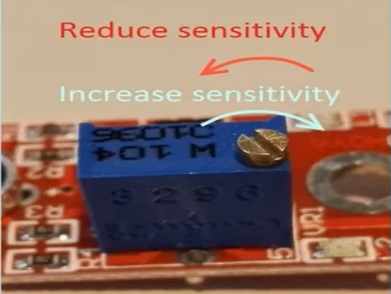
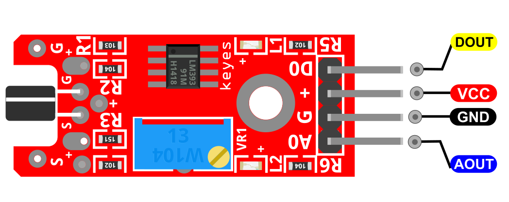
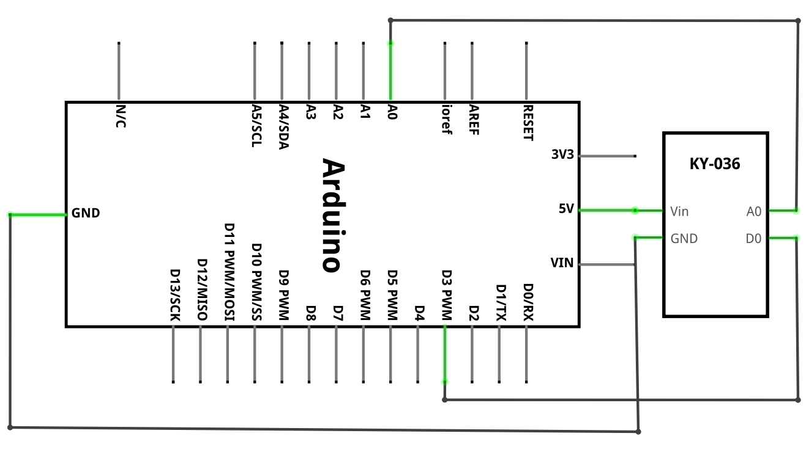
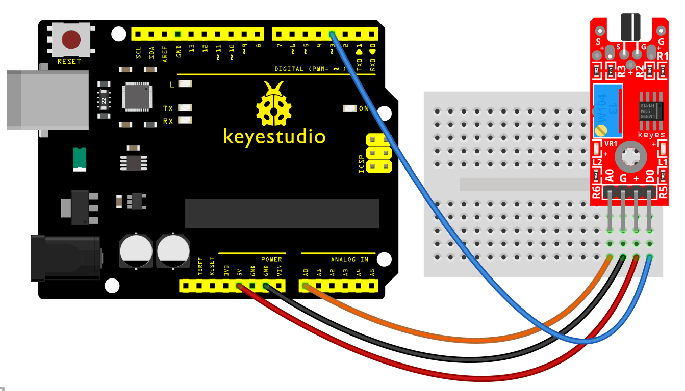
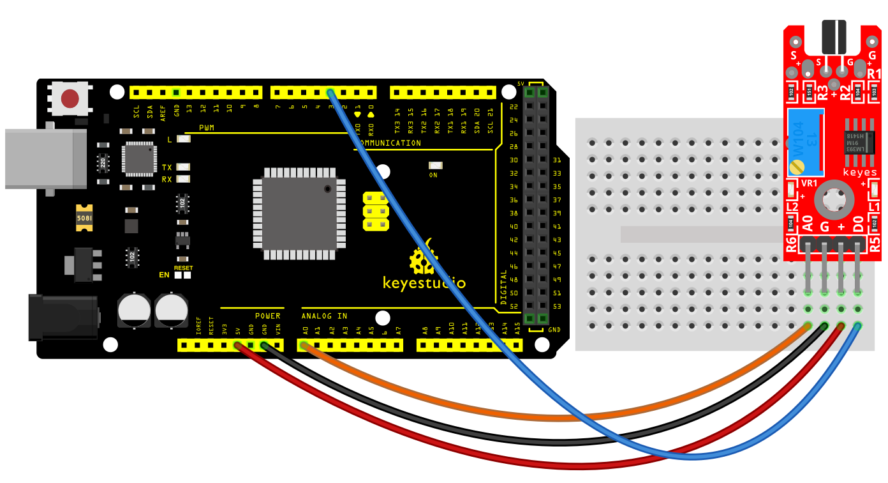
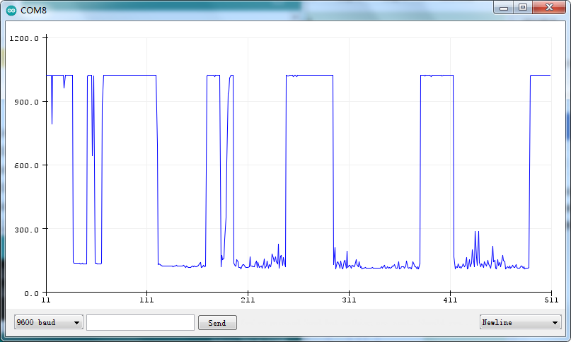

### Proyecto 22: Sensor táctil de metal

**Descripción**

El módulo de sensor táctil de metal KY-036 cuenta con un transistor Darlington y PN. Su señal es controlada por el circuito integrado comparador LM393, que consta de dos comparadores. El sensor se activa cuando se toca el cable de la barra situado sobre el transistor, que está representado por la base del transistor.

**Especificación**

| Tensión de alimentación | 3.3V a 5V          |
|-------------------------|--------------------|
| Interfaz                | analógica y digital |
| Tamaño                  | 34 x 16 mm         |
| Peso                    | 4g                 |

**¿Cómo funciona?**

Básicamente, la funcionalidad del módulo de sensor táctil de metal KY-036 se divide en tres componentes principales. Primero, la unidad sensora en la parte frontal del módulo mide físicamente el área y envía una señal analógica a la segunda unidad, el amplificador.

El amplificador amplifica la señal y, de acuerdo con el valor de resistencia del potenciómetro, envía la señal a la salida analógica del módulo. También puede ajustar la sensibilidad del sensor girando la perilla del potenciómetro. Si lo gira en el sentido de las agujas del reloj, puede aumentar la sensibilidad, y si lo gira en sentido contrario a las agujas del reloj, puede reducir la sensibilidad, como se muestra en el diagrama.

El comparador conmuta la salida digital y enciende el LED si la señal cae por debajo de un valor específico.

Pinout

DOUT es el pin digital del sensor táctil de metal que conectamos al Arduino.

AOUT es el pin analógico del sensor táctil de metal que conectamos al Arduino.

VCC debe conectarse a la alimentación de +5V del Arduino.

GND debe conectarse a la tierra del Arduino.

**Diagrama de conexión**

Conecte la salida analógica (A0) de la placa al pin A0 del Arduino y la salida digital (D0) al pin 3. Conecte la línea de alimentación (+) y tierra (G) a 5V y GND respectivamente.

**Código de ejemplo**

> **Código de ejemplo (Editor de Arduino):** [Open in Arduino Cloud Editor](https://create.arduino.cc/editor/keyestudio/295ff094-b231-4469-abca-efc67ec5d793/preview?embed)

**Resultado del ejemplo**

Use **Herramientas** \> **Trazador serie** en el IDE de Arduino para visualizar los valores en la interfaz analógica. Use un imán para activar el interruptor.

