### Project 23: Reed-schakelmodule
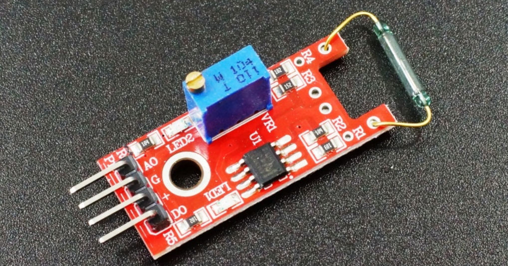

**Beschrijving**

De KY-025 Reed-schakelmodule is een kleine elektrische schakelaar die wordt bediend door een aangelegd magnetisch veld en die vaak wordt gebruikt als naderingssensor.

De module heeft zowel digitale als analoge uitgangen. Een trimmer wordt gebruikt om de gevoeligheid van de sensor te kalibreren. Compatibel met Arduino, Raspberry Pi, ESP32 en andere microcontrollers.

De reed-schakelaar is een speciale schakelaar en een hoofdcomponent voor reed-relais en naderingsschakelaars.

Een reed-schakelaar bestaat meestal uit twee zachtmagnetische materialen en metalen reed-contacten die zichzelf loskoppelen wanneer er geen magnetisch veld is.

Bovendien zijn sommige reed-schakelaars ook uitgerust met een andere reed die fungeert als het derde normaal gesloten contact. Deze reed-contacten zijn ingekapseld in een glazen buis gevuld met inerte gassen (zoals stikstof en helium) of in een vacuümglazen buis.

De in de glazen buis ingekapselde reeds worden parallel geplaatst met overlappende uiteinden. Een bepaalde hoeveelheid ruimte of wederzijds contact wordt gereserveerd om de normaal open of normaal gesloten contacten van de schakelaar te vormen.

Reed-schakelaars kunnen worden gebruikt voor tellingen, limieten of andere doeleinden.

Een soort fietskilometerteller wordt bijvoorbeeld samengesteld door een magneet aan de band te bevestigen en een reed-schakelaar ernaast te monteren.

U kunt ook een reed-schakelaar op de deur monteren voor alarmdoeleinden of als schakelaars.

Reed-schakelaars worden veel toegepast in huishoudelijke apparaten, auto's, communicatie, industrie, gezondheidszorg en beveiligingsgebieden.

Bovendien kan het ook worden toegepast op andere sensoren en elektrische apparaten zoals vloeistofmeters, deurmagneten, reed-relais, olieniveausensoren en naderingssensoren (magnetische sensoren). Het kan worden gebruikt in omgevingen met een hoog risico.

**Specificatie**

Deze module bestaat uit een 2x14mm normaal open [reed-schakelaar](https://en.wikipedia.org/wiki/Reed_switch), een LM393 dubbele differentiële comparator, een 3296W-104 trimmerpotentiometer, 6 weerstanden, 2 LED's en 4 mannelijke headerpinnen.

| Bedrijfsspanning    | 3.3V ~ 5.5V                     |
|---------------------|---------------------------------|
| Werkstroom          | ≥20mA                           |
| Werktemperatuur     | －10℃ tot ＋50℃                  |
| Detectieafstand     | ≤10mm                           |
| Afmetingen bord     | 1.5cm x 3.6cm \[0.6in x 1.4in\] |

Overzicht reed-schakelaar

Een typische reed-schakelaar bevat een paar metalen reeds gemaakt van een ferromagnetisch materiaal (iets dat gemakkelijk gemagnetiseerd wordt, maar magnetisme verliest wanneer het een magnetisch veld verlaat). De oppervlakken van de reed-contacten zijn geplateerd met slijtvaste metalen zoals rhodium, ruthenium, palladium of iridium om ze een langere levensduur te geven, aangezien ze miljoenen keren in- en uitschakelen.

De reeds zijn hermetisch afgesloten in een buisvormige glazen omhulling om ze vrij te houden van stof en vuil. De [hermetische afdichting](https://en.wikipedia.org/wiki/Hermetic_seal) van reed-schakelaars maakt ze geschikt voor gebruik in explosieve omgevingen waar kleine vonken van conventionele schakelaars een gevaar zouden vormen. De glazen buis is gevuld met een inert gas, meestal stikstof, of een vacuüm om oxidatie van de contacten te voorkomen.

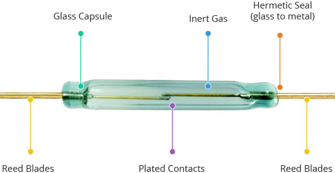

Typisch zijn contacten gemaakt van een nikkel-ijzerlegering die gemakkelijk te magnetiseren is (een hoge magnetische permeabiliteit heeft) maar niet lang zo blijft (een lage magnetische retentiviteit heeft). Als mechanisch apparaat hebben ze enige tijd nodig om te reageren op veranderingen in het magnetische veld – met andere woorden, hun schakelsnelheid is laag (doorgaans 0,6 ms inschakeltijd, 0,2 ms uitschakeltijd) vergeleken met elektronische schakelaars.

In aanwezigheid van een magnetisch veld bewegen beide contacten (in plaats van slechts één) en vormen ze een vlak, parallel contactoppervlak met elkaar. Dit helpt de levensduur en betrouwbaarheid van de reed-schakelaar te verlengen.

Een reed-schakelaar detecteert alleen de aanwezigheid van een magnetisch veld en meet de sterkte ervan niet. Als u geïnteresseerd bent in het meten van de sterkte, is een analoge Hall-effectsensor een betere optie om te overwegen.

**Hoe werkt het?**

De sleutel tot het begrijpen van de werking van reed-schakelaars is te beseffen dat ze deel uitmaken van zowel een magnetisch als een elektrisch circuit – magnetisme stroomt erdoorheen, net als elektriciteit.

Wanneer u een magneet dichter bij de reed-schakelaar brengt, wordt de hele schakelaar een deel van het “magnetische circuit”, inclusief de magneet (de stippellijn in de afbeelding toont een deel van het magnetische veld).

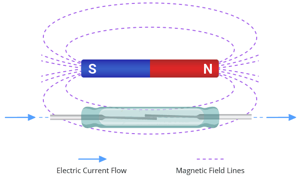

De twee contacten van een reed-schakelaar worden tegenovergestelde magnetische polen, daarom trekken ze elkaar aan en klikken ze samen. Het maakt niet uit welk uiteinde van de magneet u dichterbij brengt: de contacten polariseren nog steeds op tegenovergestelde manieren en trekken elkaar aan.

Wanneer u de magneet weghaalt, scheiden de contacten zich en keren ze terug naar hun oorspronkelijke positie.

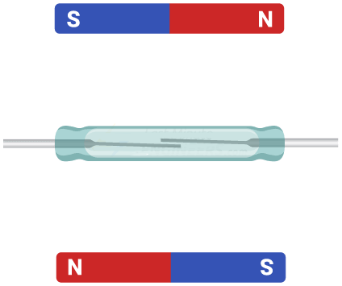

Een reed-schakelaar zoals deze is normaal open (NO). Dit betekent dat ‘normaal’ wanneer de schakelaar niet wordt beïnvloed door het magnetische veld, de schakelaar open is en geen elektriciteit geleidt. Wanneer een magneet dichtbij genoeg komt om de schakelaar te activeren, sluiten de contacten en stroomt er stroom doorheen.

In deze illustraties is de beweging van de contacten sterk overdreven. Echte reed-schakelaars hebben contacten die slechts enkele microns van elkaar verwijderd zijn (ongeveer tien keer dunner dan een mensenhaar). De beweging is dus niet zichtbaar met het blote oog. Met dank aan [Zátonyi Sándor](https://en.wikipedia.org/wiki/File:Reed_switch.ogv) voor het delen van macroscopische foto's van de reed-schakelaar.

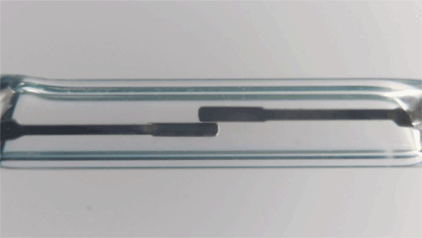

Pinout

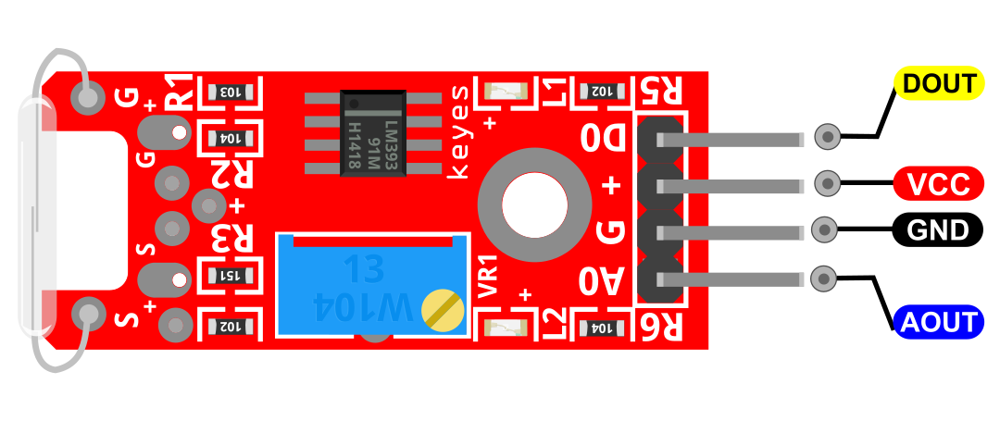

DOUT is de digitale pin van de reed-schakelaar die we verbinden met de Arduino.

AOUT is de analoge pin van de reed-schakelaar die we verbinden met de Arduino.

VCC moet worden aangesloten op de +5V-voeding van de Arduino.

GND moet worden aangesloten op de massa van de Arduino.

**Aansluitschema**

Verbind de analoge uitgang (A0) van het bord met pin A0 op de Arduino en de digitale uitgang (D0) met pin 3. Verbind de voedingslijn (+) en massa (G) respectievelijk met 5V en GND.

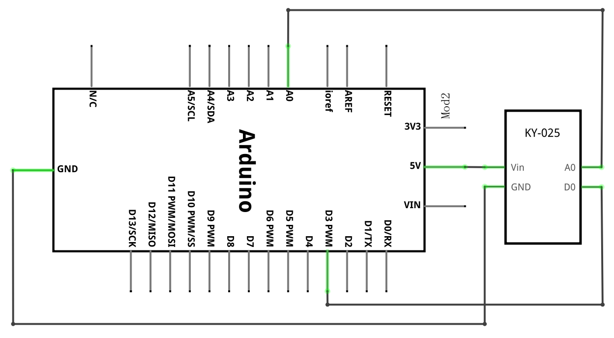

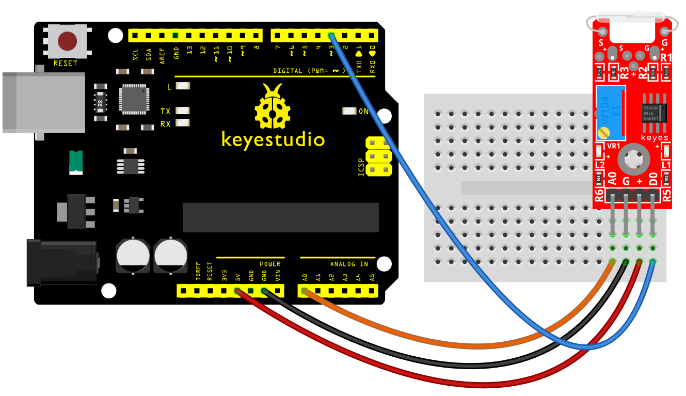

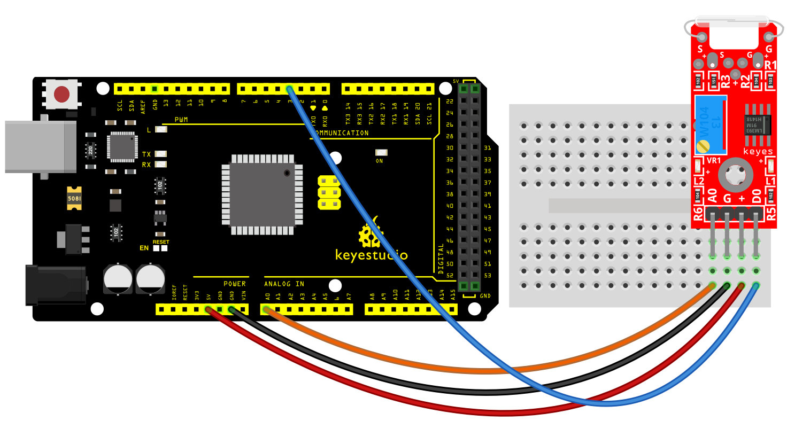

**Voorbeeldcode**

> **Voorbeeldcode (Arduino Editor):** [Open in Arduino Cloud Editor](https://create.arduino.cc/editor/keyestudio/c23e0b10-d0f9-4e98-9510-977c2debfafe/preview?embed)

**Voorbeeldresultaat**

Gebruik **Tools** \> **Serial Plotter** in de Arduino IDE om de waarden op de analoge interface te visualiseren, gebruik een magneet om de schakelaar te activeren.

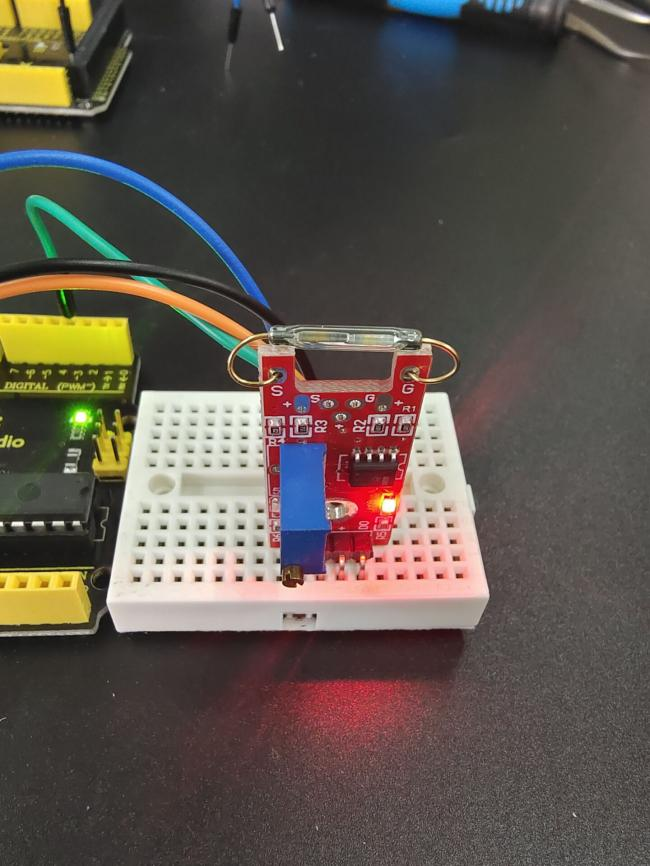

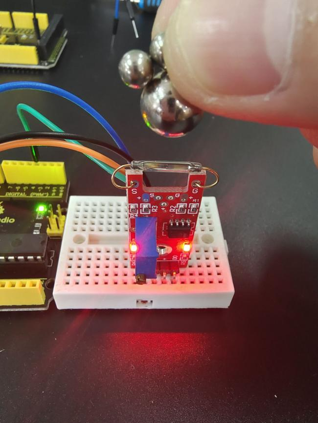

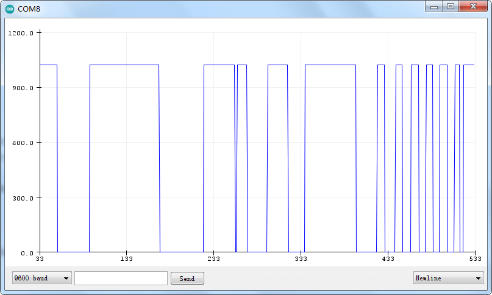