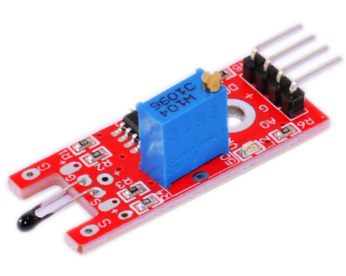
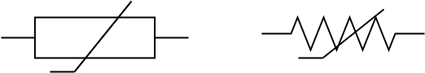
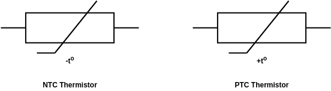
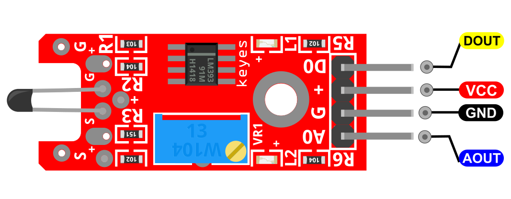
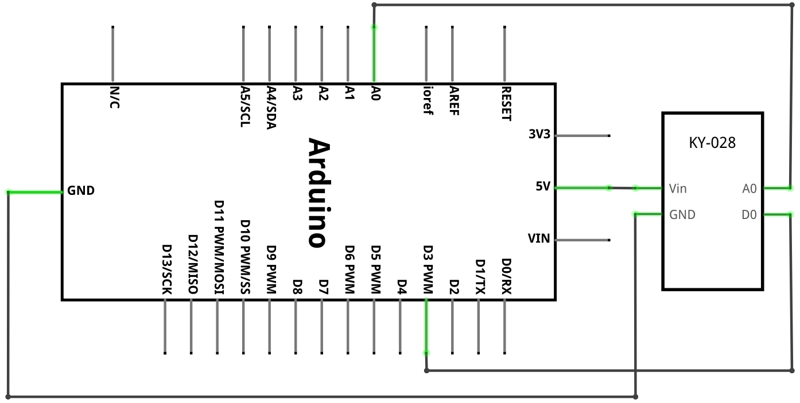
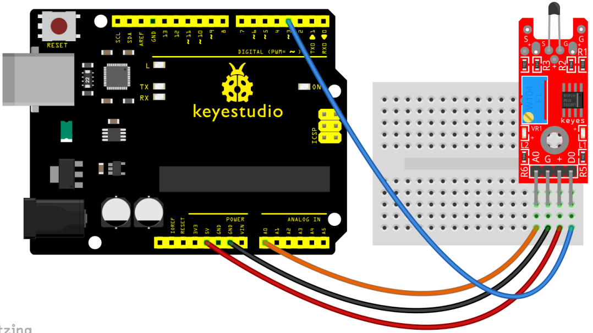
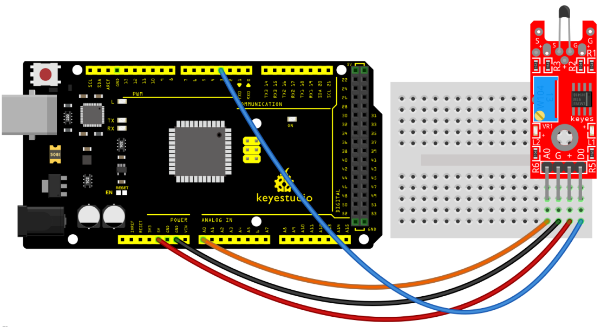
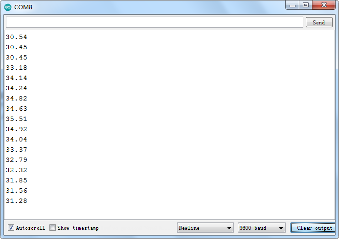

### Proyecto 24: Sensor de temperatura digital

**Descripción**

 El sensor de temperatura digital KY-028 mide los cambios de temperatura basándose en la resistencia de un termistor. Este módulo tiene salidas tanto digitales como analógicas, y hay un potenciómetro para ajustar el umbral de detección en la interfaz digital. Compatible con Arduino, Raspberry Pi, ESP32 y otros microcontroladores.

Este módulo se basa en el principio de funcionamiento de un termistor (la resistencia varía con el cambio de temperatura en el ambiente).

Puede detectar cambios de temperatura en el entorno y enviar los datos a la E/S analógica de la placa Arduino.

Todo lo que necesitamos hacer es convertir los datos de salida del sensor a temperatura en grados Celsius mediante una programación sencilla, mostrándolos finalmente en el monitor.

Es conveniente y eficaz, por lo que se aplica ampliamente en jardinería, sistemas de alarma domésticos y otros dispositivos.

**Especificación**

Tensión de funcionamiento 3.3V ~ 5.5V

Rango de medición de temperatura -55°C a 125°C [-67°F a 257°F]

Precisión de medición ±0.5°C

Dimensiones de la placa 15mm x 36mm [0.6in x 1.4in]

**¿Cómo funciona?**

El termistor, o simplemente **Term**istor Sensible a la **Temp**eratura, es un **sensor de temperatura** que funciona según el principio de resistencia variable con la temperatura. Están hechos de materiales semiconductores. El símbolo del circuito del termistor se muestra en la figura.

El termistor funciona con el principio simple de cambio de resistencia debido a un cambio de temperatura. Cuando la temperatura ambiente cambia, el termistor comienza a auto-calentar sus elementos. Su valor de resistencia cambia con respecto a este cambio de temperatura. Este cambio depende del tipo de termistor utilizado. Las características de resistencia-temperatura de diferentes tipos de termistores se dan en la siguiente sección.

**Termistor NTC**

NTC significa Coeficiente de Temperatura Negativo. Son semiconductores cerámicos que tienen un alto coeficiente de temperatura negativo de resistencia. La resistencia de un NTC disminuirá con el aumento de la temperatura de manera no lineal.

Los símbolos de circuito de los termistores NTC y PTC se muestran en la siguiente figura.

**Termistor PTC**

Los termistores PTC son resistores de coeficiente de temperatura positivo y están hechos de materiales cerámicos policristalinos. La resistencia de un PTC aumentará con el aumento de la temperatura de manera no lineal. El termistor PTC muestra solo un pequeño cambio de resistencia con la temperatura hasta que se alcanza el punto de conmutación (TR).

Las características de resistencia-temperatura de un NTC y un PTC se muestran en la siguiente figura.

Pinout

DOUT es el pin digital del sensor de temperatura digital que conectamos al Arduino.

AOUT es el pin analógico del sensor de temperatura digital que conectamos al Arduino.

VCC debe conectarse a la alimentación de +5V del Arduino.

GND debe conectarse a la tierra del Arduino.

**Diagrama de conexión**

Conecte la salida analógica (A0) de la placa al pin A0 del Arduino y la salida digital (D0) al pin 3. Conecte la línea de alimentación (+) y tierra (G) a 5V y GND respectivamente.

**Código de ejemplo**

> **Código de ejemplo (Editor de Arduino):** [Open in Arduino Cloud Editor](https://create.arduino.cc/editor/keyestudio/8dc3a39d-5104-4855-bf45-465fe66aa6a0/preview?embed)

**Resultado del ejemplo**

Después de cablear y encender como se muestra en la figura anterior, cargue el código en la placa. Luego, abra el monitor serie del IDE de Arduino y verá el valor de temperatura actual.

