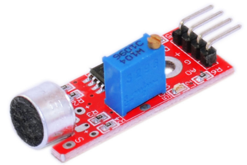
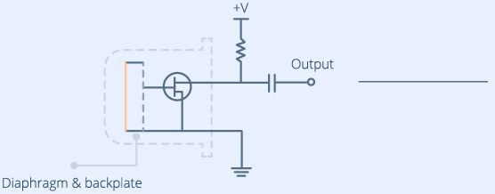
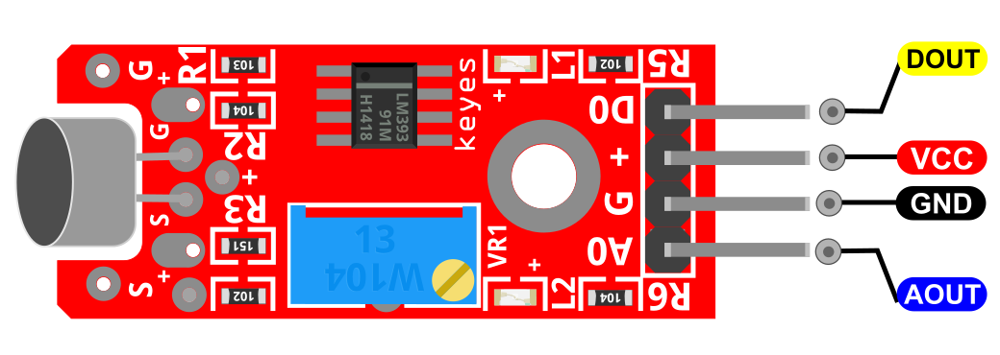
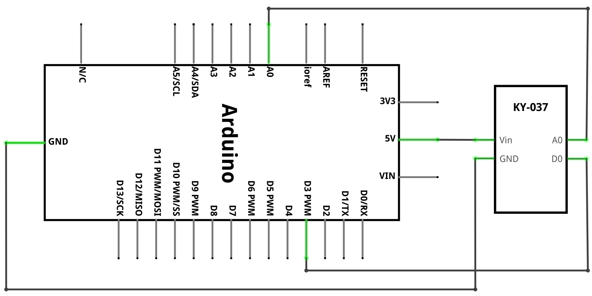
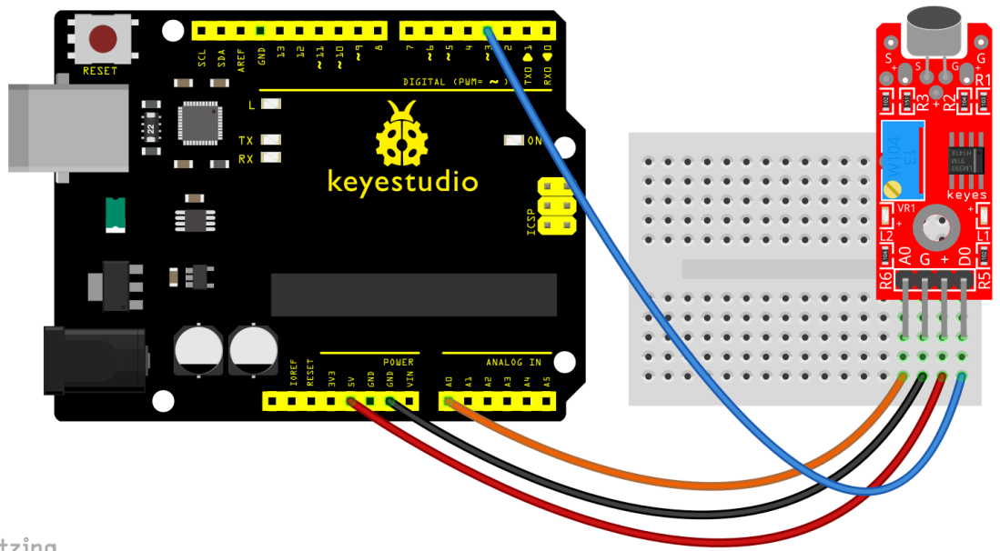
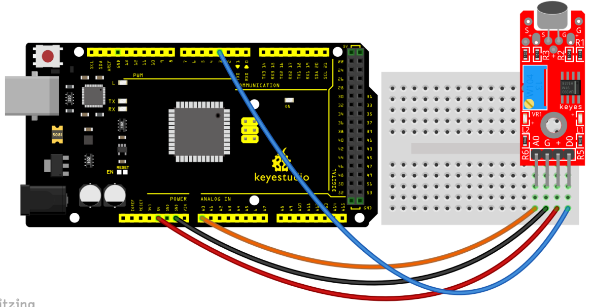
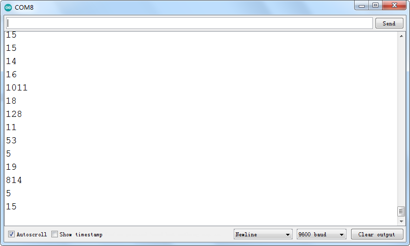

### Proyecto 25: Sensor de sonido de alta sensibilidad

**Descripción**

 Un sensor de sonido de alta sensibilidad se utiliza típicamente para detectar el volumen de los sonidos ambientales. El sensor viene con un potenciómetro, para que pueda girarlo y ajustar la ganancia de la señal.

Puede usarlo para realizar trabajos interesantes e interactivos, como un interruptor activado por voz.

**Especificación**

| Voltaje de funcionamiento  | 2v ~ 2.5v     |
|----------------------------|---------------|
| Corriente de trabajo       | 10mA          |
| Diámetro                   | 5mm           |
| Tipo de paquete            | Difusión      |
| Color                      | Rojo + Amarillo|
| Ángulo de haz              | 150           |
| Longitud de onda           | 571nm + 644nm |
| Intensidad luminosa (MCD)  | 20-40; 40-80  |

**¿Cómo funciona?**

Dentro del micrófono hay un diafragma delgado, que en realidad es una placa de un condensador. La segunda placa es la placa posterior, que está cerca y paralela al diafragma.

Cuando hablas por el micrófono, las ondas sonoras creadas por tu voz golpean el diafragma, haciéndolo vibrar.

Cuando el diafragma vibra en respuesta al sonido, la capacitancia cambia a medida que las placas se acercan o se alejan.

A medida que la capacitancia cambia, el voltaje a través de las placas cambia, lo que al medir podemos determinar la amplitud del sonido.

Descripción general del hardware

El sensor de sonido es una pequeña placa que combina un micrófono (50Hz-10kHz) y algunos circuitos de procesamiento para convertir las ondas sonoras en señales eléctricas.

Esta señal eléctrica se alimenta a un comparador de alta precisión LM393 integrado para digitalizarla y está disponible en el pin OUT.

El módulo tiene un potenciómetro incorporado para el ajuste de sensibilidad de la señal OUT.

Puede establecer un umbral usando un potenciómetro; de modo que cuando la amplitud del sonido exceda el valor del umbral, el módulo emitirá LOW, de lo contrario HIGH.

Esta configuración es muy útil cuando desea activar una acción cuando se alcanza un cierto umbral. Por ejemplo, cuando la amplitud del sonido cruza un umbral (cuando se detecta un golpe), puede activar un relé para controlar la luz. ¡Ya lo tiene!

Consejo: Gire la perilla en sentido antihorario para aumentar la sensibilidad y en sentido horario para disminuirla.

Además de esto, el módulo tiene dos LED. El LED de encendido se iluminará cuando el módulo esté alimentado. El LED de estado se iluminará cuando la salida digital pase a LOW.

Pinout

DOUT es el pin digital del sensor de sonido que conectamos al Arduino.

AOUT es el pin analógico del sensor de sonido que conectamos al Arduino.

VCC debe conectarse a la alimentación de +5V del Arduino.

GND debe conectarse a la tierra del Arduino.

**Diagrama de conexión**

Conecte la salida analógica (A0) de la placa al pin A0 del Arduino y la salida digital (D0) al pin 3. Conecte la línea de alimentación (+) y tierra (G) a 5V y GND respectivamente.

**Código de ejemplo**

> **Código de ejemplo (Arduino Editor):** [Open in Arduino Cloud Editor](https://create.arduino.cc/editor/keyestudio/23468d97-47da-4aa7-970d-489349888f6f/preview?embed)

**Resultado del ejemplo**

Una vez cableado y encendido, cargue el código. Luego, abra el monitor serie y configure la velocidad en baudios a 9600; verá el valor analógico. Al hablar hacia el micrófono, el valor aumentará, como se muestra a continuación.

