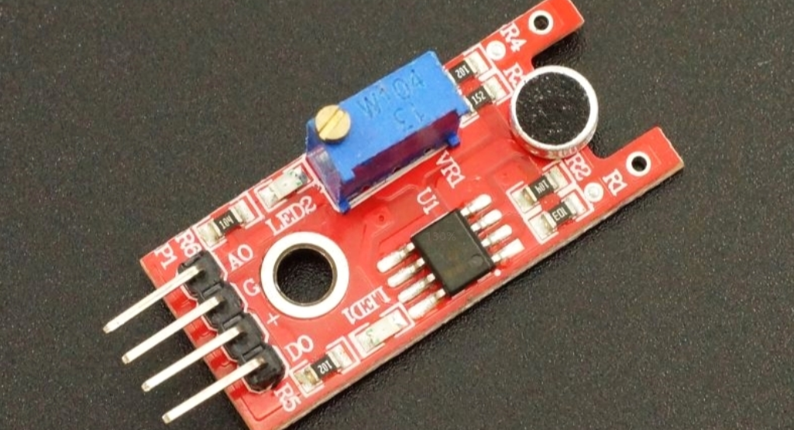
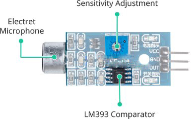
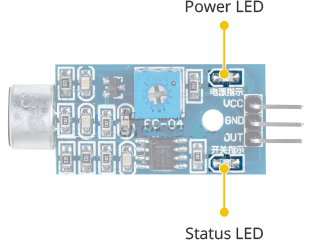
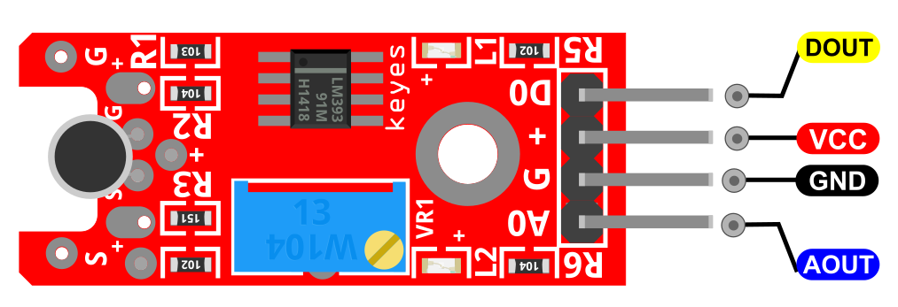
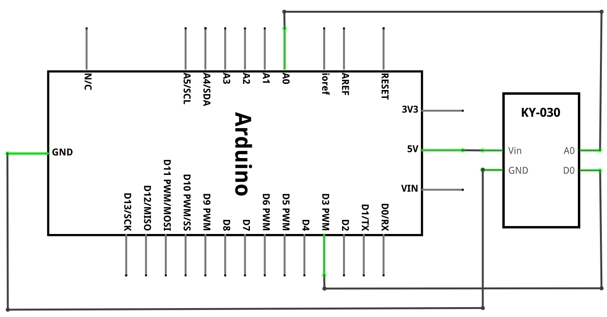
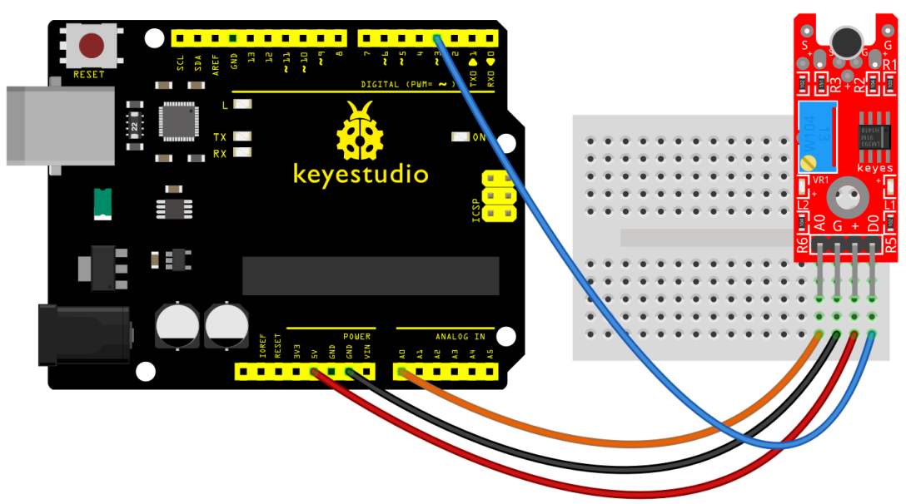
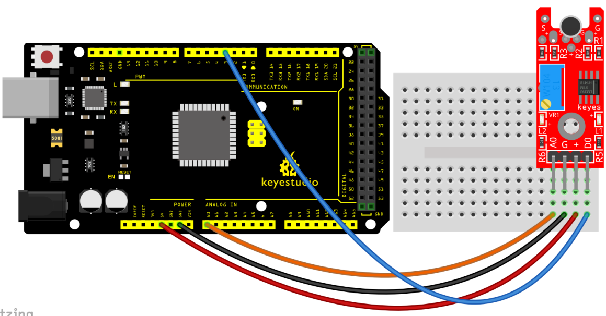
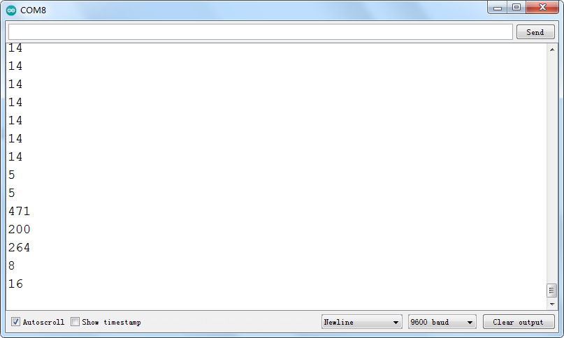

### Progetto 26: Sensore di suono analogico

**Descrizione**

Questo modulo è composto da tre elementi funzionali: il sensore sulla parte anteriore del modulo che esegue la misurazione, quindi il segnale analogico viene inviato all'amplificatore.

Questo amplifica il segnale in base al guadagno determinato dal potenziometro e invia il segnale all'uscita analogica del modulo.

La terza parte è costituita da un comparatore che commuta l'uscita digitale e il diodo quando il segnale scende al di sotto di un certo valore.

**Specifiche**

| Tensione operativa         | 2v ~ 2.5v     |
|----------------------------|---------------|
| Corrente di lavoro         | 10mA          |
| Diametro                   | 5mm           |
| Tipo di pacchetto          | Diffusione    |
| Colore                     | Rosso + Giallo|
| Angolo del fascio         | 150           |
| Lunghezza d'onda           | 571nm + 644nm |
| Intensità luminosa (MCD)   | 20-40; 40-80  |

Panoramica hardware

Il sensore di suono è una piccola scheda che combina un microfono (50Hz-10kHz) e alcuni circuiti di elaborazione per convertire le onde sonore in segnali elettrici.

Questo segnale elettrico viene inviato al comparatore di alta precisione LM393 integrato per digitalizzarlo ed è reso disponibile sul pin OUT.

Il modulo ha un potenziometro integrato per la regolazione della sensibilità del segnale OUT.

È possibile impostare una soglia utilizzando un potenziometro; in modo che quando l'ampiezza del suono supera il valore di soglia, il modulo emetterà LOW, altrimenti HIGH.

Questa configurazione è molto utile quando si desidera attivare un'azione al raggiungimento di una certa soglia. Ad esempio, quando l'ampiezza del suono supera una soglia (quando viene rilevato un colpo), è possibile attivare un relè per controllare la luce. Hai capito l'idea!

Suggerimento: Ruotare la manopola in senso antiorario per aumentare la sensibilità e in senso orario per diminuirla.

Inoltre, il modulo ha due LED. Il LED di alimentazione si accenderà quando il modulo è alimentato. Il LED di stato si accenderà quando l'uscita digitale diventa LOW.

Pinout

DOUT è il pin digitale del sensore di suono che colleghiamo all'Arduino.

AOUT è il pin analogico del sensore di suono che colleghiamo all'Arduino.

VCC dovrebbe essere collegato all'alimentazione +5V di Arduino.

GND dovrebbe essere collegato alla massa di Arduino.

**Schema di collegamento**

**Codice di esempio**

> **Codice di esempio (Editor Arduino):** [Apri nell'editor cloud Arduino](https://create.arduino.cc/editor/keyestudio/146dffe9-bcca-4987-a0ff-c30782142e26/preview?embed)

**Risultato dell'esempio**

Completato il cablaggio e l'accensione, caricare il codice, quindi aprire il monitor seriale e impostare la velocità di trasmissione a 9600, si vedrà il valore analogico. Quando si parla verso la testina del microfono, il valore aumenterà. Mostrato di seguito.

