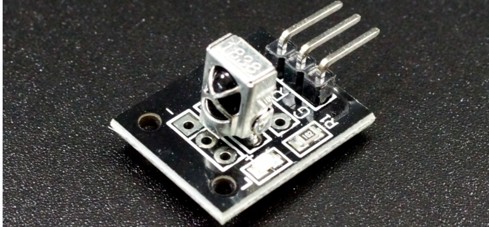
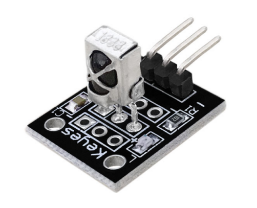
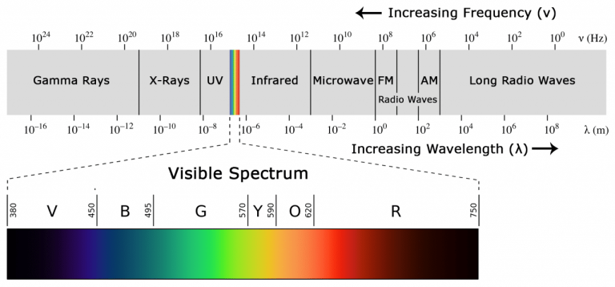
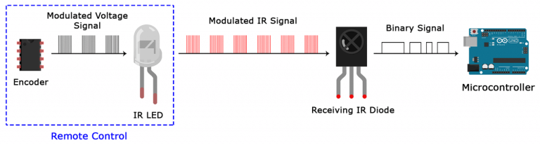
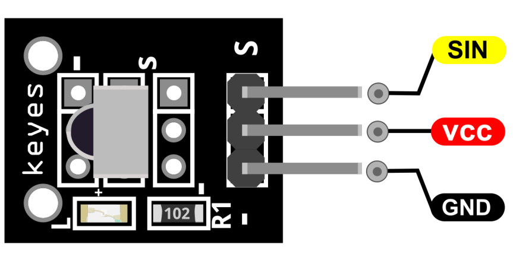
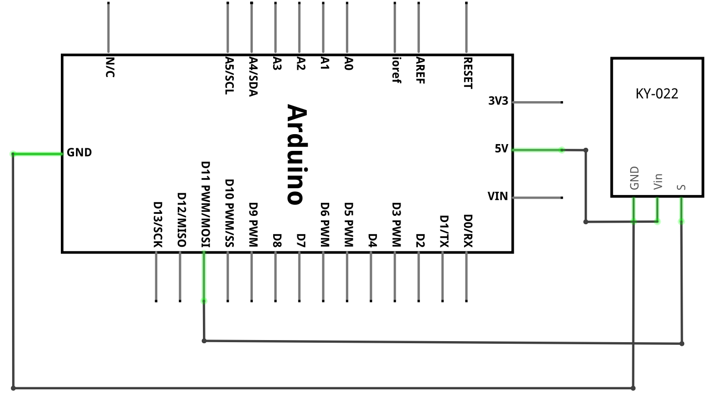
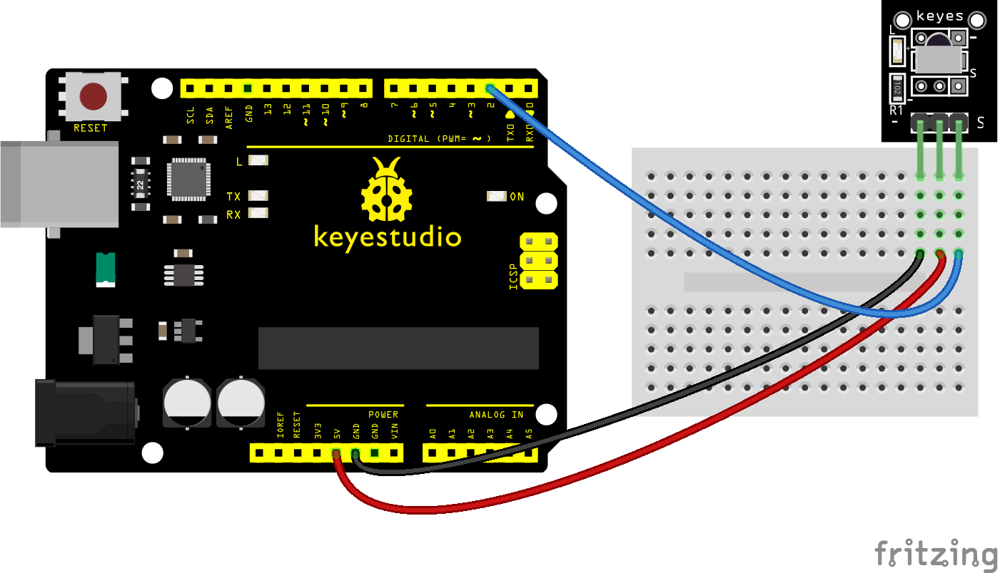
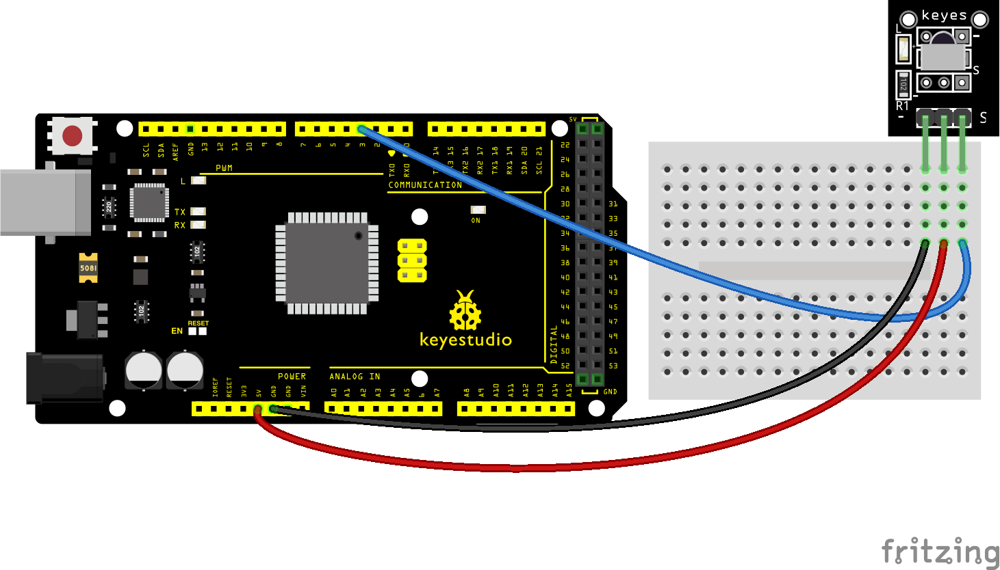
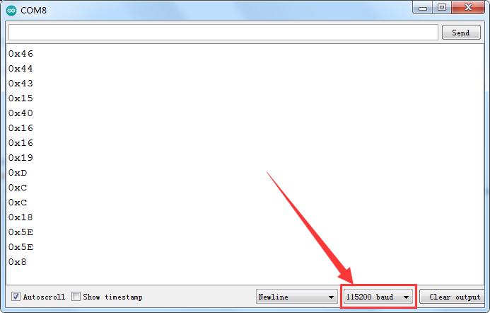

### Projekt 27: Digitales IR-Empfängermodul

**Beschreibung**

 Das KY-022 Infrarot-Empfängermodul reagiert auf 38kHz IR-Licht. Es kann verwendet werden, um Befehle von IR-Fernbedienungen von Fernsehern, Stereoanlagen und anderen Geräten zu empfangen.

Es kann auch zusammen mit dem [KY-005 IR-Sendermodul](https://arduinomodules.info/ky-005-infrared-transmitter-sensor-module/) verwendet werden.

IR wird häufig in der Fernbedienung eingesetzt. Mit diesem IR-Empfänger kann das Arduino-Projekt Befehle von beliebigen IR-Fernbedienungen empfangen, wenn Sie den richtigen Decoder haben. Es wird auch einfach sein, einen eigenen IR-Controller mit einem IR-Sender zu erstellen.

**Spezifikation**

| Betriebsspannung     | 2.7V bis 5.5V  |
|----------------------|----------------|
| Betriebsstrom        | 0.4mA bis 1.5mA|
| Empfangsentfernung   | 18m            |
| Empfangswinkel       | ±45º           |
| Trägerfrequenz       | 38KHz          |
| Niedriger Pegelspannung | 0.4V           |
| Hoher Pegelspannung  | 4.5V           |
| Umgebungslichtfilter | bis zu 500LUX  |

**Was ist Infrarot?**

Infrarotstrahlung ist eine Form von Licht, ähnlich dem Licht, das wir überall um uns herum sehen. Der einzige Unterschied zwischen IR-Licht und sichtbarem Licht ist die Frequenz und Wellenlänge, was bedeutet, dass Infrarotlicht außerhalb des Bereichs des sichtbaren Lichts liegt und somit für das menschliche Auge unsichtbar ist. Eine gute Möglichkeit, Infrarotlicht zu sehen, ist, es durch eine alte Kamera zu betrachten, da diese einen Filter enthält, der das IR-Licht sichtbar macht, normalerweise als violettes Leuchten.

**IR-Signalmodulation**

IR-Licht ist überall um uns herum, wird von der Sonne, Glühbirnen und allem, was Wärme erzeugt, ausgestrahlt. Es wäre also leicht anzunehmen, dass ein IR-Empfänger all diese zusätzliche IR-Strahlung aufnehmen würde, anstatt die von einem Sender gesendete. Um zu verhindern, dass diese zusätzliche Strahlung das IR-Signal stört, wird eine Signalmodulationstechnik verwendet.

Bei der IR-Signalmodulation wandelt ein Encoder auf der IR-Fernbedienung ein binäres Signal in ein moduliertes elektrisches Signal um. Dieses elektrische Signal wird an die sendende LED gesendet. Die sendende LED wandelt das modulierte elektrische Signal in ein moduliertes IR-Lichtsignal um. Der IR-Empfänger demoduliert dann das IR-Lichtsignal und wandelt es zurück in Binärdaten, bevor er die Informationen an einen Mikrocontroller weiterleitet, wie unten im Diagramm dargestellt.

Ein moduliertes IR-Signal ist eine Reihe von Lichtimpulsen, die mit hoher Frequenz ein- und ausgeschaltet werden, dies wird als Trägerfrequenz bezeichnet. Die von den meisten Sendern verwendete Trägerfrequenz beträgt 38 kHz, da sie in der Natur selten ist und daher von Umgebungs-IR-Rauschen unterschieden werden kann. Auf diese Weise weiß der IR-Empfänger, dass das 38-kHz-Signal vom Sender gesendet wurde und nicht aus der Umgebung aufgenommen wurde.

Pinbelegung

SIN ist der Signalpin des IR-Empfängermoduls, den wir mit dem Arduino verbinden.

VCC sollte mit der +5V-Stromversorgung des Arduino verbunden werden.

GND sollte mit der Masse des Arduino verbunden werden.

**Verbindungsdiagramm**

Verbinden Sie die Stromleitung (Mitte) und Masse (-) des Moduls mit +5 und GND am Arduino. Verbinden Sie auch den Signalpin (S) mit Pin 11. Richten Sie den IR-Empfänger und -Sender aus und platzieren Sie sie einander zugewandt.

**Beispielcode**

> **Beispielcode (Arduino Editor):** [Im Arduino Cloud Editor öffnen](https://create.arduino.cc/editor/keyestudio/16cac7ca-3f1a-49e2-8cda-3f03126a0748/preview?embed)

**Hinweis:** Bevor Sie den Code kompilieren, denken Sie daran, die Bibliothek in das Bibliotheksverzeichnis der Arduino IDE zu legen. Andernfalls schlägt die Kompilierung fehl.

Die IR Remote Library enthält einige Beispielcodes zum Senden und Empfangen.

**Beispielergebnis**

Schließen Sie die Verkabelung ab und laden Sie den Code hoch. Senden Sie dann das Infrarotsignal über die Infrarot-Fernbedienung, das vom Infrarot-Empfängermodul empfangen und gedruckt wird.

**Erweitertes Training**

Verwenden Sie die Infrarot-Fernbedienung, um die LED-Lampe anzuschließen

**Verbindungsdiagramm**

**Untitled Sketch_bb**

**Beispielcode**

> **Beispielcode (Arduino Editor):** [Im Arduino Cloud Editor öffnen](https://create.arduino.cc/editor/keyestudio/0a67adcf-e902-4ca0-a824-7b84ab58c7f5/preview?embed)

**Beispielergebnis**

Drücken Sie die OK-Taste, und die LED schaltet sich ein. Drücken Sie die OK-Taste erneut, und die LED schaltet sich aus

> **Hinweis:** Diese Sektion wurde noch nicht übersetzt und wird im Original (Englisch) angezeigt.