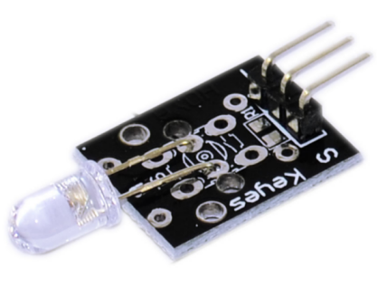
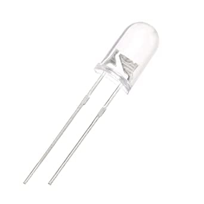
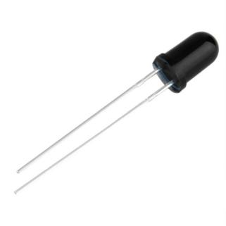
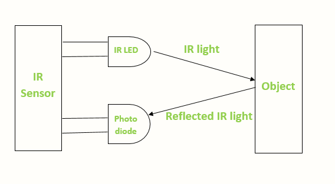
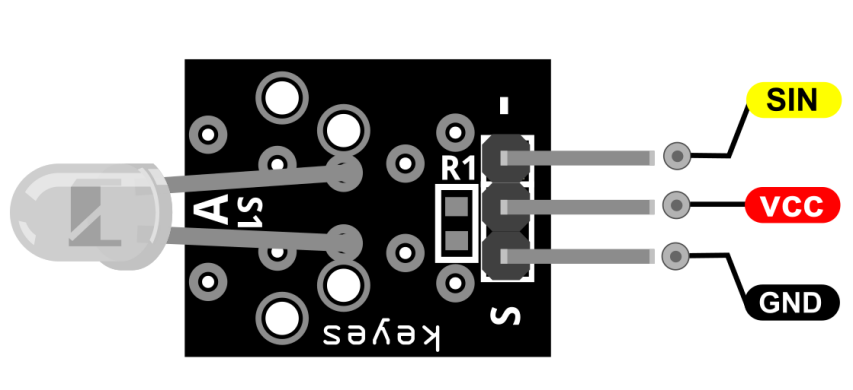
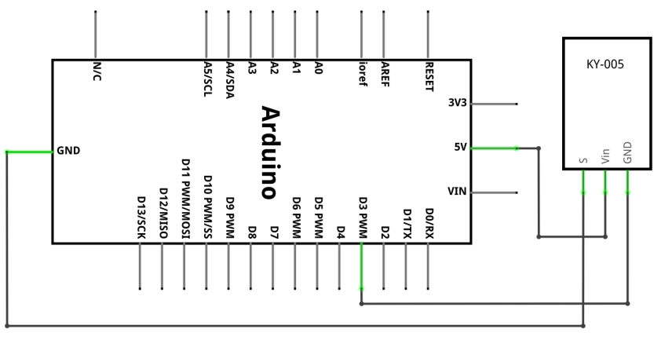
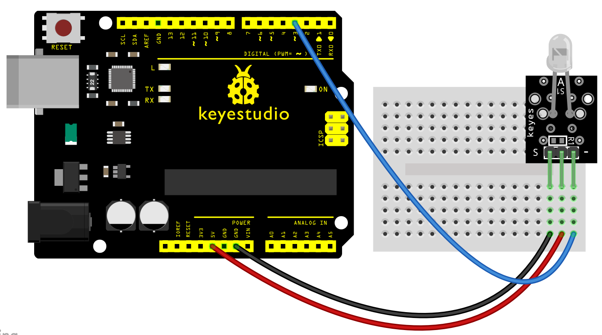
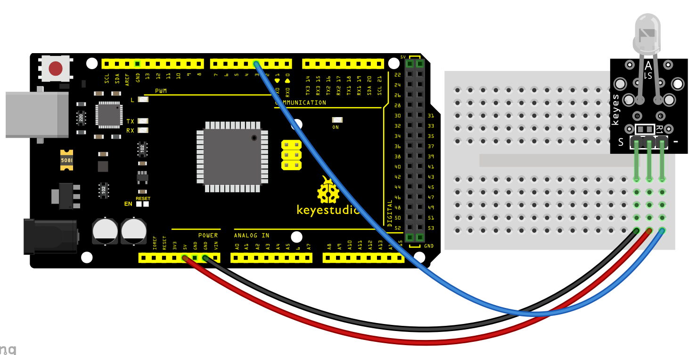
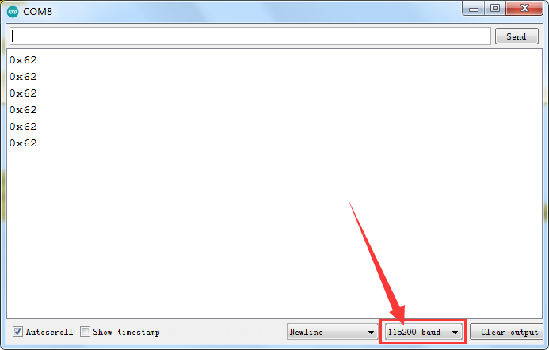

### Progetto 28: Modulo Trasmettitore IR Digitale

**Descrizione**

Il modulo trasmettitore a infrarossi KY-005 emette luce infrarossa a 38kHz. Può essere utilizzato per controllare TV, stereo, condizionatori d'aria e altri dispositivi con ricevitori IR. Può anche essere utilizzato insieme al modulo ricevitore a infrarossi KY-022.

**Specifiche**

| Alimentazione              | 3-5V                  |
|----------------------------|-----------------------|
| Frequenza centrale infrarossi | 850nm-940nm           |
| Angolo di emissione infrarossi | circa 20 gradi      |
| Distanza di emissione infrarossi | circa 1.3m (5V 38Khz) |
| Presa interfaccia           | PH2.54                |

**Come funziona?**

Esistono diversi tipi di trasmettitori a infrarossi a seconda della loro lunghezza d'onda, potenza di uscita e tempo di risposta. Un sensore IR è costituito da un LED IR e un fotodiodo IR, insieme sono chiamati fotoaccoppiatore o optoaccoppiatore.

**Trasmettitore IR o LED IR**

Il trasmettitore a infrarossi è un diodo a emissione di luce (LED) che emette radiazioni infrarosse chiamate LED IR. Anche se un LED IR assomiglia a un normale LED, la radiazione emessa da esso è invisibile all'occhio umano.

L'immagine di un LED a infrarossi è mostrata di seguito.

**Ricevitore IR o Fotodiodo**

I ricevitori a infrarossi o sensori a infrarossi rilevano la radiazione da un trasmettitore IR. I ricevitori IR si presentano sotto forma di fotodiodi e fototransistor. I fotodiodi a infrarossi sono diversi dai normali fotodiodi in quanto rilevano solo la radiazione infrarossa. L'immagine seguente mostra l'immagine di un ricevitore IR o di un fotodiodo,

Esistono diversi tipi di ricevitori IR basati su lunghezza d'onda, tensione, package, ecc. Quando utilizzati in una combinazione trasmettitore-ricevitore a infrarossi, la lunghezza d'onda del ricevitore dovrebbe corrispondere a quella del trasmettitore.

L'emettitore è un LED IR e il rilevatore è un fotodiodo IR. Il fotodiodo IR è sensibile alla luce IR emessa da un LED IR. La resistenza e la tensione di uscita del fotodiodo cambiano in proporzione alla luce IR ricevuta. Questo è il principio di funzionamento sottostante del sensore IR.

Quando il trasmettitore IR emette radiazioni, queste raggiungono l'oggetto e parte delle radiazioni si riflette sul ricevitore IR. In base all'intensità della ricezione da parte del ricevitore IR, viene definita l'uscita del [sensore](https://robu.in/product-category/sensor/).

Pinout

SIN è il pin del segnale del modulo trasmettitore a infrarossi che colleghiamo all'Arduino.

VCC deve essere collegato all'alimentazione +5V dell'Arduino.

GND deve essere collegato alla massa dell'Arduino.

**Schema di collegamento**

Collegare la linea di alimentazione della scheda (centrale) e la massa (-) rispettivamente a +5 e GND sull'Arduino. Collegare il pin del segnale (S) al pin 3 sull'Arduino Uno. Il numero del pin per il trasmettitore IR è determinato dalla libreria IRremote. Altre piattaforme potrebbero utilizzare un pin diverso.

Il seguente sketch Arduino funge da telecomando TV. Utilizza la libreria IRremote per inviare serialmente istruzioni a una TV utilizzando la luce infrarossa.

In questo esempio, invieremo il comando di accensione per le TV Sony ogni 5 secondi, accendendo e spegnendo la TV 10 volte.

Controllare la documentazione della libreria IRremote per i comandi TV e i dispositivi supportati. I link alle librerie richieste si trovano nella sezione Download qui sotto.

È possibile utilizzare anche il modulo [ricevitore IR KY-022](https://arduinomodules.info/ky-022-infrared-receiver-module/) per ricevere ed elaborare il segnale.

**Codice di esempio**

> **Codice di esempio (Arduino Editor):** [Apri nell'editor cloud di Arduino](https://create.arduino.cc/editor/keyestudio/41d92e91-c660-4a5d-8449-50093ebed0c0/preview?embed)

**Risultato:**

Collegare la linea, caricare il codice, quindi collegare il modulo ricevitore a infrarossi con una scheda di invio veloce. Stampare il codice dell'elemento 27 tramite la porta seriale per vedere il valore inviato dal modulo trasmettitore a infrarossi

