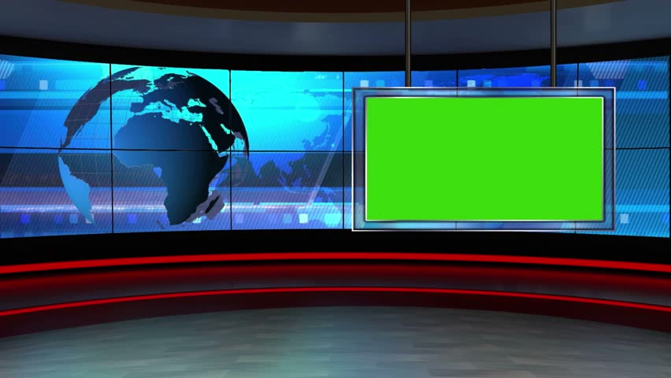
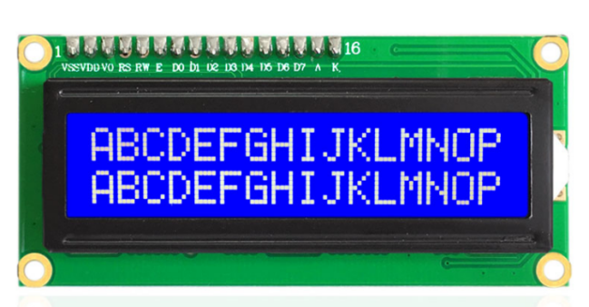
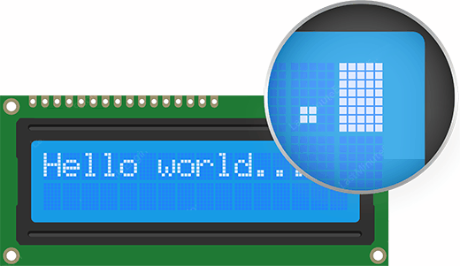
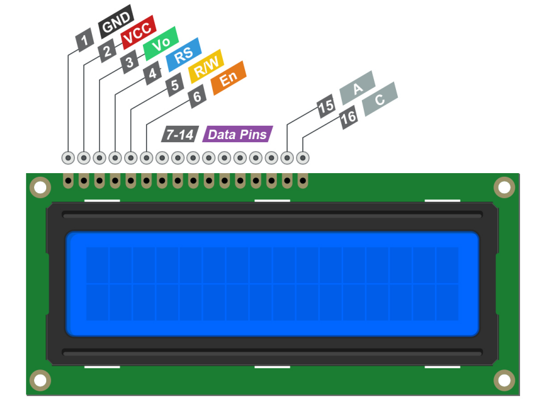
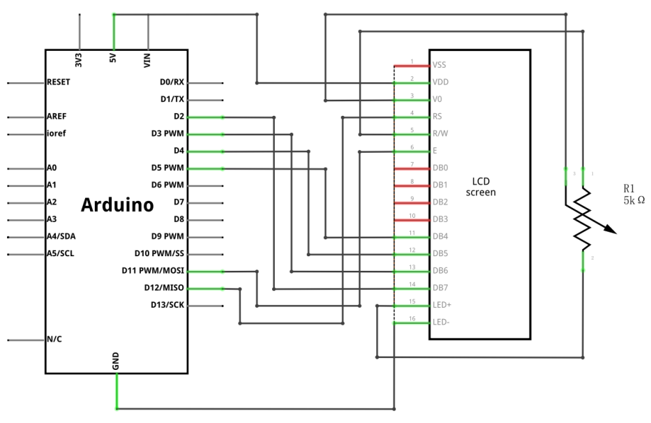
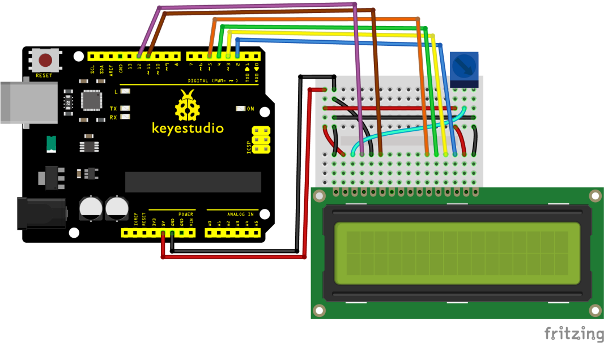
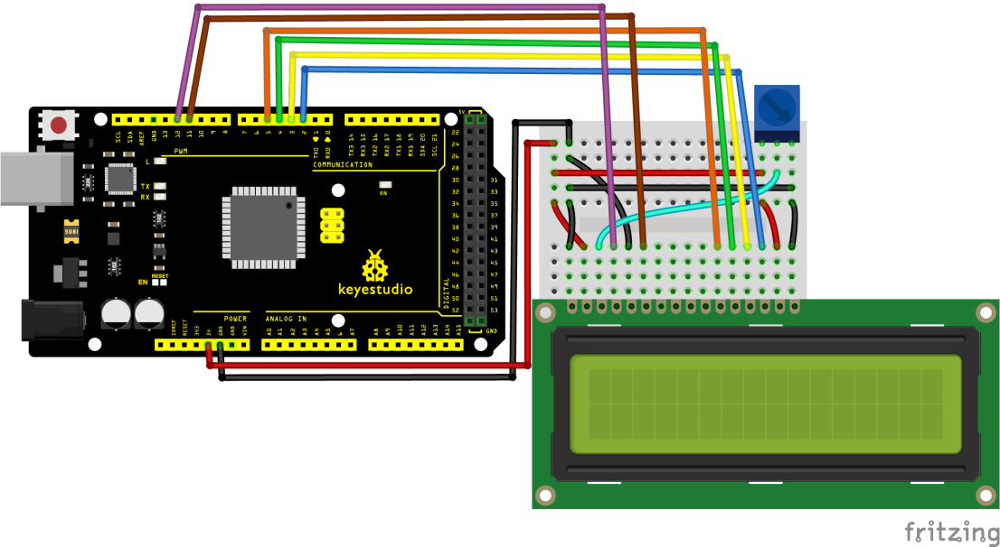
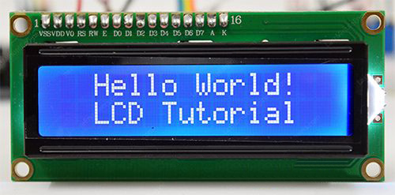

### Progetto 29: Modulo LCD 1602

**Descrizione**

 Vuoi che i tuoi progetti Arduino visualizzino messaggi di stato o letture di sensori? Allora questi display LCD potrebbero essere la soluzione perfetta. Sono estremamente comuni e un modo rapido per aggiungere un'interfaccia leggibile al tuo progetto.

**Specifiche**

| Power Supply    | 3.3-5V                               |
|-----------------|--------------------------------------|
| Display Mode    | STN, BLUB                            |
| Display Formate | 16 Character x 2 Line                |
| Input Data      | 4-Bits or 8-Bits interface available |
| Display Font    | 5 x 8 Dots                           |
| Driving Scheme  | 1/16Duty,1/5Bias                     |
| BACKLIGHT       | blue                                 |

**Come funziona?**

Questi LCD sono ideali per visualizzare solo testo/caratteri, da cui il nome "Character LCD". Il display ha una retroilluminazione a LED e può visualizzare 32 caratteri ASCII su due righe con 16 caratteri per riga.

Ogni rettangolo contiene una griglia di 5×8 pixel

Se guardi attentamente, puoi effettivamente vedere i piccoli rettangoli per ogni carattere sul display e i pixel che compongono un carattere. Ognuno di questi rettangoli è una griglia di 5×8 pixel.

Sebbene visualizzino solo testo, sono disponibili in molte dimensioni e colori: ad esempio, 16×1, 16×4, 20×4, con testo bianco su sfondo blu, con testo nero su verde e molti altri.

La buona notizia è che tutti questi display sono "intercambiabili" – se costruisci il tuo progetto con uno, puoi semplicemente scollegarlo e usarne un altro LCD di dimensioni/colore a tua scelta. Il tuo codice potrebbe dover adattarsi alle dimensioni maggiori, ma almeno il cablaggio è lo stesso!

Pinout

GND dovrebbe essere collegato alla massa di Arduino.

VCC è l'alimentazione per l'LCD che colleghiamo al pin da 5 volt sull'Arduino.

Vo (LCD Contrast) controlla il contrasto e la luminosità dell'LCD. Utilizzando un semplice divisore di tensione con un potenziometro, possiamo effettuare regolazioni fini del contrasto.

Il pin RS (Register Select) consente all'Arduino di comunicare all'LCD se sta inviando comandi o dati. Fondamentalmente, questo pin viene utilizzato per differenziare i comandi dai dati.

Ad esempio, quando il pin RS è impostato su LOW, stiamo inviando comandi all'LCD (come impostare il cursore in una posizione specifica, cancellare il display, scorrere il display a destra e così via). E quando il pin RS è impostato su HIGH, stiamo inviando dati/caratteri all'LCD.

Il pin R/W (Read/Write) sull'LCD serve a controllare se si stanno leggendo dati dall'LCD o scrivendo dati sull'LCD. Poiché stiamo usando questo LCD solo come dispositivo di OUTPUT, collegheremo questo pin a LOW. Questo lo forza in modalità WRITE.

Il pin En (Enable) viene utilizzato per abilitare il display. Ciò significa che quando questo pin è impostato su LOW, l'LCD non si preoccupa di ciò che sta accadendo con R/W, RS e le linee del bus dati; quando questo pin è impostato su HIGH, l'LCD sta elaborando i dati in ingresso.

D0-D7 (Data Bus) sono i pin che trasportano i dati a 8 bit che inviamo al display. Ad esempio, se vogliamo vedere il carattere maiuscolo "A" sul display, imposteremo questi pin su 0100 0001 (secondo la tabella ASCII) all'LCD.

I pin A-C (Anode & Cathode) vengono utilizzati per controllare la retroilluminazione dell'LCD.

**Schema di collegamento**

Colleghiamo il display LCD all'Arduino. Quattro pin dati (D4-D7) dall'LCD saranno collegati ai pin digitali dell'Arduino da \##4-7. Il pin Enable sull'LCD sarà collegato all'Arduino \##2 e il pin RS sull'LCD sarà collegato all'Arduino \##1.

**Codice di esempio**

> **Codice di esempio (Arduino Editor):** [Open in Arduino Cloud Editor](https://create.arduino.cc/editor/keyestudio/297ee0b0-c507-43fc-bc1d-90244e380dc7/preview?embed)

**Risultato dell'esempio**

Se tutto va bene, dovresti vedere qualcosa del genere sul display.

