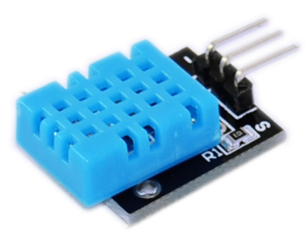
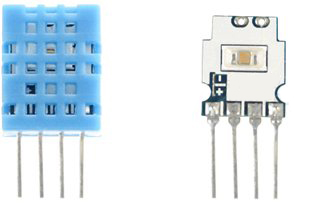
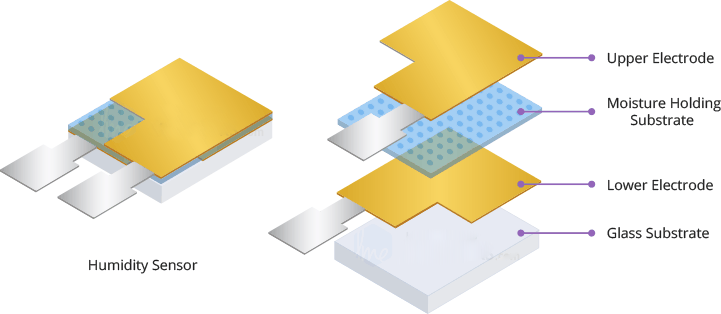
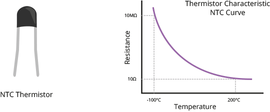
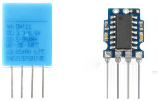
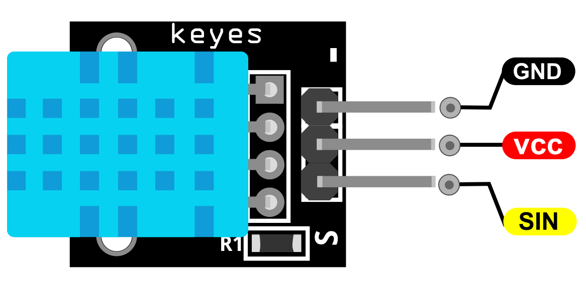
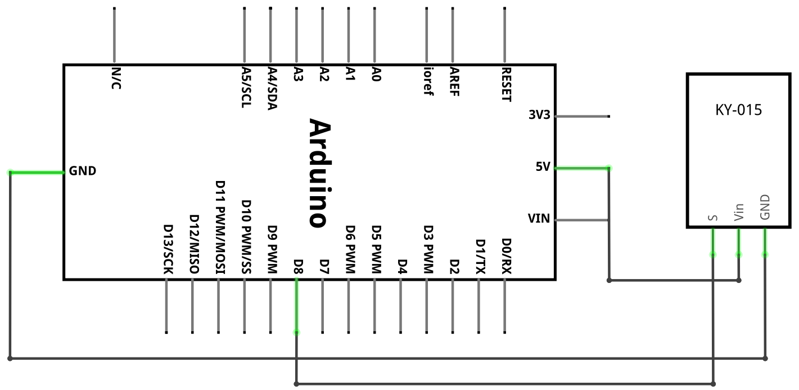
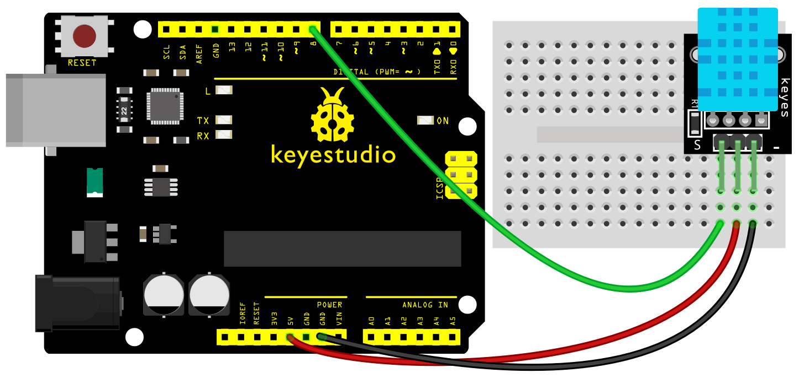
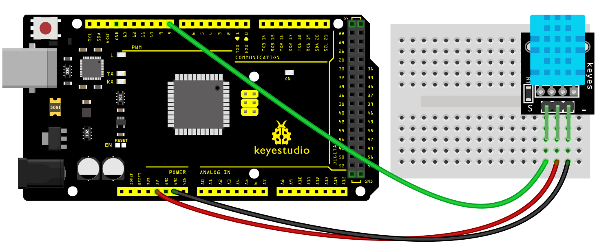
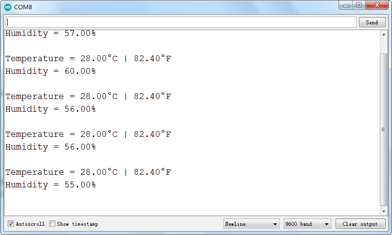

### Projekt 30: DHT11 Sensor

**Beschreibung**

 Verleihen Sie Ihrem nächsten Arduino-Projekt die Fähigkeit, seine Umgebung zu erfassen, mit dem kostengünstigen digitalen Temperatur- und Feuchtigkeitssensormodul DHT11 von AOSONG.

Dieser Sensor ist vorkalibriert und benötigt keine zusätzlichen Komponenten, sodass Sie sofort mit der Messung der relativen Luftfeuchtigkeit und Temperatur beginnen können.

**Spezifikation**

| Betriebsspannung                   | 3.3V bis 5.5V                 |
|------------------------------------|-------------------------------|
| Feuchtigkeitsmessbereich           | 20% bis 90% RH                |
| Feuchtigkeitsmessgenauigkeit       | ±5% RH                        |
| Feuchtigkeitsmessauflösung         | 1% RH                         |
| Temperaturmessbereich              | 0ºC bis 50ºC \[32ºF bis 122ºF\] |
| Temperaturmessgenauigkeit          | ±2ºC                          |
| Temperaturmessauflösung            | 1ºC                           |
| Signalübertragungsbereich          | 20m                           |

**Wie funktioniert es?**

Im Inneren des DHT11 befindet sich eine Feuchtigkeitssensor-Komponente zusammen mit einem Thermistor.

 Die Feuchtigkeitssensor-Komponente besteht aus zwei Elektroden mit einem feuchtigkeitsspeichernden Substrat, das dazwischen liegt.

Die Ionen werden vom Substrat freigesetzt, wenn Wasserdampf von ihm absorbiert wird, was wiederum die Leitfähigkeit zwischen den Elektroden erhöht.

Die Widerstandsänderung zwischen den beiden Elektroden ist proportional zur relativen Luftfeuchtigkeit. Eine höhere relative Luftfeuchtigkeit verringert den Widerstand zwischen den Elektroden, während eine niedrigere relative Luftfeuchtigkeit den Widerstand zwischen den Elektroden erhöht.

Der DHT11 enthält auch einen NTC/Thermistor zur Temperaturmessung. Ein Thermistor ist ein thermischer Widerstand, dessen Widerstand sich drastisch mit der Temperatur ändert. Der Begriff „NTC“ bedeutet „Negativer Temperaturkoeffizient“, was bedeutet, dass der Widerstand mit zunehmender Temperatur abnimmt.

Auf der anderen Seite befindet sich eine kleine Leiterplatte mit einem 8-Bit SOIC-14-Gehäuse-IC. Dieser IC misst und verarbeitet das analoge Signal mit gespeicherten Kalibrierungskoeffizienten, führt eine Analog-Digital-Wandlung durch und gibt ein digitales Signal mit Temperatur und Luftfeuchtigkeit aus.

Pinbelegung

- (VCC) Pin versorgt den Sensor mit Strom.

Der SIN-Pin wird zur Kommunikation zwischen dem Sensor und dem Arduino verwendet.

– (GND) sollte mit der Masse des Arduino verbunden werden.

**Verbindungsdiagramm**

Verbinden Sie die Stromleitung (Mitte) und Masse (-) jeweils mit +5 und GND. Verbinden Sie das Signal (S) mit Pin 8 am Arduino.

| **KY-015** | **Arduino** |
|------------|-------------|
| S          | Pin 8       |
| Mitte      | +5V         |
| –          | GND         |

DHT-Bibliothek installieren

DHT11-Sensoren verwenden ihr eigenes Ein-Draht-Protokoll zur Datenübertragung. Dieses Protokoll erfordert präzises Timing. Glücklicherweise wurde die **DHT Library** geschrieben, um all die Komplexität zu verbergen, sodass wir einfache Befehle zum Auslesen der Temperatur- und Feuchtigkeitsdaten verwenden können.

Laden Sie die Bibliothek zuerst herunter, indem Sie das [GitHub repo](https://github.com/RobTillaart/Arduino/tree/master/libraries/DHTlib) besuchen und die ZIP-Datei herunterladen:

<https://github.com/RobTillaart/Arduino/tree/master/libraries/DHTlib>

Um sie zu installieren, öffnen Sie die Arduino IDE, gehen Sie zu Sketch > Include Library > Add .ZIP Library und wählen Sie dann die gerade heruntergeladene DHTlib ZIP-Datei aus.

**Beispielcode**

> **Beispielcode (Arduino Editor):** [Im Arduino Cloud Editor öffnen](https://create.arduino.cc/editor/keyestudio/eb777384-8f6a-4d7f-bd23-5c34a2179980/preview?embed)

**Beispielergebnis**

Sobald der Sketch hochgeladen ist, öffnen Sie ein Serial Monitor-Fenster, um die Ausgabe vom Arduino zu sehen.

