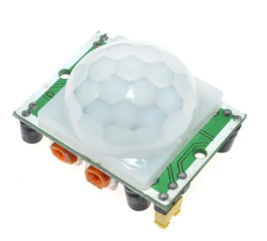
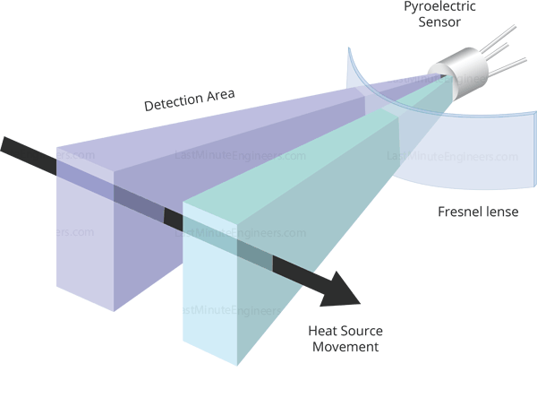
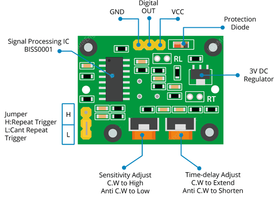
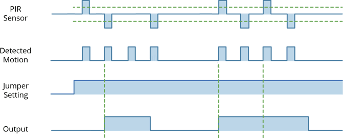
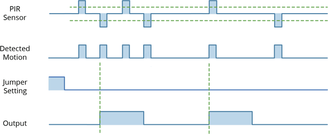
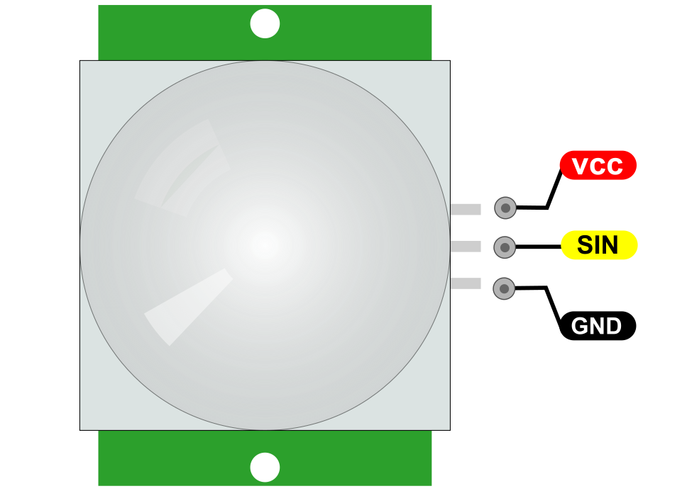
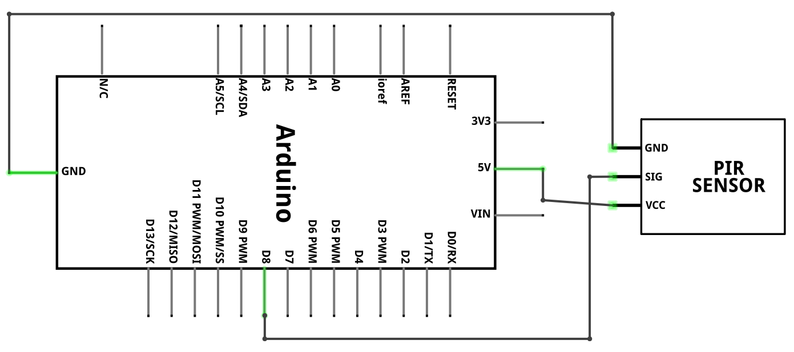
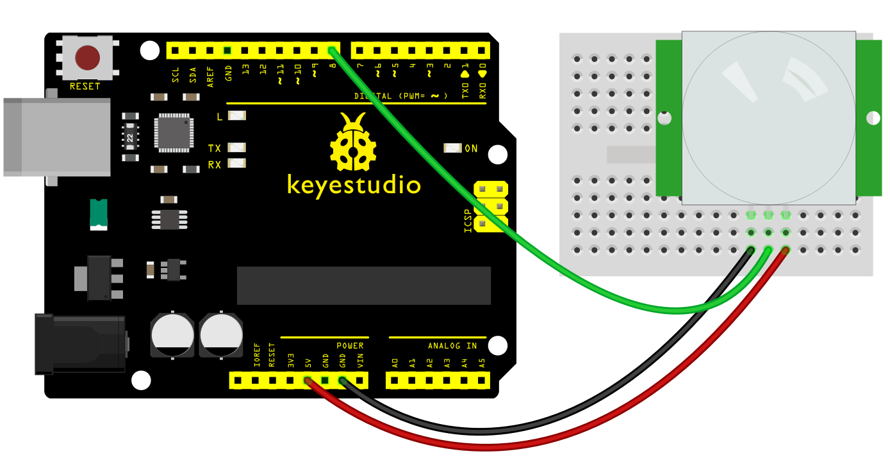
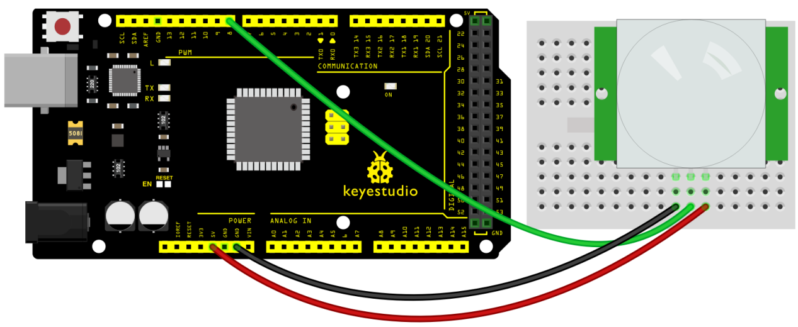
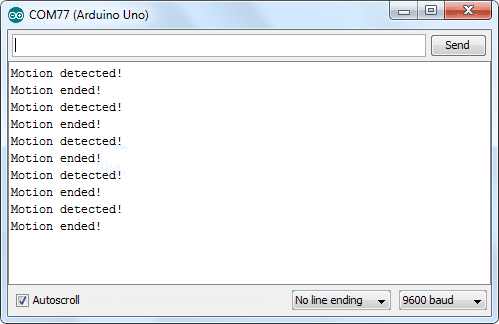

### Project 31: PIR Motion Sensor

**Description**

 Every mad scientist’s lab, or teenager’s secret room, needs advanced protection against intrusion by rogue agents or siblings. If you are one of them, you should probably consider getting a **Passive Infrared (PIR) sensor**. PIR sensors allow you to detect when someone is in your room when they shouldn’t be.

Though it may seem like something out of a spy movie, you likely use PIR sensors every day. This sensor is the same you will find in most modern security systems, automatic light switches, garage door openers and similar applications where the operation of some electrical device is necessary only in the presence of humans.

**Specification**

1.  Input Voltage: 3.3 ~ 5V, Maximum for 6V
2.  Working Current: 15uA
3.  Working Temperature: -20 ~ 85 ℃
4.  Output Voltage: High 3V, Low 0V
5.  Output Delay Time (High Level): About 2.3 to 3 Seconds
6.  Detection Angle: 100 °
7.  Detection Distance: 7 meters
8.  Output Indicator LED (if output HIGH, it will be ON)
9.  Limit Current for Pin: 100mA
10. Size: 30\*20mm
11. Weight: 4g

**How Does It Work?**

If you didn’t know, all objects with a temperature above Absolute Zero (0 Kelvin / -273.15 °C) emit heat energy in the form of infrared radiation, including human bodies. The hotter an object is, the more radiation it emits.

PIR sensor is specially designed to detect such levels of infrared radiation. It basically consists of two main parts: **A Pyroelectric Sensor** and a special lens called **Fresnel lens** which focuses the infrared signals onto the pyroelectric sensor.

A Pyroelectric Sensor actually has two rectangular slots in it made of a material that allows the infrared radiation to pass. Behind these, are two separate infrared sensor electrodes, one responsible for producing a positive output and the other a negative output. The reason for that is that we are looking for a change in IR levels and not ambient IR levels. The two electrodes are wired up so that they cancel each other out. If one half sees more or less IR radiation than the other, the output will swing high or low.

**When the sensor is idle**, i.e. there is no movement around the sensor; both slots detect the same amount of infrared radiation, resulting in a zero output signal.

**But when a warm body like a human or animal passes by**; it first intercepts one half of the PIR sensor, which causes a positive differential change between the two halves. When the warm body leaves the sensing area, the reverse happens, whereby the sensor generates a negative differential change. The corresponding pulse of signals results in the sensor setting its output pin high.

HC-SR501 PIR Motion Detector

For most of our Arduino projects that need to detect when a person has left or entered the area, or has approached, HC-SR501 PIR sensors are a great choice. They are low power and low cost, pretty rugged, have a wide lens range, easy to interface with and are insanely popular among hobbyists.

HC-SR501 PIR sensor has three output pins VCC, Output and Ground as shown in the diagram below. It has a built-in voltage regulator so it can be powered by any DC voltage from 4.5 to 12 volts, typically 5V is used. Other than this, there are a couple options you have with your PIR. Let’s check them out.

There are two potentiometers on the board to adjust a couple of parameters:

- **Sensitivity** – This sets the maximum distance that motion can be detected. It ranges from 3 meters to approximately 7 meters. The topology of your room can affect the actual range you achieve.
- **Time** – This sets how long that the output will remain HIGH after detection. At minimum it is 3 seconds, at maximum it is 300 seconds or 5 minutes.

Finally the board has a jumper (on some models the jumper is not soldered in). It has two settings:

- **H** – This is the Hold/Repeat/Retriggering. In this position the HC-SR501 will continue to output a HIGH signal as long as it continues to detect movement.
- **L** – This is the Intermittent or No-Repeat/Non-Retriggering. In this position the output will stay HIGH for the period set by the TIME potentiometer adjustment.

Pinout

VCC is the power supply for HC-SR501 PIR sensor which we connect the 5V pin on the Arduino.

SIN pin is a 3.3V TTL logic output. LOW indicates no motion is detected, HIGH means some motion has been detected.

GND should be connected to the ground of Arduino.

**Connection Diagram**

**Sample Code**

> **Sample Code (Arduino Editor):** [Open in Arduino Cloud Editor](https://create.arduino.cc/editor/keyestudio/80cbe42d-d2e1-4ba4-bb5c-ad74a74a9e25/preview?embed)

**Example Result**

At the end we will print a message on the serial monitor when motion is detected.

