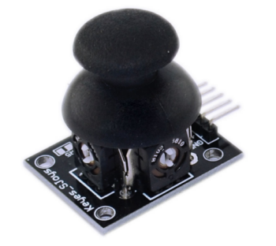
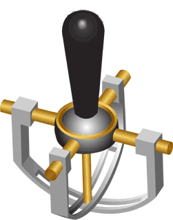
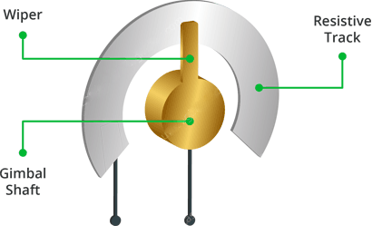
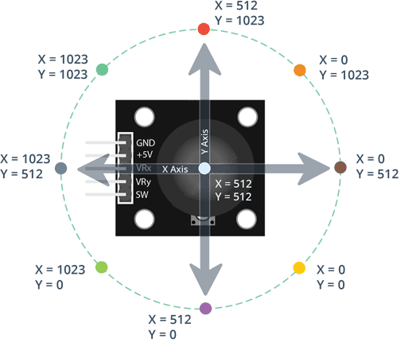
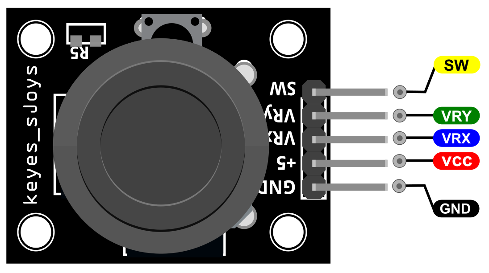
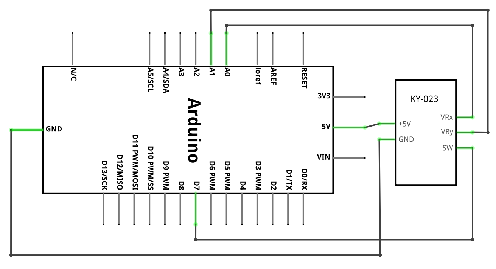
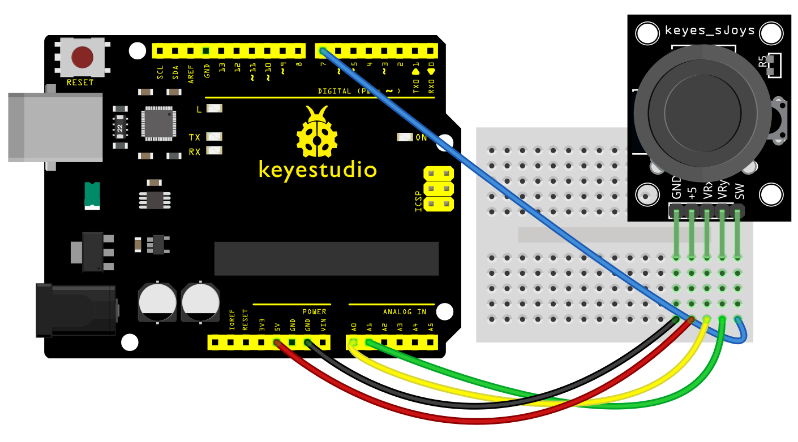
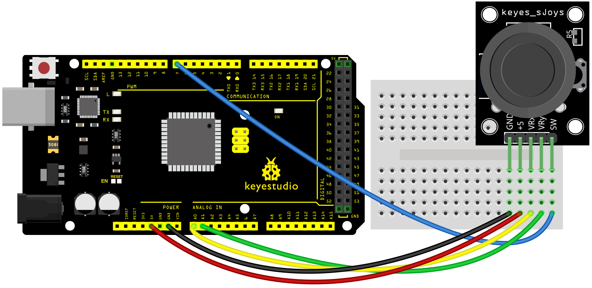
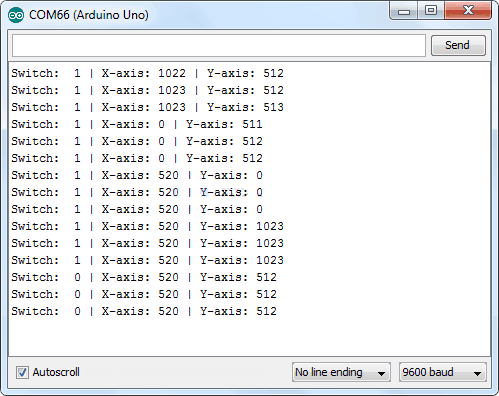

### Projet 32: Module Joystick

**Description**

 Lorsque vous entendez le mot **Joystick**, la première chose qui vous vient à l'esprit est celle des contrôleurs de jeu. Ils sont principalement utilisés pour jouer à des jeux, bien que dans l'électronique DIY, il y ait beaucoup de choses amusantes que vous pouvez faire avec. Par exemple, contrôler un robot/rover ou contrôler le mouvement d'une caméra ; ce ne sont que la pointe de l'iceberg.

**Spécification**

| Tension de fonctionnement | 3.3V à 5V |
|---|---|
| Dimensions de la carte | 2.6cm x 3.4cm \[1.02in x 1.22in\] |
| Interface | Analogique x2, Numérique x1 |

**Comment ça marche ?**

L'idée de base d'un joystick est de traduire la position du manche sur **deux axes** — l'**axe X** (de gauche à droite) et l'**axe Y** (de haut en bas) en informations électroniques qu'un Arduino peut traiter. Cela peut être un peu délicat, mais c'est rendu possible par la conception du joystick, qui se compose de deux potentiomètres et d'un **mécanisme de cardan**.

Mécanisme de cardan

Lorsque vous faites pivoter le joystick, la poignée du pouce déplace une tige étroite qui repose dans deux arbres à fentes rotatifs (cardan). L'un des arbres permet un mouvement sur l'axe X (gauche et droite) tandis que l'autre permet un mouvement sur l'axe Y (haut et bas). Incliner le manche vers l'avant et vers l'arrière fait pivoter l'arbre de l'axe Y d'un côté à l'autre. L'incliner de gauche à droite fait pivoter l'arbre de l'axe X. Lorsque vous déplacez le manche en diagonale, il fait pivoter les deux arbres.

Un potentiomètre est connecté à chaque arbre du joystick qui interprète la position de la tige comme des lectures analogiques. Le déplacement des arbres à fentes fait pivoter le bras de contact du potentiomètre. En d'autres termes, si vous poussez le manche à fond vers l'avant, il fera tourner le bras de contact du potentiomètre vers une extrémité de la piste, et si vous le tirez vers vous, il fera tourner le bras de contact dans l'autre sens.

Lecture des valeurs analogiques du Joystick

Pour lire la position physique du joystick, nous devons mesurer le changement de résistance d'un potentiomètre. Ce changement peut être lu par une broche analogique Arduino à l'aide d'un ADC.

Comme la carte Arduino a une résolution ADC de 10 bits, les valeurs sur chaque canal analogique (axe) peuvent varier de 0 à 1023. Ainsi, si le manche est déplacé sur l'axe X d'une extrémité à l'autre, les valeurs X changeront de 0 à 1023 et une chose similaire se produit lorsqu'il est déplacé le long de l'axe Y. Lorsque le joystick reste en position centrale, la valeur est d'environ 512.

Le graphique ci-dessous montre les directions X et Y et donne également une indication de la façon dont les sorties réagiront lorsque le joystick sera poussé dans différentes directions.

Brochage

GND est la broche de masse que nous connectons à la broche GND de l'Arduino.

VCC fournit l'alimentation du module. Vous pouvez le connecter à la sortie 5V de votre Arduino.

VRx donne la lecture du joystick dans la direction horizontale (coordonnée X), c'est-à-dire à quelle distance le joystick est poussé vers la gauche et la droite.

VRy donne la lecture du joystick dans la direction verticale (coordonnée Y), c'est-à-dire à quelle distance le joystick est poussé vers le haut et le bas.

SW est la sortie du bouton-poussoir. Il est normalement ouvert, ce qui signifie que la lecture numérique de la broche SW sera HIGH. Lorsque le bouton est enfoncé, il se connecte à GND, donnant une sortie LOW.

**Schéma de connexion**

Connectez VRx à la broche analogique A0 de l'Arduino et VRy à la broche analogique A1 de l'Arduino. Connectez la broche SW du joystick à la broche numérique D7 de l'Arduino.

**Exemple de code**

> **Exemple de code (Arduino Editor):** [Open in Arduino Cloud Editor](https://create.arduino.cc/editor/keyestudio/4b1b7392-115e-441b-aa8d-6352106039bf/preview?embed)

**Résultat de l'exemple**

Après avoir bien câblé et téléchargé le code, ouvrez le moniteur série du logiciel Arduino et réglez le débit en bauds sur 9600. Vous verrez la valeur affichée ci-dessous. Si vous poussez le joystick vers le bas / le haut / la gauche / la droite, les données changeront.

