### Project 33: Rotary Encoder Module
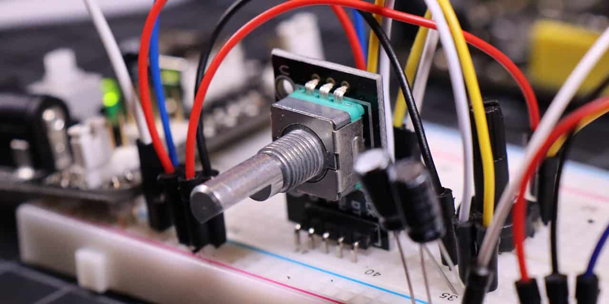

**Description**

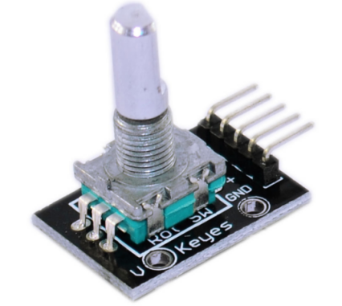 A rotary encoder is a type of position sensor that converts the angular position (rotation) of a knob into an output signal that is used to determine the direction in which the knob is being rotated.

Due to their robustness and precise digital control, they are used in many applications, including robotics, CNC machines, and printers.

There are two types of rotary encoders: absolute and incremental. The absolute encoder provides the exact position of the knob in degrees, while the incremental encoder reports how many increments the shaft has moved.

The rotary encoder used in this tutorial is an **incremental** type.

**Specification**

| Power Supply | 5V      |
|--------------|---------|
| Interface    | Digital |

**How Does It Work?**

Inside the encoder is a slotted disk connected to the common ground pin C, and two contact pins A and B, as illustrated below.

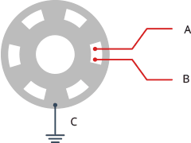

When you turn the knob, pins A and B come into contact with the common ground pin C in a specific order, depending on the direction of rotation.

When they make contact with the common ground, they produce signals. These signals are shifted 90° out of phase with each other, as one pin makes contact before the other. This is called **quadrature encoding**.

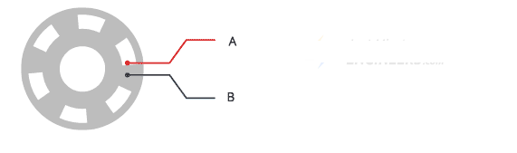

When you turn the knob clockwise, pin A connects first, followed by pin B. When you turn the knob counterclockwise, pin B connects first, followed by pin A.

By tracking when each pin connects to and disconnects from the ground, we can use these signal changes to determine the direction in which the knob is being rotated. You can do this by simply observing the state of B when A changes state.

When A changes state:

- if B != A, then the knob was turned clockwise.

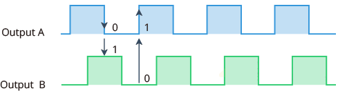

if B = A, then the knob was turned counterclockwise.

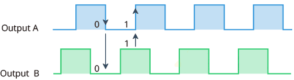

Pinout

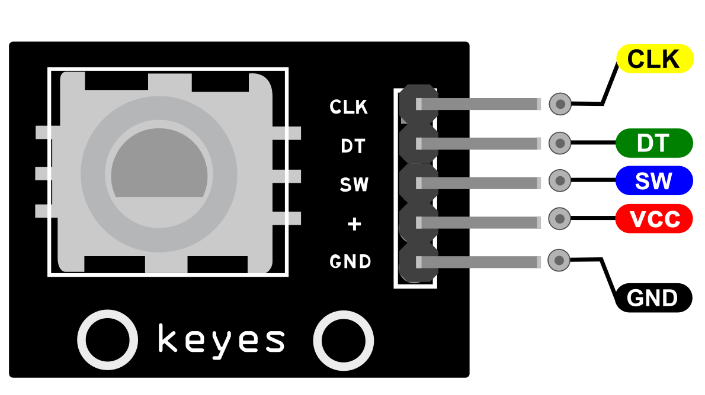

GND is the Ground connection.

VCC is the positive supply voltage, usually 3.3 or 5 Volts.

SW is the active low push button switch output. When the knob is pushed, the voltage goes LOW.

DT (Output B) is the same as the CLK output, but it lags the CLK by a 90° phase shift. This output can be used to determine the direction of rotation.

CLK (Output A) is the primary output pulse for determining the amount of rotation. Each time the knob is rotated by one detent (click) in either direction, the ‘CLK’ output goes through one cycle of going HIGH and then LOW.

**Connection Diagram**

connect the CLK and DT pins to digital pin2 and 3 respectively. Finally, connect the SW pin to a digital pin 4.

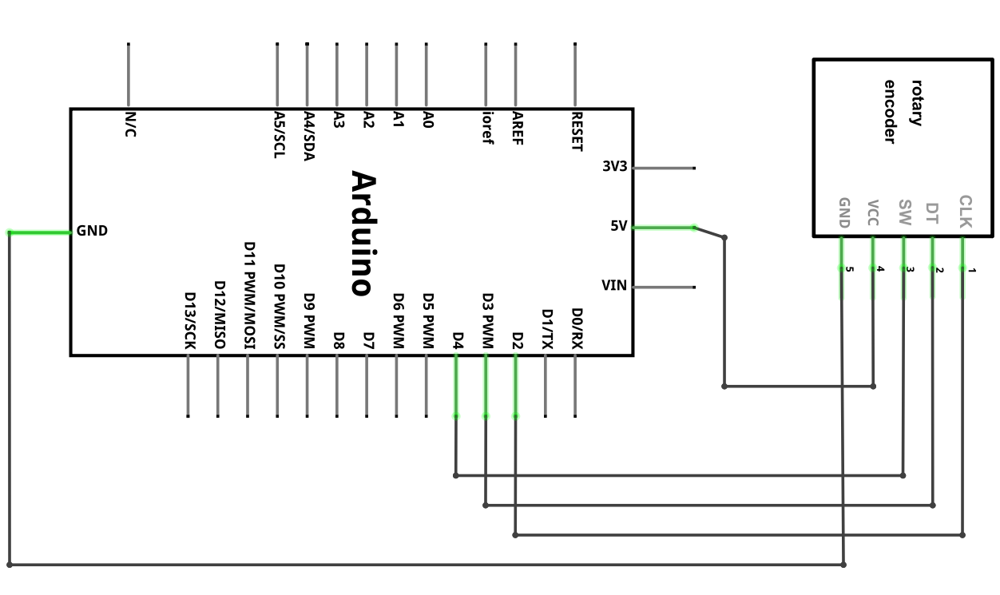

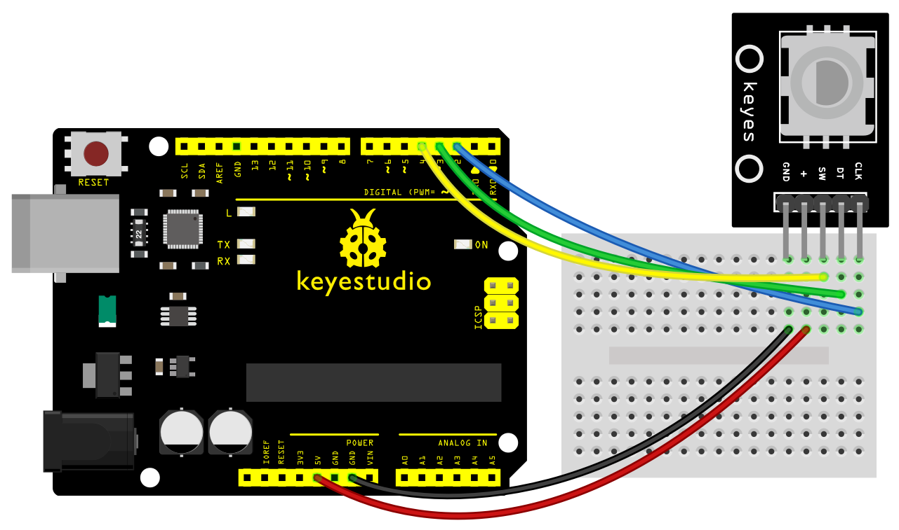

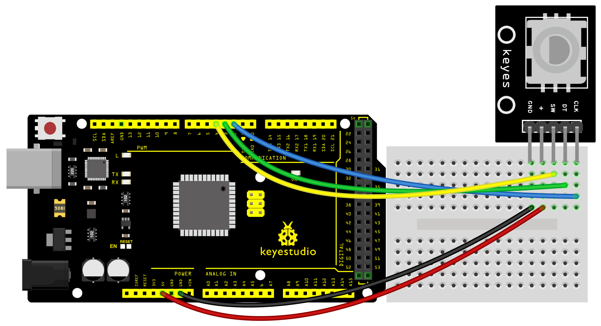

**Sample Code**

> **Sample Code (Arduino Editor):** [Open in Arduino Cloud Editor](https://create.arduino.cc/editor/keyestudio/6eff86c8-3892-43a1-8a85-ea46a2dbb954/preview?embed)

**Example Result**

If everything is fine, you should see the output below on the serial monitor.

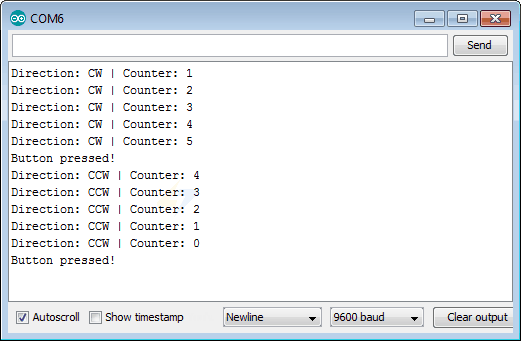