### Project 34: 4x4 membraantoetsenbord

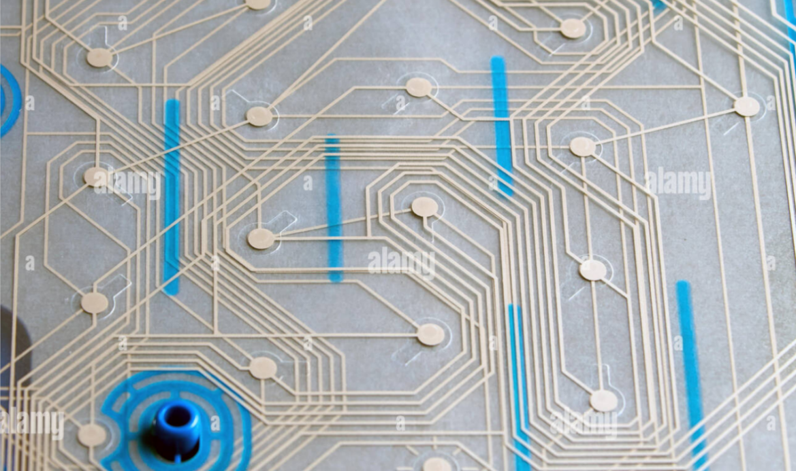

**Beschrijving**

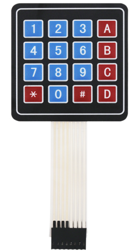 Een membraantoetsenbord is een toepassing van een membraanschakelaar met gerangschikte knoppen. Membraantoetsenborden zijn wereldwijd een veelgebruikt besturingssysteem, dat zowel praktisch als esthetisch is. Het bestaat uit een paneel, een bovenste circuit, een isolatielaag en een onderste circuit. Vanwege hun voordelen zoals een aantrekkelijk uiterlijk, modern design, compact formaat, lichtgewicht, sterke afdichting (vochtbestendig, stofdicht, voorkoming van olievervuiling, zuur- en alkalibestendigheid), schokbestendigheid en lange levensduur, worden ze vaak gebruikt in gebieden zoals medische instrumenten, computerbesturing, digitale werktuigmachines, elektronische weegapparatuur, post en telecommunicatie, kopieerapparaten, koelkasten, magnetrons, elektrische ventilatoren, wasmachines en elektronische speelautomaten.

**Specificatie**

| Nominale stroom        | 35V (DC), 100mA, 1W    |
|------------------------|------------------------|
| Contactweerstand       | 10Ω~500Ω               |
| Isolatieweerstand      | 100MΩ100V              |
| Diëlektrische sterkte  | 250VRms (50~60Hz 1min) |
| Elektrische schok schudden | <5ms                   |
| Levensduur: aanraaktype| ≥ 1 miljoen keer       |
| Werkspanning: aanraak  | 170~397g（6~14oz）     |
| Schakelpad             | T-Touch: 0.6~1.5mm     |
| Werktemperatuur        | -40 ~ +80              |
| Temperatuur            | 40,90％ ~ 95％, 240h   |
| Trilling               | 20G, maximaal          |

**Hoe werkt het?**

De knoppen op een toetsenbord zijn gerangschikt in rijen en kolommen. Een 4x4 toetsenbord heeft 4 rijen en 4 kolommen:

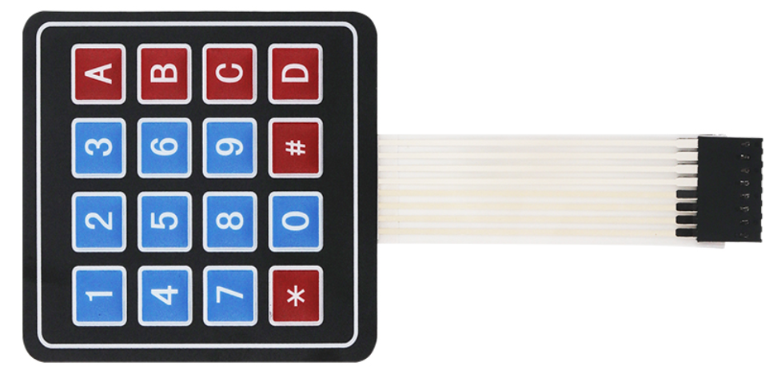

Onder elke toets bevindt zich een membraanschakelaar. Elke schakelaar in een rij is verbonden met de andere schakelaars in de rij door een geleidende spoor onder de pad. Elke schakelaar in een kolom is op dezelfde manier verbonden – één kant van de schakelaar is verbonden met alle andere schakelaars in die kolom door een geleidende spoor. Elke rij en kolom wordt naar een enkele pin geleid, voor een totaal van 8 pinnen op een 4x4 toetsenbord:

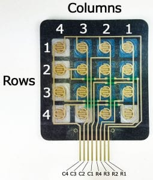

Het indrukken van een knop sluit de schakelaar tussen een kolom- en een rijspoor, waardoor stroom kan vloeien tussen een kolompin en een rijspin.

Het schema voor een 4x4 toetsenbord toont hoe de rijen en kolommen zijn verbonden:

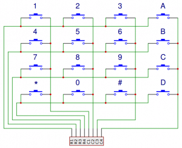

De Arduino detecteert welke knop wordt ingedrukt door de rij- en kolompin te detecteren die met de knop is verbonden.

Dit gebeurt in vier stappen:

1\. Ten eerste, wanneer er geen knoppen worden ingedrukt, worden alle kolom-pinnen HIGH gehouden en alle rij-pinnen LOW:

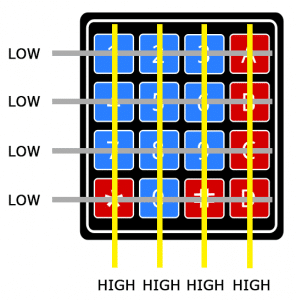

2\. Wanneer een knop wordt ingedrukt, wordt de kolom-pin LOW getrokken, aangezien de stroom van de HIGH-kolom naar de LOW-rij-pin stroomt:

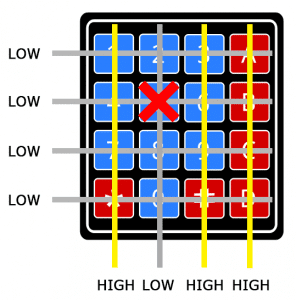

3\. De Arduino weet nu in welke kolom de knop zich bevindt, dus nu hoeft hij alleen nog de rij te vinden waarin de knop zich bevindt. Dit doet hij door elk van de rij-pinnen HIGH te schakelen en tegelijkertijd alle kolom-pinnen te lezen om te detecteren welke kolom-pin weer HIGH wordt:

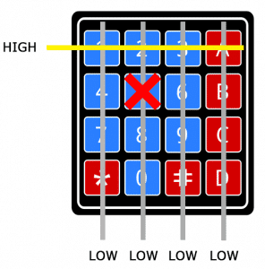

4\. Wanneer de kolom-pin weer HIGH wordt, heeft de Arduino de rij-pin gevonden die met de knop is verbonden:

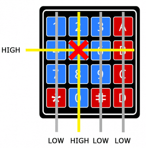

Uit het bovenstaande diagram kunt u zien dat de combinatie van rij 2 en kolom 2 alleen kan betekenen dat de knop nummer 5 is ingedrukt.

Pin-indeling

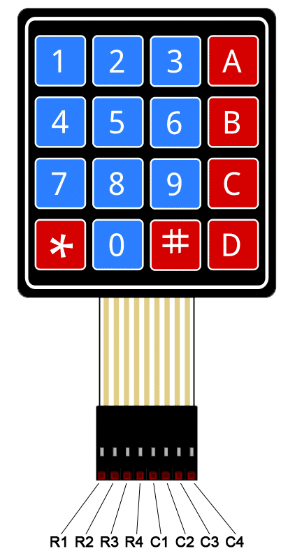

**Aansluitschema**

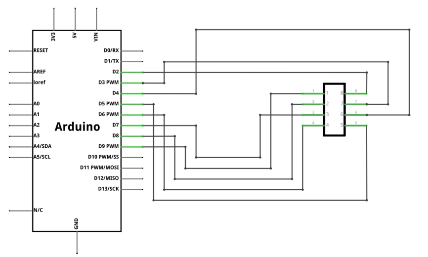

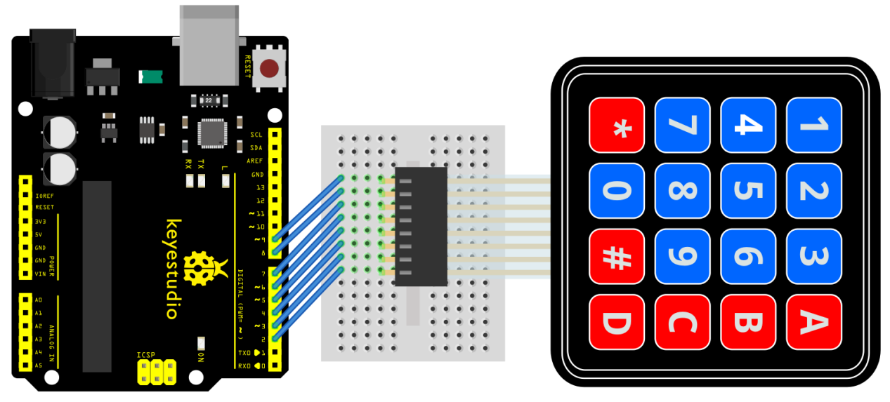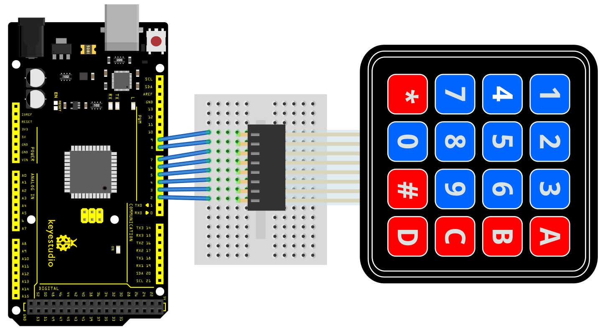

**Voorbeeldcode**

> **Voorbeeldcode (Arduino Editor):** [Open in Arduino Cloud Editor](https://create.arduino.cc/editor/keyestudio/6faccd43-7da7-4f10-9c00-36cd0c7e62c4/preview?embed)

**Voorbeeldresultaat**

Nadat u de code heeft geüpload, opent u de seriële monitor. Wanneer u op een toets drukt, wordt de waarde afgedrukt:

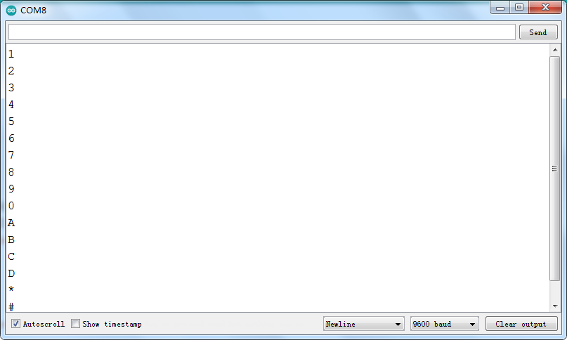