### Progetto 35: Sensore a ultrasuoni HC-SR04
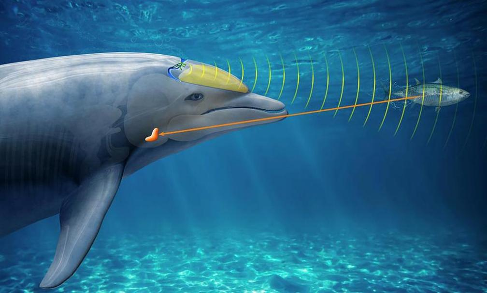

**Descrizione**

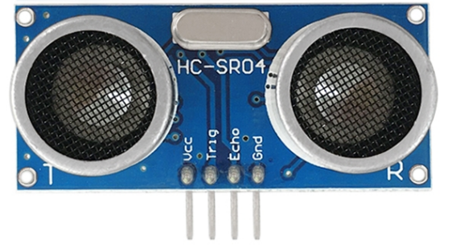 Dai al tuo prossimo progetto Arduino poteri da pipistrello con un sensore di distanza a ultrasuoni HC-SR04 che può segnalare la distanza degli oggetti fino a 13 piedi di distanza. Questa è un'informazione davvero utile se stai cercando di evitare che il tuo robot si scontri contro un muro! Sono a basso consumo (adatti per dispositivi alimentati a batteria), economici, facili da interfacciare e incredibilmente popolari tra gli hobbisti. E come bonus, ha anche un aspetto accattivante, come un paio di occhi di robot Wall-E per la tua ultima invenzione robotica!

**Cos'è l'ultrasuono?**

L'ultrasuono è un'onda sonora ad alta frequenza, con frequenze superiori al limite udibile dell'udito umano.

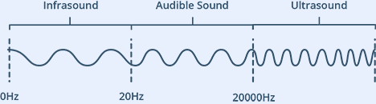

Le orecchie umane possono sentire onde sonore che vibrano nell'intervallo da circa 20 volte al secondo (un rumore profondo e rimbombante) a circa 20.000 volte al secondo (un fischio acuto). Tuttavia, l'ultrasuono ha una frequenza superiore a 20.000 Hz ed è quindi inudibile per gli esseri umani.

Panoramica hardware

Al suo interno, il sensore di distanza a ultrasuoni HC-SR04 è costituito da due trasduttori a ultrasuoni. Uno agisce come trasmettitore che converte il segnale elettrico in impulsi sonori ultrasonici a 40 KHz. Il ricevitore ascolta gli impulsi trasmessi. Se li riceve, produce un impulso di uscita la cui larghezza può essere utilizzata per determinare la distanza percorsa dall'impulso. Semplice come bere un bicchier d'acqua!

Il sensore è piccolo, facile da usare in qualsiasi progetto di robotica e offre un'eccellente rilevazione di distanza senza contatto tra 2 cm e 400 cm (circa un pollice a 13 piedi) con una precisione di 3 mm. Poiché funziona a 5 volt, può essere collegato direttamente a un Arduino o a qualsiasi altro microcontrollore logico a 5V.

**Specifiche**

| Tensione operativa   | DC 5V          |
|----------------------|----------------|
| Corrente operativa   | 15mA           |
| Frequenza operativa  | 40KHz          |
| Portata massima      | 4m             |
| Portata minima       | 2cm            |
| Precisione di misurazione | 3mm            |
| Angolo di misurazione | 15 gradi       |
| Segnale di ingresso trigger | Impulso TTL da 10µS |
| Dimensione           | 45 x 20 x 15mm |

**Come funziona?**

Tutto inizia quando un impulso di almeno 10 µS (10 microsecondi) di durata viene applicato al pin Trigger. In risposta a ciò, il sensore trasmette un'esplosione sonora di otto impulsi a 40 KHz. Questo schema a 8 impulsi rende la 
«firma ultrasonica» del dispositivo unica, consentendo al ricevitore di differenziare il modello trasmesso dal rumore ultrasonico ambientale.

Gli otto impulsi ultrasonici viaggiano attraverso l'aria lontano dal trasmettitore. Nel frattempo, il pin Echo passa a HIGH per iniziare a formare l'inizio del segnale di ritorno dell'eco.

Nel caso in cui tali impulsi non vengano riflessi, il segnale Echo andrà in timeout dopo 38 mS (38 millisecondi) e tornerà a LOW. Pertanto, un impulso di 38 mS indica l'assenza di ostruzioni all'interno del raggio d'azione del sensore.

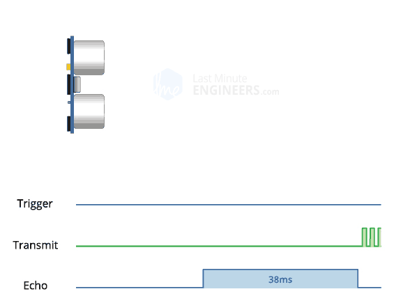

Se tali impulsi vengono riflessi, il pin Echo passa a LOW non appena il segnale viene ricevuto. Ciò produce un impulso la cui larghezza varia tra 150 µS e 25 mS, a seconda del tempo impiegato per la ricezione del segnale.

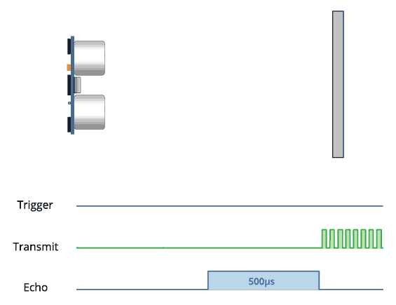

La larghezza dell'impulso ricevuto viene quindi utilizzata per calcolare la distanza dall'oggetto riflesso. Questo può essere calcolato utilizzando la semplice equazione distanza-velocità-tempo, che abbiamo imparato al liceo. Nel caso in cui l'avessi dimenticata, un modo semplice per ricordare le equazioni di distanza, velocità e tempo è quello di mettere le lettere in un triangolo.

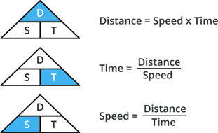

Prendiamo un esempio per renderlo più chiaro. Supponiamo di avere un oggetto davanti al sensore a una distanza sconosciuta e di aver ricevuto un impulso di larghezza 500 µS sul pin Echo. Ora calcoliamo quanto dista l'oggetto dal sensore. Useremo l'equazione seguente.

Distanza = Velocità x Tempo

Qui, abbiamo il valore del Tempo, cioè 500 µs, e conosciamo la velocità. Quale velocità abbiamo? La velocità del suono, ovviamente! È 340 m/s. Dobbiamo convertire la velocità del suono in cm/µs per calcolare la distanza. Una rapida ricerca su Google per "velocità del suono in centimetri per microsecondo" dirà che è 0,034 cm/µs. Potresti fare i calcoli, ma cercarlo è più facile. Ad ogni modo, con queste informazioni, possiamo calcolare la distanza!

Distanza = 0.034 cm/µs x 500 µs

Ma non è finita! Ricorda che l'impulso indica il tempo impiegato dal segnale per essere inviato e riflesso, quindi per ottenere la distanza, dovrai dividere il risultato a metà.

Distanza = (0.034 cm/µs x 500 µs) / 2

Distanza = 8.5 cm

Quindi, ora sappiamo che l'oggetto si trova a **8,5 centimetri** dal sensore.

Pinout

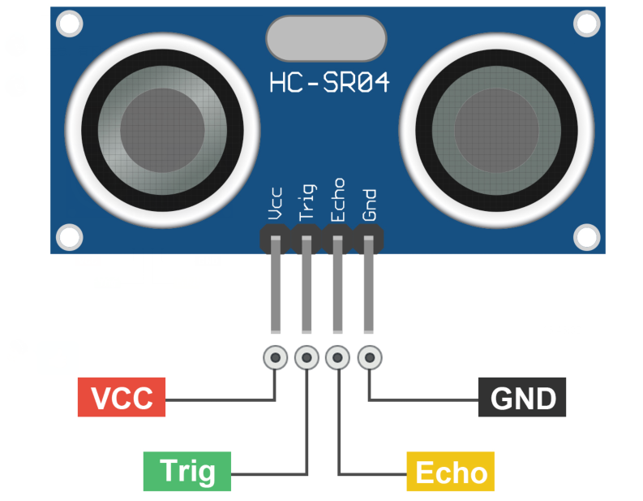

VCC è l'alimentazione per il sensore di distanza a ultrasuoni HC-SR04 che colleghiamo al pin 5V sull'Arduino.

Il pin Trig viene utilizzato per attivare gli impulsi sonori ultrasonici.

Il pin Echo produce un impulso quando il segnale riflesso viene ricevuto. La lunghezza dell'impulso è proporzionale al tempo impiegato per rilevare il segnale trasmesso.

GND deve essere collegato alla massa dell'Arduino.

**Schema di collegamento**

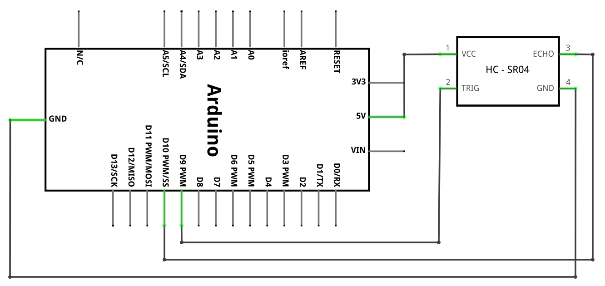

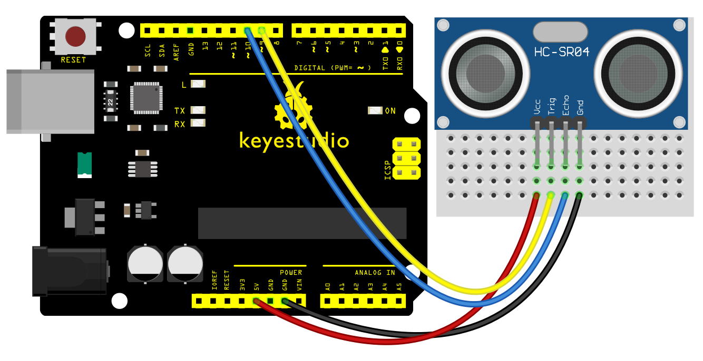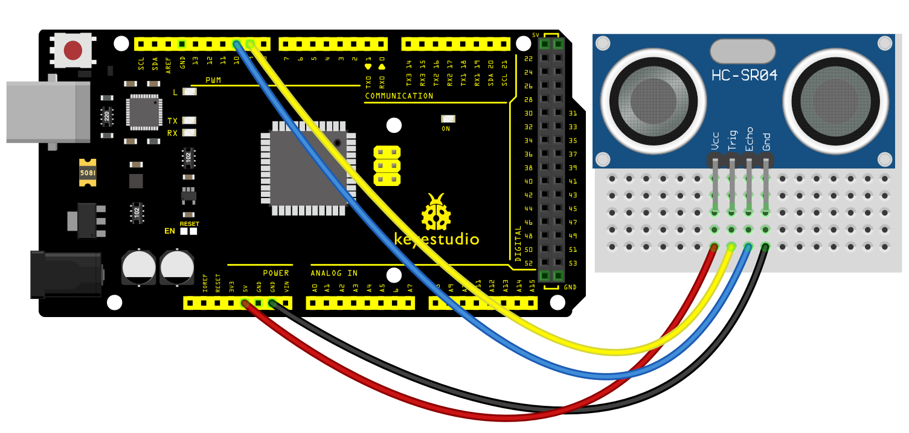

**Codice di esempio**

> **Codice di esempio (Arduino Editor):** [Open in Arduino Cloud Editor](https://create.arduino.cc/editor/keyestudio/8b517b27-cea2-4c93-a21f-d212f751f002/preview?embed)

**Risultato dell'esempio**

Dopo aver caricato il codice sulla scheda, aprire il monitor seriale. Quando si posiziona un oggetto davanti al sensore a ultrasuoni (da vicino e da lontano), esso rileverà la distanza dell'oggetto. Il valore verrà visualizzato sul monitor come mostrato di seguito.

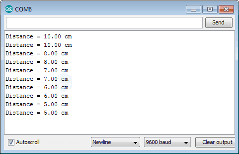

> **Nota:** Questa sezione non è ancora stata tradotta e viene visualizzata in inglese originale.