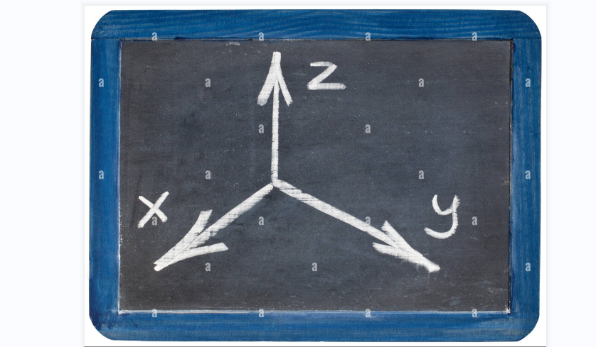
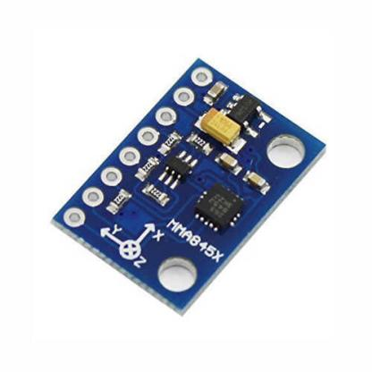
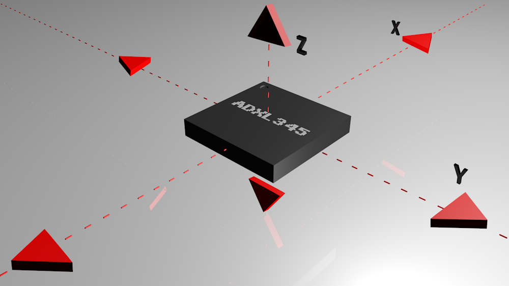
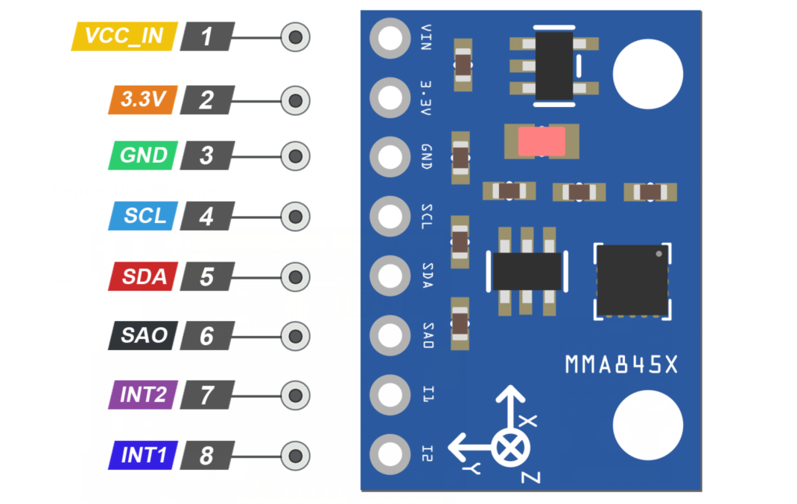
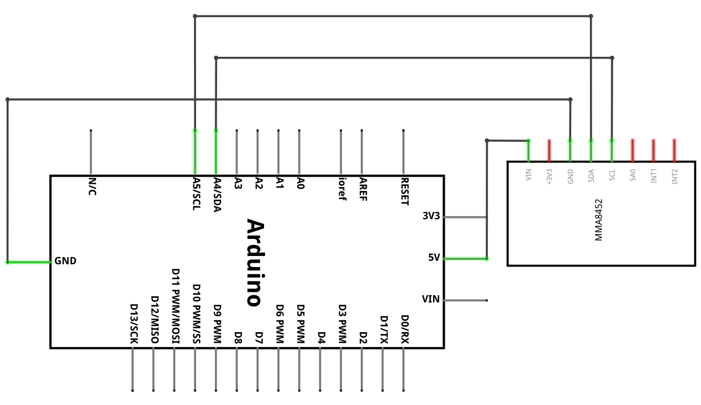
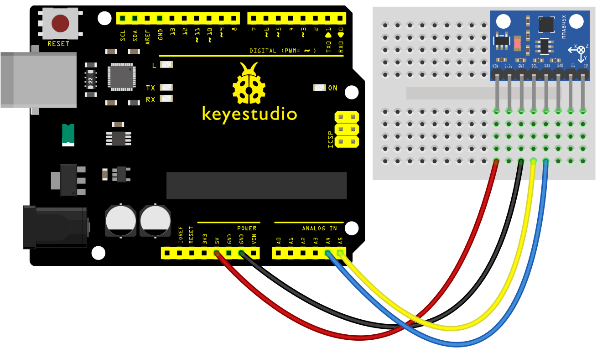
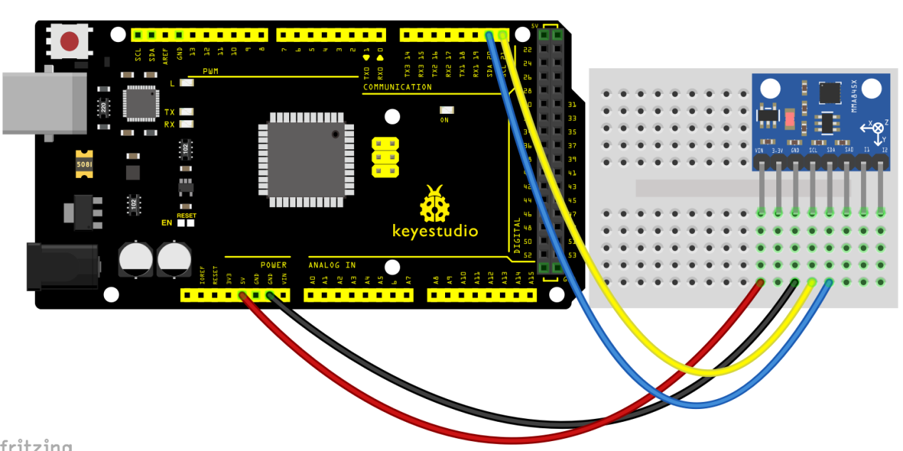
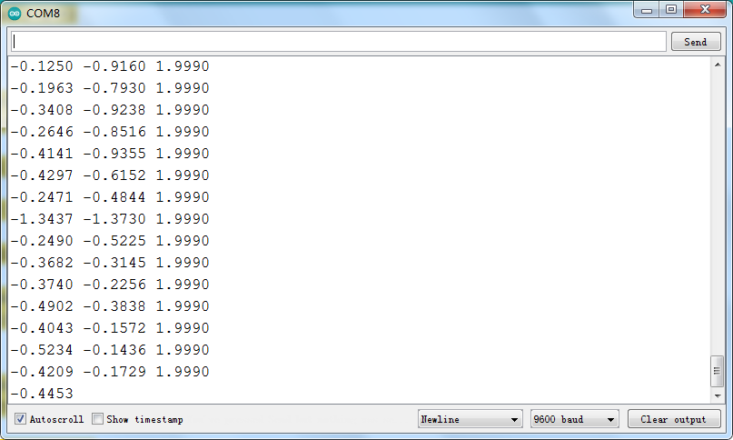

### プロジェクト36: MMA8452Q デジタル加速度センサー

**説明**

 MMA8452Q はスマートで低消費電力の3軸静電容量式マイクロマシン加速度センサーで、12ビット分解能を備えています。

この加速度センサーは豊富な組み込み機能を持ち、柔軟なユーザープログラマブルオプションと2つの割り込みピン構成を特徴としています。

組み込みの割り込み機能は全体の消費電力を節約でき、メインプロセッサでデータを常時ポーリングする負担を軽減します。

さらに、MMA8452Q は ±2g / ±4g / ±8g のユーザー選択可能なレンジを持ち、高域通過フィルタ済みデータと非フィルタデータをリアルタイムで出力できます。

本デバイスは慣性によるウェイクアップ割り込み信号を生成する組み込み機能を設定でき、静止状態でイベントを監視しながら低消費電力モードを維持できます。

**仕様**

- 電源電圧：1.95 V～3.6 V
- インターフェース電圧：1.6 V～3.6 V
- ±2g/±4g/±8g の選択可能レンジ
- 出力データレート（ODR）範囲：1.56 Hz～800 Hz
- ノイズ：99 μg/√Hz
- 12ビットおよび8ビットのデジタル出力;
- I2C デジタル出力インターフェース（プルアップ抵抗が4.7 kΩのとき最大2.25 MHz）;
- 2つのプログラム可能な割り込みピンが6つの割り込みソースに対応;
- 3つのモーション検出組み込みチャネル：フリーフォール検出、パルス検出、シェイク検出;
- 方向（横／縦）検出およびラグ補償の設定;
- 自動復帰（arousal）および自動休止（auto-dormant）時のODRを自動的に変更可能;
- ハイパスフィルタ処理済みデータをリアルタイムで出力可能;
- 消費電流：6 μA～165 μA

**動作原理**

加速度計の動作原理はそれほど複雑ではありません。加速度の力を単位（g）で計測し、1軸・2軸・3軸のいずれかの平面で測定を行います。現在、最も一般的に使われているのは3軸加速度計で、これはそれぞれ異なる方向（X、Y、Z平面）で加速度を測定する3つの個別の加速度計から構成されています。

ある平面での加速度がセンサーの向きと反対方向に働く場合、その軸の加速度は負の値として測定されます。逆に同じ方向に働く場合は正の値として測定されます。

外部からの加速度が加わらない場合、デバイスは自由落下の基準加速度、すなわち重力加速度のみを測定します。3軸加速度計が X軸が左、Y軸が下、Z軸が前方を向くように配置され、外力が加わらない場合、加速度計は次のように示します：X = 0 g、Y = 1 g、Z = 0 g。もし同じ加速度計を左に傾けると、X = 1 g、Y = 0 g、Z = 0 g を示します。同様に右に傾けると X軸は X = -1 g を示します。こうした加速度測定の依存性は、加速度制御システムのアルゴリズムで利用されます。

ピン配置

 VCC_IN はモジュールの電源です。Arduino の 5V 出力に接続してください。

3.3V はモジュールの電源です。Arduino の 3.3V 出力に接続してください。

GND は Arduino の GND に接続してください。

SCL は I2C のクロックピンです。これはバスマスターから供給されるタイミング信号です。Arduino の SCL ピンに接続してください。

SDA は I2C のデータピンです。このラインは送受信の両方に使われます。Arduino の SDA ピンに接続してください。

**接続図**

**サンプルコード**

> **サンプルコード (Arduino エディタ)：** [Arduino Cloud エディタで開く](https://create.arduino.cc/editor/keyestudio/288a0f7e-9d9a-43e8-af93-7923029c246b/preview?embed)

**実行結果の例**

上図の配線どおりに接続しコードを書き込んだ後、電源を入れてシリアルモニタを開くと、センサーの三軸加速度とその状態が下図のように表示されます。

