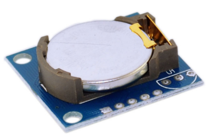
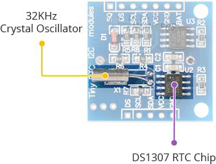
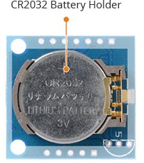
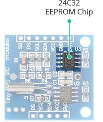
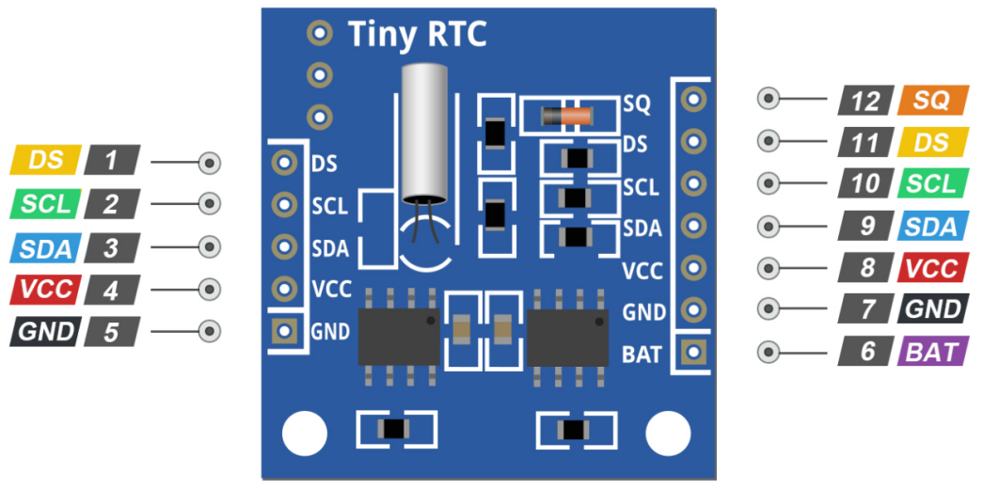
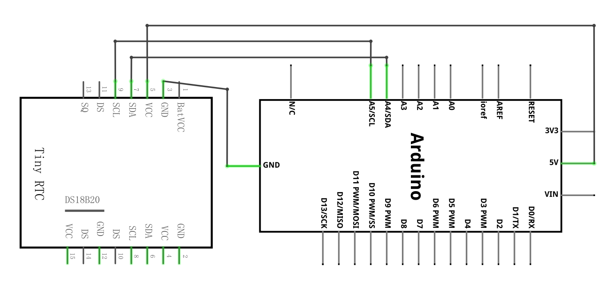
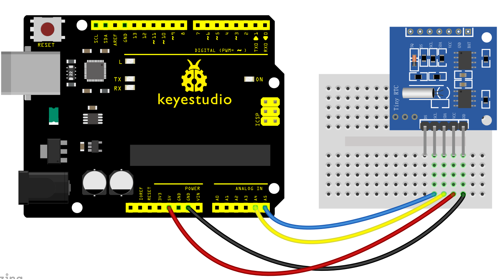
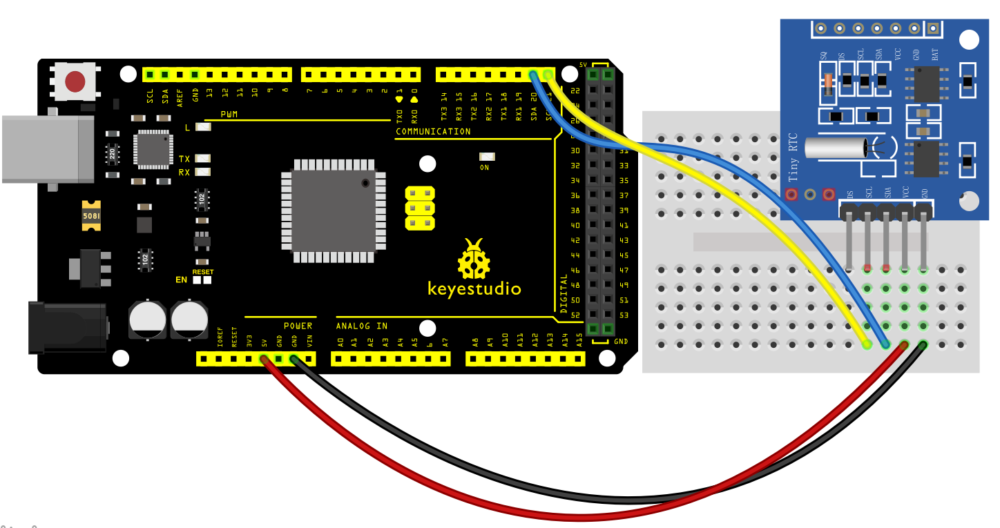
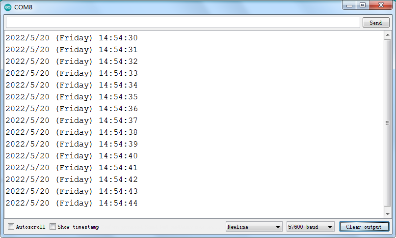

### Proyecto 37: Módulo de reloj DS1307

**Descripción**

 Todos sabemos que la mayoría de los MCUs que usamos para nuestros proyectos son agnósticos al tiempo; en pocas palabras, no son conscientes del tiempo que los rodea. Está bien para la mayoría de nuestros proyectos, pero de vez en cuando, cuando te encuentras con una idea en la que mantener el tiempo es una preocupación primordial, el módulo RTC DS1307 es un salvador. Es perfecto para proyectos que contienen registro de datos, construcción de relojes, marcas de tiempo, temporizadores y alarmas.

Chip RTC DS1307

En el corazón del módulo se encuentra un chip RTC de bajo costo y bastante preciso de Maxim – **DS1307**. Gestiona todas las funciones de cronometraje y cuenta con una sencilla interfaz I2C de dos hilos que se puede interconectar fácilmente con cualquier microcontrolador de su elección.

El chip mantiene información de segundos, minutos, horas, día, fecha, mes y año. La fecha de fin de mes se ajusta automáticamente para meses con menos de 31 días, incluyendo correcciones para años bisiestos (válido hasta 2100). El reloj funciona en formato de 24 horas o 12 horas con un indicador AM/PM.

Otra característica interesante de esta placa es el pin SQW, que emite una de cuatro frecuencias de onda cuadrada: 1Hz, 4kHz, 8kHz o 32kHz, y se puede habilitar programáticamente.

El DS1307 viene con un cristal externo de 32kHz para el cronometraje. El problema con estos cristales es que la temperatura externa puede afectar su frecuencia de oscilación. Este cambio de frecuencia es insignificante, pero sin duda se acumula.

Esto puede sonar como un problema, pero no lo es. En realidad, resulta en que el reloj se desvía unos cinco minutos al mes.

Batería de respaldo

El DS1307 incorpora una entrada de batería y mantiene un cronometraje preciso cuando se interrumpe la alimentación principal del dispositivo.

El circuito de detección de energía incorporado monitorea continuamente el estado de VCC para detectar fallas de energía y cambia automáticamente a la fuente de alimentación de respaldo. Por lo tanto, no tiene que preocuparse por los cortes de energía, su MCU aún puede realizar un seguimiento del tiempo.

La parte inferior de la placa contiene un soporte de batería para pilas de botón de litio de 20 mm y 3 V. Cualquier batería CR2032 puede encajar bien.

Suponiendo que se utiliza una batería CR2032 completamente cargada con una capacidad de 47 mAh y que el chip consume su mínimo de 300 nA, la batería puede mantener el RTC funcionando durante un mínimo de 17,87 años sin una fuente de alimentación externa de 5 V.

**47mAh/300nA = 156666.67 horas = 6527.78 días = 17.87 años**

EEPROM 24C32 integrada

El módulo RTC DS1307 también viene con un chip EEPROM 24C32 de 32 bytes de Atmel con ciclos de lectura-escritura limitados. Se puede usar para guardar configuraciones o realmente cualquier cosa.

La EEPROM 24C32 utiliza la interfaz I2C para la comunicación y comparte el mismo bus I2C que el DS1307.

La EEPROM 24C32 integrada tiene una dirección I2C cableada y está configurada en 0x50HEX.

Pinout

El pin SQ emite una de cuatro frecuencias de onda cuadrada: 1Hz, 4kHz, 8kHz o 32kHz, y se puede habilitar programáticamente.

Se supone que el pin DS emite lecturas de temperatura si su módulo tiene un sensor de temperatura DS18B20 instalado justo al lado del soporte de la batería (etiquetado como U1).

SCL es la entrada de reloj para la interfaz I2C y se utiliza para sincronizar el movimiento de datos en la interfaz serie.

SDA es la entrada/salida de datos para la interfaz serie I2C.

El pin VCC suministra energía al módulo. Puede estar entre 3.3V y 5.5V.

GND es un pin de tierra.

BAT es una entrada de suministro de respaldo para cualquier celda de litio estándar de 3V u otra fuente de energía para mantener un cronometraje preciso cuando se interrumpe la alimentación principal del dispositivo.

**Diagrama de conexión**

Conectando el pin VCC a la salida de 5V del Arduino y conectando GND a tierra.

En la placa UNO, los pines SDA (línea de datos) y SCL (línea de reloj) se encuentran en los encabezados de pines cerca del pin AREF. También se conocen como A5 (SCL) y A4 (SDA).

Si tienes una placa Mega, ¡los pines son diferentes! Querrás usar los pines digitales 21 (SCL) y 20 (SDA). Consulta la siguiente tabla para una comprensión rápida.

**Código de ejemplo**

> **Código de ejemplo (Arduino Editor):** [Open in Arduino Cloud Editor](https://create.arduino.cc/editor/keyestudio/4b15d9ef-327c-4051-ae34-a86d1e3cb005/preview?embed)

**Resultado del ejemplo**

Así es como se ve la salida en el monitor serie.

